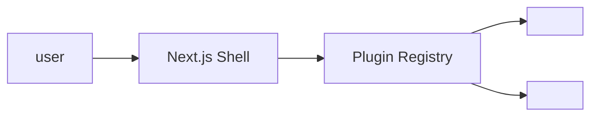

<!--
Copy this file to `docs/spec/NNN-feature-slug/plan.md` and fill in every section.
The plan is the *how* — architecture, files, packages, sequencing.
-->

# Implementation Plan — `<NNN-feature-slug>`

> **Spec:** [`spec.md`](./spec.md)

## 1. High-Level Approach

Two or three paragraphs describing the chosen architectural approach. Why
this approach over the alternatives considered? Reference any prior art in
the repository.

## 2. Architecture Diagram



Replace with a diagram appropriate to the feature.

## 3. Affected Packages & Files

| Package / Path                            | Change          | Notes |
| ----------------------------------------- | --------------- | ----- |
| `apps/web/lib/services/<name>/`           | new / modify    |       |
| `packages/<plugin-name>/`                 | new package     |       |
| `apps/web/components/<area>/`             | modify          |       |
| `apps/web-e2e/tests/<area>/<spec>.spec.ts`| new e2e test    |       |

## 4. Public API / Plugin Manifest

If this feature exposes a plugin or adapter:

```ts
// packages/<plugin-name>/src/index.ts
export const plugin = defineDirectoryPlugin({
  name: '<plugin-name>',
  version: '0.1.0',
  templateRange: '>=0.1 <1.0',
  capabilities: ['<capability>'],
  config: ConfigSchema,
});
```

## 5. Data Model Changes

- Drizzle schema diff (link to file).
- Migration plan (`pnpm db:generate` + `pnpm db:migrate`).
- Backfill / seed implications.

## 6. UX & A11y Plan

- New components and where they slot in.
- Keyboard navigation map.
- Localisation: list of message keys to add (link to `apps/web/messages/en.json`).

## 7. Performance Plan

- Expected impact on LCP / INP / CLS.
- Bundle size delta (estimate or measured).
- Caching strategy (server / SWR / `cache:` directive / React Query).

## 8. Security Plan

- AuthN / AuthZ boundaries.
- Input validation (Zod schemas).
- Rate limiting / abuse considerations.
- Secrets and env-var changes (never commit secrets).

## 9. Test Plan

- Unit / integration tests added.
- Playwright e2e specs added or updated.
- Manual verification recipe (steps to reproduce locally).

## 10. Rollout & Migration Plan

- Feature flag (if any) and how it is configured.
- Backward compatibility notes.
- Steps to enable in `directory.config.ts` / env / admin UI.

## 11. Constitution Check

Tick every article that this plan satisfies; if a violation is required,
document it under §12 Complexity Tracking.

- [ ] **I — Plugin-First** — net-new functionality is a plugin/adapter.
- [ ] **II — TypeScript Everywhere** — only `.ts`/`.tsx` files added.
- [ ] **III — Spec Before Code** — spec exists and is approved.
- [ ] **IV — Documentation First-Class** — `docs/` updated; index/log updated.
- [ ] **V — Performance Budget** — no regression beyond agreed thresholds.
- [ ] **VI — Latest Stable Frameworks** — no pinning below latest.
- [ ] **VII — Reuse Before Build** — popular library used where appropriate.
- [ ] **VIII — No Removal Without Migration** — additive change, or migration documented.
- [ ] **IX — Test Coverage Bar** — e2e tests added.
- [ ] **X — Modular Packages** — code placed in focused packages.

## 12. Complexity Tracking

For each unchecked principle above, explain:

- Why the violation is necessary.
- The simpler alternative that was rejected.
- The follow-up spec that will resolve the debt (if any).

## 13. Open Questions

Mirror these into [`docs/questions.md`](../../docs/questions.md) with a
chosen default. Do not block on questions — pick a default and proceed.

## 14. References

- Spec: `./spec.md`
- Constitution articles: I, IV, V, …
- Related plans: …
