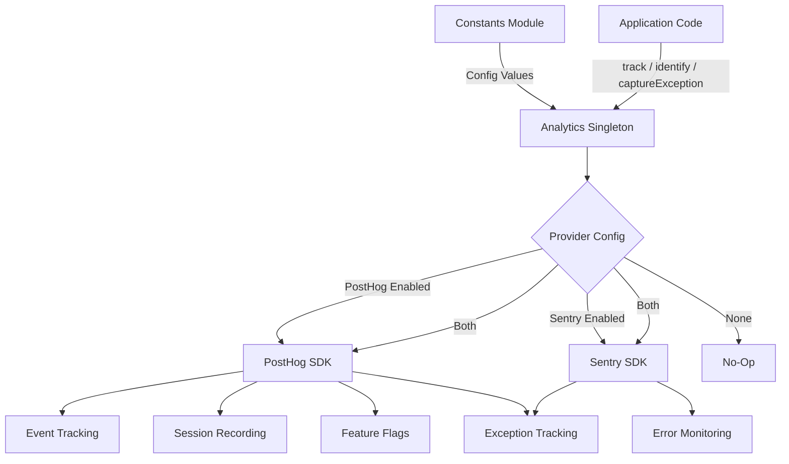
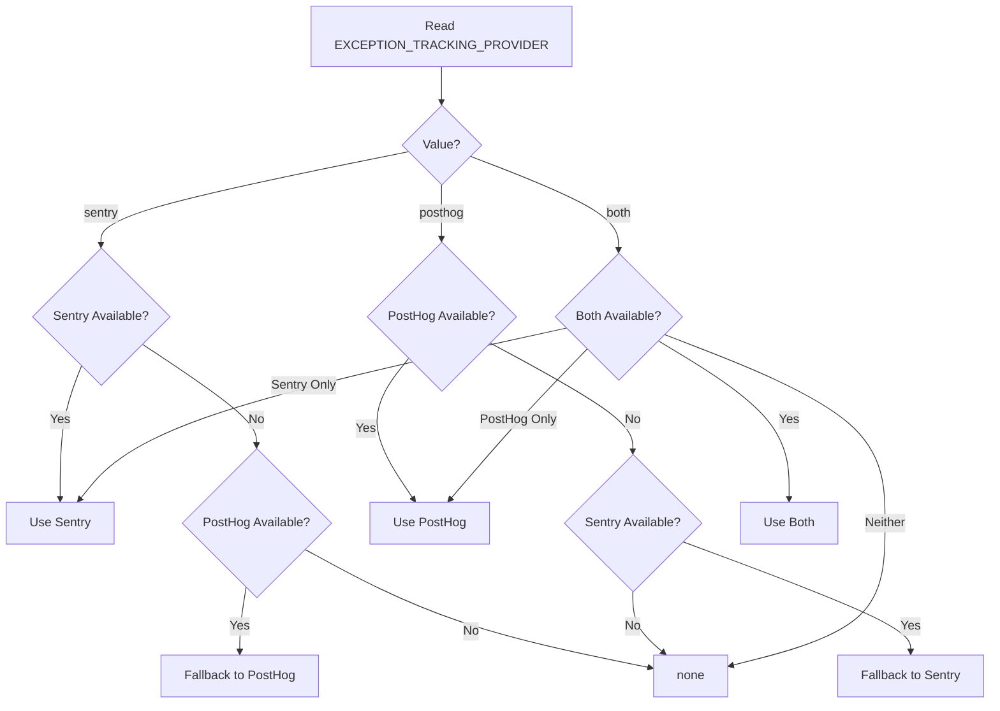

# وحدة التحليلات

توفر وحدة التحليلات (`template/lib/analytics/`) فئة مفردة موحدة لتتبع الأحداث من جانب العميل وتحديد المستخدم وتقييم علامة الميزة والتقاط الاستثناءات. فهو يدمج **PostHog** لتحليلات المنتج و**Sentry** لمراقبة الأخطاء، مع دعم لاستخدام أي من الموفرين بشكل فردي، أو كليهما في وقت واحد، أو عدم استخدام أي منهما.

## نظرة عامة على الهندسة المعمارية



## ملفات المصدر

|ملف|الوصف|
|------|-------------|
|`lib/analytics/index.ts`|`Analytics` فئة مفردة و`analytics` تصدير|

## الفئة الأساسية: `Analytics`

فئة `Analytics` هي فئة مفردة تلتف حول PostHog وSentry. يعد الاتصال من جانب الخادم آمنًا - حيث يتم إرجاع كافة الأساليب بصمت عندما يكون `window` غير محدد.

### تعريفات النوع

```typescript
type EventProperties = Properties;          // PostHog Properties type
type UserProperties = Record<string, any>;
type ExceptionTrackingProvider = 'sentry' | 'posthog' | 'both' | 'none';
```

### وصول سينجلتون

```typescript
// Get the singleton instance
const analytics = Analytics.getInstance();

// Or use the pre-created export
import { analytics } from '@/lib/analytics';
```

### `init(): void`

تهيئة PostHog بتكوين مركزي وإعداد تتبع الاستثناءات. يجب أن يتم استدعاؤه مرة واحدة من جانب العميل (عادةً في تخطيط الجذر أو مكون الموفر).

```typescript
// In your root layout or PostHog provider
'use client';
import { analytics } from '@/lib/analytics';

useEffect(() => {
  analytics.init();
}, []);
```

**السلوك:**
- يتخطى التهيئة إذا تمت تهيئتها بالفعل أو إذا كانت تعمل من جانب الخادم
- يقرأ التكوين من الثوابت (`POSTHOG_KEY`، `POSTHOG_HOST`، `POSTHOG_ENABLED`، إلخ.)
- يقوم بتكوين تسجيل الجلسة مع الإخفاء عندما يكون `POSTHOG_SESSION_RECORDING_ENABLED` صحيحًا
- يطبق معدل أخذ العينات (`POSTHOG_SAMPLE_RATE`) - في إعدادات الإنتاج الافتراضية على 10%
- يقوم بإعداد معالجات `window.onerror` و`unhandledrejection` العامة عند تمكين تتبع استثناء PostHog
- يربط PostHog مع Sentry عندما يكون كلا الموفرين نشطين

### `identify(userId: string, properties?: UserProperties): void`

يربط المستخدم المجهول الحالي بمعرف مستخدم محدد. يقوم أيضًا بتعيين سياق مستخدم Sentry عند تمكين Sentry.

```typescript
analytics.identify(session.user.id, {
  email: session.user.email,
  plan: 'premium',
});
```

### `reset(): void`

يعيد تعيين هوية المستخدم الحالية (على سبيل المثال، عند تسجيل الخروج). يمسح سياقات مستخدم PostHog وSentry.

```typescript
analytics.reset();
```

### `track(eventName: string, properties?: EventProperties): void`

يلتقط حدثًا مخصصًا في PostHog.

```typescript
analytics.track('item_submitted', {
  itemId: 'abc-123',
  category: 'SaaS Tools',
});
```

### `trackPageView(url: string, properties?: EventProperties): void`

يلتقط حدث عرض الصفحة يدويًا. يُستخدم عند تعطيل `POSTHOG_AUTO_CAPTURE` وتحتاج إلى تتبع واضح لعرض الصفحة.

```typescript
analytics.trackPageView(window.location.href, {
  referrer: document.referrer,
});
```

### `isFeatureEnabled(flagKey: string, defaultValue?: boolean): boolean`

يقوم بتقييم علامة ميزة PostHog بشكل متزامن.

```typescript
const showNewUI = analytics.isFeatureEnabled('new-dashboard-ui', false);
```

### `reloadFeatureFlags(): Promise<void>`

يفرض إعادة جلب إشارات الميزات من خادم PostHog.

```typescript
await analytics.reloadFeatureFlags();
```

### `captureException(error: Error | string, context?: Record<string, any>): void`

تتبع الاستثناء الموحد الذي يتم إرساله إلى الموفر (الموفرين) الذي تم تكوينه.

```typescript
try {
  await riskyOperation();
} catch (error) {
  analytics.captureException(error, {
    component: 'PaymentForm',
    action: 'submit',
  });
}
```

**توجيه الموفر:**
- `'posthog'` - يرسل حدث `$exception` إلى PostHog مع تتبع المكدس
- `'sentry'` - المكالمات `Sentry.captureException` مع سياق إضافي
- `'both'`--يرسل إلى كلا الموفرين
- `'none'` - يتم التجاهل بصمت

### `captureError(error: Error, context?: Record<string, any>): void`

**مهمل.** الاسم المستعار لـ `captureException`. يسجل تحذير الإهمال.

### `getExceptionTrackingProvider(): ExceptionTrackingProvider`

إرجاع موفر تتبع الاستثناءات النشط حاليًا.

### `setUserProperties(properties: UserProperties): void`

يقوم بتعيين خصائص المستخدم المستمرة في ملف تعريف شخص PostHog عبر `posthog.people.set()`.

```typescript
analytics.setUserProperties({
  subscription_tier: 'premium',
  company: 'Acme Corp',
});
```

### `setSuperProperties(properties: Record<string, any>): void`

يسجل الخصائص الفائقة المرسلة مع كل حدث لاحق عبر `posthog.register()`.

```typescript
analytics.setSuperProperties({
  app_version: '2.1.0',
  environment: 'production',
});
```

## ثوابت التكوين

كل تكوينات التحليلات مدفوعة بثوابت من `lib/constants.ts`:

|ثابت|الافتراضي|الوصف|
|----------|---------|-------------|
|`POSTHOG_KEY`|بيئى فار|مفتاح API لمشروع PostHog|
|`POSTHOG_HOST`|بيئى فار|عنوان URL لمضيف PostHog API|
|`POSTHOG_ENABLED`|مشتقة|صحيح عندما يتم تعيين كل من المفتاح والمضيف|
|`POSTHOG_DEBUG`|بيئى فار|تمكين تسجيل تصحيح PostHog|
|`POSTHOG_SESSION_RECORDING_ENABLED`|`'true'`|تمكين تسجيل الجلسة|
|`POSTHOG_AUTO_CAPTURE`|`'false'`|التقاط تلقائي لمشاهدات الصفحة|
|`POSTHOG_SAMPLE_RATE`|`0.1` (منتج) / `1.0` (مطور)|معدل أخذ العينات الحدث|
|`POSTHOG_SESSION_RECORDING_SAMPLE_RATE`|`0.1` (منتج) / `1.0` (مطور)|تسجيل معدل أخذ العينات|
|`EXCEPTION_TRACKING_PROVIDER`|`'both'`|الموفر الذي يتعامل مع الاستثناءات|
|`SENTRY_ENABLED`|مشتقة|صحيح عندما يتم تعيين DSN ويسمح به env|

## حل موفر تتبع الاستثناء

يتم تحديد الموفر في وقت الإنشاء باستخدام المنطق الاحتياطي:



## الاستخدام مع Next.js

التكامل النموذجي في مشروع Next.js App Router:

```tsx
// app/providers.tsx
'use client';
import { useEffect } from 'react';
import { analytics } from '@/lib/analytics';
import { useSession } from 'next-auth/react';
import { usePathname } from 'next/navigation';

export function AnalyticsProvider({ children }: { children: React.ReactNode }) {
  const { data: session } = useSession();
  const pathname = usePathname();

  useEffect(() => {
    analytics.init();
  }, []);

  useEffect(() => {
    if (session?.user?.id) {
      analytics.identify(session.user.id, {
        email: session.user.email,
      });
    }
  }, [session]);

  useEffect(() => {
    analytics.trackPageView(pathname);
  }, [pathname]);

  return <>{children}</>;
}
```
