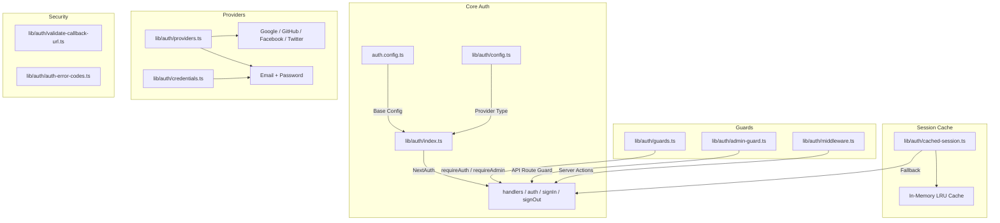
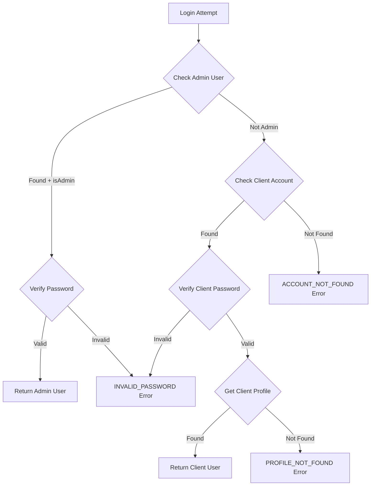

# وحدة المرافق المصادقة

توفر وحدة أدوات المصادقة المساعدة (`template/lib/auth/`) طبقة مصادقة شاملة مبنية على NextAuth.js (Auth.js) مع دعم لموفرين متعددين، والتخزين المؤقت للجلسة، والحراس من جانب الخادم، وإجراءات الخادم التي تم التحقق من صحتها، وSupabase كواجهة خلفية بديلة للمصادقة.

## نظرة عامة على الهندسة المعمارية



## ملفات المصدر

|ملف|الوصف|
|------|-------------|
|`lib/auth/index.ts`|تكوين NextAuth.js مع محول Drizzle|
|`lib/auth/config.ts`|تكوين نوع موفر المصادقة|
|`lib/auth/credentials.ts`|مزود بيانات اعتماد البريد الإلكتروني/كلمة المرور|
|`lib/auth/providers.ts`|مصنع مزود OAuth|
|`lib/auth/guards.ts`|حراس الصفحة من جانب الخادم|
|`lib/auth/admin-guard.ts`|حارس مسؤول مسار واجهة برمجة التطبيقات (API).|
|`lib/auth/middleware.ts`|التحقق من صحة البرمجيات الوسيطة لإجراءات الخادم|
|`lib/auth/cached-session.ts`|طبقة التخزين المؤقت للجلسة|
|`lib/auth/session-cache.ts`|تنفيذ ذاكرة التخزين المؤقت|
|`lib/auth/validate-callback-url.ts`|إعادة توجيه التحقق من صحة عنوان URL|
|`lib/auth/auth-error-codes.ts`|التعداد رمز الخطأ|
|`lib/auth/supabase/`|Supabase مصادقة العميل/الخادم/البرامج الوسيطة|

## تكوين NextAuth.js (`index.ts`)

توفر عملية التصدير الرئيسية واجهة NextAuth.js القياسية:

```typescript
import { auth, signIn, signOut, handlers, unstable_update } from '@/lib/auth';
```

### استراتيجية الجلسة

- **الاستراتيجية:** JWT (وليست جلسات قاعدة البيانات)
- **الحد الأقصى للعمر:** 30 يومًا
- **عمر التحديث:** 24 ساعة (فاصل تحديث الجلسة)

### رد اتصال JWT

يعمل رد اتصال JWT على إثراء الرموز المميزة بما يلي:
- `userId` - من كائن المستخدم أو الرمز المميز `sub`
- `clientProfileId` - تم إنشاؤه تلقائيًا لمستخدمي OAuth عند تسجيل الدخول لأول مرة
- `isAdmin` - يتم تحديده من `isClient`/`isAdmin` أو الإعدادات الافتراضية إلى `false`
- `provider` - اسم موفر المصادقة

### رد الاتصال بالجلسة

يقوم رد اتصال الجلسة بتعيين حقول JWT إلى كائن الجلسة:
- `session.user.id`
- `session.user.clientProfileId`
- `session.user.provider`
- `session.user.isAdmin`

### الصفحات المخصصة

```typescript
pages: {
  signIn: '/auth/signin',
  signOut: '/auth/signout',
  error: '/auth/error',
  verifyRequest: '/auth/verify-request',
  newUser: '/auth/register',
}
```

### الأحداث

- **تسجيل الخروج** - يؤدي إلى إبطال ذاكرة التخزين المؤقت للجلسة للمستخدم
- **updateUser** - يبطل ذاكرة التخزين المؤقت للجلسة عندما تتغير بيانات المستخدم

## تكوين المصادقة (`config.ts`)

### `AuthProviderType`

```typescript
type AuthProviderType = 'supabase' | 'next-auth' | 'both';
```

### `AuthConfig`

```typescript
interface AuthConfig {
  provider: AuthProviderType;
  supabase?: {
    url: string;
    anonKey: string;
    redirectUrl?: string;
  };
  nextAuth?: {
    enableCredentials?: boolean;
    enableOAuth?: boolean;
    providers?: any[];
  };
}
```

### `getAuthConfig(): AuthConfig`

يحل التكوين مع هذه الأولوية:
1. التجاوز العالمي عبر `configureAuth()`
2. الكشف المعتمد على البيئة (عنوان URL لـ Supabase/التواجد الرئيسي)
3. الافتراضي: `next-auth` مع تمكين بيانات الاعتماد وOAuth

## موفر بيانات الاعتماد (`credentials.ts`)

### وظائف كلمة المرور

```typescript
async function hashPassword(password: string): Promise<string>;
// Uses bcryptjs with 10 salt rounds, loaded via dynamic import

async function comparePasswords(plainText: string, hashed: string | null): Promise<boolean>;
// Returns false if hashed is null
```

### تدفق المصادقة



### `AuthProviders` التعداد

```typescript
enum AuthProviders {
  CREDENTIALS = 'credentials',
  GOOGLE = 'google',
  FACEBOOK = 'facebook',
  GITHUB = 'github',
  TWITTER = 'twitter',
  X = 'x',
  MICROSOFT = 'microsoft',
}
```

## موفرو OAuth (`providers.ts`)

### `createNextAuthProviders(config?): Provider[]`

يقوم بإنشاء مثيلات موفر NextAuth ديناميكيًا بناءً على التكوين:

```typescript
import { createNextAuthProviders } from '@/lib/auth/providers';

const providers = createNextAuthProviders({
  google: { enabled: true, clientId: '...', clientSecret: '...' },
  github: { enabled: true, clientId: '...', clientSecret: '...' },
  credentials: { enabled: true },
});
```

مقدمو الخدمة المدعومين: **Google**، **GitHub**، **Facebook**، **Twitter**، **Credentials**.

## حراس جانب الخادم (`guards.ts`)

### `requireAuth(): Promise<Session>`

يتطلب المصادقة. يعيد التوجيه إلى `/auth/signin` إذا لم تتم مصادقته.

```typescript
export default async function ProtectedPage() {
  const session = await requireAuth();
  return <div>Welcome {session.user.email}</div>;
}
```

### `requireAdmin(): Promise<Session>`

يتطلب دور المشرف. يعيد التوجيه إلى `/admin/auth/signin` إذا لم تتم مصادقته، `/unauthorized` إذا لم يكن مسؤولاً.

```typescript
export default async function AdminPage() {
  const session = await requireAdmin();
  return <div>Admin Dashboard</div>;
}
```

### `getSession(): Promise<Session | null>`

يحصل على الجلسة الحالية دون إعادة التوجيه. إرجاع `null` للمستخدمين غير المصادقين.

### `checkIsAdmin(): Promise<boolean>`

التحقق من حالة المسؤول دون إعادة التوجيه.

## حماية طريق واجهة برمجة التطبيقات (`admin-guard.ts`)

### `checkAdminAuth(): Promise<NextResponse | null>`

يُرجع `null` إذا كان مصرحًا به، أو يُرجع خطأ `NextResponse` (401/403/500) إذا لم يكن كذلك:

```typescript
export async function GET() {
  const authError = await checkAdminAuth();
  if (authError) return authError;
  // ... handle authorized request
}
```

### `withAdminAuth(handler): handler`

دالة ذات ترتيب أعلى تغلف معالجات توجيه واجهة برمجة التطبيقات (API):

```typescript
import { withAdminAuth } from '@/lib/auth/admin-guard';

export const GET = withAdminAuth(async (request) => {
  // Only reached if user is authenticated admin
  return NextResponse.json({ data: await getAdminData() });
});
```

## إجراءات الخادم التي تم التحقق منها (`middleware.ts`)

### `validatedAction(schema, action)`

يلتف إجراء الخادم مع التحقق من صحة Zod:

```typescript
import { validatedAction } from '@/lib/auth/middleware';
import { z } from 'zod';

const schema = z.object({ name: z.string().min(1), email: z.string().email() });

export const updateProfile = validatedAction(schema, async (data, formData) => {
  await db.update(users).set(data);
  return { success: 'Profile updated' };
});
```

### `validatedActionWithUser(schema, action)`

كما هو مذكور أعلاه ولكنه يتحقق أيضًا من المصادقة ويدخل المستخدم:

```typescript
export const submitItem = validatedActionWithUser(schema, async (data, formData, user) => {
  await db.insert(items).values({ ...data, userId: user.id });
  return { success: 'Item submitted' };
});
```

### `ActionState` اكتب

```typescript
type ActionState = {
  error?: string;
  success?: string;
  redirect?: string;
  [key: string]: any;
};
```

## التخزين المؤقت للجلسة (`cached-session.ts`)

يقلل من حمل المصادقة عن طريق تخزين الجلسات التي تم فك تشفيرها مؤقتًا في الذاكرة.

### `getCachedSession(request?): Promise<Session | null>`

```typescript
import { getCachedSession } from '@/lib/auth/cached-session';

// In server components
const session = await getCachedSession();

// In API routes (pass request for token extraction)
const session = await getCachedSession(request);
```

### `invalidateSessionCache(token?, userId?): Promise<void>`

يبطل الجلسات المخزنة مؤقتًا عن طريق الرمز المميز أو معرف المستخدم.

### `clearSessionCache(): void`

مسح جميع الجلسات المخزنة مؤقتًا (لعمليات النشر أو التحديثات الهامة).

### استخراج الرمز المميز

يتم استخراج الرموز المميزة من الطلبات بهذا الترتيب:
1. `next-auth.session-token` أو `__Secure-next-auth.session-token` ملف تعريف الارتباط
2. `Authorization: Bearer <token>` الرأس
3. `X-Session-Token` رأس مخصص

## رموز الخطأ (`auth-error-codes.ts`)

```typescript
enum AuthErrorCode {
  ACCOUNT_NOT_FOUND = 'ACCOUNT_NOT_FOUND',
  INVALID_PASSWORD = 'INVALID_PASSWORD',
  PROFILE_NOT_FOUND = 'PROFILE_NOT_FOUND',
  GENERIC_ERROR = 'GENERIC_ERROR',
  RATE_LIMITED = 'RATE_LIMITED',
  USE_OAUTH_PROVIDER = 'USE_OAUTH_PROVIDER',
  SESSION_REFRESH_FAILED = 'SESSION_REFRESH_FAILED',
  PAGE_REFRESH_FAILED = 'PAGE_REFRESH_FAILED',
}
```

## التحقق من صحة عنوان URL لرد الاتصال (`validate-callback-url.ts`)

### `isValidCallbackUrl(url: string | null): boolean`

يمنع ثغرات إعادة التوجيه المفتوحة:

```typescript
isValidCallbackUrl('/admin/items')       // true
isValidCallbackUrl('/client/dashboard')  // true
isValidCallbackUrl('https://evil.com')   // false
isValidCallbackUrl('//evil.com')         // false
```

### `getSafeRedirectPath(callbackUrl, fallbackPath): string`

يُرجع عنوان URL لرد الاتصال إذا كان صالحًا، وإلا فهو المسار الاحتياطي.

### `createSafeCallbackUrl(pathname, search?): string`

ينشئ عنوان URL لرد الاتصال يقتصر على 2048 حرفًا لمنع تلوث المعلمات.
