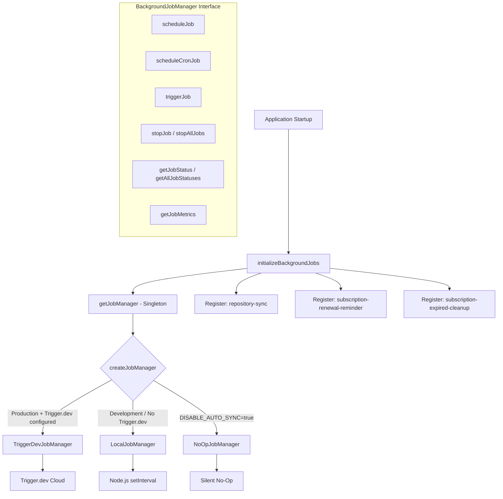
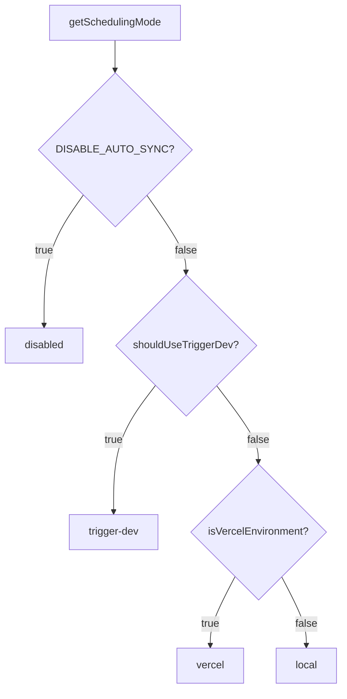

# وحدة وظائف الخلفية

توفر وحدة وظائف الخلفية (`template/lib/background-jobs/`) طبقة تجريد لجدولة المهام المتكررة وتنفيذها. وهو يدعم ثلاث إستراتيجيات وقت التشغيل - **Trigger.dev** للإنتاج، و**local `setInterval`** للتطوير، ووضع **no-op** لتعطيل المهام بالكامل - يتم تحديده تلقائيًا بناءً على تكوين البيئة.

## نظرة عامة على الهندسة المعمارية



## ملفات المصدر

|ملف|الوصف|
|------|-------------|
|`lib/background-jobs/types.ts`|تعريفات الواجهة والنوع|
|`lib/background-jobs/config.ts`|تكوين Trigger.dev والكشف عن وضع الجدولة|
|`lib/background-jobs/job-factory.ts`|وظيفة المصنع ومدير المفردة|
|`lib/background-jobs/local-job-manager.ts`|`LocalJobManager` التنفيذ|
|`lib/background-jobs/trigger-dev-job-manager.ts`|`TriggerDevJobManager` التنفيذ|
|`lib/background-jobs/noop-job-manager.ts`|`NoOpJobManager` التنفيذ|
|`lib/background-jobs/initialize-jobs.ts`|تسجيل الوظيفة عند بدء تشغيل التطبيق|
|`lib/background-jobs/index.ts`|تصدير البراميل|

## تعريفات النوع

### `BackgroundJobManager` الواجهة

```typescript
interface BackgroundJobManager {
  scheduleJob(id: string, name: string, job: () => void | Promise<void>, interval: number): void;
  scheduleCronJob(id: string, name: string, job: () => void | Promise<void>, cronExpression: string): void;
  triggerJob(id: string): Promise<void>;
  stopJob(id: string): void;
  stopAllJobs(): void;
  getJobStatus(id: string): JobStatus | undefined;
  getAllJobStatuses(): JobStatus[];
  getJobMetrics(): JobMetrics;
}
```

### `JobStatus`

```typescript
type JobStatusType = 'running' | 'completed' | 'failed' | 'scheduled' | 'stopped';

interface JobStatus {
  id: string;
  name: string;
  status: JobStatusType;
  lastRun: Date | null;
  nextRun: Date | null;
  duration: number;     // Last execution duration in ms
  error?: string;       // Error message if status is 'failed'
}
```

### `JobMetrics`

```typescript
interface JobMetrics {
  totalExecutions: number;       // Total invocations (not unique jobs)
  successfulJobs: number;
  failedJobs: number;
  averageJobDuration: number;    // Rolling average in ms
  lastCleanup: Date;
}
```

### `TriggerDevConfig`

```typescript
interface TriggerDevConfig {
  enabled: boolean;
  apiKey?: string;
  apiUrl?: string;
  environment: string;
  isFullyConfigured: boolean;
  isPartiallyConfigured: boolean;
}
```

### `SchedulingMode`

```typescript
type SchedulingMode = 'trigger-dev' | 'vercel' | 'local' | 'disabled';
```

## وظائف التكوين

### `getTriggerDevConfig(): TriggerDevConfig`

يقرأ إعدادات Trigger.dev من ConfigService.

### `shouldUseTriggerDev(): boolean`

يُرجع `true` عندما يتم تكوين Trigger.dev بالكامل وتمكينه وتكون البيئة إنتاجية.

### `getSchedulingMode(): SchedulingMode`

يحدد نظام الجدولة الذي يجب أن يكون نشطًا باستخدام هذه الأولوية:



## المصنع وسينجلتون

### `createJobManager(): BackgroundJobManager`

إنشاء مدير الوظائف المناسب بناءً على البيئة:

```typescript
import { createJobManager } from '@/lib/background-jobs';

const manager = createJobManager();
// Returns: TriggerDevJobManager | LocalJobManager | NoOpJobManager
```

### `getJobManager(): BackgroundJobManager`

إرجاع مثيل المفردة، وإنشائه عند الاستدعاء الأول:

```typescript
import { getJobManager } from '@/lib/background-jobs';

const manager = getJobManager();
manager.scheduleJob('my-job', 'My Job', async () => {
  await doWork();
}, 60_000);
```

### `resetJobManager(): void`

يوقف جميع الوظائف ويدمر المفردة (مفيدة للاختبار):

```typescript
import { resetJobManager } from '@/lib/background-jobs';
resetJobManager();
```

## LocalJobManager

يستخدم Node.js `setInterval` للتطوير والبيئات الاحتياطية.

** السلوكيات الرئيسية: **
- تخطي التنفيذ عندما تكون المهمة قيد التشغيل بالفعل (يمنع التداخل)
- يتتبع المقاييس بمتوسط المدة المتداول
- يحول تعبيرات cron إلى فترات عبر التعيين المبسط
- يقلل من تسجيل وحدة التحكم في وضع التطوير

### رسم الخرائط من كرون إلى الفاصل الزمني

|نمط كرون|الفاصل الزمني|
|-------------|----------|
| `*/30 * * * * *` |30 ثانية|
| `*/2 * * * *` |2 دقيقة|
| `*/5 * * * *` |5 دقائق|
| `*/15 * * * *` |15 دقيقة|
| `0 * * * *` |1 ساعة|
| `0 9 * * *` |24 ساعة|
|الافتراضي|1 دقيقة|

## TriggerDevJobManager

تسجيل الجداول الزمنية باستخدام واجهة برمجة التطبيقات للجداول `@trigger.dev/sdk` v4. لا **لا** ينفذ أجهزة ضبط الوقت المحلية - تتم معالجة التنفيذ من خلال العملية المنفذة Trigger.dev.

** السلوكيات الرئيسية: **
- التحميل البطيء `@trigger.dev/sdk` عبر الاستيراد الديناميكي
- تحويل الجداول المستندة إلى الفاصل الزمني إلى تعبيرات cron
- يتتبع المقاييس المحلية عند تشغيل المهام في سياق العامل
- `stopJob` / `stopAllJobs` قم بمسح الحالة المحلية فقط (تتم إدارة الجداول الزمنية البعيدة بواسطة Trigger.dev)

## NoOpJobManager

جميع العمليات صامتة no-ops. يتم استخدامه عندما يكون `DISABLE_AUTO_SYNC=true` قيد التطوير.

## التسجيل الوظيفي

تقوم الدالة `initializeBackgroundJobs()` بتسجيل جميع وظائف التطبيق عند بدء التشغيل:

```typescript
import { initializeBackgroundJobs } from '@/lib/background-jobs/initialize-jobs';

// Called once during app initialization
await initializeBackgroundJobs();
```

### وظائف مسجلة

|معرف الوظيفة|الجدول الزمني|الوصف|
|--------|----------|-------------|
|`repository-sync`|كل 5 دقائق|مزامنة محتوى CMS المستند إلى Git عبر `syncManager.performSync()`|
|`subscription-renewal-reminder`|يومياً الساعة 9:00 صباحاً|يرسل تذكيرات تجديد للاشتراكات التي تنتهي صلاحيتها خلال 7 أيام|
|`subscription-expired-cleanup`|يومياً عند منتصف الليل|يعالج وينتهي الاشتراكات بعد تاريخ انتهائها|

**هام:** تستخدم جميع عمليات رد الاتصال الخاصة بالمهمة عمليات استيراد ديناميكية لمنع حزمة الويب من تجميع الوحدات الخاصة بـ Node.js في وقت الإنشاء:

```typescript
manager.scheduleJob('repository-sync', 'Repository Synchronization', async () => {
  // Dynamic import prevents webpack bundling of isomorphic-git chain
  const { syncManager } = await import('@/lib/services/sync-service');
  await syncManager.performSync();
}, 5 * 60 * 1000);
```

## أمثلة الاستخدام

### جدولة وظيفة مخصصة

```typescript
import { getJobManager } from '@/lib/background-jobs';

const manager = getJobManager();

// Interval-based (every 10 minutes)
manager.scheduleJob('cleanup-temp', 'Temp File Cleanup', async () => {
  await cleanupTempFiles();
}, 10 * 60 * 1000);

// Cron-based (every hour)
manager.scheduleCronJob('hourly-report', 'Hourly Report', async () => {
  await generateReport();
}, '0 * * * *');
```

### وظائف المراقبة

```typescript
const manager = getJobManager();

// Check specific job
const status = manager.getJobStatus('repository-sync');
console.log(status?.status, status?.lastRun, status?.duration);

// List all jobs
const allStatuses = manager.getAllJobStatuses();

// Get aggregate metrics
const metrics = manager.getJobMetrics();
console.log(`Total: ${metrics.totalExecutions}, Failed: ${metrics.failedJobs}`);
```

### الزناد اليدوي

```typescript
const manager = getJobManager();
await manager.triggerJob('repository-sync');
```
