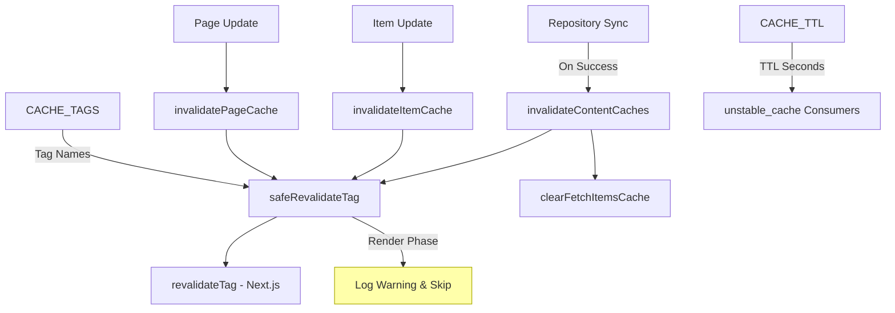
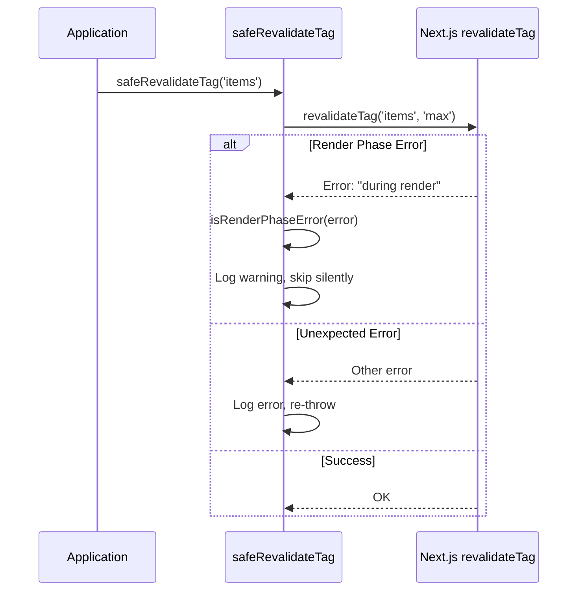
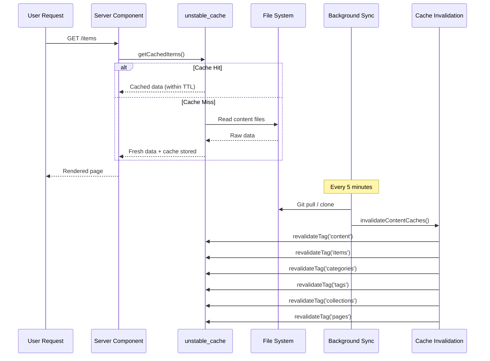

# وحدة إبطال ذاكرة التخزين المؤقت

توفر وحدة إبطال ذاكرة التخزين المؤقت (`template/lib/cache-config.ts` و`template/lib/cache-invalidation.ts`) نظامًا مركزيًا لعلامات ذاكرة التخزين المؤقت ووظائف إبطال Next.js `unstable_cache` و`revalidateTag`. فهو يضمن إبطال ذاكرة التخزين المؤقت للمحتوى بشكل صحيح بعد مزامنة المستودع أثناء التعامل مع قيود مرحلة العرض Next.js بأمان.

## نظرة عامة على الهندسة المعمارية



## ملفات المصدر

|ملف|الوصف|
|------|-------------|
|`lib/cache-config.ts`|تخزين ثوابت TTL وتعريفات العلامات|
|`lib/cache-invalidation.ts`|وظائف الإبطال مع سلامة مرحلة التقديم|

## تكوين ذاكرة التخزين المؤقت TTL

جميع قيم TTL موجودة في **ثواني**، ويتم استخدامها مع Next.js `unstable_cache`:

```typescript
const CACHE_TTL = {
  CONTENT: 600,   // 10 minutes -- content listings
  ITEM: 600,      // 10 minutes -- individual items
  CONFIG: 600,    // 10 minutes -- site configuration
  PAGES: 600,     // 10 minutes -- static pages
} as const;
```

### الاستخدام مع `unstable_cache`

```typescript
import { unstable_cache } from 'next/cache';
import { CACHE_TTL, CACHE_TAGS } from '@/lib/cache-config';

const getCachedItems = unstable_cache(
  async () => fetchAllItems(),
  ['items-list'],
  {
    revalidate: CACHE_TTL.CONTENT,
    tags: [CACHE_TAGS.CONTENT, CACHE_TAGS.ITEMS],
  }
);
```

## علامات ذاكرة التخزين المؤقت

يتم استخدام العلامات مع `revalidateTag()` لإبطال ذاكرة التخزين المؤقت بشكل انتقائي.

### العلامات الثابتة

|علامة ثابتة|القيمة|الوصف|
|-------------|-------|-------------|
|`CACHE_TAGS.CONTENT`|`'content'`|العلامة الرئيسية - تبطل كافة ذاكرات التخزين المؤقت للمحتوى|
|`CACHE_TAGS.ITEMS`|`'items'`|جميع العناصر جمع|
|`CACHE_TAGS.CATEGORIES`|`'categories'`|جميع الفئات|
|`CACHE_TAGS.TAGS`|`'tags'`|جميع العلامات|
|`CACHE_TAGS.COLLECTIONS`|`'collections'`|جميع المجموعات|
|`CACHE_TAGS.CONFIG`|`'config'`|تكوين الموقع|
|`CACHE_TAGS.PAGES`|`'pages'`|جميع الصفحات الثابتة|

### العلامات الديناميكية (الوظائف)

|وظيفة العلامة|إخراج المثال|الوصف|
|-------------|---------------|-------------|
|`CACHE_TAGS.ITEM(slug)`|`'item:my-tool'`|عنصر محدد بواسطة سبيكة|
|`CACHE_TAGS.PAGE(slug)`|`'page:about'`|صفحة محددة بواسطة سبيكة|
|`CACHE_TAGS.ITEMS_LOCALE(locale)`|`'items:en'`|العناصر التي تمت تصفيتها حسب اللغة|
|`CACHE_TAGS.CATEGORIES_LOCALE(locale)`|`'categories:fr'`|الفئات حسب اللغة|
|`CACHE_TAGS.TAGS_LOCALE(locale)`|`'tags:de'`|العلامات حسب اللغة|
|`CACHE_TAGS.COLLECTIONS_LOCALE(locale)`|`'collections:es'`|المجموعات حسب اللغة|

### مثال: التخزين المؤقت الخاص بالإعدادات المحلية

```typescript
import { CACHE_TAGS, CACHE_TTL } from '@/lib/cache-config';

const getCachedItemsByLocale = unstable_cache(
  async (locale: string) => fetchItemsByLocale(locale),
  ['items-by-locale'],
  {
    revalidate: CACHE_TTL.CONTENT,
    tags: [CACHE_TAGS.ITEMS, CACHE_TAGS.ITEMS_LOCALE('en')],
  }
);
```

## وظائف الإبطال

### `invalidateContentCaches(): Promise<void>`

يبطل **جميع** ذاكرات التخزين المؤقت ذات الصلة بالمحتوى. يتم الاتصال به بعد اكتمال مزامنة المستودع بنجاح.

```typescript
import { invalidateContentCaches } from '@/lib/cache-invalidation';

// After successful repository sync
await performSync();
await invalidateContentCaches();
```

**يبطل هذه العلامات:**
- `CONTENT`، `ITEMS`، `CATEGORIES`، `TAGS`، `COLLECTIONS`، `PAGES`
- يقوم أيضًا بمسح ذاكرة التخزين المؤقت `fetchItems` في الذاكرة عبر `clearFetchItemsCache()`

### `invalidateItemCache(slug: string): Promise<void>`

يبطل ذاكرة التخزين المؤقت لعنصر واحد.

```typescript
import { invalidateItemCache } from '@/lib/cache-invalidation';

await invalidateItemCache('my-saas-tool');
// Revalidates tag: 'item:my-saas-tool'
```

### `invalidatePageCache(slug: string): Promise<void>`

يبطل ذاكرة التخزين المؤقت لصفحة ثابتة واحدة.

```typescript
import { invalidatePageCache } from '@/lib/cache-invalidation';

await invalidatePageCache('about');
// Revalidates tag: 'page:about'
```

## سلامة مرحلة التقديم

لا يسمح Next.js بـ `revalidateTag()` أثناء مرحلة العرض لمكونات الخادم. تتعامل الوحدة مع هذا باستخدام غلاف `safeRevalidateTag`.

### كيف يعمل



### أنماط اكتشاف الأخطاء

تقوم الدالة `isRenderPhaseError` بالتحقق من أنماط متعددة لتكون مرنة ضد تغييرات رسالة الخطأ Next.js:

- `"during render"` - رسالة Next.js الحالية
- `"render phase"` - صياغة بديلة
- `"revalidate"` + `"render"` - كلتا الكلمتين الرئيسيتين موجودتان
- `"unsupported"` + `"render"` - التحقق من المجموعة

## مخطط تدفق ذاكرة التخزين المؤقت


