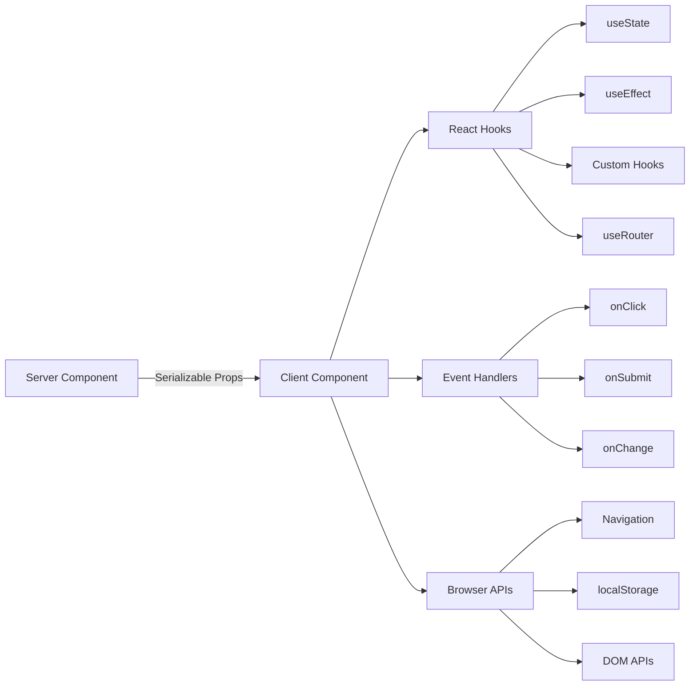

# أنماط مكونات العميل

## نظرة عامة

مكونات العميل في قالب Ever Works عبارة عن "جزر" تفاعلية تتعامل مع أحداث المستخدم، وتدير الحالة المحلية، وتتكامل مع واجهات برمجة تطبيقات المتصفح. يتم التعرف عليها بواسطة التوجيه `"use client"` في أعلى الملف ويتم استخدامها بشكل انتقائي عندما يكون التفاعل مطلوبًا.

## الهندسة المعمارية



## ملفات المصدر

|ملف|نمط|
|------|---------|
|`template/app/[locale]/admin/page.tsx`|الحد الأدنى من تفويض مجمّع العميل إلى المكون|
|`template/app/not-found.tsx`|التنقل مع العميل باستخدام `useRouter`|
|`template/app/global-error.tsx`|حدود الخطأ مع وظيفة إعادة التعيين|
|`template/components/filters/filter-url-parser.tsx`|إدارة حالة URL|
|`template/components/header/more-menu.tsx`|القوائم المنسدلة التفاعلية|

## الأنماط الأساسية

### النمط 1: الحد الأدنى من أغلفة العميل

تستخدم العديد من مكونات الصفحة أنحف غلاف عميل ممكن:

```typescript
"use client";

import { AdminDashboard } from "@/components/admin";

export default function AdminPage() {
    return <AdminDashboard />;
}
```

يبقي هذا النمط ملف الصفحة صغيرًا أثناء تفويض كل المنطق إلى مكون منفصل. يمثل التوجيه `"use client"` الحد الذي تنتقل فيه شجرة مكون الخادم إلى عرض العميل.

### النمط 2: مكونات حدود الخطأ

يوضح معالج الأخطاء العام نمط حدود الخطأ:

```typescript
'use client';

export default function GlobalError({
    error,
    reset,
}: {
    error: Error & { digest?: string };
    reset: () => void;
}) {
    useEffect(() => {
        console.error(error);
    }, [error]);

    return (
        <html lang="en">
            <body>
                <div>
                    <h1>Something went wrong!</h1>
                    {process.env.NODE_ENV !== 'production' && (
                        <div>
                            <p>{error.message}</p>
                            {error.digest && <p>Error ID: {error.digest}</p>}
                        </div>
                    )}
                    <Button onPress={() => reset()}>Refresh</Button>
                    <Link href="/">Go Home</Link>
                </div>
            </body>
        </html>
    );
}
```

الجوانب الرئيسية:
- تتضمن الدعامة `error` `digest` اختيارية لتتبع أخطاء الخادم
- تقوم الدالة `reset()` بإعادة عرض أبناء حدود الخطأ
- تظهر آثار المكدس فقط في التطوير
- يقوم المكون بتغليف العلامات `<html>` و`<body>` الخاصة به نظرًا لأن الأخطاء العامة تحل محل الصفحة بأكملها

### النمط 3: التنقل من جانب العميل

توضح صفحة "لم يتم العثور عليها" أنماط التنقل من جانب العميل:

```typescript
'use client';

import { useRouter } from 'next/navigation';

export default function NotFound() {
    const router = useRouter();

    return (
        <div>
            <Button onClick={() => router.back()}>Go Back</Button>
            <Button onClick={() => router.push('/')}>Back to Home</Button>
            <button onClick={() => router.push('/help')}>Contact Support</button>
        </div>
    );
}
```

يوفر الخطاف `useRouter` من `next/navigation` التنقل البرمجي. لاحظ أن هذا من `next/navigation`، وليس `next/router` (جهاز توجيه الصفحات).

### النمط 4: التنقل عبر عميل i18n-Aware

يوفر القالب خطافات تنقل مدركة للإعدادات المحلية عبر `i18n/navigation.ts`:

```typescript
import { createNavigation } from "next-intl/navigation";
import { routing } from "./routing";

export const { Link, redirect, usePathname, useRouter, getPathname } =
    createNavigation(routing);
```

مكونات العميل التي تحتاج إلى استيراد التنقل المدرك للإعدادات المحلية من هذه الوحدة بدلاً من `next/navigation`:

```typescript
'use client';

import { Link, useRouter, usePathname } from '@/i18n/navigation';

function LocaleAwareComponent() {
    const router = useRouter();
    const pathname = usePathname();

    // router.push('/about') automatically includes the current locale prefix
    return <Link href="/about">About</Link>;
}
```

### النمط 5: إجراءات الخادم مع التحقق من صحة النموذج

تتكامل مكونات العميل مع إجراءات الخادم باستخدام نمط الإجراء الذي تم التحقق من صحته من `lib/auth/middleware.ts`:

```typescript
// Server action (lib/auth/middleware.ts)
export function validatedAction<S extends z.ZodType, T>(
    schema: S,
    action: ValidatedActionFunction<S, T>
) {
    return async (prevState: ActionState, formData: FormData): Promise<T> => {
        const result = schema.safeParse(Object.fromEntries(formData));
        if (!result.success) {
            return { error: result.error.issues[0].message } as T;
        }
        return action(result.data, formData);
    };
}

// Client component
'use client';

import { useActionState } from 'react';
import { myServerAction } from './actions';

function MyForm() {
    const [state, formAction, isPending] = useActionState(myServerAction, {});

    return (
        <form action={formAction}>
            {state.error && <p>{state.error}</p>}
            <input name="email" type="email" />
            <button type="submit" disabled={isPending}>Submit</button>
        </form>
    );
}
```

### النمط 6: إدارة الحالة باستخدام الخطافات المخصصة

ينظم القالب منطق العميل في خطافات مخصصة في الدليل `hooks/`:

```typescript
'use client';

import { useFavorites } from '@/hooks/useFavorites';
import { useFilters } from '@/hooks/useFilters';

function ItemList() {
    const { favorites, toggleFavorite } = useFavorites();
    const { filters, updateFilter, resetFilters } = useFilters();

    return (
        <div>
            <FilterBar filters={filters} onChange={updateFilter} onReset={resetFilters} />
            <ItemGrid items={items} favorites={favorites} onToggleFavorite={toggleFavorite} />
        </div>
    );
}
```

## حدود مكونات العميل

### متى تستخدم `"use client"`

- **معالجات الأحداث**: `onClick`، `onSubmit`، `onChange`
- ** خطافات التفاعل **: `useState`، `useEffect`، `useRef`، خطافات مخصصة
- **واجهات برمجة تطبيقات المتصفح**: `window`، `localStorage`، `navigator`
- **مكتبات عملاء الجهات الخارجية**: مكتبات مكونات واجهة المستخدم التي تتطلب التفاعل

### متى يجب الاحتفاظ به كمكون للخادم

- تقديم محتوى ثابت
- جلب البيانات وتحويلها
- جاري تحميل الترجمة (`getTranslations`)
- توليد البيانات الوصفية
- أغلفة التخطيط

## أفضل الممارسات في القالب

1. **ادفع `"use client"` إلى أقصى عمق ممكن** -- أبقِ الحدود قريبة من الورقة التفاعلية
2. **تمرير بيانات الخادم كدعائم** -- تجنب إعادة جلبها إلى العميل
3. **استخدم `useEffect` للتأثيرات الجانبية فقط** - وليس لجلب البيانات
4. **تفضيل إجراءات الخادم على مسارات واجهة برمجة التطبيقات** -- لعمليات إرسال النماذج وتغييراتها
5. **استيراد التنقل من `@/i18n/navigation`** - يضمن التوجيه المدرك للإعدادات المحلية
6. ** واجهة مستخدم لتطوير البوابة فقط ** - استخدم `process.env.NODE_ENV !== 'production'` الشيكات
