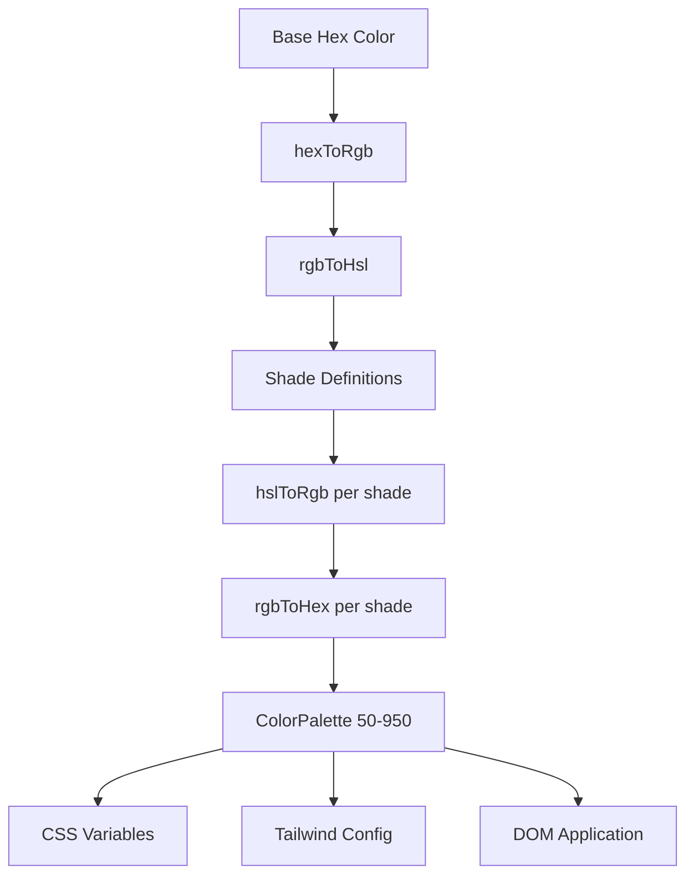

# نظام الألوان

يستخدم القالب نظامًا ديناميكيًا لتوليد الألوان يقوم بإنشاء لوحات ألوان كاملة من الألوان السداسية الأساسية. يعمل هذا على تشغيل محرك السمات ويسمح بتخصيص الألوان في وقت التشغيل من خلال متغيرات CSS وتكامل Tailwind CSS.

## نظرة عامة على الهندسة المعمارية



## ملفات المصدر

|ملف|الغرض|
|------|---------|
|`lib/color-generator.ts`|توليد اللوحة الأساسية من الألوان السداسية|
|`lib/theme-color-manager.ts`|تطبيق الألوان على مستوى الموضوع وتوليد CSS|
|`lib/theme-utils.ts`|فئات الأدوات المساعدة، ومساعدي العتامة، والإعدادات المسبقة للموضوع|

## خط أنابيب تحويل اللون

يقوم النظام بتحويل الألوان من خلال تمثيلات متعددة لإنشاء الظلال بدقة. تتعامل أربع وظائف تحويل مع رحلة الذهاب والإياب الكاملة.

```typescript
// Hex -> RGB -> HSL (for manipulation) -> RGB -> Hex (output)
export function hexToRgb(hex: string): { r: number; g: number; b: number };
export function rgbToHsl(r: number, g: number, b: number): { h: number; s: number; l: number };
export function hslToRgb(h: number, s: number, l: number): { r: number; g: number; b: number };
export function rgbToHex(r: number, g: number, b: number): string;
```

تحدث تعديلات الإضاءة والتشبع في مساحة الألوان HSL، والتي توفر انتقالات ظل موحدة بشكل ملحوظ عبر اللوحة.

## تعريفات الظل

يحتوي كل مستوى ظل على تعديلات ثابتة على الإضاءة والتشبع بالنسبة للون الأساسي (500):

|الظل|ضبط الخفة|ضبط التشبع|الاستخدام|
|-------|-----------------|-------------------|-------|
| 50 | +45 | -30 |أخف الخلفيات|
| 100 | +40 | -25 |تحوم الخلفيات|
| 200 | +30 | -20 |الخلفيات النشطة|
| 300 | +20 | -10 |الحدود|
| 400 | +10 | -5 |نص العنصر النائب|
| **500** | **0** | **0** |** اللون الأساسي **|
| 600 | -10 | +5 |تحوم الدول|
| 700 | -20 | +10 |الدول النشطة|
| 800 | -30 | +15 |نص التأكيد|
| 900 | -40 | +20 |العناوين|
| 950 | -45 | +25 |أحلك الخلفيات|

## واجهة لوحة الألوان

```typescript
export interface ColorPalette {
  50: string;
  100: string;
  200: string;
  300: string;
  400: string;
  500: string;  // Base color
  600: string;
  700: string;
  800: string;
  900: string;
  950: string;
}
```

## توليد لوحة

تأخذ وظيفة `generateColorPalette` أي لون سداسي عشري وتنتج لوحة ألوان كاملة مكونة من 11 لونًا:

```typescript
import { generateColorPalette } from '@/lib/color-generator';

const palette = generateColorPalette('#3b82f6');
// Returns: { 50: '#e8f0fe', 100: '#d4e4fd', ..., 950: '#0a1d3d' }
```

يتم تثبيت القيم بين 0 و100 لكل من الخفة والتشبع لمنع ظهور الألوان خارج النطاق.

## جيل متغير CSS

يقوم النظام بإنشاء خصائص CSS مخصصة لكل ظل:

```typescript
import { generateCssVariables } from '@/lib/color-generator';

const palette = generateColorPalette('#3b82f6');
const css = generateCssVariables('theme-primary', palette);
// Output:
// --theme-primary: #3b82f6;
// --theme-primary-50: #e8f0fe;
// --theme-primary-100: #d4e4fd;
// ... (all 11 shades)
```

## تكامل Tailwind CSS

قم بإنشاء كائنات تكوين Tailwind التي تشير إلى متغيرات CSS:

```typescript
import { generateTailwindConfig } from '@/lib/color-generator';

const config = generateTailwindConfig('theme-primary');
// Returns: {
//   DEFAULT: 'var(--theme-primary)',
//   50: 'var(--theme-primary-50)',
//   100: 'var(--theme-primary-100)',
//   ...
// }
```

## مدير لون الموضوع

تطبق الوحدة `theme-color-manager.ts` اللوحات على DOM في وقت التشغيل.

### تكوينات الموضوع الموسعة

تحدد أربعة سمات مضمنة الألوان الأساسية للألوان الأساسية والثانوية واللكنة والخلفية والسطح والنص:

```typescript
export const EXTENDED_THEME_CONFIGS: Record<ThemeKey, ThemeConfig> = {
  everworks: {
    primary: "#3d70ef",
    secondary: "#00c853",
    accent: "#0056b3",
    background: "#ffffff",
    surface: "#f8f9fa",
    text: "#1a1a1a",
    textSecondary: "#6c757d",
  },
  corporate: { /* ... */ },
  material: { /* ... */ },
  funny: { /* ... */ },
};
```

### تطبيق اللوحات على DOM

```typescript
import { applyColorPalette, applyThemeWithPalettes } from '@/lib/theme-color-manager';

// Apply a single color palette
applyColorPalette('theme-primary', '#3d70ef');

// Apply an entire theme (primary + secondary + accent + utility colors)
applyThemeWithPalettes('everworks');
```

تقوم وظيفة `applyColorPalette` أيضًا بإنشاء متغير RGB لدعم العتامة:

```typescript
// Sets both:
// --theme-primary: #3d70ef
// --theme-primary-rgb: 61, 112, 239
```

### توليد CSS ثابت

للعرض من جانب الخادم أو إنشاء CSS في وقت البناء:

```typescript
import { generateThemeCss } from '@/lib/theme-color-manager';

const css = generateThemeCss('everworks');
// Returns full CSS variable string for all theme colors
```

## فئات فائدة الموضوع

توفر الوحدة `theme-utils.ts` مجموعات فئات Tailwind المعدة مسبقًا:

```typescript
import { themeClasses } from '@/lib/theme-utils';

// Button variants
themeClasses.button.primary   // "bg-theme-primary hover:bg-theme-accent text-white"
themeClasses.button.secondary // "bg-theme-secondary hover:bg-theme-secondary/80 text-white"
themeClasses.button.outline   // "border-2 border-theme-primary text-theme-primary ..."
themeClasses.button.ghost     // "text-theme-primary hover:bg-theme-primary/10"

// Text variants
themeClasses.text.primary     // "text-theme-text"
themeClasses.text.secondary   // "text-theme-text-secondary"
themeClasses.text.accent      // "text-theme-primary"
```

### وظائف المساعدة

```typescript
import { withOpacity, getCssVariable, cn, buildThemeClasses } from '@/lib/theme-utils';

// Generate opacity variant
withOpacity('bg-theme-primary', 50); // "bg-theme-primary/50"

// Get CSS variable reference
getCssVariable('theme-primary'); // "var(--theme-primary)"

// Conditional class building
buildThemeClasses('base-class', 'theme-class', {
  'active-class': isActive,
  'disabled-class': isDisabled,
});
```

## دفعة موضوع توليد اللون

قم بإنشاء تكوين CSS وTailwind لألوان متعددة في وقت واحد:

```typescript
import { generateThemeColors } from '@/lib/color-generator';

const result = generateThemeColors({
  primary: '#3d70ef',
  secondary: '#00c853',
  accent: '#0056b3',
});

// result.css - Complete CSS variable declarations
// result.tailwind - Tailwind config object for all colors
```

## تطبيق موضوع مخصص

قم بتطبيق ألوان عشوائية دون استخدام السمات المعدة مسبقًا:

```typescript
import { applyCustomTheme } from '@/lib/theme-color-manager';

applyCustomTheme({
  primary: '#e91e63',
  secondary: '#9c27b0',
  accent: '#673ab7',
});
```

## معالجة الأخطاء

يتضمن مدير ألوان السمات سلوكًا احتياطيًا:

- إذا لم يتم العثور على مفتاح السمة، فإنه يعود إلى السمة الافتراضية `everworks`.
- إذا أدى تطبيق سمة إلى حدوث خطأ ولم تكن السمة المطلوبة هي `everworks`، فستتم إعادة المحاولة تلقائيًا باستخدام السمة الافتراضية.
- أمان SSR: `useThemeWithPalettes` يتحقق من توفر `window` قبل تطبيق تغييرات DOM.
