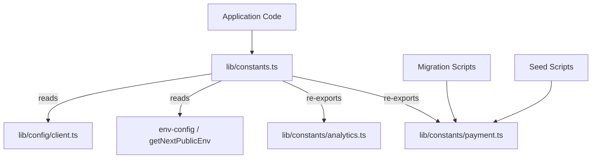

# مرجع الثوابت

تعمل وحدة الثوابت (`template/lib/constants.ts` و`template/lib/constants/`) على مركزية جميع قيم التكوين على مستوى التطبيق والتعدادات والإعدادات التي تعتمد على البيئة والأرقام السحرية. يتم تنظيم الثوابت في ملفات خاصة بالمجال للسماح بالاستيراد الآمن في سياقات خارج وقت تشغيل Next.js (على سبيل المثال، البرامج النصية للترحيل، والبرامج النصية الأولية).

## نظرة عامة على الهندسة المعمارية



## ملفات المصدر

|ملف|الوصف|
|------|-------------|
|`lib/constants.ts`|برميل الثوابت الرئيسية - الواردات من env-config وإعادة تصدير الوحدات الفرعية|
|`lib/constants/payment.ts`|تعدادات الدفع وأنواعه (آمنة للنصوص البرمجية)|
|`lib/constants/analytics.ts`|الثوابت المتعلقة بالتحليلات|

## ثوابت التوطين

```typescript
const DEFAULT_LOCALE = 'en';

const LOCALES = [
  'en', 'fr', 'es', 'de', 'zh', 'ar', 'he', 'ru', 'uk', 'pt',
  'it', 'ja', 'ko', 'nl', 'pl', 'tr', 'vi', 'th', 'hi', 'id', 'bg'
] as const;

type Locale = (typeof LOCALES)[number];

/** Right-to-left locales */
const RTL_LOCALES: readonly Locale[] = ['ar', 'he'] as const;
```

## العلامة التجارية وواجهة المستخدم

```typescript
const LOGO_URL = '/logo-ever-work-3.png';
```

## واجهة برمجة التطبيقات والواجهة الخلفية

```typescript
/** Base URL for internal Next.js API routes */
const API_BASE_URL = getNextPublicEnv('NEXT_PUBLIC_API_BASE_URL');
```

## المصادقة والأمن

```typescript
const COOKIE_SECRET = getNextPublicEnv('COOKIE_SECRET');
const JWT_ACCESS_TOKEN_EXPIRES_IN = getNextPublicEnv('JWT_ACCESS_TOKEN_EXPIRES_IN');
const JWT_REFRESH_TOKEN_EXPIRES_IN = getNextPublicEnv('JWT_REFRESH_TOKEN_EXPIRES_IN');
```

## التحليلات - PostHog

|ثابت|المصدر|الوصف|
|----------|--------|-------------|
|`POSTHOG_KEY`|`NEXT_PUBLIC_POSTHOG_KEY`|مفتاح API لمشروع PostHog|
|`POSTHOG_HOST`|`NEXT_PUBLIC_POSTHOG_HOST`|مضيف PostHog API|
|`POSTHOG_ENABLED`|مشتقة|صحيح عند وجود كل من المفتاح والمضيف|
|`POSTHOG_DEBUG`|`POSTHOG_DEBUG`|تمكين تسجيل التصحيح|
|`POSTHOG_SESSION_RECORDING_ENABLED`|البيئة / `'true'`|تبديل تسجيل الجلسة|
|`POSTHOG_AUTO_CAPTURE`|البيئة / `'false'`|التقاط تلقائي لمشاهدات الصفحة|
|`POSTHOG_SAMPLE_RATE`|محسوبة|`0.1` قيد الإنتاج، `1.0` قيد التطوير|
|`POSTHOG_SESSION_RECORDING_SAMPLE_RATE`|محسوبة|`0.1` قيد الإنتاج، `1.0` قيد التطوير|

## تتبع الأخطاء - الحراسة

|ثابت|المصدر|الوصف|
|----------|--------|-------------|
|`SENTRY_DSN`|`NEXT_PUBLIC_SENTRY_DSN`|اسم مصدر بيانات الحراسة|
|`SENTRY_ENABLE_DEV`|`SENTRY_ENABLE_DEV`|تمكين الحراسة في التنمية|
|`SENTRY_DEBUG`|`SENTRY_DEBUG`|وضع تصحيح الحراسة|
|`SENTRY_ENABLED`|مشتقة|صحيح عندما يتم ضبط DSN وتسمح البيئة بذلك|

## تتبع الاستثناء الموحد

```typescript
const EXCEPTION_TRACKING_PROVIDER = getNextPublicEnv('EXCEPTION_TRACKING_PROVIDER', 'both');
const POSTHOG_EXCEPTION_TRACKING = getNextPublicEnv('POSTHOG_EXCEPTION_TRACKING', 'true');
const SENTRY_EXCEPTION_TRACKING = getNextPublicEnv('SENTRY_EXCEPTION_TRACKING', 'true');

type ExceptionTrackingProvider = 'sentry' | 'posthog' | 'both' | 'none';
```

## اختبار كابتشا

```typescript
const RECAPTCHA_SITE_KEY = getNextPublicEnv('NEXT_PUBLIC_RECAPTCHA_SITE_KEY');
const RECAPTCHA_SECRET_KEY = getNextPublicEnv('RECAPTCHA_SECRET_KEY');
```

## ثوابت الدفع (`constants/payment.ts`)

تم فصل هذا الملف عمدًا عن `constants.ts` لتجنب استيراد `@/lib/config`، مما يسمح باستخدامه في الترحيل والبرامج النصية الأولية التي تعمل خارج Next.js.

### التعدادات

```typescript
enum PaymentFlow {
  PAY_AT_START = 'pay_at_start',
  PAY_AT_END = 'pay_at_end',
}

enum PaymentStatus {
  PENDING = 'pending',
  PAID = 'paid',
  FAILED = 'failed',
}

enum PaymentInterval {
  DAILY = 'daily',
  WEEKLY = 'weekly',
  MONTHLY = 'monthly',
  YEARLY = 'yearly',
  ONE_TIME = 'one-time',
  PER_SUBMISSION = 'per-submission',
}

enum PaymentPlan {
  FREE = 'free',
  STANDARD = 'standard',
  PREMIUM = 'premium',
}

enum PaymentMethod {
  CREDIT_CARD = 'credit_card',
  PAYPAL = 'paypal',
}

enum PaymentCurrency {
  USD = 'USD',
  EUR = 'EUR',
  GBP = 'GBP',
  CAD = 'CAD',
  AUD = 'AUD',
  ETH = 'ETH',
}

enum PaymentProvider {
  STRIPE = 'stripe',
  SOLIDGATE = 'solidgate',
  LEMONSQUEEZY = 'lemonsqueezy',
  POLAR = 'polar',
}

enum SubmissionStatus {
  DRAFT = 'draft',
  PENDING = 'pending',
  APPROVED = 'approved',
  REJECTED = 'rejected',
  PUBLISHED = 'published',
  ARCHIVED = 'archived',
}
```

### أسماء عرض الخطة

```typescript
const PAYMENT_PLAN_NAMES: Record<PaymentPlan, string> = {
  free: 'Free Plan',
  standard: 'Standard Plan',
  premium: 'Premium Plan',
};
```

### تسعير إعلانات الراعي

```typescript
const SponsorAdPricing = {
  WEEKLY: 100,    // $100.00
  MONTHLY: 300,   // $300.00
} as const;
```

## ثوابت التحليلات (`constants/analytics.ts`)

```typescript
/** Cookie name for anonymous viewer tracking */
const VIEWER_COOKIE_NAME = 'ever_viewer_id';

/** Cookie max age: 365 days in seconds */
const VIEWER_COOKIE_MAX_AGE = 365 * 24 * 60 * 60;  // 31,536,000
```

## أنماط الاستيراد

### رمز التطبيق الكامل

```typescript
// Import everything from the main barrel
import {
  DEFAULT_LOCALE,
  LOCALES,
  POSTHOG_ENABLED,
  PaymentPlan,
  PaymentProvider,
  SubmissionStatus,
  VIEWER_COOKIE_NAME,
} from '@/lib/constants';
```

### البرامج النصية خارج وقت تشغيل Next.js

```typescript
// Import only from payment.ts to avoid Next.js dependencies
import { PaymentPlan, PaymentStatus, SubmissionStatus } from '@/lib/constants/payment';
```
