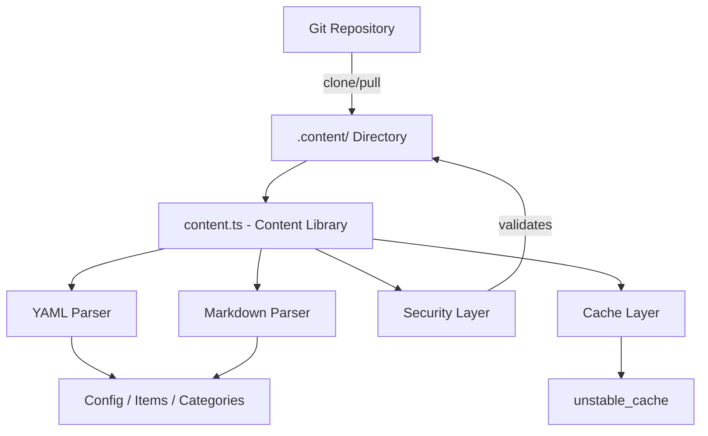
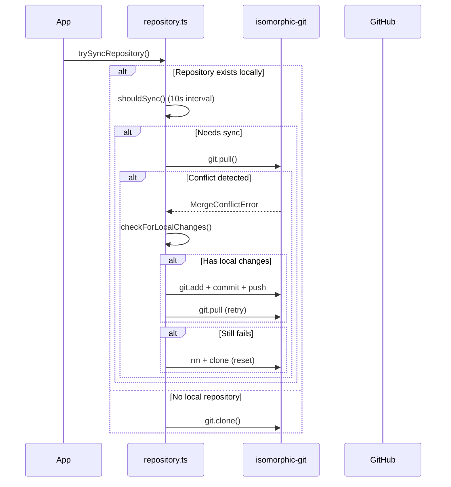

# مكتبة المحتوى

توفر مكتبة المحتوى (`lib/content.ts`) أدوات مساعدة من جانب الخادم لقراءة المحتوى وتحليله وتخزينه مؤقتًا من مستودع CMS يستند إلى Git. فهو يتعامل مع ملفات محتوى YAML/Markdown وإدارة التكوين ومزامنة المحتوى باستخدام إجراءات أمنية قوية.

## نظرة عامة على الهندسة المعمارية



## ملفات المصدر

|ملف|الغرض|
|------|---------|
|`lib/content.ts`|معالجة المحتوى الرئيسي، والقراءة، والتخزين المؤقت|
|`lib/repository.ts`|مزامنة استنساخ/سحب Git مع المستودع البعيد|
|`lib/lib.ts`|أدوات المسار المساعدة (`getContentPath`، `fsExists`، `dirExists`)|
|`lib/cache-config.ts`|علامات ذاكرة التخزين المؤقت وتكوين TTL|

## طبقة الأمان

تفرض مكتبة المحتوى إجراءات أمنية متعددة لمنع هجمات اجتياز المسار والحقن.

### التحقق من صحة رمز اللغة

```typescript
function validateLanguageCode(lang: string): boolean {
  const validLangPattern = /^[a-zA-Z0-9_-]+$/;
  return validLangPattern.test(lang) && lang.length <= 10;
}
```

يتم قبول الأحرف الأبجدية الرقمية والواصلات والشرطات السفلية فقط بحد أقصى 10 أحرف.

### تعقيم اسم الملف

```typescript
function sanitizeFilename(filename: string): string {
  const sanitized = path.basename(filename);
  if (sanitized.includes('..') || sanitized.includes('/') || sanitized.includes('\\')) {
    throw new Error('Invalid filename: contains dangerous characters');
  }
  return sanitized;
}
```

يستخدم `path.basename` لتجريد مكونات الدليل ويرفض أي أحرف اجتياز متبقية.

### التحقق من صحة المسار

```typescript
function validatePath(filepath: string, basePath: string): void {
  const resolvedPath = path.resolve(filepath);
  const resolvedBase = path.resolve(basePath);
  if (!resolvedPath.startsWith(resolvedBase + path.sep) && resolvedPath !== resolvedBase) {
    throw new Error('Invalid file path: outside of allowed directory');
  }
}
```

تقوم الدالة `safeReadFile` بإجراء فحص مزدوج: فهي تتحقق من صحة المسار ثم تتحقق من بقاء المسار الحقيقي الذي تم حله (الارتباطات التالية) داخل الدليل الأساسي.

### التحقق من صحة عنوان URL

```typescript
function isValidUrl(url: string): boolean {
  const trimmed = url.trim();
  if (trimmed.startsWith('/') && !trimmed.startsWith('//')) return true;
  return trimmed.startsWith('http://') || trimmed.startsWith('https://');
}
```

كتل `javascript:`، `data:`، `vbscript:`، وغيرها من مخططات البروتوكول الخطيرة.

### التحقق من حجم CSS

```typescript
function isValidCssSize(value: string): boolean {
  if (['auto', 'inherit', 'initial', 'unset'].includes(value.trim())) return true;
  return /^\d+(\.\d+)?(px|em|rem|vh|vw|%|pt|cm|mm|in)?$/.test(value.trim());
}
```

يمنع حقن CSS من خلال حقول المادة الأمامية المخصصة للبطل.

## معالجة المحتوى

### تحليل YAML

يتم تحليل ملفات المحتوى باستخدام مكتبة `yaml` مع التحقق من صحة مخطط Zod للمادة الأمامية:

```typescript
const customHeroFrontmatterSchema = z.object({
  background_image: z.string().refine(isValidUrl, {
    message: 'Invalid URL: must be http, https, or relative path'
  }).optional(),
  // ... additional validated fields
});
```

### التخزين المؤقت للتكوين

يتم تخزين تكوين الموقع مؤقتًا باستخدام Next.js `unstable_cache` مع TTLs وعلامات ذاكرة التخزين المؤقت المحددة:

```typescript
import { CACHE_TAGS, CACHE_TTL } from './cache-config';

const getCachedConfig = unstable_cache(
  async () => { /* read and parse config.yml */ },
  [CACHE_TAGS.CONFIG],
  { revalidate: CACHE_TTL }
);
```

## مزامنة مستودع Git

تدير الوحدة `repository.ts` عمليات Git باستخدام `isomorphic-git`.

### تدفق المزامنة



### حماية المهلة

يتم تغليف جميع عمليات Git بمهلات قابلة للتكوين:

```typescript
async function withTimeout<T>(promise: Promise<T>, timeoutMs: number = 120000): Promise<T> {
  const timeoutPromise = new Promise<never>((_, reject) => {
    setTimeout(() => reject(new Error(`Operation timeout after ${timeoutMs}ms`)), timeoutMs);
  });
  return Promise.race([promise, timeoutPromise]);
}
```

### حل الصراعات

يتعامل النظام مع تعارضات الدمج من خلال استراتيجية متعددة الخطوات:

1. **اكتشف التغييرات المحلية** عبر `git.statusMatrix()`
2. **محاولة دفع** التغييرات المحلية قبل السحب
3. ** أعد محاولة السحب ** بعد الدفع الناجح
4. **إعادة الضبط الكامل** (حذف + إعادة استنساخ) كحل أخير

### السلوك الاحتياطي

إذا لم يتم تكوين `DATA_REPOSITORY` أو فشل الاستنساخ، فسيقوم النظام بإنشاء الحد الأدنى من المحتوى الاحتياطي:

```typescript
// Creates empty content directory with minimal config
const DEFAULT_CONFIG = `site_name: Website
item_name: Item
items_name: Items
copyright_year: ${new Date().getFullYear()}
`;
```

## التنفيذ على الخادم فقط

يستخدم كل من `content.ts` و`repository.ts` الاستيراد `server-only` لمنع الاستخدام العرضي من جانب العميل:

```typescript
'use server';
import 'server-only';
```

وهذا يضمن عدم تسرب عمليات المحتوى مع الوصول إلى نظام الملفات إلى حزم العميل.

## الوظائف المصدرة الرئيسية

|وظيفة|الوصف|
|----------|-------------|
|`getCachedConfig()`|إرجاع تكوين الموقع المخزن مؤقتًا من `config.yml`|
|`trySyncRepository()`|استنساخ المحتوى أو سحبه من مستودع Git البعيد|
|`pullChanges()`|تسحب أحدث التغييرات مع حل الصراع|
|`validateLanguageCode()`|التحقق من صحة تنسيق رمز اللغة i18n|
|`sanitizeFilename()`|تجريد مكونات الدليل من أسماء الملفات|
|`safeReadFile()`|يقرأ الملفات مع حماية كاملة من اجتياز المسار|
