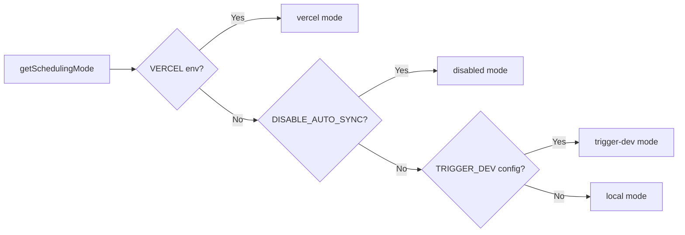

# نظام وظائف كرون

## نظرة عامة

يطبق قالب Ever Works نظام مهام خلفية مرنًا يدعم ثلاثة أوضاع جدولة: **Vercel Cron**، **Trigger.dev**، و**المجدول المحلي**. نقاط نهاية Cron هي مسارات API Next.js القياسية التي تمت مصادقتها عبر `CRON_SECRET`، ويتضمن النظام وحدة تهيئة مفردة تضمن إعداد المهام مرة واحدة بالضبط لكل عملية.

## الهندسة المعمارية

```mermaid
flowchart TD
    A[Scheduling Mode Detection] --> B{getSchedulingMode}

    B -->|vercel| C[Vercel Cron]
    B -->|trigger-dev| D[Trigger.dev]
    B -->|local| E[Local Scheduler]
    B -->|disabled| F[No Jobs]

    C --> G[vercel.json crons]
    G --> G1[/api/cron/sync]
    G --> G2[/api/cron/subscription-reminders]
    G --> G3[/api/cron/subscription-expiration]

    G1 --> H[CRON_SECRET Verification]
    G2 --> H
    G3 --> H

    H -->|Valid| I[Execute Job]
    H -->|Invalid| J[401 Unauthorized]

    I --> I1[triggerManualSync]
    I --> I2[subscriptionRenewalReminderJob]
    I --> I3[processExpiredSubscriptions]

    D --> K[Trigger.dev SDK]
    E --> L[Internal setInterval]

    K --> I
    L --> I
```

## ملفات المصدر

|ملف|الغرض|
|------|---------|
|`template/vercel.json`|تعريفات جدول Vercel cron|
|`template/app/api/cron/sync/route.ts`|نقطة النهاية لمزامنة المحتوى|
|`template/app/api/cron/subscription-reminders/route.ts`|تجديد رسائل البريد الإلكتروني التذكيرية|
|`template/app/api/cron/subscription-expiration/route.ts`|معالجة الاشتراك منتهية الصلاحية|
|`template/app/api/cron/jobs/background-jobs-init.ts`|تهيئة وظيفة Singleton|

## تكوين جدول كرون

### vercel.json

```json
{
    "crons": [
        {
            "path": "/api/cron/sync",
            "schedule": "0 3 * * *"
        },
        {
            "path": "/api/cron/subscription-reminders",
            "schedule": "0 9 * * *"
        },
        {
            "path": "/api/cron/subscription-expiration",
            "schedule": "0 0 * * *"
        }
    ]
}
```

|وظيفة|الجدول الزمني|الوقت|الوصف|
|-----|----------|------|-------------|
|مزامنة المحتوى| `0 3 * * *` |3:00 صباحًا بالتوقيت العالمي الموحد يوميًا|مزامنة المحتوى من نظام إدارة المحتوى المستند إلى Git|
|تذكيرات الاشتراك| `0 9 * * *` |9:00 صباحًا بالتوقيت العالمي المنسق يوميًا|يرسل رسائل تذكير بالتجديد عبر البريد الإلكتروني|
|انتهاء الاشتراك| `0 0 * * *` |منتصف الليل بالتوقيت العالمي المنسق يوميا|عمليات الاشتراكات منتهية الصلاحية|

## المصادقة

### توقيت التحقق السري الآمن

تتحقق جميع نقاط نهاية cron من `CRON_SECRET` باستخدام المقارنة الآمنة للتوقيت لمنع هجمات التوقيت:

```typescript
import crypto from 'crypto';

function verifyCronSecret(request: NextRequest): boolean {
    const authHeader = request.headers.get('authorization');
    const cronSecret = process.env.CRON_SECRET;

    // Development bypass
    if (!cronSecret && process.env.NODE_ENV === 'development') {
        console.log('[Cron] Bypassing cron auth in development');
        return true;
    }

    if (!cronSecret || !authHeader) return false;

    const expectedValue = `Bearer ${cronSecret}`;

    // Length check before timing-safe comparison
    if (authHeader.length !== expectedValue.length) return false;

    return crypto.timingSafeEqual(
        Buffer.from(authHeader, 'utf8'),
        Buffer.from(expectedValue, 'utf8')
    );
}
```

ميزات الأمان الرئيسية:
- **مقارنة آمنة للتوقيت** عبر `crypto.timingSafeEqual` - تمنع المهاجمين من قياس فروق وقت الاستجابة لتخمين السر
- **الفحص المسبق للطول** - يتطلب `timingSafeEqual` مخازن مؤقتة متساوية الطول
- ** تجاوز التطوير ** - فقط عندما لا يتم تكوين `CRON_SECRET` و`NODE_ENV=development`

### المصادقة التلقائية لفيرسيل

عند النشر على Vercel، يتضمن النظام الأساسي تلقائيًا رأس `Authorization: Bearer <CRON_SECRET>` لمهام cron التي تم تكوينها. ما عليك سوى تعيين متغير البيئة `CRON_SECRET` في لوحة معلومات Vercel.

## تنفيذ الوظائف

### وظيفة مزامنة المحتوى

```typescript
export async function GET(request: Request): Promise<NextResponse> {
    const startTime = Date.now();

    // Verify authorization
    if (!isAuthorized) {
        return NextResponse.json({ success: false, message: "Unauthorized" }, { status: 401 });
    }

    try {
        const result = await triggerManualSync();
        const duration = Date.now() - startTime;

        return NextResponse.json({
            success: result.success,
            timestamp: new Date().toISOString(),
            duration,
            message: result.message,
        }, {
            headers: { "Cache-Control": "no-cache, no-store, must-revalidate" },
        });
    } catch (error) {
        return NextResponse.json({
            success: false,
            message: "Cron sync failed",
            details: safeErrorMessage(error, "Unknown error"),
        }, { status: 500 });
    }
}
```

تنسيق الرد:
```json
{
    "success": true,
    "timestamp": "2025-01-15T03:00:05.123Z",
    "duration": 5123,
    "message": "Sync completed successfully"
}
```

### مهمة انتهاء الاشتراك

تقوم هذه الوظيفة بمعالجة الاشتراكات منتهية الصلاحية وترسل رسائل بريد إلكتروني للإشعار:

```typescript
export async function GET(request: NextRequest) {
    if (!verifyCronSecret(request)) {
        return NextResponse.json({ success: false, message: 'Unauthorized' }, { status: 401 });
    }

    // 1. Find and update expired subscriptions
    const result = await subscriptionService.processExpiredSubscriptions();

    // 2. Send notification emails
    const { service: emailService } = await createEmailService();
    if (emailService.isServiceAvailable()) {
        for (const subscription of result.subscriptions) {
            const user = await getUserById(subscription.userId);
            const emailTemplate = getSubscriptionExpiredTemplate({ /* ... */ });
            await sendEmailSafely(emailService, emailConfig, emailTemplate, user.email);
        }
    }

    // 3. Return results
    return NextResponse.json({
        success: true,
        data: {
            processed: result.processed,
            affectedUsers,
            errors: result.errors,
            timestamp: new Date().toISOString()
        }
    });
}
```

السلوكيات الرئيسية:
- فشل البريد الإلكتروني لا يتسبب في فشل المهمة
- يتم أيضًا تصدير طريقة `POST` كاسم مستعار للمشغلات اليدوية
- يُرجع `207 Multi-Status` للنجاحات الجزئية

### وظيفة تذكير الاشتراك

```typescript
export async function GET(request: NextRequest) {
    if (!verifyCronSecret(request)) {
        return NextResponse.json({ error: 'Unauthorized' }, { status: 401 });
    }

    const result = await subscriptionRenewalReminderJob();

    if (!result.success) {
        return NextResponse.json(
            { error: 'Job completed with errors', ...result },
            { status: 207 }  // Multi-Status for partial success
        );
    }

    return NextResponse.json({
        message: 'Subscription reminder job completed',
        ...result
    });
}

// Support POST for Vercel Cron
export async function POST(request: NextRequest) {
    return GET(request);
}
```

## تهيئة وظائف الخلفية

### نمط سينجلتون

تستخدم وحدة التهيئة `globalThis` لضمان إعداد المهام مرة واحدة بالضبط، حتى عبر استدعاءات الوظائف بدون خادم:

```typescript
const GLOBAL_KEY = '__BACKGROUND_JOBS_INIT__' as const;

interface BackgroundJobsGlobalState {
    initializationState: 'pending' | 'initializing' | 'completed';
    initializationPromise: Promise<void> | null;
    loggedMode: SchedulingMode | null;
}

export async function ensureBackgroundJobsInitialized(): Promise<void> {
    // Skip during tests and builds
    if (process.env.NODE_ENV === 'test') return;
    if (process.env.NEXT_PHASE === 'phase-production-build') return;

    const state = getGlobalState();

    // Fast path: already completed
    if (state.initializationState === 'completed') return;

    // Wait for in-progress initialization
    if (state.initializationState === 'initializing') {
        return state.initializationPromise;
    }

    // Start initialization
    state.initializationState = 'initializing';
    state.initializationPromise = doInitialize();

    try {
        await state.initializationPromise;
        state.initializationState = 'completed';
    } catch (error) {
        state.initializationState = 'pending'; // Allow retry
        throw error;
    }
}
```

### أوضاع الجدولة



|الوضع|السلوك|
|------|----------|
|`vercel`|تتم معالجة المهام بواسطة Vercel Cron عبر نقاط نهاية HTTP|
|`trigger-dev`|الوظائف التي تتم إدارتها بواسطة برنامج جدولة السحابة Trigger.dev|
|`local`|برنامج جدولة داخلي `setInterval` للتطوير|
|`disabled`|لا توجد جدولة تلقائية (`DISABLE_AUTO_SYNC=true`)|

## متغيرات البيئة

|متغير|مطلوب|الوصف|
|----------|----------|-------------|
|`CRON_SECRET`|الإنتاج فقط|الرمز المميز لمصادقة cron|
|`DISABLE_AUTO_SYNC`|لا|اضبط على `true` لتعطيل جميع وظائف الخلفية|
|`VERCEL`|ضبط تلقائي|يتم ضبطه تلقائيًا بواسطة منصة Vercel|

## أفضل الممارسات

1. **استخدم دائمًا المقارنة الآمنة للتوقيت** لأسرار cron - لمنع هجمات التوقيت
2. **تصدير كل من GET وPOST** - يمكن لـ Vercel Cron استخدام أي من الطريقتين
3. ** قم بتعيين `Cache-Control: no-cache`** على الاستجابات - منع التخزين المؤقت لنتائج المهمة
4. **تسجيل مدة المهمة** - يساعد في تحديد تراجعات الأداء
5. **تعامل مع حالات فشل البريد الإلكتروني بأمان** -- لا تدع حالات فشل الإشعارات تؤدي إلى تعطل المهمة
6. **استخدم `207 Multi-Status`** للنجاحات الجزئية - وهو ما يميزه عن النجاح/الفشل الكامل
