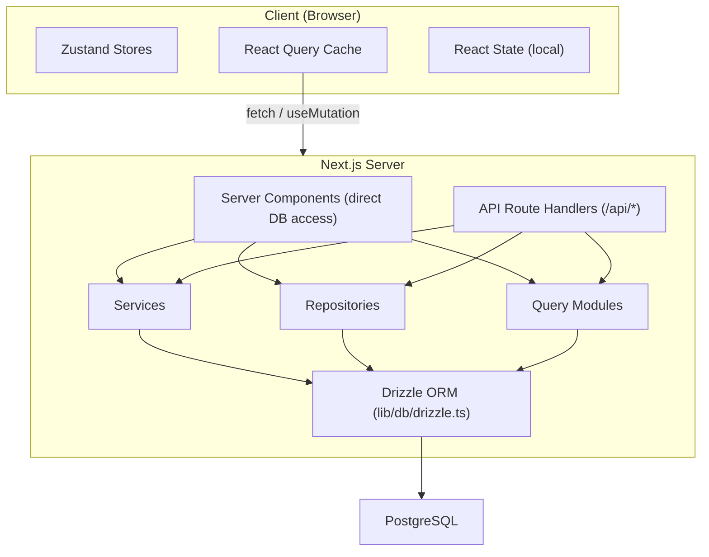

# تدفق البيانات وإدارة الحالة

يصف هذا المستند كيفية تدفق البيانات عبر قالب Ever Works، من قاعدة البيانات إلى واجهة المستخدم، ويغطي مكونات الخادم، ومسارات واجهة برمجة التطبيقات، وReact Query، ومخازن Zustand، ونمط المستودع.

## نظرة عامة على الهندسة المعمارية

يستخدم القالب بنية بيانات متعددة الطبقات:



## جلب البيانات من جانب الخادم

### مكونات الخادم (الوصول المباشر إلى قاعدة البيانات)

يمكن لمكونات الخادم الموجودة في الدليل `app/` استيراد واستدعاء وظائف استعلام قاعدة البيانات أو أساليب المستودع مباشرة. هذا هو المسار الأكثر فعالية لأنه يتجنب رحلات HTTP ذهابًا وإيابًا غير الضرورية.

```typescript
// app/[locale]/admin/items/page.tsx (simplified)
import { getItems } from '@/lib/db/queries';

export default async function AdminItemsPage() {
  const items = await getItems();
  return <ItemsList items={items} />;
}
```

### معالجات توجيه API

تعمل مسارات API في `app/api/` كجسر بين مكونات العميل والمنطق من جانب الخادم. وهي تتبع نمط المعالج الدقيق: التحقق من صحة الإدخال، واستدعاء الخدمة أو المستودع المناسب، وإرجاع استجابة HTTP.

```typescript
// Typical API route pattern
export async function GET(request: NextRequest) {
  const session = await auth();
  if (!session?.user) {
    return NextResponse.json({ error: 'Unauthorized' }, { status: 401 });
  }

  const data = await someRepository.findAll();
  return NextResponse.json({ success: true, data });
}
```

## إدارة الدولة من جانب العميل

### استعلام TanStack (استعلام التفاعل 5)

React Query هي الأداة الأساسية لإدارة حالة الخادم من جانب العميل. يستخدمه القالب على نطاق واسع من خلال الخطافات المخصصة في الدليل `hooks/`.

** التكوين العام ** (`lib/react-query-config.ts`):
- الوقت الافتراضي الافتراضي: 5 دقائق
- وقت جمع القمامة: 10 دقائق
- إعادة المحاولة التلقائية مع التراجع الأسي (حتى 3 محاولات إعادة المحاولة)
- أعد الجلب على تركيز النافذة وأعد الاتصال
- لا توجد إعادة المحاولة على أخطاء العميل 4xx

**نمط الخطاف**: تحتوي كل منطقة ميزة على خطافات مخصصة تغلف استعلام React:

```typescript
// hooks/use-admin-items.ts (simplified pattern)
import { useQuery, useMutation, useQueryClient } from '@tanstack/react-query';

export function useAdminItems(params) {
  return useQuery({
    queryKey: ['admin', 'items', params],
    queryFn: () => fetch('/api/admin/items').then(r => r.json()),
    staleTime: 5 * 60 * 1000,
  });
}

export function useCreateItem() {
  const queryClient = useQueryClient();
  return useMutation({
    mutationFn: (data) => fetch('/api/admin/items', {
      method: 'POST',
      body: JSON.stringify(data),
    }).then(r => r.json()),
    onSuccess: () => {
      queryClient.invalidateQueries({ queryKey: ['admin', 'items'] });
    },
  });
}
```

### متاجر زوستاند

يتم استخدام Zustand لحالة واجهة المستخدم الخاصة بالعميل فقط والتي لا تحتاج إلى مزامنة الخادم. تشمل الأمثلة ما يلي:

- **حالة السمة**: تفضيل الوضع الفاتح/المظلم
- **حالة الفلتر**: تحديدات الفلتر النشطة
- **حالة الوسائط**: حالة مفتوحة/مغلقة للحالات والتراكبات
- **تفضيلات التخطيط**: عرض الشبكة مقابل عرض القائمة، وحالة الشريط الجانبي

### رد الفعل السياق

يوفر موفرو سياق التفاعل في `components/context/` و`components/providers/` الحالة المشتركة للأشجار الفرعية للمكونات. يتكون غلاف موفري الجذر (`app/[locale]/providers.tsx`) من:

- رد فعل مزود الاستعلام (مع عميل الاستعلام)
- مزود الموضوع
- مزود جلسة المصادقة
- نخب مزود الإخطار

## طبقات الوصول إلى البيانات

### نمط المستودع

توفر المستودعات الموجودة في `lib/repositories/` فكرة واضحة عن عمليات قاعدة البيانات. يقوم كل مستودع بتغليف الاستعلامات الخاصة بكيان مجال معين.

```
lib/repositories/
├── admin-analytics-optimized.repository.ts
├── admin-stats.repository.ts
├── category.repository.ts
├── client-dashboard.repository.ts
├── client-item.repository.ts
├── collection.repository.ts
├── integration-mapping.repository.ts
├── item.repository.ts
├── role.repository.ts
├── sponsor-ad.repository.ts
├── tag.repository.ts
├── twenty-crm-config.repository.ts
└── user.repository.ts
```

### وحدات الاستعلام

يحتوي الدليل `lib/db/queries/` على أكثر من 23 وحدة استعلام منظمة حسب المجال. توفر هذه وظائف استعلام Drizzle ORM الأولية التي تستهلكها المستودعات والخدمات.

### طبقة الخدمات

يحتوي الدليل `lib/services/` على أكثر من 30 ملف خدمة تنفذ منطق الأعمال. تقوم الخدمات بتنسيق مستودعات متعددة واستدعاءات واجهة برمجة التطبيقات الخارجية والتأثيرات الجانبية (البريد الإلكتروني والإشعارات وخطافات الويب).

## بنية عميل API

### عميل API من جانب الخادم

`lib/api/server-api-client.ts` يوفر عميل HTTP مركزيًا للمكالمات من جانب الخادم مع:
- إعادة المحاولة التلقائية مع التراجع الأسي
- المهلات القابلة للتكوين (الافتراضي 30 ثانية)
- تسجيل منظم في التنمية
- تطبيع الخطأ

### عميل API من جانب المتصفح

`lib/api/api-client.ts` و`lib/api/api-client-class.ts` يوفران تجريد واجهة برمجة التطبيقات من جانب العميل الذي تستخدمه خطافات React Query لاستدعاء مسارات واجهة برمجة التطبيقات.

## بيانات المحتوى (نظام إدارة المحتوى المستند إلى Git)

يتم تخزين محتوى العنصر (قوائم الدليل) في مستودع Git وإدارته من خلال `lib/content.ts` و`lib/repository.ts`. يتم استنساخ هذا المحتوى في `.content/` في وقت الإنشاء وتتم مزامنته بشكل دوري. يستخدم نظام المحتوى `isomorphic-git` لعمليات Git مباشرة من Node.js.

## استراتيجية ذاكرة التخزين المؤقت

يطبق القالب نهج التخزين المؤقت متعدد المستويات:

1. **ذاكرة التخزين المؤقت لاستعلام التفاعل**: من جانب العميل مع أوقات قديمة/GC قابلة للتكوين لكل استعلام
2. **ذاكرة التخزين المؤقت Next.js**: العرض من جانب الخادم وذاكرة التخزين المؤقت للبيانات عبر `lib/cache-config.ts`
3. **إبطال ذاكرة التخزين المؤقت**: إبطال مستهدف من خلال `lib/cache-invalidation.ts` باستخدام علامات إعادة التحقق
4. **تجميع اتصالات قاعدة البيانات**: تم تكوينه في `lib/db/drizzle.ts` بأحجام تجمع تتراوح بين 1-50 اتصالاً
