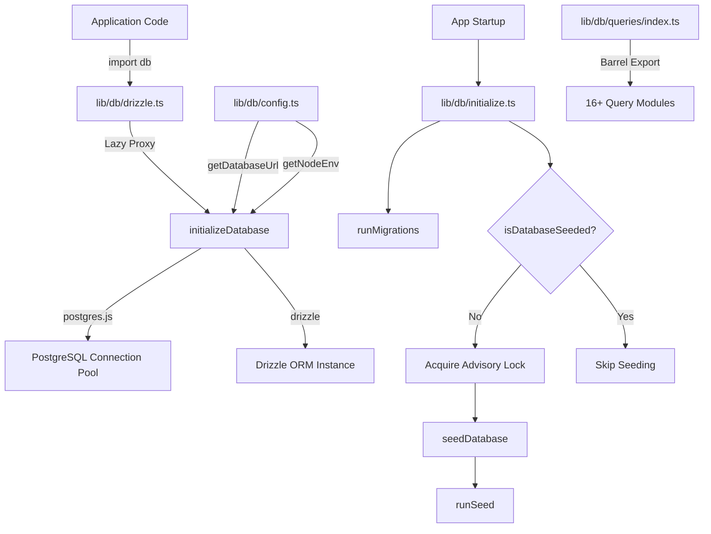
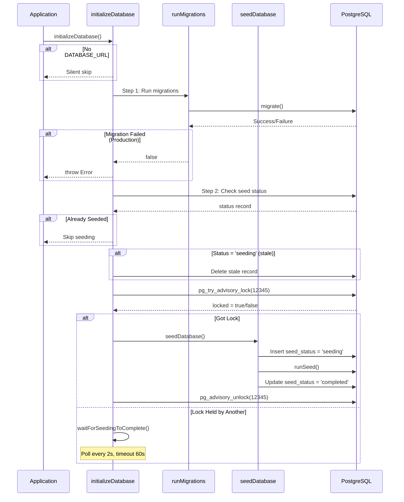

# وحدة أدوات مساعدة قاعدة البيانات

تدير وحدة الأدوات المساعدة لقاعدة البيانات (`template/lib/db/`) تجميع اتصالات PostgreSQL عبر `postgres.js`، وتهيئة Drizzle ORM، والترحيلات الآلية، وبذر قاعدة البيانات باستخدام القفل الآمن للتزامن. إنه مصمم للعمل في بيئات بدون خادم (Vercel) حيث يمكن أن تتسابق عمليات التشغيل الباردة المتعددة لتهيئة قاعدة البيانات.

## نظرة عامة على الهندسة المعمارية



## ملفات المصدر

|ملف|الوصف|
|------|-------------|
|`lib/db/config.ts`|تكوين قاعدة بيانات آمنة للبرنامج النصي (لا يوجد `server-only`)|
|`lib/db/drizzle.ts`|تجمع الاتصال ومثيل Drizzle مع الوكيل البطيء|
|`lib/db/initialize.ts`|الهجرة التلقائية وتنسيق البذر|
|`lib/db/migrate.ts`|عداء الهجرة|
|`lib/db/queries/index.ts`|تصدير البرميل لجميع وحدات الاستعلام|

## تكوين قاعدة البيانات (`config.ts`)

وظائف آمنة للبرنامج النصي **لا** تستورد `server-only`، مما يسمح باستخدامها في البرامج النصية للترحيل والبذور:

```typescript
function getDatabaseUrl(): string | undefined;
function getNodeEnv(): 'development' | 'production' | 'test';
function isProduction(): boolean;
```

## الاتصال وORM (`drizzle.ts`)

### نمط الوكيل الكسول

يستخدم التصدير `db` JavaScript `Proxy` لتأجيل تهيئة الاتصال حتى الاستخدام الأول. وهذا يمنع حدوث أخطاء في الاتصال أثناء وقت الإنشاء عندما لا يكون `DATABASE_URL` متاحًا.

```typescript
// Proxy intercepts all property access and initializes on demand
export const db = new Proxy({} as ReturnType<typeof drizzle>, {
  get(target, prop) {
    const database = initializeDatabase();
    return database[prop as keyof typeof database];
  },
});
```

### تكوين تجمع الاتصال

```typescript
function getPoolSize(): number;
// - Reads DB_POOL_SIZE env var (clamped to 1-50)
// - Defaults: 20 (production), 10 (development)
```

إعدادات المسبح:
- `idle_timeout`: 20 ثانية
- `connect_timeout`: 30 ثانية
- `prepare`: خطأ (مطلوب لبعض البيئات التي لا تحتوي على خادم)

### سينجلتون عبر `globalThis`

يتم تخزين الاتصال مؤقتًا على `globalThis` للبقاء على قيد الحياة أثناء عمليات إعادة تحميل الوحدة النمطية Next.js الساخنة أثناء التطوير:

```typescript
const globalForDb = globalThis as unknown as {
  conn: postgres.Sql | undefined;
  db: ReturnType<typeof drizzle> | undefined;
};
```

### الوصول المباشر للمثيل

بالنسبة للحالات التي تتطلب مثيل Drizzle الفعلي (على سبيل المثال، محول NextAuth.js Drizzle):

```typescript
import { getDrizzleInstance } from '@/lib/db/drizzle';

const adapter = DrizzleAdapter(getDrizzleInstance(), { ... });
```

## عداء الهجرة (`migrate.ts`)

### `runMigrations(): Promise<boolean>`

يقوم بتشغيل عمليات ترحيل Drizzle من المجلد `./lib/db/migrations`. من الآمن الاتصال عند كل بدء تشغيل لأن Drizzle's `migrate()` غير فعال - فهو يتتبع عمليات الترحيل المطبقة في جدول `__drizzle_migrations`.

```typescript
import { runMigrations } from '@/lib/db/migrate';

const success = await runMigrations();
if (!success) {
  console.error('Migrations failed -- run pnpm db:migrate manually');
}
```

**السلوك:**
- يسجل تاريخ الهجرة الحديث قبل وبعد التنفيذ
- يُرجع `true` عند النجاح، `false` عند الفشل
- لا يتم الرمي - يتم تسجيل حالات الفشل وإعادتها كقيمة منطقية

## تهيئة قاعدة البيانات (`initialize.ts`)

### `initializeDatabase(): Promise<void>`

وظيفة التهيئة الرئيسية تسمى عند بدء تشغيل التطبيق. يتعامل مع دورة الحياة الكاملة:



### سلامة التزامن

يمكن أن تبدأ مثيلات متعددة بدون خادم في وقت واحد. تمنع الوحدة البذر المكرر باستخدام:

1. **قفل استشاري PostgreSQL** (`pg_try_advisory_lock(12345)`) - غير محظور
2. ** جدول حالة البذور ** تتبع `seeding`، `completed`، `failed` الحالات
3. **اكتشاف التلف** - حد 5 دقائق لحالة `seeding` العالقة
4. **الانتظار والاستقصاء** - المثيلات التي لا يمكنها الحصول على استقصاء القفل كل ثانيتين

### وظائف المساعدة

```typescript
// Check if database has been successfully seeded
async function isDatabaseSeeded(): Promise<boolean>;

// Wait for another instance to finish seeding (60s timeout, 2s intervals)
async function waitForSeedingToComplete(): Promise<boolean>;
```

## وحدات الاستعلام

يحتوي الدليل `lib/db/queries/` على وحدات استعلام خاصة بالمجال، جميعها مُعاد تصديرها عبر `index.ts`:

|الوحدة النمطية|المجال|
|--------|--------|
|`activity.queries.ts`|تسجيل النشاط|
|`auth.queries.ts`|المصادقة (بحث المستخدم، التحقق من كلمة المرور)|
|`client.queries.ts`|ملفات تعريف العملاء|
|`comment.queries.ts`|التعليقات|
|`company.queries.ts`|ملفات تعريف الشركة|
|`dashboard.queries.ts`|إحصائيات لوحة القيادة|
|`engagement.queries.ts`|المشاهدات والأصوات وتجميع المفضلة|
|`item.queries.ts`|البند الخام|
|`location-index.queries.ts`|الفهرسة على أساس الموقع|
|`newsletter.queries.ts`|اشتراكات النشرة الإخبارية|
|`payment.queries.ts`|سجلات الدفع|
|`report.queries.ts`|التقارير|
|`subscription.queries.ts`|الاشتراكات|
|`survey.queries.ts`|المسوحات والردود|
|`user.queries.ts`|إدارة المستخدم|
|`vote.queries.ts`|نظام التصويت|

### نمط الاستيراد

```typescript
import {
  getUserByEmail,
  getClientProfileByUserId,
  logActivity,
  isUserAdmin,
} from '@/lib/db/queries';
```

## متغيرات البيئة

|متغير|مطلوب|الوصف|
|----------|----------|-------------|
|`DATABASE_URL`|لا (قاعدة بيانات اختيارية)|سلسلة اتصال PostgreSQL|
|`DB_POOL_SIZE`|لا|حجم تجمع الاتصال (الافتراضي: 10/20)|
|`NODE_ENV`|لا|يحدد الإعدادات الافتراضية لحجم التجمع والتسجيل|
