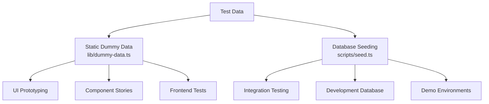
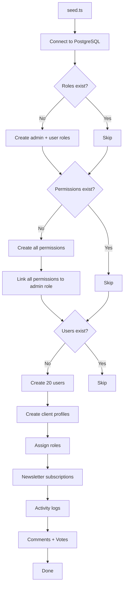
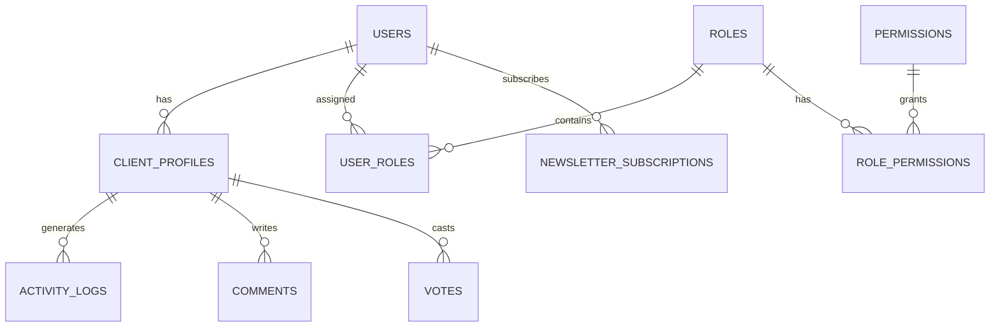

# نظام البيانات الوهمية

يوفر القالب طريقتين لاختبار البيانات: البيانات الوهمية الثابتة لتطوير واجهة المستخدم والنماذج الأولية، ونظام زرع قاعدة البيانات لإنشاء سجلات واقعية في PostgreSQL. يغطيان معًا دورة حياة التطوير الكاملة بدءًا من النماذج بالحجم الطبيعي وحتى اختبار التكامل.

## نظرة عامة



## البيانات الوهمية الثابتة

تقوم الوحدة `lib/dummy-data.ts` بتصدير بيانات العينة المكتوبة لاستخدامها في المكونات أثناء التطوير.

### واجهة التقديم

```typescript
export interface Submission {
  id: string;
  title: string;
  description: string;
  status: "approved" | "pending" | "rejected";
  submittedAt: string | null;
  approvedAt?: string;
  rejectedAt?: string;
  rejectionReason?: string;
  category: string;
  tags: string[];
  views: number;
  likes: number;
}
```

### dummySubmissions

ستة نماذج من التقديمات تغطي جميع حالات الحالة:

|معرف|العنوان|الحالة|الفئة|وجهات النظر|يحب|
|---|---|---|---|---|---|
| 1 |منصة التجارة الإلكترونية الحديثة|تمت الموافقة عليه|تطوير الويب| 1250 | 89 |
| 2 |تطبيق إدارة المهام|في انتظار|تطوير المحمول| 567 | 23 |
| 3 |لوحة معلومات الطقس|مرفوض|تطوير الويب| 890 | 45 |
| 4 |مساعد الدردشة بالذكاء الاصطناعي|تمت الموافقة عليه|الذكاء الاصطناعي/التعلم الآلي| 2100 | 156 |
| 5 |تطبيق تتبع اللياقة البدنية|في انتظار|تطوير المحمول| 432 | 18 |
| 6 |منصة المدونة|في انتظار|تطوير الويب| 0 | 0 |

الاستخدام في المكونات:

```typescript
import { dummySubmissions } from '@/lib/dummy-data';

export function SubmissionList() {
  return (
    <div>
      {dummySubmissions.map((submission) => (
        <SubmissionCard key={submission.id} submission={submission} />
      ))}
    </div>
  );
}
```

### dummyPortfolio

ثلاثة نماذج لعناصر المحفظة لعرض بطاقات المشروع:

|معرف|العنوان|مميز|العلامات|
|---|---|---|---|
| 1 |منصة التجارة الإلكترونية|نعم|Next.js، شريط، التجارة الإلكترونية|
| 2 |تطبيق إدارة المهام|نعم|رد فعل، Firebase، في الوقت الحقيقي|
| 3 |لوحة معلومات الطقس|لا|Vue.js، واجهة برمجة تطبيقات الطقس، لوحة المعلومات|

يتضمن كل عنصر في المحفظة ما يلي:

```typescript
{
  id: string;
  title: string;
  description: string;
  imageUrl: string;      // Unsplash placeholder image
  externalUrl: string;   // Demo link
  tags: string[];
  isFeatured: boolean;
}
```

## زرع قاعدة البيانات

يقوم البرنامج النصي `scripts/seed.ts` بإنشاء بيانات واقعية مباشرة في PostgreSQL باستخدام Drizzle ORM.

### هندسة البذر



### علاقات البيانات



### ملفات تعريف المستخدمين التي تم إنشاؤها

يقوم البذر بإنشاء ملفات تعريف ذات تباين حتمي:

```typescript
// Plan distribution
plan: i % 5 === 0 ? 'premium'    // 20% premium
    : i % 3 === 0 ? 'standard'   // ~13% standard
    : 'free';                     // ~67% free

// Job titles alternate
jobTitle: i % 2 === 0 ? 'Developer' : 'Designer';

// Companies alternate
company: i % 2 === 0 ? 'Acme Inc.' : 'Globex';

// Bios for every 3rd user
bio: i % 3 === 0 ? 'Power user' : null;
```

### أنماط سجل النشاط

تتنقل سجلات الأنشطة من خلال أربعة أنواع من الإجراءات:

|نمط الفهرس|العمل|الوصف|
|---|---|---|
|`i % 4 === 0`|`SIGN_UP`|إنشاء الحساب|
|`i % 4 === 1`|`SIGN_IN`|حدث تسجيل الدخول|
|`i % 4 === 2`|`COMMENT`|تم نشر التعليق|
|`i % 4 === 3`|`VOTE`|يلقي التصويت|

يتم اختيار الطوابع الزمنية بشكل عشوائي خلال آخر 7 أيام.

### توزيع الأصوات

يتم تقسيم الأصوات بنسبة 75/25 لصالح الأصوات المؤيدة:

```typescript
voteType: i % 4 === 0 ? VoteType.DOWNVOTE : VoteType.UPVOTE
```

### تكوين الاتصال

يستخدم بذارة إعدادات الاتصال المحافظة المناسبة للنصوص البرمجية:

```typescript
const conn = postgres(databaseUrl, {
  max: 1,              // Single connection (no pool needed)
  idle_timeout: 20,    // Close idle connections after 20s
  connect_timeout: 10, // 10-second connection timeout
  prepare: false,      // Disable prepared statements
});
```

## بذر المنتج الشريطي

يقوم البرنامج النصي `scripts/seed-stripe-products.ts` بإنشاء كتالوج الفواتير في Stripe. راجع وثائق [البرامج النصية لقاعدة البيانات](../development/database-scripts.md) للحصول على قائمة المنتجات الكاملة.

## العجز

تم تصميم كلا أسلوبي البذر ليكونا آمنين للتنفيذ المتكرر:

|نوع البيانات|حالة الحرس|السلوك عند إعادة التشغيل|
|---|---|---|
|الأدوار|`SELECT * FROM roles LIMIT 1`|تخطي إذا كان هناك أي وجود|
|الأذونات|`SELECT * FROM permissions LIMIT 1`|تخطي إذا كان هناك أي وجود|
|المستخدمين|`SELECT count(*) FROM users`|تخطي إذا كان العد> 0|
|النشرة الإخبارية|مضمن في كتلة إنشاء المستخدم|تخطي مع المستخدمين|

## استخدام البيانات الوهمية في التنمية

### النمط 1: النماذج الأولية للمكونات

استخدم البيانات الوهمية الثابتة لإنشاء مكونات واجهة المستخدم قبل أن تصبح الواجهة الخلفية جاهزة:

```typescript
import { dummySubmissions, type Submission } from '@/lib/dummy-data';

interface SubmissionCardProps {
  submission: Submission;
}

export function SubmissionCard({ submission }: SubmissionCardProps) {
  const statusColors = {
    approved: 'bg-green-100 text-green-800',
    pending: 'bg-yellow-100 text-yellow-800',
    rejected: 'bg-red-100 text-red-800',
  };

  return (
    <div className="p-4 border rounded-lg">
      <h3>{submission.title}</h3>
      <span className={statusColors[submission.status]}>
        {submission.status}
      </span>
      <p>{submission.description}</p>
      <div className="flex gap-2">
        {submission.tags.map(tag => (
          <span key={tag} className="badge">{tag}</span>
        ))}
      </div>
    </div>
  );
}
```

### النمط 2: نماذج لوحة المعلومات

```typescript
import { dummySubmissions } from '@/lib/dummy-data';

// Derive stats from dummy data
const stats = {
  total: dummySubmissions.length,
  approved: dummySubmissions.filter(s => s.status === 'approved').length,
  pending: dummySubmissions.filter(s => s.status === 'pending').length,
  rejected: dummySubmissions.filter(s => s.status === 'rejected').length,
  totalViews: dummySubmissions.reduce((sum, s) => sum + s.views, 0),
};
```

### النمط 3: الاستبدال بالبيانات الحقيقية

عندما يصبح تكامل الواجهة الخلفية جاهزًا، قم بتبديل الاستيراد:

```typescript
// Before (dummy data)
import { dummySubmissions } from '@/lib/dummy-data';
const submissions = dummySubmissions;

// After (real data)
const submissions = await getSubmissions();
```

## إضافة بيانات وهمية جديدة

عند إضافة ميزات جديدة، قم بتوسيع `lib/dummy-data.ts` بنموذج البيانات المكتوبة:

1. قم بتعريف واجهة TypeScript لشكل البيانات
2. تصديره لاستخدامه في المكونات
3. إنشاء إدخالات نموذجية تغطي حالات الحافة (الحقول الفارغة، والسلاسل ذات الطول الأقصى، وجميع قيم الحالة)
4. استخدم قيمًا واقعية (أسماء العلم وعناوين URL الصالحة والأرقام المعقولة)
5. قم بتضمين كل من العناصر المميزة وغير المميزة حيثما أمكن ذلك

```typescript
// Example: adding dummy reviews
export interface DummyReview {
  id: string;
  authorName: string;
  rating: number;
  comment: string;
  createdAt: string;
}

export const dummyReviews: DummyReview[] = [
  {
    id: "1",
    authorName: "Jane Developer",
    rating: 5,
    comment: "Excellent tool for rapid prototyping",
    createdAt: "2024-02-01T10:00:00Z"
  },
  // ... more entries covering 1-star, no comment, etc.
];
```
