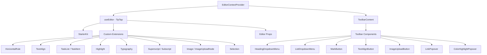

# نظام المحرر

يشتمل القالب على محرر نص منسق مبني على TipTap (ProseMirror) مع بنية معيارية للملحقات ومكونات شريط الأدوات والخطافات ووظائف الأداة المساعدة. يدعم المحرر العناوين والقوائم وقوائم المهام والصور وكتل التعليمات البرمجية وتنسيق النص والمزيد.

## نظرة عامة على الهندسة المعمارية



## ملفات المصدر

|الدليل|المحتويات|
|-----------|----------|
|`lib/editor/extensions/`|يقوم ملحق TipTap بإعادة التصدير والتكوين|
|`lib/editor/components/`|مكونات واجهة المستخدم (أزرار شريط الأدوات، والنوافذ المنبثقة، والأيقونات)|
|`lib/editor/hooks/`|خطافات التفاعل لإدارة حالة المحرر|
|`lib/editor/providers/`|مزود سياق المحرر مع إعداد الامتداد|
|`lib/editor/contents/`|تخطيط شريط الأدوات ومكونات محتوى المحرر|
|`lib/editor/utils/`|وظائف الأداة المساعدة (الاختصارات، التحقق من الصحة، التحميل)|

## تكوين التمديد

تم تسجيل الامتدادات في `EditorContextProvider`. يوفر `StarterKit` الوظيفة الأساسية، مع ملحقات إضافية موضوعة في الأعلى:

```typescript
const extensions = useMemo(() => [
  StarterKit.configure({
    horizontalRule: false,
    link: { openOnClick: false, enableClickSelection: true },
  }),
  HorizontalRule,
  TextAlign.configure({ types: ['heading', 'paragraph'] }),
  ImageUploadNode.configure({
    accept: 'image/*',
    maxSize: MAX_FILE_SIZE, // 5MB
    limit: 3,
    upload: handleImageUpload,
    onError: (error) => console.error('Upload failed:', error),
  }),
  TaskList,
  TaskItem.configure({ nested: true }),
  Highlight.configure({ multicolor: true }),
  Image,
  Typography,
  Superscript,
  Subscript,
  Selection,
], []);
```

### ملخص الامتداد

|ملحق|المصدر|الغرض|
|-----------|--------|---------|
|`StarterKit`|`@tiptap/starter-kit`|الفقرات، غامقة، مائلة، القوائم، التعليمات البرمجية، الاقتباس|
|`HorizontalRule`|`@tiptap/extension-horizontal-rule`|فواصل أفقية|
|`TextAlign`|`@tiptap/extension-text-align`|اليسار، الوسط، اليمين، تبرير المحاذاة|
|`TaskList` / `TaskItem`|`@tiptap/extension-list`|قوائم مربعات الاختيار التفاعلية|
|`Highlight`|`@tiptap/extension-highlight`|تسليط الضوء على النص متعدد الألوان|
|`Typography`|`@tiptap/extension-typography`|علامات الاقتباس الذكية، والشرطات، وعلامات الحذف|
|`Superscript`|`@tiptap/extension-superscript`|نص مرتفع|
|`Subscript`|`@tiptap/extension-subscript`|نص منخفض|
|`Selection`|`@tiptap/extensions`|التعامل مع الاختيار المحسن|
|`Image`|`@tiptap/extension-image`|عرض الصور الثابتة|
|`ImageUploadNode`|مخصص|تحميل الصور بالسحب والإفلات مع التقدم|

## موفر سياق المحرر

يتم توفير المحرر عبر React context للوصول إلى مستوى الشجرة:

```typescript
export const EditorContext = createContext<Editor | null>(null);

export function EditorContextProvider({ children }: { children: React.ReactNode }) {
  const editor = useEditor({
    immediatelyRender: false,
    shouldRerenderOnTransaction: false,
    editorProps: {
      attributes: {
        autocomplete: 'on',
        autocorrect: 'on',
        autocapitalize: 'off',
        'aria-label': 'Main content area, start typing to enter text.',
        class: cn('min-h-96'),
      },
    },
    extensions,
  });

  return <EditorContext.Provider value={editor}>{children}</EditorContext.Provider>;
}
```

خيارات التكوين الرئيسية:
- `immediatelyRender: false` يمنع عدم تطابق ترطيب SSR
- `shouldRerenderOnTransaction: false` يعمل على تحسين الأداء عن طريق تجنب عمليات إعادة العرض غير الضرورية

## تكوين شريط الأدوات

يحدد المكون `ToolbarContent` تخطيط شريط الأدوات الكامل المنظم في مجموعات:

|المجموعة|المكونات|
|-------|------------|
|التاريخ|التراجع، الإعادة|
|أنواع الكتل|القائمة المنسدلة للعناوين (H1-H4)، القائمة المنسدلة (رمز نقطي، مرتب، مهمة)، علامة اقتباس، كتلة التعليمات البرمجية|
|علامات مضمنة|غامق، مائل، يتوسطه خط، رمز، تسطير، تمييز اللون، رابط|
|البرنامج النصي|مرتفع، منخفض|
|محاذاة|يسار، وسط، يمين، تبرير|
|وسائل الإعلام|تحميل الصورة|

يتم فصل المجموعات بواسطة مكونات `ToolbarSeparator` مع عناصر `Spacer` لتحديد المواقع.

## خطاف المحرر

### `useTiptapEditor`

يوفر وصولاً مرنًا إلى نسخة المحرر إما من الدعائم أو السياق:

```typescript
export function useTiptapEditor(providedEditor?: Editor | null): {
  editor: Editor | null;
  editorState?: Editor["state"];
  canCommand?: Editor["can"];
}
```

يقوم هذا الخطاف بدمج المحرر المقدم مباشرة مع محرر السياق، مما يتيح للمكونات العمل بشكل مستقل وداخل شجرة الموفر.

### خطافات إضافية

|هوك|الغرض|
|------|---------|
|`use-editor.ts`|إدارة حالة المحرر الأساسي|
|`use-editor-sync.ts`|التزامن بين مثيلات المحرر|
|`use-cursor-visibility.ts`|موضع المؤشر وتتبع الرؤية|
|`use-element-rect.ts`|تتبع المستطيل المحيط بالعنصر|
|`use-scrolling.ts`|انتقل الموقف والسلوك|
|`use-throttled-callback.ts`|تنفيذ رد الاتصال خنق|
|`use-window-size.ts`|تتبع حجم النافذة المستجيبة|
|`use-unmount.ts`|تنظيف على إلغاء تحميل المكون|

## وظائف المرافق

### تنسيق مفتاح الاختصار

يتعامل النظام مع اختصارات لوحة المفاتيح الخاصة بالنظام الأساسي:

```typescript
export const MAC_SYMBOLS: Record<string, string> = {
  mod: "Command", command: "Command", meta: "Command",
  ctrl: "Ctrl", alt: "Option", shift: "Shift",
  // ... additional mappings
};

export const formatShortcutKey = (key: string, isMac: boolean, capitalize?: boolean) => {
  // Returns Mac symbols or formatted key names
};

export const parseShortcutKeys = (props: {
  shortcutKeys: string | undefined;
  delimiter?: string;
  capitalize?: boolean;
}) => string[];
```

### التحقق من صحة المخطط

```typescript
// Check if a mark type exists in the editor schema
export const isMarkInSchema = (markName: string, editor: Editor | null): boolean;

// Check if a node type exists in the editor schema
export const isNodeInSchema = (nodeName: string, editor: Editor | null): boolean;

// Check if extensions are registered
export function isExtensionAvailable(editor: Editor | null, extensionNames: string | string[]): boolean;
```

### التنقل العقدي

```typescript
// Find a node at a specific document position
export function findNodeAtPosition(editor: Editor, position: number): TiptapNode | null;

// Find a node by reference or position
export function findNodePosition(props: {
  editor: Editor | null;
  node?: TiptapNode | null;
  nodePos?: number | null;
}): { pos: number; node: TiptapNode } | null;

// Move focus to the next node
export function focusNextNode(editor: Editor): boolean;
```

### تحميل الصورة

```typescript
export const MAX_FILE_SIZE = 5 * 1024 * 1024; // 5MB

export const handleImageUpload = async (
  file: File,
  onProgress?: (event: { progress: number }) => void,
  abortSignal?: AbortSignal
): Promise<string>;
```

يتحقق معالج التحميل من صحة حجم الملف، ويدعم تتبع التقدم، ويتعامل مع الإلغاء عبر `AbortSignal`.

### تطهير URL

```typescript
export function isAllowedUri(uri: string | undefined, protocols?: ProtocolConfig): boolean;
export function sanitizeUrl(inputUrl: string, baseUrl: string, protocols?: ProtocolConfig): string;
```

يضمن أن البروتوكولات الآمنة فقط (`http`، `https`، `ftp`، `mailto`، وما إلى ذلك) مسموح بها في الروابط. يتم استبدال عناوين URL غير الآمنة بـ `"#"`.
