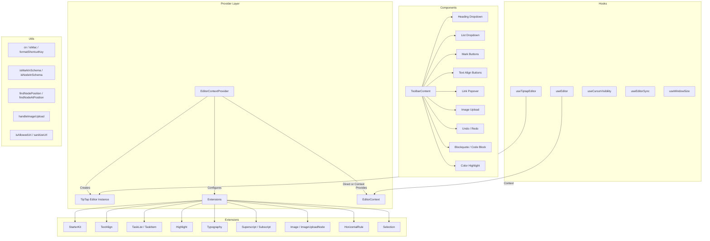

# وحدة الأدوات المساعدة للمحرر

توفر وحدة الأدوات المساعدة للمحرر (`template/lib/editor/`) حلاً كاملاً لتحرير النص المنسق مبنيًا على **TipTap** (ProseMirror). يتضمن موفر محرر تم تكوينه مسبقًا، وامتدادات TipTap، ومكتبة مكونات شريط الأدوات الكاملة، ووظائف الأداة المساعدة لمعالجة DOM، وخطافات React المخصصة لإدارة حالة المحرر.

## نظرة عامة على الهندسة المعمارية



## ملفات المصدر

|الدليل|الوصف|
|-----------|-------------|
|`lib/editor/index.ts`|تصدير البرميل لجميع الوحدات الفرعية|
|`lib/editor/providers/`|`EditorContextProvider` و`EditorContext`|
|`lib/editor/extensions/`|إعادة تصدير ملحق TipTap|
|`lib/editor/hooks/`|خطافات رد فعل مخصصة|
|`lib/editor/utils/`|وظائف المرافق|
|`lib/editor/contents/`|`ToolbarContent` و`EditorContent` المكونات|
|`lib/editor/components/`|أساسيات واجهة المستخدم، وأزرار شريط الأدوات، والأيقونات، والعقد|
|`lib/editor/styles/`|محرر أنماط CSS|

## مزود المحرر

### `EditorContextProvider`

يلتف حول الأطفال باستخدام مثيل محرر TipTap الذي تم تكوينه مسبقًا:

```tsx
import { EditorContextProvider } from '@/lib/editor';

function MyEditor() {
  return (
    <EditorContextProvider>
      <ToolbarContent editor={null} />
      <EditorContent />
    </EditorContextProvider>
  );
}
```

### التكوين

يقوم الموفر بتكوين TipTap بهذه الإعدادات:

```typescript
const editor = useEditor({
  immediatelyRender: false,
  shouldRerenderOnTransaction: false,
  editorProps: {
    attributes: {
      autocomplete: 'on',
      autocorrect: 'on',
      autocapitalize: 'off',
      'aria-label': 'Main content area, start typing to enter text.',
      class: 'min-h-96',
    },
  },
  extensions: [/* ... */],
});
```

### الإضافات التي تم تكوينها مسبقًا

|ملحق|التكوين|
|-----------|--------------|
|`StarterKit`|`horizontalRule: false`، `link.openOnClick: false`|
|`HorizontalRule`|الافتراضي|
|`TextAlign`|ينطبق على `heading` و`paragraph` العقد|
|`ImageUploadNode`|قبول: `image/*`، بحد أقصى 5 ميجابايت، بحد أقصى 3 صور|
|`TaskList` / `TaskItem`|تم تمكين المهام المتداخلة|
|`Highlight`|تم تمكين متعدد الألوان|
|`Image`|الافتراضي|
|`Typography`|علامات الاقتباس والشرطات الذكية|
|`Superscript` / `Subscript`|الافتراضي|
|`Selection`|الافتراضي|

## خطافات

### `useEditor(): Editor`

يسترد نسخة المحرر من `EditorContext`. يجب استخدامه داخل `EditorContextProvider`.

```typescript
import { useEditor } from '@/lib/editor';

function MyComponent() {
  const editor = useEditor();
  // editor is the TipTap Editor instance
}
```

### `useTiptapEditor(providedEditor?): { editor, editorState?, canCommand? }`

خطاف مرن يقبل نسخة محرر اختيارية أو يعود إلى سياق TipTap:

```typescript
import { useTiptapEditor } from '@/lib/editor/hooks';

function ToolbarButton({ editor: externalEditor }) {
  const { editor, editorState, canCommand } = useTiptapEditor(externalEditor);

  const isBold = editorState ? editor?.isActive('bold') : false;
  const canBold = canCommand ? canCommand().toggleBold() : false;
}
```

### خطافات أخرى

|هوك|الغرض|
|------|---------|
|`useCursorVisibility`|يتتبع رؤية موضع المؤشر في إطار العرض|
|`useEditorSync`|مزامنة محتوى المحرر مع الحالة الخارجية|
|`useElementRect`|يتتبع العنصر المحيط بالمستطيل|
|`useScrolling`|يكتشف حالة التمرير|
|`useThrottledCallback`|خنق وظيفة رد الاتصال|
|`useUnmount`|تشغيل عملية التنظيف عند إلغاء تحميل المكون|
|`useWindowSize`|يتتبع أبعاد النافذة|

## وظائف المرافق

### مساعد اسم الفئة

```typescript
function cn(...classes: (string | boolean | undefined | null)[]): string;
// Filters falsy values and joins with space
cn('min-h-96', isActive && 'bg-blue-500', undefined); // 'min-h-96 bg-blue-500'
```

### كشف المنصة

```typescript
function isMac(): boolean;
// Returns true if navigator.platform includes 'mac'
```

### تنسيق مفتاح الاختصار

```typescript
function formatShortcutKey(key: string, isMac: boolean, capitalize?: boolean): string;
// Mac: 'ctrl' -> '???', 'alt' -> '???', 'shift' -> '???', 'meta' -> '???'
// Windows: 'ctrl' -> 'Ctrl'

function parseShortcutKeys(props: {
  shortcutKeys: string | undefined;
  delimiter?: string;    // default: '+'
  capitalize?: boolean;  // default: true
}): string[];
// 'ctrl+shift+b' -> ['???', '???', 'B'] (Mac) or ['Ctrl', 'Shift', 'B'] (Windows)
```

### فحص المخطط

```typescript
function isMarkInSchema(markName: string, editor: Editor | null): boolean;
// Checks if a mark type exists in the editor schema

function isNodeInSchema(nodeName: string, editor: Editor | null): boolean;
// Checks if a node type exists in the editor schema

function isExtensionAvailable(editor: Editor | null, extensionNames: string | string[]): boolean;
// Checks if one or more extensions are registered
// Logs a warning if none found
```

### عمليات العقدة

```typescript
function findNodeAtPosition(editor: Editor, position: number): TiptapNode | null;
// Returns the node at the given document position

function findNodePosition(props: {
  editor: Editor | null;
  node?: TiptapNode | null;
  nodePos?: number | null;
}): { pos: number; node: TiptapNode } | null;
// Finds position by node reference or position number

function focusNextNode(editor: Editor): boolean;
// Moves cursor to the next node, creating a paragraph if at end

function isNodeTypeSelected(editor: Editor | null, types: string[]): boolean;
// Checks if current selection is a NodeSelection matching any type

function isValidPosition(pos: number | null | undefined): pos is number;
// Type guard for valid document positions (>= 0)
```

### تحميل الصورة

```typescript
const MAX_FILE_SIZE = 5 * 1024 * 1024; // 5MB

async function handleImageUpload(
  file: File,
  onProgress?: (event: { progress: number }) => void,
  abortSignal?: AbortSignal,
): Promise<string>;
// Returns the URL of the uploaded image
// Default implementation is a demo stub -- replace with actual upload logic
```

### التحقق من صحة عنوان URL

```typescript
function isAllowedUri(uri: string | undefined, protocols?: ProtocolConfig): boolean;
// Checks URI against allowed protocols:
// http, https, ftp, ftps, mailto, tel, callto, sms, cid, xmpp
// Plus any custom protocols passed in

function sanitizeUrl(inputUrl: string, baseUrl: string, protocols?: ProtocolConfig): string;
// Returns sanitized URL or '#' if not allowed
```

## محتوى شريط الأدوات

يوفر المكون `ToolbarContent` شريط أدوات كاملًا تم تكوينه مسبقًا:

```tsx
import { ToolbarContent } from '@/lib/editor/contents';

<ToolbarContent editor={editor} />
```

### مجموعات شريط الأدوات

|المجموعة|المكونات|
|-------|-----------|
|تراجع/إعادة|`UndoRedoButton` (تراجع، إعادة)|
|تنسيق الكتلة|`HeadingDropdownMenu` (H1-H4)، `ListDropdownMenu` (رمز نقطي، أمر، مهمة)، `BlockquoteButton`، `CodeBlockButton`|
|التنسيق المضمن|`MarkButton` (غامق، مائل، خط، رمز، تسطير)، `ColorHighlightPopover`، `LinkPopover`|
|مرتفع|`MarkButton` (مرتفع، منخفض)|
|محاذاة النص|`TextAlignButton` (يسار، وسط، يمين، ضبط)|
|وسائل الإعلام|`ImageUploadButton`|

## مكتبة المكونات

### المكونات البدائية

مكونات واجهة المستخدم الأساسية المستخدمة بواسطة أزرار شريط الأدوات:

- `Badge`، `Button`، `Card`، `DropdownMenu`، `Input`، `Popover`، `Separator`، `Spacer`، `Toolbar`، `Tooltip`

### مكونات العقدة

طرق عرض عقدة TipTap المخصصة:

- `HorizontalRuleNode` - ملحق القاعدة الأفقية المخصصة
- `ImageUploadNode` - عقدة تحميل الملف بالسحب والإفلات

### مكونات الأيقونة

أيقونات SVG لجميع إجراءات شريط الأدوات (غامق ومائل ومستويات العناوين والقوائم والمحاذاة وما إلى ذلك).
