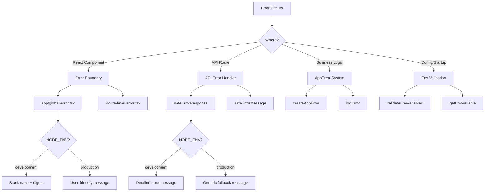

# أنماط معالجة الأخطاء

## نظرة عامة

يطبق قالب Ever Works استراتيجية معالجة أخطاء متعددة الطبقات تغطي حدود أخطاء React، واستجابات أخطاء مسار واجهة برمجة التطبيقات، وأخطاء التطبيق المكتوبة، والتحقق من صحة متغير البيئة. يعطي التصميم الأولوية للأمان (عدم تسرب المعلومات في الإنتاج) مع الحفاظ على تصحيح الأخطاء الصديق للمطورين في التطوير.

## الهندسة المعمارية



## ملفات المصدر

|ملف|الغرض|
|------|---------|
|`template/app/global-error.tsx`|حدود خطأ رد الفعل على مستوى الجذر|
|`template/app/not-found.tsx`|404 صفحة غير موجودة|
|`template/lib/utils/api-error.ts`|الأدوات المساعدة لخطأ مسار واجهة برمجة التطبيقات|
|`template/lib/utils/error-handler.ts`|أنواع أخطاء التطبيق وتسجيلها|
|`template/lib/auth/error-handler.ts`|معالجة الأخطاء الخاصة بالمصادقة|

## رد فعل حدود الخطأ

### حدود الخطأ العالمية

يلتقط الملف `global-error.tsx` الأخطاء التي لم تتم معالجتها في جذر التطبيق:

```typescript
'use client';

export default function GlobalError({
    error,
    reset,
}: {
    error: Error & { digest?: string };
    reset: () => void;
}) {
    useEffect(() => {
        console.error(error);
    }, [error]);

    return (
        <html lang="en">
            <body>
                <h1>Something went wrong!</h1>
                {process.env.NODE_ENV !== 'production' && (
                    <div>
                        <p className="text-red-600">{error.message}</p>
                        {error.stack && <pre>{error.stack}</pre>}
                        {error.digest && <p>Error ID: {error.digest}</p>}
                    </div>
                )}
                <Button onPress={() => reset()}>Refresh</Button>
                <Link href="/">Go Home</Link>
            </body>
        </html>
    );
}
```

السلوكيات الرئيسية:
- **التطوير**: يعرض رسالة الخطأ وتتبع المكدس وملخص الأخطاء
- **الإنتاج**: يعرض رسالة عامة فقط
- **ملخص الخطأ**: معرف فريد تم إنشاؤه بواسطة Next.js لارتباط الأخطاء من جانب الخادم
- **وظيفة إعادة الضبط**: إعادة عرض الشجرة الفرعية لحدود الخطأ
- ** HTML قائم بذاته **: يتضمن علامات `<html>` و`<body>` الخاصة به لأنه يحل محل الصفحة بأكملها

### لم يتم العثور على الصفحة

```typescript
'use client';

export default function NotFound() {
    const router = useRouter();
    return (
        <div>
            <h1>404</h1>
            <h2>Page Not Found</h2>
            <Button onClick={() => router.back()}>Go Back</Button>
            <Button onClick={() => router.push('/')}>Back to Home</Button>
        </div>
    );
}
```

## معالجة أخطاء واجهة برمجة التطبيقات

### رد آمن

الأداة المساعدة الأساسية لاستجابات أخطاء توجيه واجهة برمجة التطبيقات:

```typescript
export function safeErrorResponse(
    error: unknown,
    fallbackMessage: string,
    status: number = 500
): NextResponse {
    const detail = error instanceof Error ? error.message : String(error);

    // Always log full details server-side
    console.error(`[API Error] ${fallbackMessage}:`, detail);

    const message = process.env.NODE_ENV === "development" ? detail : fallbackMessage;

    return NextResponse.json({ success: false, error: message }, { status });
}
```

الاستخدام في مسارات API:

```typescript
export async function GET(request: NextRequest) {
    try {
        const result = await someOperation();
        return NextResponse.json(result);
    } catch (error) {
        return safeErrorResponse(error, 'Failed to process request');
    }
}
```

### رسالة آمنة

بالنسبة للحالات التي تحتاج فيها إلى سلسلة الخطأ دون إنشاء استجابة:

```typescript
export function safeErrorMessage(error: unknown, fallbackMessage: string): string {
    if (process.env.NODE_ENV === "development") {
        return error instanceof Error ? error.message : String(error);
    }
    return fallbackMessage;
}
```

## نظام خطأ التطبيق

### أنواع الأخطاء

```typescript
export enum ErrorType {
    AUTH = 'auth',
    CONFIG = 'config',
    DATABASE = 'database',
    NETWORK = 'network',
    VALIDATION = 'validation',
    UNKNOWN = 'unknown'
}

export interface AppError {
    message: string;
    type: ErrorType;
    code?: string;
    originalError?: unknown;
}
```

### خلق الأخطاء المكتوبة

```typescript
import { createAppError, ErrorType } from '@/lib/utils/error-handler';

const error = createAppError(
    'Failed to configure OAuth providers',
    ErrorType.CONFIG,
    'OAUTH_CONFIG_FAILED',
    originalError
);
```

### تسجيل الأخطاء الهيكلية

```typescript
import { logError } from '@/lib/utils/error-handler';

// Logs: [CONFIG] [Auth Config]: Failed to configure OAuth providers
// Logs: Error code: OAUTH_CONFIG_FAILED
// Logs: Original error: <original error details>
logError(error, 'Auth Config');
```

تعالج الدالة `logError` ثلاثة أشكال للأخطاء:
1. **AppError** - سجل منظم يتضمن النوع والكود والخطأ الأصلي
2. **خطأ** - سجل قياسي يحتوي على الرسالة وتتبع المكدس
3. **غير معروف** - سجل احتياطي مع سلسلة من الإكراه

### التحقق من صحة متغير البيئة

```typescript
import { validateEnvVariables, getEnvVariable } from '@/lib/utils/error-handler';

// Validate multiple variables at once
const validationError = validateEnvVariables([
    'DATABASE_URL', 'AUTH_SECRET', 'CRON_SECRET'
]);
if (validationError) {
    logError(validationError, 'Startup');
}

// Get a single required variable (throws if missing)
const dbUrl = getEnvVariable('DATABASE_URL');

// Get an optional variable
const optional = getEnvVariable('OPTIONAL_VAR', false);
```

## معالجة الأخطاء في المصادقة

يستخدم تكوين المصادقة تدهورًا أنيقًا:

```typescript
const configureProviders = () => {
    try {
        const oauthProviders = configureOAuthProviders();
        return createNextAuthProviders({ /* full config */ });
    } catch (error) {
        const appError = createAppError(
            'Failed to configure OAuth providers. Falling back to credentials only.',
            ErrorType.CONFIG,
            'OAUTH_CONFIG_FAILED',
            error
        );
        logError(appError, 'Auth Config');

        // Fallback to credentials only
        return createNextAuthProviders({
            credentials: { enabled: true },
            google: { enabled: false },
            github: { enabled: false },
            facebook: { enabled: false },
            twitter: { enabled: false },
        });
    }
};
```

إذا فشل تكوين موفر OAuth، فسيعود النظام إلى مصادقة بيانات الاعتماد فقط بدلاً من التعطل.

## خطأ في معالجة التدفق حسب الطبقة

|طبقة|استراتيجية|سلوك الإنتاج|
|-------|----------|-------------------|
|مكونات الرد|حد الخطأ (`global-error.tsx`)|رسالة عامة، لا يوجد تتبع المكدس|
|طرق واجهة برمجة التطبيقات|`safeErrorResponse()`|رسالة احتياطية عامة|
|إجراءات الخادم|`validatedAction()` يكتشف أخطاء Zod|رسالة خطأ التحقق الأولى|
|تكوين المصادقة|حاول/التقط مع `createAppError()`|التدهور اللطيف لأوراق الاعتماد|
|وظائف كرون|حاول/قبض + التسجيل المنظم|تم تسجيل خطأ، وتم إرجاع الاستجابة|
|خطافات الويب|حاول/قبض + 400 استجابة|رسالة فشل عامة إلى الموفر|

## أفضل الممارسات

1. **لا تكشف أبدًا عن العناصر الداخلية في الإنتاج** - استخدم دائمًا `safeErrorResponse` لمسارات واجهة برمجة التطبيقات
2. **تسجيل كل شيء من جانب الخادم** - تنتقل تفاصيل الخطأ الكاملة إلى وحدة التحكم/التسجيل بغض النظر عن البيئة
3. **استخدم الأخطاء المكتوبة** -- `createAppError` مع `ErrorType` لتصنيف متسق
4. **تدهور رائع** - الرجوع إلى الوظائف المنخفضة بدلاً من التعطل
5. ** ملخص الأخطاء للارتباط ** - استخدم الحقل `digest` من أخطاء Next.js لتتبع المشكلات من جانب الخادم
6. **التحقق من صحة الحدود** - التحقق من env vars عند بدء التشغيل، والتحقق من صحة الإدخال عند حدود واجهة برمجة التطبيقات (API).
