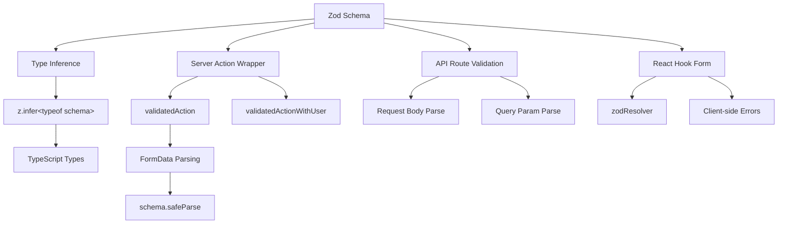

# أنماط التحقق من صحة النموذج

## نظرة عامة

يستخدم قالب Ever Works **Zod** كمصدر وحيد للحقيقة للتحقق من صحة البيانات عبر حدود العميل والخادم. يتم تنظيم مخططات التحقق من الصحة في `lib/validations/` ويتم استهلاكها بواسطة:

- ** إجراءات الخادم ** عبر `validatedAction()` و`validatedActionWithUser()`
- **معالجات توجيه واجهة برمجة التطبيقات** للتحقق من صحة معلمة نص/استعلام الطلب
- تكامل **React Hook Form** للتحقق من صحة النموذج من جانب العميل
- **اكتب الاستدلال** عبر `z.infer<>` لضمان سلامة النوع من طرف إلى طرف

## الهندسة المعمارية



## ملفات المصدر

|ملف|الغرض|
|------|---------|
|`template/lib/validations/auth.ts`|مخطط التحقق من صحة كلمة المرور|
|`template/lib/validations/company.ts`|مخططات الشركة CRUD|
|`template/lib/validations/client-item.ts`|مخططات تقديم/تحديث عنصر العميل|
|`template/lib/validations/client-dashboard.ts`|مخططات استعلام لوحة المعلومات|
|`template/lib/validations/sponsor-ad.ts`|مخططات دورة حياة الإعلان الراعي|
|`template/lib/validations/item.ts`|مخطط بيانات الموقع|
|`template/lib/validations/user-location.ts`|مخطط إعدادات موقع المستخدم|
|`template/lib/auth/middleware.ts`|`validatedAction` / `validatedActionWithUser` الأدوات المساعدة|

## أنماط مخطط التحقق من الصحة

### النمط 1: التحقق من صحة كلمة المرور باستخدام القواعد المتسلسلة

```typescript
import { z } from "zod";

export const passwordSchema = z
    .string()
    .min(8, "Password must be at least 8 characters")
    .regex(/[A-Z]/, "Password must contain at least one uppercase letter")
    .regex(/[a-z]/, "Password must contain at least one lowercase letter")
    .regex(/[0-9]/, "Password must contain at least one number")
    .regex(/[^A-Za-z0-9]/, "Password must contain at least one special character");
```

يفرض هذا المخطط متطلبات كلمة مرور قوية من خلال التحسينات المتسلسلة. يوفر كل `.regex()` رسالة خطأ محددة يمكن لواجهة المستخدم عرضها بشكل مضمّن.

### النمط 2: إنشاء/تحديث أزواج المخططات

يوضح التحقق من صحة الشركة نمط الإنشاء/التحديث:

```typescript
export const createCompanySchema = z.object({
    name: z.string().min(1, "Company name is required").max(255),
    website: z.string().url("Invalid URL format").optional().or(z.literal("")),
    domain: z.string().max(255).optional()
        .transform((val) => val?.toLowerCase().trim() || undefined),
    slug: z.string().max(255).optional()
        .transform((val) => val?.toLowerCase().trim() || undefined)
        .refine(
            (val) => !val || /^[a-z0-9-]+$/.test(val),
            { message: "Slug must contain only lowercase letters, numbers, and hyphens" }
        ),
    status: z.enum(companyStatus).default("active"),
});

export const updateCompanySchema = z.object({
    id: z.string().uuid(),
    name: z.string().min(1).max(255).optional(),  // Optional for updates
    // ... other fields also optional
    status: z.enum(companyStatus).optional(),
});
```

الاختلافات الرئيسية:
- **إنشاء المخططات** يحتوي على حقول مطلوبة ذات إعدادات افتراضية
- **تحديث المخططات** يتطلب `id` وجعل كافة الحقول الأخرى اختيارية
- كلاهما يشتركان في منطق `.transform()` للتطبيع (على سبيل المثال، البزاقات الصغيرة)

### النمط 3: حقول الحالة المستندة إلى التعداد

```typescript
export const companyStatus = ["active", "inactive"] as const;
export const itemStatus = ['pending', 'approved', 'rejected'] as const;
export const sponsorAdStatuses = [
    "pending_payment", "pending", "rejected",
    "active", "expired", "cancelled",
] as const;

// Usage in schemas
status: z.enum(companyStatus).default("active"),
status: z.enum(sponsorAdStatuses).optional(),
```

يوفر استخدام المصفوفات `as const` مع `z.enum()` التحقق من صحة وقت التشغيل وأمان نوع وقت الترجمة.

### النمط 4: مخططات معلمات الاستعلام مع التحويلات

```typescript
export const clientItemsListQuerySchema = z.object({
    page: z.string().optional()
        .transform(val => (val ? parseInt(val, 10) : 1))
        .refine(val => !Number.isNaN(val), { message: 'Page must be a valid number' })
        .refine(val => val >= 1, { message: 'Page must be at least 1' }),
    limit: z.string().optional()
        .transform(val => (val ? parseInt(val, 10) : 10))
        .refine(val => val >= 1 && val <= 100, { message: 'Limit must be between 1 and 100' }),
    status: z.enum(clientStatusFilter).optional().default('all'),
    search: z.string().max(100, 'Search query is too long').optional(),
    sortBy: z.enum(['name', 'updated_at', 'status', 'submitted_at']).optional().default('updated_at'),
    sortOrder: z.enum(['asc', 'desc']).optional().default('desc'),
    deleted: z.string().optional().transform(val => val === 'true'),
});
```

تصل معلمات الاستعلام كسلاسل. يستخدم المخطط `.transform()` لتحويلها إلى الأنواع الصحيحة (الأرقام والقيم المنطقية) أثناء تطبيق التحقق من الصحة والإعدادات الافتراضية.

### النمط 5: مخططات الكائنات المتداخلة مع التحقق من الصحة عبر الحقول

```typescript
export const updateLocationSchema = z
    .object({
        defaultLatitude: z.number().min(-90).max(90).nullable().optional(),
        defaultLongitude: z.number().min(-180).max(180).nullable().optional(),
        defaultCity: z.string().max(200).nullable().optional(),
        defaultCountry: z.string().max(100).nullable().optional(),
        locationPrivacy: locationPrivacySchema.optional(),
    })
    .refine(
        (data) => {
            const hasLat = data.defaultLatitude != null;
            const hasLng = data.defaultLongitude != null;
            return hasLat === hasLng;  // Both or neither
        },
        { message: 'Both latitude and longitude must be provided together' }
    );
```

يقوم `.refine()` على مستوى الكائن بالتحقق من صحة التبعيات عبر الحقول - يجب أن يكون خط الطول وخط العرض موجودين أو يكونان غائبين.

### النمط 6: أنواع الاتحاد للمدخلات المرنة

```typescript
category: z.union([
    z.string().min(1, 'Category is required'),
    z.array(z.string().min(1)).min(1, 'At least one category is required'),
]).optional().nullable(),
```

يقبل هذا كلاً من سلسلة واحدة ومجموعة من السلاسل لحقل الفئة، ويستوعب أنواعًا مختلفة من إدخالات النماذج.

## التحقق من جانب الخادم

### التفاف التحقق من صحة العمل

```typescript
export function validatedAction<S extends z.ZodType<any, any>, T>(
    schema: S,
    action: ValidatedActionFunction<S, T>
) {
    return async (prevState: ActionState, formData: FormData): Promise<T> => {
        const result = schema.safeParse(Object.fromEntries(formData));
        if (!result.success) {
            return { error: result.error.issues[0].message } as T;
        }
        return action(result.data, formData);
    };
}
```

هذه الوظيفة ذات الترتيب الأعلى:
1. يحول `FormData` إلى كائن عادي
2. يتم التحقق من صحته مقابل مخطط Zod باستخدام `safeParse()`
3. إرجاع خطأ التحقق الأول إذا كان غير صالح
4. يستدعي وظيفة الإجراء مع البيانات المكتوبة والمحللة إذا كانت صالحة

### validatedActionWithUser Wrapper

```typescript
export function validatedActionWithUser<S extends z.ZodType<any, any>, T>(
    schema: S,
    action: ValidatedActionWithUserFunction<S, T>
) {
    return async (prevState: ActionState, formData: FormData): Promise<T> => {
        const session = await auth();
        if (!session?.user) {
            throw new Error("User is not authenticated");
        }
        const result = schema.safeParse(Object.fromEntries(formData));
        if (!result.success) {
            return { error: result.error.issues[0].message } as T;
        }
        return action(result.data, formData, session.user);
    };
}
```

يؤدي هذا إلى إضافة فحص المصادقة قبل التحقق من الصحة، وتمرير كائن `user` إلى وظيفة الإجراء.

## اكتب الاستدلال

يقوم كل مخطط بتصدير أنواع TypeScript المستنتجة:

```typescript
export type CreateCompanyInput = z.infer<typeof createCompanySchema>;
export type UpdateCompanyInput = z.infer<typeof updateCompanySchema>;
export type ClientUpdateItemInput = z.infer<typeof clientUpdateItemSchema>;
export type ClientCreateItemInput = z.infer<typeof clientCreateItemSchema>;
```

يتم استخدام هذه الأنواع عبر طبقة الخدمة ومسارات واجهة برمجة التطبيقات (API)، مما يضمن تطابق شكل البيانات التي تم التحقق من صحتها مع ما يتوقعه منطق الأعمال.

## أفضل الممارسات

1. **مخطط واحد، مستهلكون متعددون** - حدد مرة واحدة في `lib/validations/`، استخدمه في كل مكان
2. **التحويل عند الحدود** -- استخدم `.transform()` لتحويل السلاسل إلى الأنواع المناسبة
3. **رسائل خطأ مخصصة** - تتضمن كل قاعدة تحقق من الصحة رسالة سهلة الاستخدام
4. **المخططات الفرعية المشتركة** - إعادة استخدام المخططات مثل `locationSchema` و`passwordSchema` عبر النماذج
5. **استنتج الأنواع من المخططات** - لا تقم مطلقًا بتحديد الأنواع التي تكرر تعريفات المخطط يدويًا
6. **التحقق من الصحة عبر الحقول** - استخدم `.refine()` على مستوى الكائن لقواعد متعددة الحقول
7. **الافتراضيات المعقولة** - استخدم `.default()` للحقول الاختيارية ذات القيم القياسية
