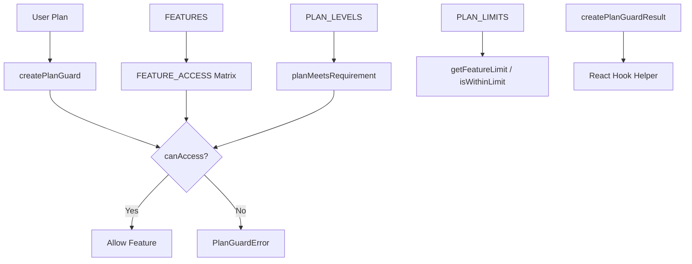

# وحدة الحراسة

توفر وحدة الحراس (`template/lib/guards/`) نظامًا للتحكم في الوصول إلى الميزات قائم على الخطة. فهو يحدد خطط الاشتراك التي يمكنها الوصول إلى الميزات، ويفرض حدودًا رقمية لكل خطة، ويوفر كلاً من وظائف الحماية من جانب الخادم ومنشئ نتائج سهل الاستخدام للاستخدام من جانب العميل.

## نظرة عامة على الهندسة المعمارية



## ملفات المصدر

|ملف|الوصف|
|------|-------------|
|`lib/guards/index.ts`|تصدير البراميل|
|`lib/guards/plan-features.guard.ts`|تنفيذ الحراسة الكاملة|

## التسلسل الهرمي للخطة

يتم ترتيب الخطط حسب المستوى، حيث تتضمن المستويات الأعلى جميع ميزات المستويات الأدنى عند تكوينها باستخدام `minPlan`:

```typescript
const PLAN_LEVELS: Record<string, number> = {
  free: 1,
  standard: 2,
  premium: 3,
};
```

### `getPlanLevel(plan: string): number`

إرجاع المستوى الرقمي لسلسلة الخطة. إرجاع `0` للخطط غير المعروفة.

### `planMeetsRequirement(userPlan: string, requiredPlan: string): boolean`

يتحقق مما إذا كان مستوى خطة المستخدم أكبر من أو يساوي مستوى الخطة المطلوبة.

```typescript
planMeetsRequirement('premium', 'standard'); // true
planMeetsRequirement('free', 'standard');    // false
```

## تعريفات الميزة

يتم الإعلان عن جميع الميزات المتاحة كثوابت:

```typescript
const FEATURES = {
  // Submission Features
  SUBMIT_PRODUCT: 'submit_product',
  EXTENDED_DESCRIPTION: 'extended_description',
  UNLIMITED_DESCRIPTION: 'unlimited_description',
  UPLOAD_IMAGES: 'upload_images',
  UPLOAD_VIDEO: 'upload_video',
  VERIFIED_BADGE: 'verified_badge',
  SPONSORED_BADGE: 'sponsored_badge',

  // Review & Priority
  PRIORITY_REVIEW: 'priority_review',
  INSTANT_REVIEW: 'instant_review',

  // Visibility & Placement
  SEARCH_VISIBILITY: 'search_visibility',
  CATEGORY_PLACEMENT: 'category_placement',
  SPONSORED_POSITION: 'sponsored_position',
  HOMEPAGE_FEATURED: 'homepage_featured',
  NEWSLETTER_MENTION: 'newsletter_mention',

  // Statistics & Analytics
  VIEW_STATISTICS: 'view_statistics',
  ADVANCED_ANALYTICS: 'advanced_analytics',

  // Support
  EMAIL_SUPPORT: 'email_support',
  PRIORITY_EMAIL_SUPPORT: 'priority_email_support',
  PHONE_SUPPORT: 'phone_support',

  // Social & Marketing
  SOCIAL_SHARING: 'social_sharing',
  LEARN_MORE_BUTTON: 'learn_more_button',

  // Modifications
  FREE_MODIFICATIONS: 'free_modifications',

  // Submissions
  UNLIMITED_SUBMISSIONS: 'unlimited_submissions',
} as const;

type Feature = (typeof FEATURES)[keyof typeof FEATURES];
```

## مصفوفة الوصول إلى الميزات

يقوم السجل `FEATURE_ACCESS` بتعيين كل ميزة إلى قاعدة الوصول الخاصة بها:

```typescript
type FeatureAccess =
  | PaymentPlan             // Only that specific plan
  | PaymentPlan[]           // Any of these plans
  | 'all'                   // All plans have access
  | { minPlan: PaymentPlan }; // That plan and above
```

### ملخص قواعد الوصول

|ميزة|قاعدة الوصول|
|---------|------------|
|`submit_product`|`'all'`|
|`extended_description`|`{ minPlan: 'standard' }`|
|`unlimited_description`|`'premium'`|
|`upload_images`|`'all'`|
|`upload_video`|`'premium'`|
|`verified_badge`|`{ minPlan: 'standard' }`|
|`sponsored_badge`|`'premium'`|
|`priority_review`|`{ minPlan: 'standard' }`|
|`instant_review`|`'premium'`|
|`search_visibility`|`'all'`|
|`category_placement`|`'all'`|
|`sponsored_position`|`'premium'`|
|`homepage_featured`|`'premium'`|
|`newsletter_mention`|`'premium'`|
|`view_statistics`|`{ minPlan: 'standard' }`|
|`advanced_analytics`|`'premium'`|
|`email_support`|`'all'`|
|`priority_email_support`|`{ minPlan: 'standard' }`|
|`phone_support`|`'premium'`|
|`social_sharing`|`{ minPlan: 'standard' }`|
|`learn_more_button`|`'premium'`|
|`free_modifications`|`{ minPlan: 'standard' }`|
|`unlimited_submissions`|`'premium'`|

## حدود الخطة

الحدود الرقمية للميزات ذات القيود الكمية. `null` يشير إلى عدد غير محدود.

```typescript
const PLAN_LIMITS: Record<PaymentPlan, FeatureLimits> = {
  free: {
    max_images: 1,
    max_description_words: 200,
    max_submissions: 1,
    review_days: 7,
    free_modification_days: 0,
  },
  standard: {
    max_images: 5,
    max_description_words: 500,
    max_submissions: 10,
    review_days: 3,
    free_modification_days: 30,
  },
  premium: {
    max_images: null,            // unlimited
    max_description_words: null, // unlimited
    max_submissions: null,       // unlimited
    review_days: 1,
    free_modification_days: 365,
  },
};
```

## وظائف التحقق من الوصول

### `canAccessFeature(feature: Feature, userPlan: string): boolean`

فحص الوصول الأساسي الذي يقيم قاعدة الوصول إلى الميزة:

```typescript
import { canAccessFeature, FEATURES } from '@/lib/guards';

canAccessFeature(FEATURES.UPLOAD_VIDEO, 'premium');   // true
canAccessFeature(FEATURES.UPLOAD_VIDEO, 'standard');  // false
canAccessFeature(FEATURES.UPLOAD_IMAGES, 'free');     // true ('all')
canAccessFeature(FEATURES.VERIFIED_BADGE, 'standard'); // true (minPlan: standard)
canAccessFeature(FEATURES.VERIFIED_BADGE, 'free');     // false
```

### `getFeatureLimit<K>(limitName: K, userPlan: string): FeatureLimits[K]`

إرجاع القيمة الحدية للخطة:

```typescript
import { getFeatureLimit } from '@/lib/guards';

getFeatureLimit('max_images', 'free');     // 1
getFeatureLimit('max_images', 'premium');  // null (unlimited)
getFeatureLimit('review_days', 'standard'); // 3
```

### `isWithinLimit(limitName, value, userPlan): boolean`

التحقق مما إذا كانت القيمة ضمن حدود الخطة:

```typescript
import { isWithinLimit } from '@/lib/guards';

isWithinLimit('max_images', 3, 'free');     // false (limit: 1)
isWithinLimit('max_images', 3, 'standard'); // true (limit: 5)
isWithinLimit('max_images', 100, 'premium'); // true (unlimited)
```

### `getAccessibleFeatures(userPlan: string): Feature[]`

إرجاع جميع الميزات التي يمكن الوصول إليها من خلال خطة معينة.

### `getMinimumPlanForFeature(feature: Feature): PaymentPlan`

إرجاع أقل خطة يمكنها الوصول إلى الميزة.

## مصنع حراسة الخطة

### `createPlanGuard(userPlan: string)`

ينشئ مثيل حارس بأساليب مقيدة لخطة محددة:

```typescript
import { createPlanGuard, FEATURES } from '@/lib/guards';

const guard = createPlanGuard('standard');

// Check access
guard.canAccess(FEATURES.VERIFIED_BADGE); // true
guard.canAccess(FEATURES.PHONE_SUPPORT);  // false

// Require access (throws PlanGuardError)
guard.requireFeature(FEATURES.VERIFIED_BADGE); // OK
guard.requireFeature(FEATURES.PHONE_SUPPORT);  // throws!

// Limits
guard.getLimit('max_images');             // 5
guard.isWithinLimit('max_images', 3);     // true
guard.requireWithinLimit('max_images', 3); // OK
guard.requireWithinLimit('max_images', 10); // throws!

// Info
guard.getAccessibleFeatures();  // Feature[]
guard.getPlan();                // 'standard'
guard.getPlanLevel();           // 2
```

### `PlanGuardError`

خطأ مخصص تم طرحه بواسطة `requireFeature`:

```typescript
class PlanGuardError extends Error {
  readonly feature: Feature;
  readonly userPlan: string;
  readonly requiredPlan: PaymentPlan;
}
```

### مثال على معالجة الأخطاء

```typescript
import { createPlanGuard, PlanGuardError, FEATURES } from '@/lib/guards';

try {
  const guard = createPlanGuard(userPlan);
  guard.requireFeature(FEATURES.UPLOAD_VIDEO);
  // Proceed with video upload
} catch (error) {
  if (error instanceof PlanGuardError) {
    return NextResponse.json({
      error: `Upgrade to ${error.requiredPlan} to access this feature`,
      requiredPlan: error.requiredPlan,
    }, { status: 403 });
  }
  throw error;
}
```

## رد فعل هوك مساعد

### `PlanGuardResult` الواجهة

```typescript
interface PlanGuardResult {
  canAccess: (feature: Feature) => boolean;
  getLimit: <K extends keyof FeatureLimits>(limitName: K) => FeatureLimits[K];
  isWithinLimit: (limitName: keyof FeatureLimits, value: number) => boolean;
  accessibleFeatures: Feature[];
}
```

### `createPlanGuardResult(userPlan: string): PlanGuardResult`

ينشئ كائنًا عاديًا مناسبًا للاستخدام في خطافات ومكونات React:

```typescript
import { createPlanGuardResult, FEATURES } from '@/lib/guards';

// In a custom hook
function usePlanGuard(plan: string) {
  return useMemo(() => createPlanGuardResult(plan), [plan]);
}

// In a component
function SubmissionForm({ userPlan }) {
  const guard = usePlanGuard(userPlan);

  return (
    <form>
      <ImageUploader
        maxImages={guard.getLimit('max_images') ?? Infinity}
        disabled={!guard.canAccess(FEATURES.UPLOAD_IMAGES)}
      />
      {guard.canAccess(FEATURES.UPLOAD_VIDEO) && <VideoUploader />}
    </form>
  );
}
```
