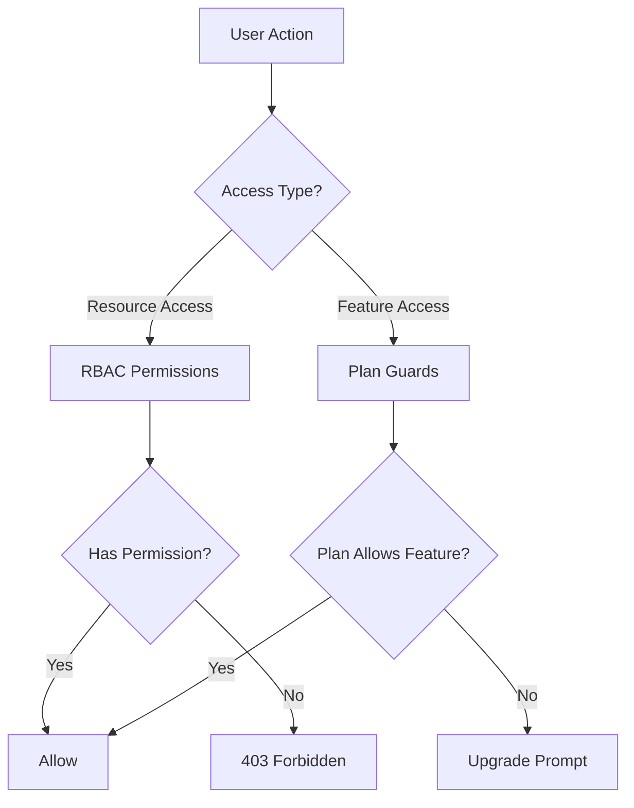
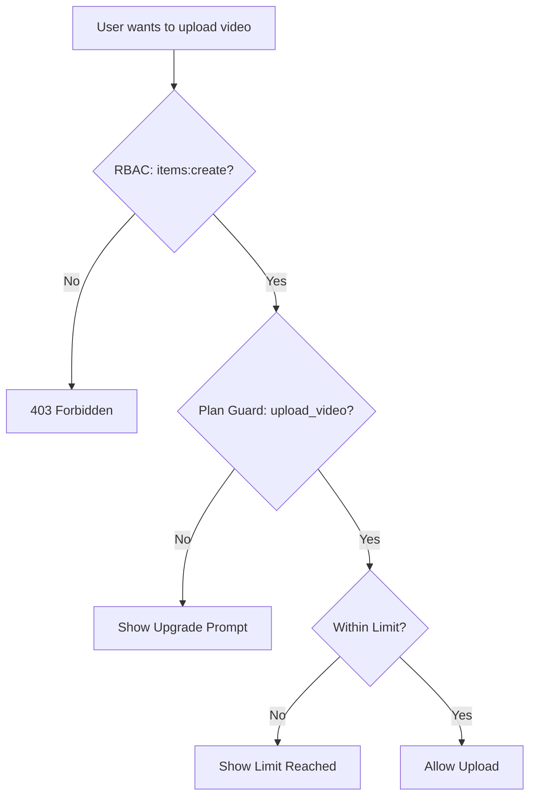

# نظام الحراسة والأذونات

يطبق قالب Ever Works نظام تحكم في الوصول ثنائي الطبقة: **أذونات RBAC** للوصول إلى الموارد المستندة إلى الأدوار و**حراس الخطة** لبوابة الميزات المستندة إلى الاشتراك. تتحكم هذه الأنظمة معًا في ما يمكن للمستخدمين فعله والميزات التي يمكنهم الوصول إليها.

## هندسة النظام



## نظام أذونات RBAC

### تعريفات الإذن

يتم تعريف كافة الأذونات في `lib/permissions/definitions.ts` باستخدام تنسيق `resource:action`:

```typescript
const PERMISSIONS = {
  items: {
    read: 'items:read',
    create: 'items:create',
    update: 'items:update',
    delete: 'items:delete',
    review: 'items:review',
    approve: 'items:approve',
    reject: 'items:reject',
  },
  categories: { read, create, update, delete },
  tags: { read, create, update, delete },
  roles: { read, create, update, delete },
  users: { read, create, update, delete, assignRoles },
  analytics: { read, export },
  system: { settings },
} as const;
```

### نوع الإذن

النوع `Permission` مشتق من الكائن const `PERMISSIONS`، مما يضمن سلامة النوع:

```typescript
type Permission = 'items:read' | 'items:create' | ... | 'system:settings';
```

### الأدوار الافتراضية

تم تكوين دورين افتراضيين مسبقًا:

|الدور|معرف|الأذونات|
|---|---|---|
|مدير سوبر|`super-admin`|جميع أذونات النظام|
|مدير المحتوى|`content-manager`|العناصر + الفئات + العلامات (مراجعة شاملة +)|

### مجموعات الأذونات

يتم تنظيم الأذونات في مجموعات صديقة لواجهة المستخدم في `lib/permissions/groups.ts`:

|المجموعة|أيقونة|الموارد المضمنة|
|---|---|---|
|إدارة المحتوى|`FileText`|العناصر والفئات والعلامات|
|إدارة المستخدم|`Users`|المستخدمون، الأدوار|
|النظام والتحليلات|`Settings`|التحليلات، النظام|

### وظائف المرافق

توفر الوحدة `lib/permissions/utils.ts` أدوات مساعدة لإدارة الحالة لواجهة مستخدم الأذونات:

```typescript
// Create a permission state map for checkboxes
const state = createPermissionState(currentPermissions);
// { 'items:read': true, 'items:create': true, ... }

// Get selected permissions from state
const selected = getSelectedPermissions(state);

// Calculate changes between old and new permissions
const changes = calculatePermissionChanges(original, updated);
// { added: ['items:delete'], removed: ['tags:create'] }

// Compare two permission sets
const equal = arePermissionsEqual(perms1, perms2);

// Filter permissions by search term
const filtered = filterPermissions(allPerms, 'items');
```

## نظام حراسة الخطة

يتحكم حراس الخطة في الوصول إلى الميزات بناءً على خطة اشتراك المستخدم. تم تعريف النظام في `lib/guards/plan-features.guard.ts`.

### التسلسل الهرمي للخطة

```typescript
const PLAN_LEVELS: Record<string, number> = {
  free: 1,
  standard: 2,
  premium: 3,
};
```

### تعريفات الميزة

تم تعداد كافة الميزات المسورة في `FEATURES`:

|الفئة|الميزات|
|---|---|
|تقديم|`submit_product`، `extended_description`، `unlimited_description`، `upload_images`، `upload_video`|
|شارات|`verified_badge`، `sponsored_badge`|
|مراجعة|`priority_review`، `instant_review`|
|الرؤية|`search_visibility`، `category_placement`، `sponsored_position`، `homepage_featured`، `newsletter_mention`|
|التحليلات|`view_statistics`، `advanced_analytics`|
|الدعم|`email_support`، `priority_email_support`، `phone_support`|
|اجتماعي|`social_sharing`، `learn_more_button`|
|أخرى|`free_modifications`، `unlimited_submissions`|

### مصفوفة الوصول إلى الميزات

ترتبط كل ميزة بقاعدة الوصول:

|نوع الوصول|بناء الجملة|مثال|
|---|---|---|
|جميع الخطط|`'all'`|`submit_product`، `upload_images`|
|خطة واحدة|`PaymentPlan.PREMIUM`|`upload_video`، `instant_review`|
|خطة الحد الأدنى|`{ minPlan: PaymentPlan.STANDARD }`|`verified_badge`، `priority_review`|
|خطط محددة|`[PaymentPlan.STANDARD, PaymentPlan.PREMIUM]`|(الميزات المخصصة)|

### حدود الخطة

تختلف الحدود الرقمية حسب الخطة:

|الحد|مجاني|قياسي|قسط|
|---|---|---|---|
|`max_images`| 1 | 5 |غير محدود|
|`max_description_words`| 200 | 500 |غير محدود|
|`max_submissions`| 1 | 10 |غير محدود|
|`review_days`| 7 | 3 | 1 |
|`free_modification_days`| 0 | 30 | 365 |

### استخدام الحرس من جانب الخادم

```typescript
import { canAccessFeature, createPlanGuard, FEATURES } from '@/lib/guards';

// Simple check
const allowed = canAccessFeature(FEATURES.UPLOAD_VIDEO, userPlan);

// Guard factory for multiple checks
const guard = createPlanGuard(userPlan);
guard.canAccess(FEATURES.VERIFIED_BADGE);       // boolean
guard.requireFeature(FEATURES.UPLOAD_VIDEO);     // throws PlanGuardError
guard.getLimit('max_images');                    // number | null
guard.isWithinLimit('max_submissions', count);   // boolean
guard.getAccessibleFeatures();                   // Feature[]
```

### خطأ في التخطيط

عندما يفشل `requireFeature`، فإنه يظهر خطأ مكتوب:

```typescript
class PlanGuardError extends Error {
  feature: Feature;      // e.g., 'upload_video'
  userPlan: string;      // e.g., 'free'
  requiredPlan: PaymentPlan; // e.g., 'premium'
}
```

### خطاف حماية من جانب العميل

يغلف الخطاف `usePlanGuard` الموجود في `hooks/use-plan-guard.ts` نظام الحماية لمكونات React:

```typescript
import { usePlanGuard, FEATURES } from '@/hooks/use-plan-guard';

function VideoUploadButton() {
  const { canAccess, requireUpgrade, isLoading } = usePlanGuard();

  if (isLoading) return <Spinner />;

  const upgradePlan = requireUpgrade(FEATURES.UPLOAD_VIDEO);
  if (upgradePlan) {
    return <UpgradePrompt plan={upgradePlan} />;
  }

  return <Button>Upload Video</Button>;
}
```

### السنانير المتخصصة

#### `useFeatureAccess`

التحقق من الوصول إلى ميزة واحدة:

```typescript
const { hasAccess, requiredPlan, isLoading } = useFeatureAccess(FEATURES.VERIFIED_BADGE);
```

#### `useFeatureLimit`

تحقق من الحدود الرقمية مع العدد المتبقي:

```typescript
const { limit, isUnlimited, remaining, isWithinLimit } = useFeatureLimit('max_images', currentCount);

if (!isUnlimited && remaining <= 0) {
  return <LimitReached />;
}
```

## تأليف الحرس

يتشكل الحراس بشكل طبيعي لسيناريوهات التحكم في الوصول المعقدة:

```typescript
// Server: Combine RBAC + plan check
function canCreateItem(userPermissions: UserPermissions, userPlan: string): boolean {
  const hasRBACAccess = hasPermission(userPermissions, 'items:create');
  const hasPlanAccess = canAccessFeature(FEATURES.SUBMIT_PRODUCT, userPlan);
  return hasRBACAccess && hasPlanAccess;
}

// Client: Combine hooks
function CreateItemButton() {
  const { canAccess } = usePlanGuard();
  const { permissions } = useRolePermissions();

  const canCreate =
    hasPermission(permissions, 'items:create') &&
    canAccess(FEATURES.SUBMIT_PRODUCT);

  if (!canCreate) return null;
  return <Button>Create Item</Button>;
}
```

## مخطط تدفق الحرس



## إضافة حراس جدد

### إضافة إذن جديد

1. أضف إلى `PERMISSIONS` في `lib/permissions/definitions.ts`:

```typescript
billing: {
  read: 'billing:read',
  manage: 'billing:manage',
},
```

2. أضف إلى مجموعة الأذونات في `lib/permissions/groups.ts`
3. قم بتعيين الأدوار الافتراضية المناسبة

### إضافة ميزة خطة جديدة

1. أضف ثابت الميزة إلى `FEATURES` في `lib/guards/plan-features.guard.ts`
2. حدد قاعدة الوصول في `FEATURE_ACCESS`
3. قم بإضافة حدود رقمية بشكل اختياري إلى `PLAN_LIMITS`

## أفضل الممارسات

1. ** تفضل حراس الخطة لبوابة الميزات ** وRBAC للتحكم في الوصول إلى الموارد - لا تخلط بينهما.
2. **تحقق دائمًا من الخادم** حتى لو قام العميل بإخفاء عناصر واجهة المستخدم - عمليات التحقق من جانب العميل مخصصة لتجربة المستخدم فقط.
3. **استخدم `createPlanGuard`** لإجراء عمليات فحص متعددة في نفس الطلب لتجنب عمليات البحث المتكررة عن الخطة.
4. ** التعامل مع حالات التحميل ** في الخطافات - قد يتم تحميل بيانات الخطة بشكل غير متزامن من خدمة الاشتراك.
5. **احتفظ بأسماء الميزات الوصفية** - استخدم `upload_video` وليس `feature_3` للوضوح في السجلات ورسائل الخطأ.
