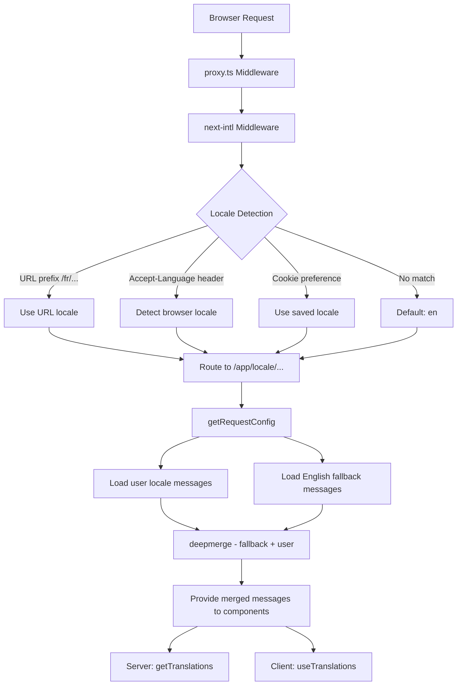

# تنفيذ i18n

## نظرة عامة

يقوم قالب Ever Works بتنفيذ التدويل باستخدام **next-intl** مع دعم لأكثر من 20 لغة محلية، واتجاه النص RTL (من اليمين إلى اليسار)، ونسخ احتياطية لرسائل الدمج العميق، والتنقل المدرك للغة المحلية. تم بناء النظام حول ثلاث طبقات: تكوين التوجيه، وتحميل الرسائل بالرجوع، ومساعدي التنقل المدركين للإعدادات المحلية.

## الهندسة المعمارية



## ملفات المصدر

|ملف|الغرض|
|------|---------|
|`template/i18n/routing.ts`|تكوين التوجيه المحلي|
|`template/i18n/request.ts`|تحميل الرسائل على نطاق الطلب|
|`template/i18n/navigation.ts`|صادرات التنقل المدركة للإعدادات المحلية|
|`template/lib/constants.ts`|تعريفات اللغة وRTL|
|`template/messages/*.json`|ملفات رسائل الترجمة|
|`template/proxy.ts`|البرامج الوسيطة مع دقة البادئة المحلية|

## اللغات المدعومة

```typescript
// lib/constants.ts
export const DEFAULT_LOCALE = 'en';
export const LOCALES = [
    'en', 'fr', 'es', 'de', 'zh', 'ar', 'he',
    'ru', 'uk', 'pt', 'it', 'ja', 'ko', 'nl',
    'pl', 'tr', 'vi', 'th', 'hi', 'id', 'bg'
] as const;

export type Locale = (typeof LOCALES)[number];

/** Locales that use right-to-left text direction */
export const RTL_LOCALES: readonly Locale[] = ['ar', 'he'] as const;
```

يدعم القالب 20 لغة بما في ذلك لغتين RTL (العربية والعبرية).

## تكوين التوجيه

```typescript
// i18n/routing.ts
import { defineRouting } from "next-intl/routing";
import { DEFAULT_LOCALE, LOCALES } from "@/lib/constants";

export const routing = defineRouting({
    locales: LOCALES,
    defaultLocale: DEFAULT_LOCALE,
    localeDetection: true,
    localePrefix: "as-needed",
});
```

|الإعداد|القيمة|تأثير|
|---------|-------|--------|
|`locales`|20 رموز محلية|مجموعة اللغات المدعومة|
|`defaultLocale`|`'en'`|التراجع عند عدم تطابق أي لغة|
|`localeDetection`|`true`|الكشف التلقائي عن رأس `Accept-Language`|
|`localePrefix`|`"as-needed"`|اللغة الافتراضية لا تحتوي على بادئة؛ الآخرون يفعلون|

مع `localePrefix: "as-needed"`:
- الإنجليزية (افتراضي): `https://example.com/about`
- الفرنسية: `https://example.com/fr/about`
- العربية: `https://example.com/ar/about`

## تحميل الرسالة مع التراجع

```typescript
// i18n/request.ts
import deepmerge from "deepmerge";
import { getRequestConfig } from "next-intl/server";

export default getRequestConfig(async ({ requestLocale }) => {
    let locale = await requestLocale;

    if (!locale || !routing.locales.includes(locale as any)) {
        locale = routing.defaultLocale;
    }

    const userMessages = (await import(`../messages/${locale}.json`)).default;
    const defaultMessages = (await import(`../messages/en.json`)).default;
    const messages = deepmerge(defaultMessages, userMessages) as any;

    return { locale, messages };
});
```

تضمن استراتيجية الدمج العميق ما يلي:
1. تعمل الرسائل الإنجليزية كمجموعة احتياطية كاملة
2. تتجاوز الرسائل الخاصة بالإعدادات المحلية اللغة الإنجليزية حيثما توجد ترجمات
3. تعود الترجمات المفقودة بأمان إلى اللغة الإنجليزية بدلاً من إظهار المفاتيح

### هيكل ملف الرسالة

```
messages/
  en.json        # Complete English messages (base)
  fr.json        # French translations
  es.json        # Spanish translations
  de.json        # German translations
  ar.json        # Arabic translations
  he.json        # Hebrew translations
  zh.json        # Chinese translations
  ...            # 13+ more locales
```

### تنسيقات التاريخ/الأرقام

```typescript
// i18n/request.ts
export const formats = {
    dateTime: {
        short: {
            day: "numeric",
            month: "short",
            year: "numeric",
        },
    },
    number: {
        precise: {
            maximumFractionDigits: 5,
        },
    },
    list: {
        enumeration: {
            style: "long",
            type: "conjunction",
        },
    },
} satisfies Formats;
```

## مساعدو الملاحة

```typescript
// i18n/navigation.ts
import { createNavigation } from "next-intl/navigation";
import { routing } from "./routing";

export const { Link, redirect, usePathname, useRouter, getPathname } =
    createNavigation(routing);
```

تحل عمليات التصدير هذه محل أدوات التنقل القياسية Next.js بإصدارات مدركة للغة المحلية:

|تصدير|معيار Next.js|السلوك المدرك للإعدادات المحلية|
|--------|-----------------|----------------------|
|`Link`|`next/link`|إضافة البادئة المحلية إلى `href`|
|`redirect`|`next/navigation`|يحافظ على اللغة الحالية في إعادة التوجيه|
|`usePathname`|`next/navigation`|إرجاع المسار بدون بادئة محلية|
|`useRouter`|`next/navigation`|`push()` / `replace()` إضافة بادئة محلية|
|`getPathname`| -- |المسار من جانب الخادم مع اللغة|

### الاستخدام في مكونات الخادم

```typescript
import { getTranslations } from 'next-intl/server';

export default async function Page({ params }: { params: Promise<{ locale: string }> }) {
    const { locale } = await params;
    const t = await getTranslations({ locale, namespace: 'common' });

    return <h1>{t('WELCOME')}</h1>;
}
```

### الاستخدام في مكونات العميل

```typescript
'use client';
import { useTranslations } from 'next-intl';
import { Link } from '@/i18n/navigation';

export function NavLink() {
    const t = useTranslations('navigation');
    return <Link href="/about">{t('ABOUT')}</Link>;
}
```

## حل لغة الوسيطة

تقوم البرامج الوسيطة في `proxy.ts` بحل معلومات الإعدادات المحلية لقرارات حماية المصادقة:

```typescript
function resolveLocalePrefix(pathname: string): {
    prefix: string;           // "/fr" or ""
    hasLocale: boolean;
    locale?: string;
    pathWithoutLocale: string; // "/admin/items"
} {
    const segments = pathname.split('/').filter(Boolean);
    const maybeLocale = segments[0];
    const hasLocale = routing.locales.includes(maybeLocale as any);
    const pathWithoutLocale = hasLocale
        ? `/${segments.slice(1).join('/')}`
        : pathname;
    return {
        prefix: hasLocale ? `/${maybeLocale}` : '',
        hasLocale,
        locale: hasLocale ? maybeLocale : undefined,
        pathWithoutLocale
    };
}
```

يُستخدم هذا لإنشاء عناوين URL لإعادة التوجيه مدركة للإعدادات المحلية في حراس المصادقة:

```typescript
url.pathname = `${localePrefix}/auth/signin`;
```

## دعم RTL

يتم تعريف لغات RTL في `lib/constants.ts`:

```typescript
export const RTL_LOCALES: readonly Locale[] = ['ar', 'he'] as const;
```

يجب أن يطبق مكون التخطيط الجذر `dir` السمة بناءً على اللغة الحالية:

```typescript
// app/[locale]/layout.tsx
const isRTL = RTL_LOCALES.includes(locale as Locale);

return (
    <html lang={locale} dir={isRTL ? 'rtl' : 'ltr'}>
        {/* ... */}
    </html>
);
```

## SEO: بدائل Hreflang

تقوم الأداة المساعدة `lib/seo/hreflang.ts` بإنشاء روابط لغة بديلة لتحسين محركات البحث:

```typescript
import { generateHreflangAlternates } from '@/lib/seo/hreflang';

export async function generateMetadata(): Promise<Metadata> {
    return {
        alternates: {
            languages: generateHreflangAlternates('/about')
        }
    };
}
```

يؤدي هذا إلى إنشاء علامات `<link rel="alternate" hreflang="fr" href="...">` لجميع اللغات المدعومة، بالإضافة إلى إدخال `x-default` يشير إلى الإصدار الإنجليزي.

## تكامل البرنامج المساعد Next.js

```typescript
// next.config.ts
import createNextIntlPlugin from "next-intl/plugin";

const withNextIntl = createNextIntlPlugin('./i18n/request.ts');
const configWithIntl = withNextIntl(nextConfig);
```

يتم تطبيق المكون الإضافي `next-intl` على تكوين Next.js بمسار واضح لملف تكوين الطلب.

## أفضل الممارسات

1. **استخدم دائمًا `getTranslations` في مكونات الخادم** - يقوم بتحميل الترجمات دون تكلفة حزمة العميل
2. **استيراد التنقل من `@/i18n/navigation`** - يضمن الارتباط المدرك للإعدادات المحلية
3. **حافظ على اكتمال اللغة الإنجليزية** - فهي بمثابة النسخة الاحتياطية لجميع اللغات الأخرى
4. **استخدام الترجمات ذات مساحة الاسم** - التنظيم حسب الميزة (`common`، `footer`، `pages`، إلخ.)
5. **تحقق من RTL باستخدام `RTL_LOCALES`** - قم بتطبيق `dir="rtl"` على مستوى التخطيط
6. **إنشاء علامات hreflang** - استخدم `generateHreflangAlternates()` في وظائف البيانات الوصفية
