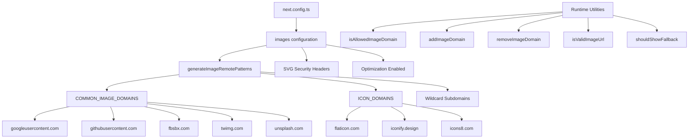

# تحسين الصورة

## نظرة عامة

يقوم قالب Ever Works بتكوين تحسين الصورة Next.js باستخدام الأنماط الديناميكية البعيدة ودعم SVG وطبقة أدوات مساعدة لإدارة المجال. يتعامل النظام مع الصور من موفري OAuth (Google، وGitHub، وFacebook، وTwitter)، وخدمات الصور المخزنة (Unsplash)، ومكتبات الأيقونات، مع فرض رؤوس الأمان لمحتوى SVG.

## الهندسة المعمارية



## ملفات المصدر

|ملف|الغرض|
|------|---------|
|`template/next.config.ts`|تكوين الصورة Next.js|
|`template/lib/utils/image-domains.ts`|المرافق لإدارة المجال|

## التكوين

### إعدادات الصورة Next.js

```typescript
// next.config.ts
images: {
    remotePatterns: generateImageRemotePatterns(),
    dangerouslyAllowSVG: true,
    contentDispositionType: 'attachment',
    contentSecurityPolicy: "default-src 'self'; script-src 'none'; sandbox;",
    unoptimized: false,
},
```

|الإعداد|القيمة|الغرض|
|---------|-------|---------|
|`remotePatterns`|ديناميكي عبر `generateImageRemotePatterns()`|القائمة البيضاء لنطاقات الصور الخارجية|
|`dangerouslyAllowSVG`|`true`|السماح بصور SVG من خلال المحسن|
|`contentDispositionType`|`'attachment'`|فرض التنزيل بدلاً من العرض المضمّن للوصول الأولي|
|`contentSecurityPolicy`|رمل صارم|منع هجمات XSS المستندة إلى SVG|
|`unoptimized`|`false`|حافظ على تمكين تحسين الصورة|

### أمان SVG

يمكن أن تحتوي ملفات SVG على JavaScript مضمن. يخفف القالب هذا من خلال:
- **سياسة أمان المحتوى**: `script-src 'none'; sandbox;` يمنع تنفيذ البرنامج النصي في ملفات SVG
- **التخلص من المحتوى**: `attachment` يضمن تنزيل ملفات SVG، وعدم تنفيذها، عند الوصول إليها مباشرة

## توليد الأنماط عن بعد

تقوم الدالة `generateImageRemotePatterns()` بإنشاء القائمة المسموح بها ديناميكيًا:

```typescript
export function generateImageRemotePatterns() {
    const patterns = [
        {
            protocol: 'https' as const,
            hostname: 'lh3.googleusercontent.com',
            pathname: '/a/**'
        },
        {
            protocol: 'https' as const,
            hostname: 'avatars.githubusercontent.com',
            pathname: '/u/**'
        },
        {
            protocol: 'https' as const,
            hostname: 'platform-lookaside.fbsbx.com',
            pathname: '/platform/**'
        },
        // ... more specific patterns
    ];

    // Add wildcard subdomain patterns
    [...COMMON_IMAGE_DOMAINS, ...ICON_DOMAINS].forEach((domain) => {
        patterns.push({
            protocol: 'https' as const,
            hostname: `*.${domain}`,
            pathname: '/**'
        });
    });

    return patterns;
}
```

### المجالات المسموح بها

**نطاقات الصور الشائعة** (الصور الرمزية لـ OAuth، الصور المخزنة):

|المجال|المصدر|
|--------|--------|
|`lh3.googleusercontent.com`|الصور الرمزية لجوجل OAuth|
|`avatars.githubusercontent.com`|الصور الرمزية لـ GitHub OAuth|
|`platform-lookaside.fbsbx.com`|الصور الرمزية لفيسبوك OAuth|
|`pbs.twimg.com`|الصور الرمزية لتويتر/X|
|`images.unsplash.com`|أونسبلاش الصور المخزنة|

**نطاقات الأيقونات** (أيقونات العناصر):

|المجال|المصدر|
|--------|--------|
|`flaticon.com`|أيقونات مسطحة|
|`iconify.design`|أيقونات الرموز|
|`icons8.com`|أيقونات8 أيقونات|
|`feathericons.com`|أيقونات ريشة|
|`heroicons.com`|أيقونات البطل|
|`tabler-icons.io`|أيقونات الجدول|

## إدارة مجال وقت التشغيل

### التحقق من المجالات المسموح بها

```typescript
import { isAllowedImageDomain } from '@/lib/utils/image-domains';

// Returns true for whitelisted domains
isAllowedImageDomain('https://lh3.googleusercontent.com/a/photo.jpg'); // true
isAllowedImageDomain('https://cdn.flaticon.com/icons/svg/123.svg');    // true
isAllowedImageDomain('https://evil-site.com/image.jpg');               // false

// Relative URLs are always allowed
isAllowedImageDomain('/images/logo.png'); // true
```

### إضافة المجال الديناميكي

```typescript
import { addImageDomain, removeImageDomain } from '@/lib/utils/image-domains';

// Add a new domain at runtime
addImageDomain('cdn.example.com');

// Add as an icon domain
addImageDomain('my-icons.com', true);

// Remove a domain
removeImageDomain('old-cdn.com');
```

ملاحظة: تؤثر إضافات وقت التشغيل على وظائف الأداة المساعدة ولكنها لا تعدل الأنماط البعيدة Next.js `next.config.ts` (تتطلب تلك الأنماط إعادة البناء).

### التحقق من صحة عنوان URL

```typescript
import { isValidImageUrl, isProblematicUrl, shouldShowFallback } from '@/lib/utils/image-domains';

// Check URL format validity
isValidImageUrl('https://example.com/photo.jpg'); // true
isValidImageUrl('/images/local.png');              // true (relative)
isValidImageUrl('not-a-url');                      // false

// Check for problematic URLs (non-image pages, redirect URLs)
isProblematicUrl('https://flaticon.com/icone-gratuite/search'); // true (not a direct image)
isProblematicUrl('https://cdn.flaticon.com/icon.svg');          // false (has image extension)

// Determine if fallback icon should be shown
shouldShowFallback('');                                          // true (empty)
shouldShowFallback('https://flaticon.com/icone-gratuite/123');   // true (problematic)
shouldShowFallback('https://cdn.flaticon.com/icon.svg');         // false
```

## رؤوس الأمان

يطبق `next.config.ts` رؤوس الأمان على كافة المسارات:

```typescript
async headers() {
    return [{
        source: "/(.*)",
        headers: [
            { key: "X-Content-Type-Options", value: "nosniff" },
            { key: "X-Frame-Options", value: "DENY" },
            { key: "Referrer-Policy", value: "strict-origin-when-cross-origin" },
            { key: "X-DNS-Prefetch-Control", value: "on" },
            { key: "Strict-Transport-Security", value: "max-age=63072000; includeSubDomains; preload" },
            {
                key: "Content-Security-Policy",
                value: "default-src 'self'; script-src 'self' 'unsafe-inline' https://assets.lemonsqueezy.com; style-src 'self' 'unsafe-inline'; img-src 'self' data: https:; font-src 'self'; connect-src 'self' https:; frame-ancestors 'none';"
            },
        ],
    }];
},
```

يسمح التوجيه `img-src 'self' data: https:` بالصور من نفس المصدر ومعرِّفات URI للبيانات وأي مصدر HTTPS. يعد هذا مسموحًا عن عمد لـ `img-src` لأن مكون صورة Next.js يتعامل مع التحقق من صحة المجال على مستوى التطبيق.

## أفضل الممارسات

1. **استخدم `next/image`** لجميع الصور الخارجية - فهو يتعامل مع التحسين والتحميل البطيء وتحويل التنسيق
2. **أضف مجالات جديدة إلى `image-domains.ts`** -- غير مضمّنة في `next.config.ts`
3. **تحقق من `shouldShowFallback()`** قبل العرض - أظهر رمزًا افتراضيًا لعناوين URL غير الصالحة/المفقودة
4. **احتفظ برؤوس أمان SVG** - لا تقم مطلقًا بإزالة إعدادات `contentSecurityPolicy` أو `contentDispositionType`
5. **تفضيل قيود اسم المسار** - استخدم أنماط `pathname` محددة (على سبيل المثال، `/a/**`) بدلاً من أحرف البدل العامة عندما يكون ذلك ممكنًا
