# نظرة عامة على المرافق ليب

يعد الدليل `template/lib/` هو الأداة المساعدة الأساسية وطبقة منطق الأعمال لقالب Ever Works. يحتوي على وحدات مشتركة للتحليلات، واتصالات واجهة برمجة التطبيقات (API)، والمصادقة، ووظائف الخلفية، والتخزين المؤقت، والتكوين، والوصول إلى قاعدة البيانات، والمدفوعات، وأدوات التحرير، والحراس، والمزيد. كل المنطق غير المكون وغير المسار يعيش هنا باتباع مبدأ الاحتفاظ بالمكونات العرضية وتفويض المنطق الثقيل إلى `lib/`.

## خريطة الوحدة

```mermaid
graph TD
    subgraph Core Infrastructure
        A[config/] --> B[config.ts / config-manager.ts]
        C[db/] --> D[drizzle.ts / queries/ / migrate.ts]
        E[cache-config.ts] --> F[cache-invalidation.ts]
    end

    subgraph Auth & Security
        G[auth/] --> H[NextAuth / Supabase / Guards / Caching]
        I[guards/] --> J[Plan Feature Access Control]
        K[permissions/] --> L[Role-Based Permissions]
    end

    subgraph API Layer
        M[api/] --> N[ApiClient / ServerClient / Error Handling]
    end

    subgraph Analytics & Tracking
        O[analytics/] --> P[PostHog + Sentry Singleton]
    end

    subgraph Background Processing
        Q[background-jobs/] --> R[Trigger.dev / Local / NoOp]
    end

    subgraph Content & Editor
        S[content.ts] --> T[Git CMS Content Loader]
        U[editor/] --> V[TipTap Rich Text Editor]
        W[lib.ts] --> X[Content Path / File Utilities]
    end

    subgraph Business Logic
        Y[services/] --> Z[20+ Domain Services]
        AA[repositories/] --> AB[Data Access Layer]
        AC[payment/] --> AD[Stripe / LemonSqueezy / Polar]
    end

    subgraph Shared Utilities
        AE[constants.ts + constants/]
        AF[utils.ts + utils/]
        AG[types.ts + types/]
        AH[validations/]
        AI[helpers.ts]
    end
```



## هيكل الدليل

|الدليل / الملف|الوصف|
|-----------------|-------------|
|`lib/analytics/`|PostHog + Sentry تحليلات فردية ([docs](./analytics-module))|
|`lib/api/`|عملاء HTTP للمتصفح والخادم ([docs](./api-client-module))|
|`lib/auth/`|المصادقة باستخدام NextAuth.js + Supabase ([docs](./auth-utilities-module))|
|`lib/background-jobs/`|جدولة الوظائف باستخدام Trigger.dev / local / no-op ([docs](./background-jobs-module))|
|`lib/cache-config.ts`|ذاكرة التخزين المؤقت TTL وتعريفات العلامات ([docs](./cache-invalidation-module))|
|`lib/cache-invalidation.ts`|وظائف إبطال ذاكرة التخزين المؤقت ([docs](./cache-invalidation-module))|
|`lib/config/`|خدمة التكوين المركزية مع مخططات Zod|
|`lib/config.ts`|تكوين الموقع (`siteConfig`)|
|`lib/config-manager.ts`|مدير تكوين وقت التشغيل|
|`lib/constants.ts`|برميل ثوابت التطبيق ([docs](./constants-reference-module))|
|`lib/constants/`|الثوابت الخاصة بالمجال (الدفع، التحليلات)|
|`lib/content.ts`|تحميل محتوى CMS القائم على Git وتخزينه مؤقتًا|
|`lib/db/`|الاتصال بقاعدة البيانات، والترحيلات، والبذر، والاستعلامات ([docs](./db-utilities-module))|
|`lib/editor/`|مكونات وأدوات محرر النص المنسق TipTap ([docs](./editor-utilities-module))|
|`lib/guards/`|التحكم في الوصول إلى الميزات المستند إلى الخطة ([docs](./guards-module))|
|`lib/helpers.ts`|رمز اللغة لرسم خرائط رمز البلد|
|`lib/lib.ts`|دقة مسار المحتوى، والأدوات المساعدة لنظام الملفات|
|`lib/logger.ts`|فائدة التسجيل المنظم|
|`lib/mail/`|إرسال البريد الإلكتروني مع دعم القالب|
|`lib/mappers/`|مخططو تحويل البيانات|
|`lib/maps/`|تكاملات مزود الخرائط (خرائط Google، Mapbox)|
|`lib/middleware/`|أدوات مساعدة للبرامج الوسيطة Next.js|
|`lib/newsletter/`|مقدمي الاشتراك في النشرة الإخبارية|
|`lib/paginate.ts`|وظيفة مساعد ترقيم الصفحات|
|`lib/payment/`|معالجة الدفع (Stripe، LemonSqueezy، Solidgate، Polar)|
|`lib/permissions/`|تعريفات الأذونات المستندة إلى الدور|
|`lib/query-client.ts`|رد فعل تكوين العميل الاستعلام|
|`lib/react-query-config.ts`|رد فعل الاستعلام الخيارات الافتراضية|
|`lib/repositories/`|طبقة الوصول إلى البيانات (نمط المستودع)|
|`lib/repository.ts`|عمليات مستودع Git (الاستنساخ، السحب، المزامنة)|
|`lib/seo/`|البيانات الوصفية لتحسين محركات البحث ومولدات البيانات المنظمة|
|`lib/services/`|خدمات منطق الأعمال (20+ خدمة المجال)|
|`lib/stripe-helpers.ts`|المرافق الخاصة بالشريط|
|`lib/swagger/`|التعليقات التوضيحية Swagger/OpenAPI|
|`lib/theme-color-manager.ts`|إدارة ألوان السمة الديناميكية|
|`lib/theme-utils.ts`|وظائف فائدة الموضوع|
|`lib/themes.tsx`|تعريفات الموضوع|
|`lib/types.ts`|تعريفات النوع المشترك|
|`lib/types/`|تعريفات النوع الخاص بالمجال|
|`lib/utils.ts`|وظائف المرافق العامة|
|`lib/utils/`|أدوات مساعدة خاصة بالمجال (أكثر من 15 وحدة)|
|`lib/validations/`|مخططات التحقق من صحة Zod|

## الوحدات الرئيسية المستقلة

### `lib/helpers.ts` - تعيين رمز اللغة/البلد

```typescript
type LanguageCode = 'en' | 'fr' | 'es' | 'zh' | 'de' | 'ar' | ... ;

const LANGUAGE_COUNTRY_CODES: Record<LanguageCode, string>;
// { en: 'US', fr: 'FR', es: 'ES', zh: 'CN', ... }

const appLocales: string[];
// All supported locale codes

function getCountryCode(languageCode?: LanguageCode): string;
// 'en' -> 'US', 'fr' -> 'FR'
```

### `lib/lib.ts` - مسار المحتوى ونظام الملفات

أدوات مساعدة للخادم فقط لإدارة دليل المحتوى:

```typescript
function getContentPath(): string;
// Returns '.content' path (local) or '/tmp/.content' (Vercel runtime)

async function ensureContentAvailable(): Promise<string>;
// Ensures content is available, triggering Git clone if needed

async function fsExists(filepath: string): Promise<boolean>;
async function dirExists(dirpath: string): Promise<boolean>;
```

### `lib/paginate.ts` - مساعد الصفحات

```typescript
function paginate<T>(items: T[], page: number, limit: number): T[];
```

### `lib/logger.ts` - التسجيل المنظم

```typescript
const logger = {
  info(message: string, context?: Record<string, any>): void;
  warn(message: string, context?: Record<string, any>): void;
  error(message: string, context?: Record<string, any>): void;
  debug(message: string, context?: Record<string, any>): void;
};
```

### `lib/color-generator.ts` - إنشاء الألوان الحتمية

يُنشئ ألوانًا متسقة من السلاسل (تستخدم للصور الرمزية والعلامات وما إلى ذلك).

### `lib/theme-color-manager.ts` - ألوان السمات الديناميكية

يدير تحديثات خصائص CSS المخصصة لتبديل السمات.

## طبقة الخدمات (`lib/services/`)

يحتوي دليل الخدمات على خدمات منطق الأعمال المنظمة حسب المجال:

|الخدمة|المسؤولية|
|---------|---------------|
|`analytics-background-processor.ts`|معالجة تحليلات الخلفية|
|`analytics-export.service.ts`|تصدير البيانات التحليلية|
|`analytics-scheduled-reports.service.ts`|تقارير التحليلات المجدولة|
|`category-file.service.ts`|عمليات ملف الفئة|
|`category-git.service.ts`|عمليات بوابة الفئة|
|`collection-git.service.ts`|عمليات جمع جيت|
|`company.service.ts`|إدارة الملف الشخصي للشركة|
|`currency-detection.service.ts`|كشف عملة المستخدم|
|`currency.service.ts`|تحويل العملة|
|`email-notification.service.ts`|إشعارات البريد الإلكتروني|
|`engagement.service.ts`|عرض/تصويت/تتبع المفضلة|
|`file.service.ts`|تحميل/إدارة الملفات|
|`geocoding/`|الترميز الجغرافي مع موفري Google/Mapbox|
|`item-audit.service.ts`|مسار تدقيق العناصر|
|`item-git.service.ts`|عمليات جيت البند|
|`location/`|فهرسة الموقع وإدارته|
|`moderation.service.ts`|الاعتدال في المحتوى|
|`notification.service.ts`|دفع الإخطارات|
|`posthog-api.service.ts`|واجهة برمجة تطبيقات PostHog من جانب الخادم|
|`role-db.service.ts`|إدارة الدور|
|`settings.service.ts`|إعدادات التطبيق|
|`sponsor-ad.service.ts`|إدارة إعلانات الراعي|
|`stripe-products.service.ts`|مزامنة منتج الشريط|
|`subscription-jobs.ts`|وظائف خلفية الاشتراك|
|`subscription.service.ts`|دورة حياة الاشتراك|
|`survey.service.ts`|إدارة المسح|
|`sync-service.ts`|مزامنة مستودع Git|
|`tag-git.service.ts`|عمليات علامة جيت|
|`twenty-crm-*.ts`|عشرون عملية تكامل لإدارة علاقات العملاء (5 ملفات)|
|`user-db.service.ts`|عمليات قاعدة بيانات المستخدم|
|`webhook-subscription.service.ts`|إدارة الويب هوك|

## طبقة المرافق (`lib/utils/`)

وحدات المساعدة لاهتمامات محددة:

|الوحدة النمطية|الغرض|
|--------|---------|
|`api-error.ts`|فئة خطأ واجهة برمجة التطبيقات|
|`bot-detection.ts`|كشف وكيل مستخدم الروبوت|
|`checkout-utils.ts`|مساعدين الدفع|
|`client-auth.ts`|أدوات المصادقة من جانب العميل|
|`currency-format.ts`|تنسيق العملة|
|`custom-navigation.ts`|التنقل المخصص لجهاز التوجيه|
|`database-check.ts`|فحص صحة قاعدة البيانات|
|`email-validation.ts`|التحقق من صحة تنسيق البريد الإلكتروني|
|`error-handler.ts`|معالج الأخطاء العالمية|
|`featured-items.ts`|اختيار العناصر المميزة|
|`footer-utils.ts`|المرافق رابط التذييل|
|`image-domains.ts`|مجالات الصور المسموح بها|
|`pagination-validation.ts`|التحقق من صحة معلمة ترقيم الصفحات|
|`payment-provider.ts`|كشف مزود الدفع|
|`plan-expiration.utils.ts`|حسابات انتهاء الخطة|
|`rate-limit.ts`|الحد من معدل API|
|`request-body.ts`|طلب تحليل الجسم|
|`server-url.ts`|دقة عنوان URL للخادم|
|`settings.ts`|وظائف مساعد الإعدادات|
|`slug.ts`|توليد سبيكة URL|
|`url-cleaner.ts`|تعقيم URL|
|`url-filter-sync.ts`|مزامنة حالة مرشح URL|

## مبادئ التصميم

1. **فصل الاهتمامات** - منطق الأعمال في `services/`، الوصول إلى البيانات في `repositories/` و`db/queries/`، العرض التقديمي في `components/`.

2. **سلامة البرنامج النصي** - تتجنب الوحدات المستخدمة بواسطة البرامج النصية للترحيل/البذور (مثل `constants/payment.ts` و`db/config.ts`) استيراد التعليمات البرمجية الخاصة بـ Next.js.

3. **التهيئة البطيئة** - تستخدم اتصالات قواعد البيانات وعملاء واجهة برمجة التطبيقات (API) ومديرو الوظائف أنماطًا مفردة مع التهيئة البطيئة لتجنب الأخطاء أثناء وقت الإنشاء.

4. **الواردات الديناميكية** - تستخدم الوحدات الخاصة بـ Node.js عمليات الاستيراد الديناميكية في وظائف الخلفية والمصادقة لمنع مشكلات تجميع حزم الويب.

5. **حدود الخادم/العميل** - تستخدم الوحدات النمطية للخادم فقط الحزمة `server-only`. تتجنب الوحدات الآمنة للعميل عمليات استيراد الخادم. يتم استخدام التوجيه `'use client'` بشكل مقتصد.
