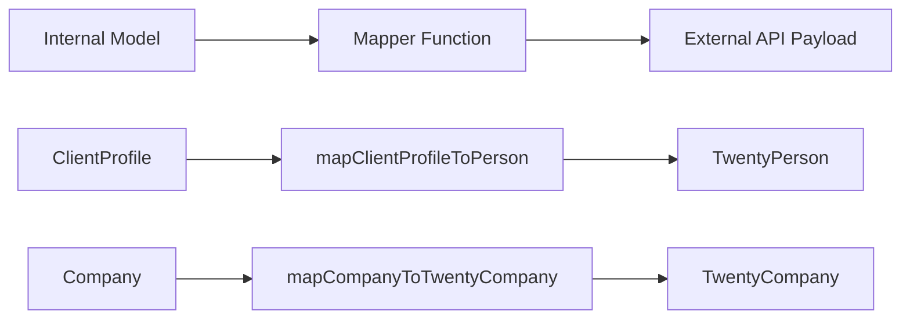

# أنماط مصمم الخرائط

يستخدم القالب وظائف مخطط خرائط خالصة لتحويل البيانات بين النماذج الداخلية وحمولات واجهة برمجة التطبيقات الخارجية. يعتبر مصممو الخرائط خاليين من التأثيرات الجانبية وآمنين، ويقومون بالتحقق من صحة الحقول المطلوبة قبل التحويل.

## نظرة عامة على الهندسة المعمارية



## ملفات المصدر

|ملف|الغرض|
|------|---------|
|`lib/mappers/twenty-crm.mapper.ts`|تعيين الكيانات المحلية لحمولات Twenty CRM API|

## مبادئ التصميم

تتبع وحدة المخطط اصطلاحات البرمجة الوظيفية الصارمة:

1. **وظائف خالصة** - لا توجد آثار جانبية، ولا طفرات، ولا تستدعي قاعدة البيانات
2. **Null-safe** -- تستخدم جميع الحقول الاختيارية عمليات تحقق صريحة خالية/غير محددة
3. **التحقق قبل التعيين** - يتم التحقق من صحة الحقول المطلوبة مع وجود أخطاء وصفية
4. **فرض المعرف الخارجي** - يجب أن يكون لدى كل كيان معين `external_id` صالح

## التحقق من صحة الهوية الخارجية

يتطلب كل كيان تم تعيينه لنظام خارجي معرفًا صالحًا:

```typescript
export function ensureExternalId(id: string | undefined | null, entityType: string): string {
  if (!id || id.trim() === '') {
    throw new Error(`${entityType} ID is required for external_id mapping`);
  }
  return id.trim();
}
```

يتم استدعاء هذه الوظيفة في بداية كل مخطط لضمان أن الحقل `external_id` لن يكون فارغًا أبدًا.

## استخراج الموقع

تقوم وظيفة الأداة المساعدة بتوزيع أسماء المدن من سلاسل مواقع النص الحر:

```typescript
export function extractCityFromLocation(location: string | undefined | null): string | null {
  if (!location || location.trim() === '') return null;
  const parts = location.split(',');
  const city = parts[0]?.trim();
  return city || null;
}
```

يتعامل مع التنسيقات مثل `"San Francisco"` و`"San Francisco, CA"` و`"San Francisco, CA, USA"`.

## ملف تعريف العميل إلى عشرين شخصًا لإدارة علاقات العملاء

تعيين السجلات الداخلية `ClientProfile` إلى حمولة Twenty CRM `TwentyPerson`:

```typescript
export function mapClientProfileToPerson(clientProfile: ClientProfile): TwentyPerson {
  const external_id = ensureExternalId(clientProfile.id, 'ClientProfile');

  const person: TwentyPerson = {
    external_id,
    name: clientProfile.name,
    email: clientProfile.email,
  };

  // Optional field mapping (null-safe)
  if (clientProfile.phone)     person.phone = clientProfile.phone;
  if (clientProfile.jobTitle)  person.job_title = clientProfile.jobTitle;
  if (clientProfile.company)   person.company_name = clientProfile.company;
  if (clientProfile.website)   person.website = clientProfile.website;

  const city = extractCityFromLocation(clientProfile.location);
  if (city) person.city = city;

  // Custom fields
  if (clientProfile.accountType) person.account_type = clientProfile.accountType;
  if (clientProfile.plan)        person.plan = clientProfile.plan;
  if (clientProfile.totalSubmissions !== null && clientProfile.totalSubmissions !== undefined) {
    person.total_submissions = clientProfile.totalSubmissions;
  }

  return person;
}
```

### جدول رسم الخرائط الميدانية

|حقل ملف تعريف العميل|حقل عشرين شخصًا|مطلوب|ملاحظات|
|--------------------|--------------------|----------|-------|
|`id`|`external_id`|نعم|التحقق من صحتها وقلصت|
|`name`|`name`|نعم|رسم الخرائط المباشرة|
|`email`|`email`|نعم|رسم الخرائط المباشرة|
|`phone`|`phone`|لا|فقط إذا كان موجودا|
|`jobTitle`|`job_title`|لا|حالة الجمل إلى حالة الثعبان|
|`company`|`company_name`|لا|تمت إعادة تسمية الحقل|
|`website`|`website`|لا|رسم الخرائط المباشرة|
|`location`|`city`|لا|تم الاستخراج عبر `extractCityFromLocation`|
|`accountType`|`account_type`|لا|حقل مخصص|
|`plan`|`plan`|لا|حقل مخصص|
|`totalSubmissions`|`total_submissions`|لا|مطلوب فحص فارغ صريح|

## شركة لشركة Twenty CRM

تعيين الكيانات الداخلية `Company` إلى حمولة Twenty CRM `TwentyCompany`:

```typescript
export function mapCompanyToTwentyCompany(company: Company): TwentyCompany {
  const external_id = ensureExternalId(company.id, 'Company');

  const twentyCompany: TwentyCompany = {
    external_id,
    name: company.name,
  };

  if (company.domain)  twentyCompany.domain_name = company.domain;
  if (company.website) twentyCompany.website = company.website;
  if (company.status)  twentyCompany.status = company.status;

  return twentyCompany;
}
```

### جدول رسم الخرائط الميدانية

|مجال الشركة|مجال الشركة العشرين|مطلوب|ملاحظات|
|--------------|---------------------|----------|-------|
|`id`|`external_id`|نعم|التحقق من صحتها وقلصت|
|`name`|`name`|نعم|رسم الخرائط المباشرة|
|`domain`|`domain_name`|لا|تمت إعادة تسمية الحقل|
|`website`|`website`|لا|رسم الخرائط المباشرة|
|`status`|`status`|لا|`'active'` أو `'inactive'`|

## إضافة مصممي الخرائط الجدد

عند إنشاء مصممي خرائط لعمليات التكامل الجديدة، اتبع الأنماط المحددة:

```typescript
// 1. Always validate external_id first
const external_id = ensureExternalId(entity.id, 'EntityName');

// 2. Build the required fields object
const payload: ExternalType = {
  external_id,
  // ... required fields
};

// 3. Conditionally add optional fields (null-safe)
if (entity.optionalField) {
  payload.optional_field = entity.optionalField;
}

// 4. Return the payload -- never mutate the input
return payload;
```

## اعتبارات الاختبار

نظرًا لأن مصممي الخرائط عبارة عن وظائف خالصة، فمن السهل اختبار الوحدة عليهم:

- اختبار مع ملء جميع الحقول الاختيارية
- اختبار مع كافة الحقول الاختيارية مثل `null` أو `undefined`
- اختبر أن المعرفات المطلوبة المفقودة تؤدي إلى أخطاء وصفية
- اختبار استخراج الموقع بتنسيقات سلسلة مختلفة
- تأكد من عدم تحور كائن الإدخال مطلقًا
