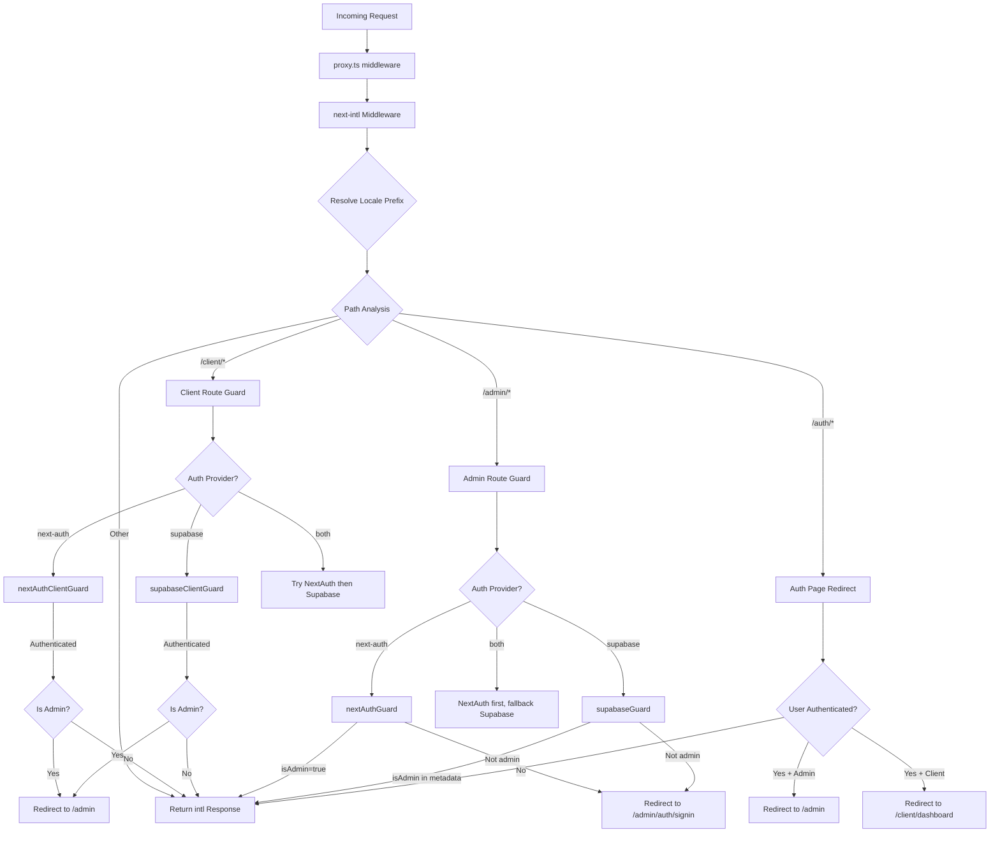

# سلسلة البرامج الوسيطة ومعالجة الطلبات

## نظرة عامة

يستخدم قالب Ever Works بنية **برمجيات وسيطة موحدة** محددة في `proxy.ts` في جذر المشروع. تنظم هذه البرامج الوسيطة ثلاثة اهتمامات مهمة لكل طلب وارد:

1. **التدويل** - الكشف عن اللغة وإدراج البادئة والتوجيه عبر `next-intl`
2. **حراس المصادقة** - حماية المسارات `/admin/*` و`/client/*` باستخدام NextAuth، أو Supabase، أو كليهما
3. **إعادة التوجيه بناءً على الأدوار** -- إرسال المستخدمين المعتمدين بعيدًا عن صفحات المصادقة العامة، وإعادة توجيه المسؤولين/العملاء إلى لوحات المعلومات الخاصة بهم

يدعم التصميم نموذج **موفر مصادقة قابل للتوصيل**: تقرأ البرنامج الوسيط `AuthProviderType` (`'next-auth'`، أو `'supabase'`، أو `'both'`) من تكوين المصادقة المركزي ويحدد وظائف الحماية المناسبة وفقًا لذلك.

## مخطط الهندسة المعمارية



## ملفات المصدر

|ملف|الغرض|
|------|---------|
|`template/proxy.ts`|نقطة الدخول الرئيسية للوسيطة|
|`template/lib/auth/config.ts`|تكوين موفر المصادقة (`getAuthConfig()`)|
|`template/lib/auth/supabase/middleware.ts`|مساعد تحديث جلسة Supabase|
|`template/lib/auth/validate-callback-url.ts`|إنشاء عنوان URL لرد الاتصال الآمن|
|`template/i18n/routing.ts`|تكوين التوجيه المحلي|

## طلب أمر المعالجة

### الخطوة 1: التدويل

يمر كل طلب أولاً عبر `next-intl` البرنامج الوسيط الذي تم إنشاؤه باستخدام `createIntlMiddleware(routing)`:

```typescript
import createIntlMiddleware from 'next-intl/middleware';
import { routing } from './i18n/routing';

const intl = createIntlMiddleware(routing);
```

يعالج هذا الكشف عن اللغة عبر `Accept-Language` الرأس وتفضيلات ملفات تعريف الارتباط وبادئة URL. يستخدم تكوين التوجيه `localePrefix: "as-needed"`، مما يعني أن اللغة الافتراضية (`en`) لا تتطلب بادئة URL.

### الخطوة 2: القرار المحلي

يقوم المساعد `resolveLocalePrefix` باستخراج المعلومات المحلية من اسم المسار:

```typescript
function resolveLocalePrefix(pathname: string): {
    prefix: string;       // e.g., "/fr" or ""
    hasLocale: boolean;
    locale?: string;
    pathWithoutLocale: string;  // e.g., "/admin/items"
}
```

يعد هذا أمرًا بالغ الأهمية لأن كل مطابقة المسار اللاحقة (على سبيل المثال، التحقق من `/admin` أو `/client`) يجب أن تعمل على المسار **بدون** البادئة المحلية.

### الخطوة 3: اختيار الحرس على أساس الطريق

تقوم البرمجيات الوسيطة بتقييم `pathWithoutLocale` لتحديد سلسلة الحماية التي سيتم تطبيقها:

|نمط المسار|تطبيق الحرس|الغرض|
|-------------|--------------|---------|
|`/client` أو `/client/*`|حارس مصادقة العميل|يتطلب المصادقة. يعيد توجيه المسؤولين إلى `/admin`|
|`/admin/*` (باستثناء `/admin/auth/signin`)|حارس مصادقة المشرف|يتطلب المصادقة + علامة `isAdmin`|
|`/auth/*`|إعادة توجيه صفحة المصادقة|يعيد توجيه المستخدمين المعتمدين بعيدًا عن تسجيل الدخول/التسجيل|
|كل شيء آخر|لا حارس|يمر عبر استجابة i18n|

### الخطوة 4: التحقق من المصادقة

#### NextAuth Guard (يعتمد على JWT)

```typescript
const token = await getToken({ req, secret: process.env.AUTH_SECRET });
if (token?.isAdmin === true) {
    return baseRes; // Admin access granted
}
```

يستخدم حراس NextAuth `getToken()` من `next-auth/jwt` لقراءة رمز JWT المميز من ملفات تعريف الارتباط. هذا متوافق مع Edge Runtime ولا يتطلب البحث في قاعدة البيانات.

#### حارس سوبابيس

```typescript
const supRes = await supabaseUpdate(req);
// Merge cookies...
const { data: { user } } = await supabase.auth.getUser();
const isAdmin = user?.user_metadata?.isAdmin === true
    || user?.user_metadata?.role === 'admin';
```

يقوم حارس Supabase أولاً بتحديث الجلسة باستخدام `updateSession()`، ثم يتحقق من بيانات تعريف المستخدم بحثًا عن علامات المسؤول.

### الخطوة 5: نشر ملفات تعريف الارتباط

تفاصيل التنفيذ المهمة: عندما يصدر الحارس استجابة إعادة توجيه، يجب نشر جميع ملفات تعريف الارتباط من `intlResponse`:

```typescript
const redirectRes = NextResponse.redirect(url);
baseRes.cookies.getAll().forEach((c) => redirectRes.cookies.set(c));
return redirectRes;
```

وهذا يضمن بقاء تفضيلات اللغة وملفات تعريف الارتباط لجلسة المصادقة على قيد الحياة مع عمليات إعادة التوجيه.

## التكوين

### اختيار موفر المصادقة

يتم تحديد موفر المصادقة بواسطة `getAuthConfig()` في `lib/auth/config.ts`:

```typescript
export type AuthProviderType = 'supabase' | 'next-auth' | 'both';

export function getAuthConfig(): AuthConfig {
    // Priority 1: Global override via configureAuth()
    // Priority 2: Environment-based (detects Supabase env vars)
    // Priority 3: Default ('next-auth')
}
```

### الوسيطة المتطابقة

```typescript
export const config = {
    matcher: ['/((?!api|trpc|_next|_vercel|.*\\..*).*)']
};
```

يستبعد هذا التعبير العادي ما يلي:
- `/api/*` المسارات (تتم معالجتها بواسطة طبقة واجهة برمجة تطبيقات Next.js)
- `/trpc/*` الطرق
- `/_next/*` (Next.js الداخلية)
- `/_vercel/*` (Vercel الداخلية)
- أي مسار بامتداد الملف (الأصول الثابتة)

### أمان عنوان URL لرد الاتصال

يستخدم البرنامج الوسيط `createSafeCallbackUrl()` لمنع هجمات إعادة التوجيه المفتوحة:

```typescript
export function createSafeCallbackUrl(pathname: string, search?: string): string {
    // Limits URL length to 2048 characters
    // Validates relative-only paths
}

export function isValidCallbackUrl(url: string | null): boolean {
    return url?.startsWith('/') && !url.startsWith('//');
}
```

## وضع الموفر المزدوج ("كلاهما")

عندما `provider === 'both'`، تنفذ البرامج الوسيطة سلسلة احتياطية:

1. ** مسارات العميل **: جرب NextAuth أولاً؛ إذا لم تتم مصادقته، حاول Supabase
2. **طرق الإدارة**: جرب NextAuth أولاً؛ إذا أدى ذلك إلى إعادة توجيه (مرفوضة)، فجرّب Supabase
3. **صفحات المصادقة**: تحقق من رمز NextAuth المميز أولاً، ثم تحقق من جلسة Supabase

يسمح هذا للمؤسسات بالانتقال بين موفري المصادقة دون تعطيل المستخدمين الحاليين.

## تفاصيل التنفيذ الرئيسية

### توافق وقت تشغيل الحافة

يتم تشغيل البرنامج الوسيط في Next.js Edge Runtime. تستخدم جميع عمليات التحقق من المصادقة واجهات برمجة التطبيقات المتوافقة مع Edge:
- NextAuth: `getToken()` (يعتمد على JWT، لا حاجة إلى قاعدة بيانات)
- Supabase: `createServerClient()` مع جلسة تعتمد على ملفات تعريف الارتباط

### التطوير مقابل تسجيل الإنتاج

يتم تسجيل تصحيح الأخطاء خلف `NODE_ENV === 'development'`:

```typescript
if (process.env.NODE_ENV === 'development') {
    console.log('[Middleware] Admin access granted via token');
}
```

### تحديث جلسة Supabase

يتم استدعاء مساعد البرنامج الوسيط Supabase (`updateSession`) قبل كل عملية تحقق من المصادقة لضمان تحديث الرموز المميزة:

```typescript
export async function updateSession(request: NextRequest) {
    const supabase = createServerClient(url, anonKey, {
        cookies: { getAll, setAll }
    });
    // IMPORTANT: DO NOT REMOVE auth.getUser()
    await supabase.auth.getUser();
    return supabaseResponse;
}
```

يؤكد التعليق الموجود في التعليمات البرمجية المصدر على أنه لا يجب إزالة `auth.getUser()` - فهو يؤدي إلى تشغيل دورة تحديث الرمز المميز التي تمنع عمليات تسجيل الخروج العشوائي.
