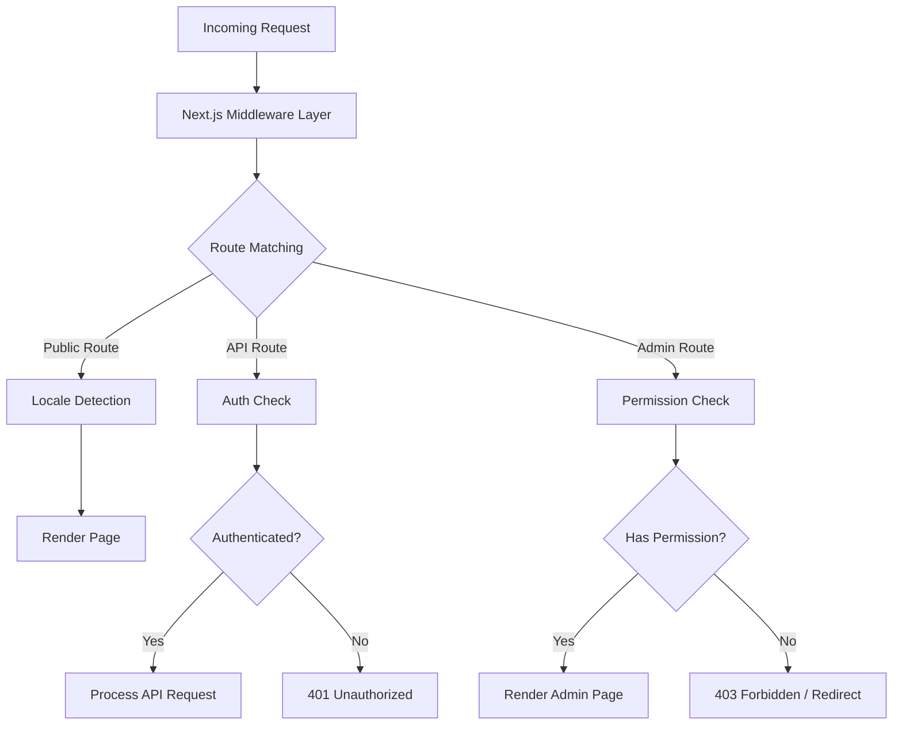
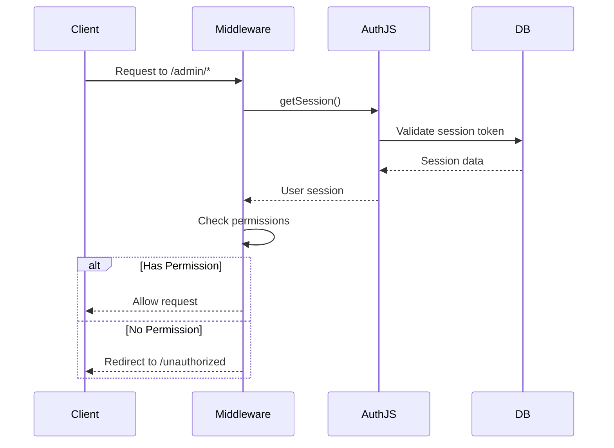
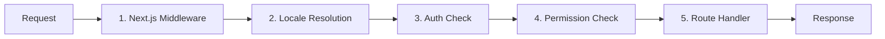

# الغوص العميق في البرمجيات الوسيطة

يستخدم قالب Ever Works بنية برمجية وسيطة ذات طبقات مبنية على اصطلاحات Next.js App Router ومنطق التحقق من الأذونات المخصص. يغطي هذا المستند مسار معالجة الطلب بالكامل، وفحص الأذونات، والبرمجيات الوسيطة للمصادقة، والتعامل مع الإعدادات المحلية، وترتيب البرامج الوسيطة.

## نظرة عامة على الهندسة المعمارية



## التحقق من الأذونات الوسيطة

يوجد نظام التحقق من الأذونات في `lib/middleware/permission-check.ts` ويوفر تحكمًا دقيقًا في الوصول لمسارات واجهة برمجة التطبيقات وصفحات الإدارة.

### الواجهة الأساسية

```typescript
interface UserPermissions {
  userId: string;
  roles: string[];
  permissions: Permission[];
}
```

### وظائف التحقق من الأذونات

|وظيفة|الغرض|المرتجعات|
|---|---|---|
|`hasPermission(user, permission)`|تحقق من إذن واحد|`boolean`|
|`hasAnyPermission(user, permissions)`|تحقق مما إذا كان لدى المستخدم واحد على الأقل|`boolean`|
|`hasAllPermissions(user, permissions)`|تحقق مما إذا كان المستخدم قد قام بإدراج كافة العناصر|`boolean`|
|`hasResourcePermission(user, resource, action)`|تحقق من تنسيق `resource:action`|`boolean`|
|`getResourcePermissions(user, resource)`|الحصول على كافة الأذونات للمورد|`Permission[]`|
|`canManageResource(user, resource)`|تحقق من الوصول إلى الإنشاء/التحديث/الحذف|`boolean`|
|`isSuperAdmin(user)`|تحقق من دور المشرف المتميز أو جميع الأذونات|`boolean`|

### الاستخدام في مسارات API

```typescript
import { hasPermission, hasAnyPermission } from '@/lib/middleware/permission-check';

export async function GET(request: Request) {
  const userPermissions = await getUserPermissions(session);

  // Single permission check
  if (!hasPermission(userPermissions, 'items:read')) {
    return new Response('Forbidden', { status: 403 });
  }

  // Multiple permission check (any)
  if (!hasAnyPermission(userPermissions, ['items:review', 'items:approve'])) {
    return new Response('Forbidden', { status: 403 });
  }
}
```

### الشيكات على مستوى الموارد

```typescript
// Check specific resource and action
const canEdit = hasResourcePermission(userPermissions, 'items', 'update');

// Get all permissions for a resource
const itemPerms = getResourcePermissions(userPermissions, 'items');
// Returns: ['items:read', 'items:create', 'items:update']

// Check management capability (create, update, or delete)
const canManage = canManageResource(userPermissions, 'categories');
```

### مساعدو الأذونات المتخصصة

توفر البرامج الوسيطة مساعدين خاصين بالمجال يجمعون بين عمليات التحقق من الأذونات المتعددة:

```typescript
// Can the user review, approve, or reject items?
const canReview = canReviewItems(userPermissions);

// Can the user manage users (read, create, update, delete, assignRoles)?
const canAdmin = canManageUsers(userPermissions);

// Can the user view analytics data?
const canView = canViewAnalytics(userPermissions);

// Is the user a super admin?
const isAdmin = isSuperAdmin(userPermissions);
```

### كشف المشرف الفائق

تستخدم الدالة `isSuperAdmin` أسلوبًا من مستويين:

1. **التحقق من الدور** (أساسي): يتحقق مما إذا كان المستخدم لديه دور `super-admin`
2. **التحقق من الإذن** (احتياطي): التحقق من أن المستخدم لديه كل إذن النظام

```typescript
function isSuperAdmin(userPermissions: UserPermissions): boolean {
  // Fast path: check role
  if (userPermissions.roles.includes('super-admin')) {
    return true;
  }
  // Exhaustive check: verify all permissions
  return hasAllPermissions(userPermissions, allSystemPermissions);
}
```

## وسيطة المصادقة

تتم معالجة المصادقة من خلال NextAuth.js (Auth.js v5) الذي تم تكوينه في `auth.config.ts`. تعمل البرامج الوسيطة على كل طلب للمسارات المحمية.

### تكوين الموفر

يقوم تكوين المصادقة بتكوين موفري OAuth ديناميكيًا باستخدام خيار احتياطي أنيق:

|مزود|مصدر التكوين|
|---|---|
|جوجل|`authConfig.google.clientId/clientSecret`|
|جيثب|`authConfig.github.clientId/clientSecret`|
|الفيسبوك|`authConfig.facebook.clientId/clientSecret`|
|تويتر/X|`authConfig.twitter.clientId/clientSecret`|
|أوراق الاعتماد|ممكّن دائمًا|

إذا فشل تكوين OAuth، فسيعود النظام إلى مصادقة بيانات الاعتماد فقط.

### تدفق جلسة المصادقة



## الوسيطة المحلية

يدعم القالب أكثر من 20 لغة من خلال `next-intl` تكامل البرامج الوسيطة. يتبع اكتشاف اللغة نمط البادئة "حسب الحاجة":

- اللغة الافتراضية (`en`): لا توجد بادئة URL - `/items/my-app`
- لغات أخرى: البادئة المحلية - `/fr/items/my-app`

### اللغات المدعومة

|لغة|اللغة|لغة|اللغة|
|---|---|---|---|
|`en`|الإنجليزية (الافتراضي)|`ja`|اليابانية|
|`fr`|الفرنسية|`ko`|الكورية|
|`es`|الاسبانية|`nl`|الهولندية|
|`de`|الألمانية|`pl`|البولندية|
|`zh`|صيني|`tr`|تركي|
|`ar`|العربية|`vi`|الفيتنامية|
|`he`|العبرية|`th`|التايلاندية|
|`ru`|الروسية|`hi`|الهندية|
|`uk`|الأوكرانية|`id`|الاندونيسية|
|`pt`|البرتغالية|`bg`|البلغارية|
|`it`|ايطالي| | |

## طلب معالجة خط الأنابيب

يتبع مسار معالجة الطلب الكامل هذا الترتيب:



### خطوات خط الأنابيب

1. **Next.js الوسيطة** (`middleware.ts`): يتم تشغيلها عند كل طلب يطابق المطابقات التي تم تكوينها. يتعامل مع عمليات إعادة التوجيه وإعادة الكتابة وحقن الرأس.

2. **تحليل اللغة**: يكتشف اللغة المفضلة للمستخدم من مسار URL، أو `Accept-Language`، أو ملف تعريف الارتباط. يضبط الإعدادات المحلية لسياق الطلب.

3. **التحقق من المصادقة**: بالنسبة للمسارات المحمية (`/admin/*`، `/dashboard/*`، `/api/admin/*`)، يتم التحقق من صحة رمز جلسة المستخدم.

4. **التحقق من الإذن**: بعد المصادقة، يتم التحقق من أن المستخدم لديه الأذونات المطلوبة للمورد والإجراء المحدد.

5. **معالج المسار**: يقوم مكون الصفحة الفعلي أو معالج مسار واجهة برمجة التطبيقات بمعالجة الطلب.

### ضمانات طلب البرمجيات الوسيطة

يفرض النظام ترتيبًا صارمًا:

- يتم تشغيل اكتشاف اللغة أولاً دائمًا (مطلوب لصفحات الخطأ)
- يتم تشغيل عمليات التحقق من المصادقة قبل عمليات التحقق من الأذونات (تحتاج إلى مستخدم للتحقق من الأذونات)
- تعتبر عمليات التحقق من الأذونات بمثابة البوابة النهائية قبل معالجات المسار
- تستخدم مسارات واجهة برمجة التطبيقات عمليات فحص الأذونات على مستوى الوظيفة (وليس على مستوى البرامج الوسيطة)

## الأدوات المساعدة للتحقق من الأذونات

تتضمن البرامج الوسيطة مساعدين للتحقق من الصحة للعمل مع سلاسل الأذونات:

```typescript
// Validate a permission string
validatePermission('items:read');     // true
validatePermission('invalid:perm');   // false

// Parse a permission into parts
parsePermission('items:update');
// Returns: { resource: 'items', action: 'update' }

// Get summary grouped by resource
getPermissionSummary(userPermissions);
// Returns: { items: ['read', 'create'], categories: ['read'] }
```

## معالجة الأخطاء

يعالج نظام البرمجيات الوسيطة الأخطاء في كل طبقة:

|طبقة|خطأ|الاستجابة|
|---|---|---|
|لغة|لغة غير صالحة|إعادة التوجيه إلى اللغة الافتراضية|
|مصادقة|لا جلسة|401 أو إعادة التوجيه لتسجيل الدخول|
|مصادقة|جلسة منتهية الصلاحية|401 مع تلميح التحديث|
|إذن|إذن مفقود|403 ممنوع|
|إذن|سلسلة الأذونات غير صالحة|تم تسجيل التحذير، تم رفض الوصول|

## أفضل الممارسات

1. **استخدم الفحص الأكثر تحديدًا** - تفضل `hasPermission` بإذن واحد على `isSuperAdmin` لبوابة الميزات العادية.

2. **التحقق من الأذونات في مسارات واجهة برمجة التطبيقات** -- لا تعتمد فقط على البرامج الوسيطة؛ التحقق دائمًا من صحة معالج المسار للدفاع في العمق.

3. **استخدم عمليات الاستيراد الديناميكية** في البرامج الوسيطة لتجنب تجميع الوحدات النمطية المخصصة للخادم فقط في وقت تشغيل الحافة.

4. ** حافظ على عمليات التحقق من الأذونات بسرعة ** - يضمن البحث عن مجموعة الأذونات `O(1)` الحد الأدنى من الحمل لكل طلب.

5. **فشل إذن التسجيل** - استخدم التسجيل المنظم باستخدام معرف المستخدم ومحاولة الحصول على إذن للتدقيق الأمني.
