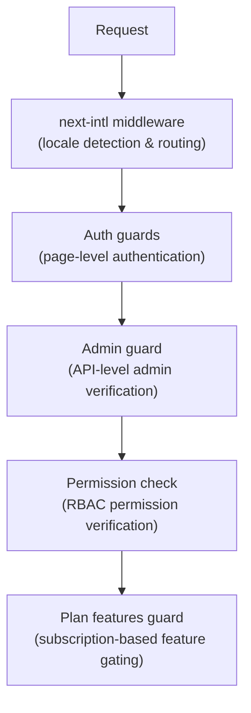

# الوسيطة والحراس

يستخدم قالب Ever Works نظام حماية متعدد الطبقات يتكون من برنامج Next.js الوسيط للتوجيه، ووحدات حماية المصادقة لحماية الصفحة وواجهة برمجة التطبيقات، وعمليات التحقق من الأذونات لـ RBAC، ووحدات حماية الميزات المستندة إلى الخطة لبوابة الاشتراك.

## طبقات الوسيطة



## البرامج الوسيطة المحلية (التالي-intl)

تتعامل البرامج الوسيطة الجذرية مع توجيه التدويل عبر `next-intl`. تم تكوينه من خلال `i18n/routing.ts` و`i18n/request.ts`.

المسؤوليات:
- اكتشف لغة المستخدم من مسار URL أو ملفات تعريف الارتباط أو `Accept-Language` الرأس
- إعادة توجيه الطلبات التي لا تحتوي على بادئة محلية إلى اللغة المناسبة
- الافتراضي هو اللغة الإنجليزية (`en`) عند عدم اكتشاف أي تفضيل
- دعم 6 لغات: `en`، `fr`، `es`، `de`، `ar`، `zh`

## حراس المصادقة

### حراس مستوى الصفحة (`lib/auth/guards.ts`)

توفر وحدة الحراس عمليات التحقق من المصادقة من جانب الخادم للصفحات. يتم استدعاؤها في الجزء العلوي من مكونات الخادم لحماية الوصول إلى الصفحة.

**`requireAuth()`** -- يتطلب مصادقة المستخدم:

```typescript
import { requireAuth } from '@/lib/auth/guards';

export default async function ProtectedPage() {
  const session = await requireAuth();
  // session.user is guaranteed to exist here
  return <div>Welcome {session.user.email}</div>;
}
```

إذا لم تتم مصادقة المستخدم، فسيتم إعادة توجيهه إلى `/auth/signin`.

**`requireAdmin()`** -- يتطلب مصادقة المستخدم والحصول على دور المسؤول:

```typescript
import { requireAdmin } from '@/lib/auth/guards';

export default async function AdminPage() {
  const session = await requireAdmin();
  return <div>Admin: {session.user.email}</div>;
}
```

إذا لم تتم مصادقة المستخدم، فسيتم إعادة توجيهه إلى `/admin/auth/signin`. إذا تمت مصادقتهم ولكن ليس المسؤول، فسيتم إعادة توجيههم إلى `/unauthorized`.

**`getSession()`** - الحصول على الجلسة دون إعادة التوجيه:

```typescript
const session = await getSession();
if (session) {
  // Authenticated
} else {
  // Guest
}
```

**`checkIsAdmin()`** - التحقق من حالة المسؤول دون إعادة التوجيه:

```typescript
const isAdmin = await checkIsAdmin();
// Returns true or false
```

### الإجراءات التي تم التحقق منها (`lib/auth/guards.ts`)

توفر وحدة الحراس أيضًا مغلفات إجراءات تم التحقق من صحتها لإجراءات خادم Next.js:

**`validatedAction(schema, action)`** - التحقق من صحة بيانات النموذج مقابل مخطط Zod:

```typescript
export const myAction = validatedAction(mySchema, async (data, formData) => {
  // data is validated and typed
});
```

**`validatedActionWithUser(schema, action)`** - للتحقق من الصحة ويتطلب المصادقة:

```typescript
export const myAction = validatedActionWithUser(mySchema, async (data, formData, user) => {
  // data is validated, user is authenticated
});
```

## حارس المشرف (`lib/auth/admin-guard.ts`)

يوفر حارس المشرف حماية مسار واجهة برمجة التطبيقات (API) خصيصًا لنقاط النهاية الإدارية.

**`checkAdminAuth()`** - وظيفة البرامج الوسيطة لمسارات واجهة برمجة التطبيقات:

```typescript
import { checkAdminAuth } from '@/lib/auth/admin-guard';

export async function GET(request: NextRequest) {
  const authError = await checkAdminAuth();
  if (authError) return authError;

  // User is verified admin, proceed with handler
}
```

يُرجع `null` إذا كان مصرحًا به، أو `NextResponse` بحالة الخطأ المناسبة (401 أو 403).

**`withAdminAuth(handler)`** - غلاف دالة ذات ترتيب أعلى:

```typescript
import { withAdminAuth } from '@/lib/auth/admin-guard';

export const GET = withAdminAuth(async (request) => {
  // Already verified as admin
  return NextResponse.json({ data: 'admin only' });
});
```

يتحقق حارس المسؤول من المصادقة (الجلسة موجودة) والترخيص (يتمتع المستخدم بدور المسؤول في قاعدة البيانات عبر التحقق `isAdmin()`).

## نظام فحص الأذونات (`lib/middleware/permission-check.ts`)

يطبق نظام الأذونات التحكم في الوصول المستند إلى الأدوار (RBAC) بأذونات تفصيلية.

### هيكل الإذن

تتبع الأذونات تنسيق `resource:action`:

```typescript
// Examples of permission keys
'items:read'
'items:create'
'items:update'
'items:delete'
'items:review'
'items:approve'
'items:reject'
'categories:read'
'categories:create'
'users:assignRoles'
'analytics:read'
'system:settings'
```

### وظائف التحقق من الأذونات

```typescript
import {
  hasPermission,
  hasAnyPermission,
  hasAllPermissions,
  hasResourcePermission,
  canManageResource,
  canReviewItems,
  canManageUsers,
  canManageRoles,
  canViewAnalytics,
  isSuperAdmin,
} from '@/lib/middleware/permission-check';

// Single permission check
hasPermission(userPermissions, 'items:create');

// Any of multiple permissions
hasAnyPermission(userPermissions, ['items:create', 'items:update']);

// All permissions required
hasAllPermissions(userPermissions, ['items:read', 'items:update']);

// Resource-level check
hasResourcePermission(userPermissions, 'items', 'create');

// Domain-specific helpers
canManageResource(userPermissions, 'categories'); // create, update, or delete
canReviewItems(userPermissions);                  // review, approve, or reject
canManageUsers(userPermissions);                  // user CRUD + assignRoles
isSuperAdmin(userPermissions);                    // all system permissions
```

### كشف المشرف الفائق

تتحقق الدالة `isSuperAdmin()` من شرطين:
1. ما إذا كان المستخدم لديه الدور `super-admin` (المفضل)
2. كإجراء احتياطي، ما إذا كان المستخدم لديه كافة أذونات النظام

### التحقق من صحة الإذن

```typescript
// Validate a permission string is defined in the system
validatePermission('items:create'); // true
validatePermission('invalid:perm'); // false

// Parse permission into resource and action
parsePermission('items:create'); // { resource: 'items', action: 'create' }
```

## ميزات الخطة الحراسة (`lib/guards/plan-features.guard.ts`)

تتميز الخطة بإمكانية الوصول إلى ميزات عناصر التحكم في الحراسة بناءً على خطط الاشتراك (مجانية، قياسية، مميزة).

### التسلسل الهرمي للخطة

```typescript
const PLAN_LEVELS = {
  free: 1,
  standard: 2,
  premium: 3,
};
```

### مصفوفة الوصول إلى الميزات

يتم تعيين كل ميزة للخطط التي يمكنها الوصول إليها:

|ميزة|مجاني|قياسي|قسط|
|---------|------|----------|---------|
|إرسال المنتج|نعم|نعم|نعم|
|تحميل الصور|نعم|نعم|نعم|
|دعم البريد الإلكتروني|نعم|نعم|نعم|
|وصف موسع| - |نعم|نعم|
|شارة التحقق| - |نعم|نعم|
|مراجعة الأولوية| - |نعم|نعم|
|عرض الإحصائيات| - |نعم|نعم|
|تحميل الفيديو| - | - |نعم|
|شارة برعاية| - | - |نعم|
|الصفحة الرئيسية مميزة| - | - |نعم|
|التحليلات المتقدمة| - | - |نعم|
|تقديمات غير محدودة| - | - |نعم|

### حدود الخطة

تحتوي كل خطة على حدود رقمية لميزات معينة:

|الحد|مجاني|قياسي|قسط|
|-------|------|----------|---------|
|صور ماكس| 1 | 5 |غير محدود|
|ماكس وصف الكلمات| 200 | 500 |غير محدود|
|ماكس التقديمات| 1 | 10 |غير محدود|
|أيام المراجعة| 7 | 3 | 1 |
|أيام التعديل المجانية| 0 | 30 | 365 |

### استخدام حارس الخطة

**استدعاءات الوظائف المباشرة:**

```typescript
import { canAccessFeature, getFeatureLimit, isWithinLimit } from '@/lib/guards';

canAccessFeature('upload_video', 'free');    // false
canAccessFeature('upload_video', 'premium'); // true
getFeatureLimit('max_images', 'standard');   // 5
isWithinLimit('max_submissions', 3, 'free'); // false (limit is 1)
```

** مصنع الحراسة (للفحوصات المتعددة): **

```typescript
import { createPlanGuard } from '@/lib/guards';

const guard = createPlanGuard('standard');
guard.canAccess('verified_badge');     // true
guard.canAccess('upload_video');       // false
guard.getLimit('max_images');          // 5
guard.requireFeature('upload_video');  // throws PlanGuardError
```

** رد فعل التكامل هوك: **

```typescript
import { createPlanGuardResult } from '@/lib/guards';

// In a hook or component
const guardResult = createPlanGuardResult(userPlan);
guardResult.canAccess('verified_badge');
guardResult.accessibleFeatures; // array of all accessible features
```

يتضمن `PlanGuardError` الذي تم طرحه بواسطة `requireFeature()` اسم الميزة، والخطة الحالية للمستخدم، والخطة المطلوبة، مما يتيح مطالبات الترقية الإعلامية في واجهة المستخدم.
