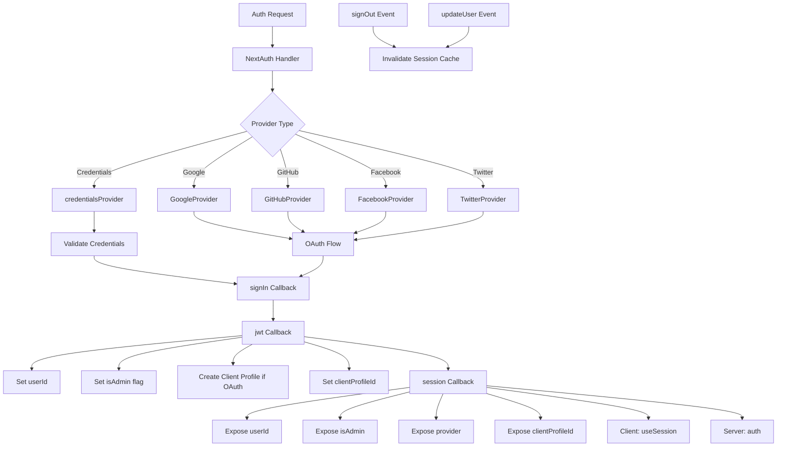

# تكوين المصادقة التالية

## نظرة عامة

يقوم قالب Ever Works بتكوين NextAuth.js (Auth.js v5) مع الجلسات المستندة إلى JWT، ومحول Drizzle ORM، وموفري OAuth المتعددين (Google، وGitHub، وFacebook، وTwitter)، والمصادقة المستندة إلى بيانات الاعتماد، وعمليات رد الاتصال المخصصة لإدارة دور المسؤول/العميل. يدعم النظام إنشاء ملف تعريف العميل تلقائيًا لمستخدمي OAuth والتخزين المؤقت للجلسة مع إبطال ذاكرة التخزين المؤقت.

## الهندسة المعمارية



## ملفات المصدر

|ملف|الغرض|
|------|---------|
|`template/lib/auth/index.ts`|تكوين NextAuth الرئيسي والصادرات|
|`template/auth.config.ts`|تكوين الموفر (متوافق مع Edge)|
|`template/lib/auth/config.ts`|اختيار نوع موفر المصادقة|
|`template/lib/auth/providers.ts`|وظائف مصنع موفر OAuth|
|`template/lib/auth/credentials.ts`|تنفيذ مزود بيانات الاعتماد|
|`template/lib/auth/guards.ts`|أدوات حماية المصادقة من جانب الخادم|
|`template/lib/auth/middleware.ts`|مغلفات العمل التي تم التحقق منها|
|`template/lib/auth/setup.ts`|مساعد تهيئة المصادقة|
|`template/lib/auth/cached-session.ts`|إدارة ذاكرة التخزين المؤقت للجلسة|
|`template/lib/auth/session-cache.ts`|تنفيذ ذاكرة التخزين المؤقت للجلسة|
|`template/lib/auth/admin-guard.ts`|منطق الحماية الخاص بالمسؤول|

## تهيئة المصادقة التالية

```typescript
// lib/auth/index.ts
export const { handlers, auth, signIn, signOut, unstable_update } = NextAuth({
    adapter: drizzle,
    session: {
        strategy: 'jwt',
        maxAge: 30 * 24 * 60 * 60,    // 30 days
        updateAge: 24 * 60 * 60        // Refresh every 24 hours
    },
    jwt: {
        maxAge: 30 * 24 * 60 * 60      // 30 days
    },
    callbacks: { authorized, redirect, signIn, jwt, session },
    events: { signOut, updateUser },
    pages: {
        signIn: '/auth/signin',
        signOut: '/auth/signout',
        error: '/auth/error',
        verifyRequest: '/auth/verify-request',
        newUser: '/auth/register'
    },
    ...authConfig  // Merges providers from auth.config.ts
});
```

### استراتيجية الجلسة

يستخدم القالب **جلسات JWT** (`strategy: 'jwt'`)، وليس جلسات قاعدة البيانات. هذا يعني:
- يتم تخزين الجلسات في ملفات تعريف الارتباط المشفرة، وليس في قاعدة البيانات
- ليس هناك حاجة إلى استعلام قاعدة البيانات للتحقق من صحة الجلسة
- متوافق مع Edge Runtime (البرامج الوسيطة)
- تقتصر بيانات الجلسة على ما يناسب رمز JWT

## محول قاعدة البيانات

```typescript
const isDatabaseAvailable = !!coreConfig.DATABASE_URL && typeof db !== 'undefined';

const drizzle = isDatabaseAvailable
    ? DrizzleAdapter(getDrizzleInstance(), {
        usersTable: users,
        accountsTable: accounts,
        sessionsTable: sessions,
        verificationTokensTable: verificationTokens
    })
    : undefined;
```

يتم إنشاء المحول بشكل مشروط بناءً على توفر قاعدة البيانات. يسمح هذا للقالب بالبدء حتى بدون قاعدة بيانات (على سبيل المثال، أثناء الإعداد الأولي)، على الرغم من أن المصادقة ستكون محدودة.

## تكوين الموفر

### auth.config.ts (متوافق مع الحافة)

```typescript
// auth.config.ts
const configureProviders = () => {
    try {
        const oauthProviders = configureOAuthProviders();
        return createNextAuthProviders({
            google: oauthProviders.find((p) => p.id === 'google')
                ? { enabled: true, clientId: '...', clientSecret: '...' }
                : { enabled: false },
            github: { /* ... */ },
            facebook: { /* ... */ },
            twitter: { /* ... */ },
            credentials: { enabled: true },
        });
    } catch (error) {
        // Fallback to credentials only
        return createNextAuthProviders({
            credentials: { enabled: true },
            google: { enabled: false },
            github: { enabled: false },
            facebook: { enabled: false },
            twitter: { enabled: false },
        });
    }
};

export default {
    trustHost: true,
    providers: configureProviders(),
} satisfies NextAuthConfig;
```

### مصنع المزود

```typescript
// lib/auth/providers.ts
export function createNextAuthProviders(config: OAuthProvidersConfig) {
    const providers = [];

    if (config.google?.enabled && config.google.clientId && config.google.clientSecret) {
        providers.push(GoogleProvider({
            clientId: config.google.clientId,
            clientSecret: config.google.clientSecret,
            ...config.google.options,
        }));
    }
    // GitHub, Facebook, Twitter follow the same pattern...

    if (config.credentials?.enabled) {
        providers.push(credentialsProvider);
    }

    return providers;
}
```

تتم إضافة الموفرين فقط عندما يكون لديهم بيانات اعتماد صالحة، مما يمنع أخطاء التكوين عند بدء التشغيل.

## عمليات الاسترجاعات

### رد اتصال تسجيل الدخول

```typescript
signIn: async ({ user, account, profile }) => {
    const isCredentials = account?.provider === 'credentials';

    if (!user?.email) {
        return !isCredentials; // Allow OAuth without email
    }

    if (!isDatabaseAvailable) {
        return !isCredentials; // Skip DB validation if no DB
    }

    // For OAuth providers, allow account linking
    if (!isCredentials && account?.provider) {
        return true;
    }

    return true;
}
```

### رد الاتصال jwt

رد الاتصال JWT هو جوهر مسار المصادقة. يعمل على كل طلب ويدير:

```typescript
jwt: async ({ token, user, account }) => {
    // 1. Set userId from user object or token.sub
    if (user?.id) token.userId = user.id;
    if (!token.userId && token.sub) token.userId = token.sub;

    // 2. Set clientProfileId
    if (user?.clientProfileId) token.clientProfileId = user.clientProfileId;

    // 3. Record provider
    if (account?.provider) token.provider = account.provider;

    // 4. Auto-create client profile for OAuth users
    if (isOAuthProvider && !token.clientProfileId && token.userId) {
        let clientProfile = await getClientProfileByUserId(token.userId);
        if (!clientProfile) {
            clientProfile = await createClientProfile({
                userId: token.userId,
                email: token.email,
                name: token.name || token.email?.split('@')[0],
            });
        }
        token.clientProfileId = clientProfile?.id;
    }

    // 5. Set isAdmin flag
    if (user?.isClient !== undefined) {
        token.isAdmin = !user.isClient;
    } else if (user?.isAdmin !== undefined) {
        token.isAdmin = user.isAdmin;
    } else if (token.isAdmin === undefined) {
        token.isAdmin = false; // Default: non-admin
    }

    return token;
}
```

### رد اتصال الجلسة

قم بتعيين حقول رمز JWT إلى كائن الجلسة المكشوف لمكونات العميل:

```typescript
session: async ({ session, token }) => {
    if (token && session.user) {
        session.user.id = token.userId;
        session.user.clientProfileId = token.clientProfileId;
        session.user.provider = token.provider || 'credentials';
        session.user.isAdmin = token.isAdmin;
    }
    return session;
}
```

## الأحداث

### إبطال ذاكرة التخزين المؤقت للجلسة

```typescript
events: {
    signOut: async (event) => {
        const token = 'token' in event ? event.token : undefined;
        if (token?.userId) {
            await invalidateSessionCache(undefined, token.userId);
        }
    },
    updateUser: async ({ user }) => {
        if (user?.id) {
            await invalidateSessionCache(undefined, user.id);
        }
    }
}
```

يؤدي كل من الحدثين `signOut` و`updateUser` إلى إبطال ذاكرة التخزين المؤقت للجلسة، مما يضمن عدم تقديم بيانات الجلسة القديمة بعد تغيير حالة المصادقة.

## حراس جانب الخادم

### يتطلب المصادقة

```typescript
export async function requireAuth() {
    const session = await auth();
    if (!session?.user) {
        redirect('/auth/signin');
    }
    return session;
}
```

### requireAdmin

```typescript
export async function requireAdmin() {
    const session = await auth();
    if (!session?.user) {
        redirect('/admin/auth/signin');
    }
    if (!session.user.isAdmin) {
        redirect('/unauthorized');
    }
    return session;
}
```

### حراس المرافق

```typescript
// Check without redirecting
export async function getSession() {
    return await auth();
}

export async function checkIsAdmin() {
    const session = await auth();
    return session?.user?.isAdmin === true;
}
```

## الصفحات المخصصة

|الصفحة|المسار|الغرض|
|------|------|---------|
|تسجيل الدخول|`/auth/signin`|نموذج تسجيل الدخول|
|تسجيل الخروج|`/auth/signout`|تأكيد الخروج|
|خطأ|`/auth/error`|عرض خطأ المصادقة|
|التحقق من الطلب|`/auth/verify-request`|مطالبة التحقق من البريد الإلكتروني|
|سجل|`/auth/register`|تسجيل مستخدم جديد|

## متغيرات البيئة

|متغير|مطلوب|الغرض|
|----------|----------|---------|
|`AUTH_SECRET`|نعم|سر تشفير JWT|
|`AUTH_GOOGLE_ID`|لا|معرف عميل Google OAuth|
|`AUTH_GOOGLE_SECRET`|لا|سر عميل Google OAuth|
|`AUTH_GITHUB_ID`|لا|معرف عميل GitHub OAuth|
|`AUTH_GITHUB_SECRET`|لا|سر عميل GitHub OAuth|
|`AUTH_FACEBOOK_ID`|لا|معرف عميل Facebook OAuth|
|`AUTH_FACEBOOK_SECRET`|لا|سر عميل Facebook OAuth|
|`AUTH_TWITTER_ID`|لا|معرف عميل Twitter/X OAuth|
|`AUTH_TWITTER_SECRET`|لا|سر عميل Twitter/X OAuth|
|`DATABASE_URL`|للمحول|سلسلة اتصال قاعدة البيانات|

## أفضل الممارسات

1. **استخدم إستراتيجية JWT** للتوافق مع Edge Runtime في البرامج الوسيطة
2. **إنشاء ملفات تعريف العميل تلقائيًا** لمستخدمي OAuth في رد اتصال JWT
3. **تدهور سلس** -- إذا فشل تكوين OAuth، فارجع إلى بيانات الاعتماد فقط
4. **إبطال ذاكرة التخزين المؤقت في أحداث المصادقة** - تسجيل الخروج وتحديث المستخدم لمسح الجلسات المخزنة مؤقتًا
5. **المحول الشرطي** -- يسمح ببدء التشغيل بدون قاعدة بيانات للتكوين الأولي
6. **وظائف الحراسة** - استخدم `requireAuth()` / `requireAdmin()` في مكونات الخادم، وليس في عمليات فحص الجلسة اليدوية
7. **الصفحات المخصصة** - تجاوز صفحات NextAuth الافتراضية للحصول على واجهة مستخدم متسقة مع تصميم القالب
