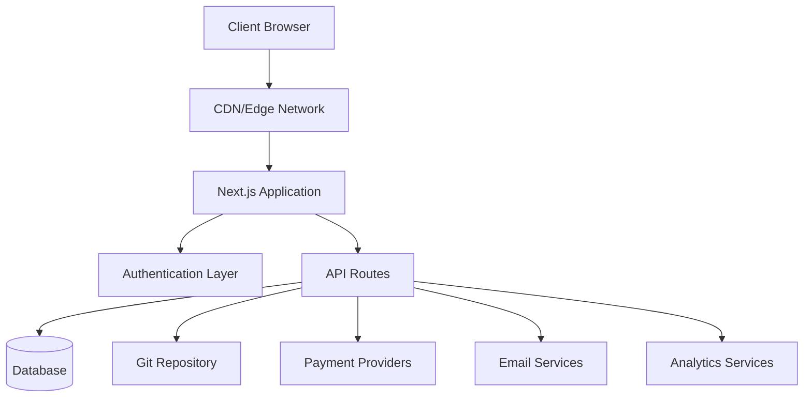
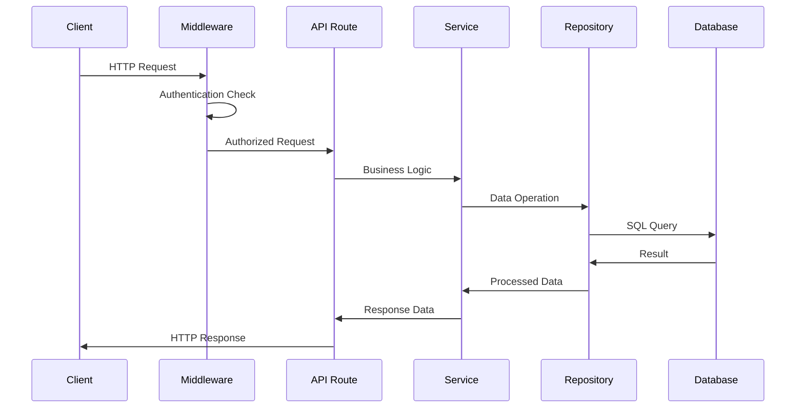
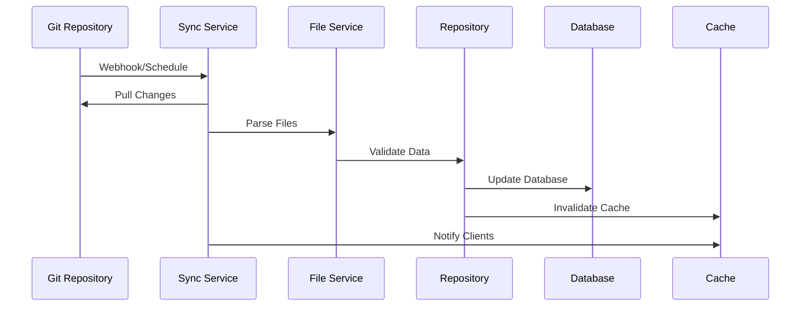
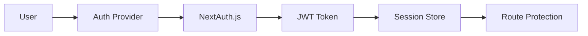

# نظرة عامة على الهندسة المعمارية

يتبع Ever Works بنية حديثة وقابلة للتطوير مصممة لتحقيق الأداء وقابلية الصيانة وتجربة المطور.

## العمارة عالية المستوى



## المبادئ الأساسية

### 1. فصل الاهتمامات
- **طبقة العرض التقديمي**: مكونات التفاعل ومنطق واجهة المستخدم
- **طبقة الأعمال**: الخدمات والمستودعات
- **طبقة البيانات**: قاعدة البيانات وواجهات برمجة التطبيقات الخارجية

### 2. تصميم وحدات
- التنظيم القائم على الميزات
- مكونات قابلة لإعادة الاستخدام
- التكاملات الشبيهة بالمكونات الإضافية

### 3. اكتب السلامة
- TypeScript طوال الوقت
- فحص صارم للنوع
- التحقق من صحة وقت التشغيل مع Zod

### 4. الأداء أولاً
- التقديم من جانب الخادم
- توليد ثابت حيثما أمكن ذلك
- استراتيجيات التخزين المؤقت الأمثل

## طبقات التطبيق

### طبقة الواجهة الأمامية

**التكنولوجيا**: React 19 + Next.js 15
** المسؤوليات **:
- تقديم واجهة المستخدم
- إدارة الحالة من جانب العميل
- تفاعلات المستخدم
- التعامل مع الطريق

**المكونات الرئيسية**:
- مكونات الصفحة (`app/[locale]/`)
- مكونات واجهة المستخدم القابلة لإعادة الاستخدام (`components/`)
- خطافات مخصصة (`hooks/`)
- موفرو السياق (`components/providers/`)

### طبقة واجهة برمجة التطبيقات

**التكنولوجيا**: مسارات واجهة برمجة تطبيقات Next.js
** المسؤوليات **:
- تنفيذ منطق الأعمال
- التحقق من صحة البيانات
- تكامل الخدمات الخارجية
- معالجة المصادقة

**الهيكل**:
```
app/api/
├── auth/           # Authentication endpoints
├── admin/          # Admin-only endpoints
├── items/          # Item management
└── webhooks/       # External service webhooks
```

### طبقة البيانات

**التقنيات**: Drizzle ORM + PostgreSQL
** المسؤوليات **:
- ثبات البيانات
- تحسين الاستعلام
- إدارة المعاملات
- ترحيل المخططات

**المكونات**:
- مخطط قاعدة البيانات (`lib/db/schema.ts`)
- المستودعات (`lib/repositories/`)
- ملفات الترحيل (`lib/db/migrations/`)

### طبقة المحتوى

**التكنولوجيا**: نظام إدارة المحتوى القائم على Git
** المسؤوليات **:
- مزامنة المحتوى
- التحكم في الإصدار
- التحرير التعاوني
- التحقق من صحة المحتوى

**الهيكل**:
```
.content/
├── config.yml      # Site configuration
├── items/          # Item definitions
├── categories/     # Category definitions
└── tags/           # Tag definitions
```

## أنماط التصميم

### 1. نمط المستودع

ملخصات منطق الوصول إلى البيانات:

```typescript
interface ItemRepository {
  findById(id: string): Promise<Item | null>;
  findBySlug(slug: string): Promise<Item | null>;
  findWithFilters(filters: ItemFilters): Promise<Item[]>;
  create(item: CreateItemRequest): Promise<Item>;
  update(id: string, updates: UpdateItemRequest): Promise<Item>;
  delete(id: string): Promise<void>;
}
```

### 2. نمط طبقة الخدمة

يلخص منطق الأعمال:

```typescript
class ItemService {
  constructor(
    private itemRepository: ItemRepository,
    private gitService: GitService,
    private notificationService: NotificationService
  ) {}

  async submitItem(data: SubmitItemRequest): Promise<SubmissionResult> {
    // Business logic here
  }
}
```

### 3. نمط المصنع

إنشاء مثيلات الخدمة:

```typescript
class PaymentProviderFactory {
  static create(provider: PaymentProvider): PaymentService {
    switch (provider) {
      case 'stripe':
        return new StripePaymentService();
      case 'lemonsqueezy':
        return new LemonSqueezyPaymentService();
      default:
        throw new Error(`Unsupported provider: ${provider}`);
    }
  }
}
```

### 4. نمط المراقب

التحديثات المستندة إلى الأحداث:

```typescript
class ContentSyncService {
  private observers: ContentObserver[] = [];

  addObserver(observer: ContentObserver): void {
    this.observers.push(observer);
  }

  notifyObservers(event: ContentEvent): void {
    this.observers.forEach(observer => observer.update(event));
  }
}
```

## تدفق البيانات

### 1. تدفق الطلب



### 2. تدفق مزامنة المحتوى



## العمارة الأمنية

### 1. تدفق المصادقة



### 2. طبقات التفويض

- **مستوى المسار**: حماية البرامج الوسيطة
- **مستوى واجهة برمجة التطبيقات**: حراس نقطة النهاية
- **مستوى البيانات**: الأمان على مستوى الصف
- **مستوى واجهة المستخدم**: التحكم في الوصول القائم على المكونات

### 3. التدابير الأمنية

- **التحقق من صحة الإدخال**: مخططات Zod
- **حقن SQL**: استعلامات ذات معلمات
- **حماية XSS**: تعقيم المحتوى
- **حماية CSRF**: التحقق من صحة الرمز المميز
- **تحديد السعر**: تقييد الطلب

## استراتيجية التخزين المؤقت

### 1. ذاكرة التخزين المؤقت للتطبيق

- **استعلام الرد**: ذاكرة التخزين المؤقت للبيانات من جانب العميل
- **Next.js Cache**: ذاكرة التخزين المؤقت لمسار الصفحة وواجهة برمجة التطبيقات
- **الإنشاء الثابت**: الصفحات المعدة مسبقًا

### 2. ذاكرة التخزين المؤقت لقاعدة البيانات

- **تجميع الاتصالات**: اتصالات قاعدة بيانات فعالة
- **تحسين الاستعلام**: الاستعلامات المفهرسة
- **قراءة النسخ المتماثلة**: عمليات القراءة الموزعة

### 3. ذاكرة التخزين المؤقت لـ CDN

- **الأصول الثابتة**: الصور، CSS، JS
- **استجابات واجهة برمجة التطبيقات**: نقاط نهاية قابلة للتخزين المؤقت
- **مواقع الحافة**: التوزيع العالمي

## اعتبارات قابلية التوسع

### 1. التحجيم الأفقي

- **تصميم عديم الحالة**: لا توجد جلسات من جانب الخادم
- **تحجيم قاعدة البيانات**: قراءة النسخ المتماثلة والتقسيم
- ** توزيع CDN **: التخزين المؤقت العالمي

### 2. تحسين الأداء

- **تقسيم الكود**: الواردات الديناميكية
- **تحسين الصورة**: مكون الصورة Next.js
- **تحسين الحزمة**: هز الشجرة وتصغيرها

### 3. الرصد والملاحظة

- **تتبع الأخطاء**: تكامل الحراسة
- **مراقبة الأداء**: مؤشرات أداء الويب الأساسية
- ** التحليلات **: تكامل PostHog
- ** التسجيل **: التسجيل المنظم

## قرارات التكنولوجيا

### لماذا Next.js؟
- **إطار عمل متكامل**: مسارات واجهة برمجة التطبيقات + الواجهة الأمامية
- **الأداء**: SSR، SSG، وISR
- **تجربة المطور**: إعادة التحميل السريع، دعم TypeScript
- **النظام البيئي**: نظام بيئي غني بالمكونات الإضافية

### لماذا رذاذ ORM؟
- **أمان النوع**: دعم كامل لـ TypeScript
- **الأداء**: الحد الأدنى من النفقات العامة
- **المرونة**: SQL الخام عند الحاجة
- **نظام الترحيل**: تغييرات المخطط التي يتم التحكم فيها بالإصدار

### لماذا نظام إدارة المحتوى المعتمد على Git؟
- **التحكم في الإصدار**: تتبع السجل الكامل
- **التعاون**: سحب سير عمل الطلب
- **النسخ الاحتياطي**: موزع حسب الطبيعة
- **المرونة**: أي مزود Git

### لماذا الرد على الاستعلام؟
- **التخزين المؤقت**: إدارة ذاكرة التخزين المؤقت الذكية
- **المزامنة**: تحديثات الخلفية
- **تحديثات متفائلة**: تجربة مستخدم أفضل
- **معالجة الأخطاء**: إعادة محاولة المنطق

## نقاط التمديد

توفر البنية عدة نقاط امتداد:

### 1. موفري المصادقة المخصصة
```typescript
// lib/auth/providers/custom-provider.ts
export function CustomProvider(options: CustomProviderOptions) {
  return {
    id: "custom",
    name: "Custom Provider",
    type: "oauth",
    // Implementation
  }
}
```

### 3. تكامل مصدر المحتوى
```typescript
// lib/content/sources/custom-source.ts
export class CustomContentSource implements ContentSource {
  async sync(): Promise<SyncResult> {
    // Implementation
  }
}
```

## الخطوات التالية

- [استكشف المكدس التقني](./tech-stack) بالتفصيل
