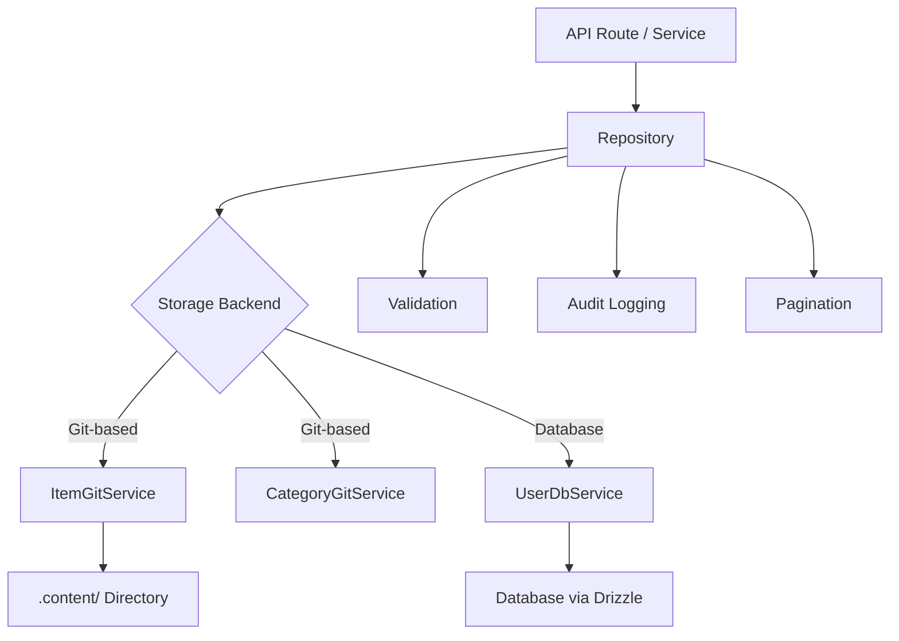

# أنماط المستودعات

يطبق القالب نمط المستودع لتوفير طبقة وصول نظيفة للبيانات بين منطق الأعمال وتخزين البيانات. تقوم المستودعات بتغليف بناء الاستعلام والتحقق من الصحة وترقيم الصفحات وتسجيل التدقيق أثناء تفويض التخزين الفعلي للخدمات الأساسية (المستندة إلى Git أو المدعومة بقاعدة البيانات).

## نظرة عامة على الهندسة المعمارية



## ملفات المصدر

|ملف|الغرض|
|------|---------|
|`lib/repositories/item.repository.ts`|العنصر CRUD مع تخزين Git وتصفيته ومراجعته|
|`lib/repositories/category.repository.ts`|إدارة الفئات مع تخزين Git|
|`lib/repositories/user.repository.ts`|عمليات المستخدم مع تخزين قاعدة البيانات|
|`lib/repositories/tag.repository.ts`|إدارة العلامات|
|`lib/repositories/role.repository.ts`|إدارة الدور|
|`lib/repositories/collection.repository.ts`|إدارة التحصيل|
|`lib/repositories/sponsor-ad.repository.ts`|إدارة إعلانات الراعي|
|`lib/repositories/client-item.repository.ts`|عمليات العناصر التي تواجه العميل|
|`lib/repositories/client-dashboard.repository.ts`|بيانات لوحة تحكم العميل|
|`lib/repositories/admin-stats.repository.ts`|إحصائيات المشرف|
|`lib/repositories/admin-analytics-optimized.repository.ts`|استعلامات التحليلات الأمثل|
|`lib/repositories/integration-mapping.repository.ts`|مخططات التكامل الخارجي|
|`lib/repositories/twenty-crm-config.repository.ts`|عشرين تكوين CRM|

## طرق المستودع المشتركة

تتبع جميع المستودعات سطح واجهة برمجة التطبيقات (API) المتسق:

|الطريقة|الوصف|
|--------|-------------|
|`findAll(options?)`|استرداد كافة السجلات مع التصفية الاختيارية|
|`findAllPaginated(page, limit, options?)`|استرجاع مرقّم الصفحات|
|`findById(id)`|ابحث عن سجل واحد حسب المعرف|
|`findBySlug(slug)`|العثور على سجل واحد عن طريق سبيكة|
|`create(data)`|إنشاء سجل جديد مع التحقق من الصحة|
|`update(id, data)`|تحديث سجل موجود مع التحقق من الصحة|
|`delete(id)`|من الصعب حذف سجل|
|`getStats()`|الحصول على إحصائيات مجمعة|

## ItemRepository

المستودع الأكثر شمولاً، والذي يوضح جميع الأنماط الرئيسية.

### تهيئة الخدمة البطيئة

تتم تهيئة خدمة Git بتكاسل عند الاستخدام الأول:

```typescript
export class ItemRepository {
  private gitService: ItemGitService | null = null;

  private async getGitService(): Promise<ItemGitService> {
    if (!this.gitService) {
      const dataRepo = coreConfig.content.dataRepository;
      const token = coreConfig.content.ghToken;
      // Parse GitHub URL, create service config
      this.gitService = await createItemGitService(config);
    }
    return this.gitService;
  }
}
```

### التصفية

يدعم الأسلوب `findAll` التصفية متعددة المعايير باستخدام منطق OR للمصفوفات:

```typescript
async findAll(options: ItemListOptions = {}): Promise<ItemData[]> {
  const items = await gitService.readItems(options.includeDeleted ?? false);
  let filteredItems = items;

  if (options.status)
    filteredItems = filteredItems.filter(item => item.status === options.status);

  if (options.categories?.length > 0)
    filteredItems = filteredItems.filter(item => {
      const itemCategories = Array.isArray(item.category) ? item.category : [item.category];
      return options.categories!.some(cat => itemCategories.includes(cat));
    });

  if (options.tags?.length > 0)
    filteredItems = filteredItems.filter(item =>
      options.tags!.some(tag => item.tags.includes(tag))
    );

  if (options.search) {
    const searchLower = options.search.toLowerCase();
    filteredItems = filteredItems.filter(item =>
      item.name.toLowerCase().includes(searchLower) ||
      item.description.toLowerCase().includes(searchLower)
    );
  }

  return filteredItems;
}
```

### ترقيم الصفحات

```typescript
async findAllPaginated(page = 1, limit = 10, options = {}): Promise<{
  items: ItemData[];
  total: number;
  page: number;
  limit: number;
  totalPages: number;
}> {
  return await gitService.getItemsPaginated(page, limit, options);
}
```

### تسجيل التدقيق

يتم تسجيل كافة العمليات المتغيرة في مسار التدقيق (أفضل جهد، وعدم الحظر):

```typescript
async create(data: CreateItemRequest, auditUser?: AuditUser): Promise<ItemData> {
  this.validateCreateData(data);
  const item = await gitService.createItem(data);

  try {
    await itemAuditService.logCreation(item, auditUser);
  } catch (err) {
    console.warn('Audit logCreation failed:', err);
  }

  return item;
}
```

أحداث التدقيق التي تم تسجيلها:

|العملية|طريقة التدقيق|تم التقاط البيانات|
|-----------|-------------|---------------|
|إنشاء|`logCreation`|عنصر جديد، المستخدم|
|تحديث|`logUpdate`|الحالة السابقة، الحالة الجديدة، المستخدم|
|مراجعة|`logReview`|العنصر، الحالة السابقة، الملاحظات، المستخدم|
|حذف|`logDeletion`|العنصر، المستخدم، العلم الناعم/الصلب|
|استعادة|`logRestoration`|العنصر، المستخدم|

### عمليات الدفعة

تعمل الطريقة `batchUpdate` على تحسين التحديثات المتعددة من خلال التزام Git واحد:

```typescript
async batchUpdate(updates: Array<{ id: string; data: UpdateItemRequest }>): Promise<ItemData[]> {
  // Pre-validate ALL updates before writing
  for (const { id, data } of updates) {
    this.validateUpdateData(id, data);
  }

  // Write each update without committing
  for (const { id, data } of updates) {
    await gitService.updateItemWithoutCommit(id, data);
  }

  // Single commit for all changes
  await gitService.commitAndPushBatch(`Batch update ${updates.length} items`);

  // Audit logging after successful commit
  for (const entry of auditEntries) {
    await itemAuditService.logUpdate(entry.previous, entry.updated, auditUser);
  }
}
```

### التحقق من الصحة

تقوم المستودعات بالتحقق من صحة الإدخال قبل عمليات التخزين:

```typescript
private validateCreateData(data: CreateItemRequest): void {
  if (!data.id?.trim())          throw new Error('Item ID is required');
  if (!data.name?.trim())        throw new Error('Item name is required');
  if (!data.slug?.trim())        throw new Error('Item slug is required');
  if (!data.description?.trim()) throw new Error('Item description is required');
  if (!data.source_url?.trim())  throw new Error('Item source URL is required');

  if (!/^[a-z0-9-]+$/.test(data.slug))
    throw new Error('Slug must contain only lowercase letters, numbers, and hyphens');

  try { new URL(data.source_url); }
  catch { throw new Error('Invalid source URL format'); }
}
```

### حذف واستعادة ناعمة

```typescript
async softDelete(id: string): Promise<ItemData> {
  return await gitService.softDeleteItem(id);
}

async restore(id: string): Promise<ItemData> {
  return await gitService.restoreItem(id);
}
```

## مستودع الفئة

يوضح نمط المفرد والتحقق المكرر:

```typescript
export class CategoryRepository {
  // Duplicate name checking (case-insensitive, excludes self for updates)
  private async checkDuplicateName(name: string, excludeId?: string): Promise<void> {
    const categories = await gitService.readCategories();
    const duplicate = categories.find(cat =>
      cat.name.toLowerCase() === name.toLowerCase() && cat.id !== excludeId
    );
    if (duplicate) throw new Error(`Category with name "${name}" already exists`);
  }

  // Sorting
  private sortCategories(categories, options): CategoryData[] {
    return categories.sort((a, b) => {
      const comparison = a.name.localeCompare(b.name);
      return options.sortOrder === 'desc' ? -comparison : comparison;
    });
  }
}

// Singleton export
export const categoryRepository = new CategoryRepository();
```

## مستودع المستخدم

يستخدم التخزين المدعوم بقاعدة البيانات عبر `UserDbService` مع التحقق من صحة Zod:

```typescript
export class UserRepository {
  private userDbService: UserDbService;

  async create(data: CreateUserRequest): Promise<AuthUserData> {
    // Zod schema validation
    const validatedData = userValidationSchema
      .pick({ email: true, password: true })
      .parse(data);

    // Uniqueness check
    const exists = await this.userDbService.emailExists(validatedData.email);
    if (exists) throw new Error('Email already in use');

    return await this.userDbService.createUser(validatedData);
  }
}
```

## استراتيجية التعامل مع الأخطاء

تتبع المستودعات نمطًا ثابتًا لمعالجة الأخطاء:

1. إعادة طرح أخطاء العمل المعروفة (على سبيل المثال، "البريد الإلكتروني قيد الاستخدام بالفعل")
2. تسجيل الأخطاء غير المعروفة وتغليفها برسائل عامة
3. يتم اكتشاف حالات فشل تسجيل التدقيق وتحذيرها، ولا يتم حظر العملية مطلقًا
