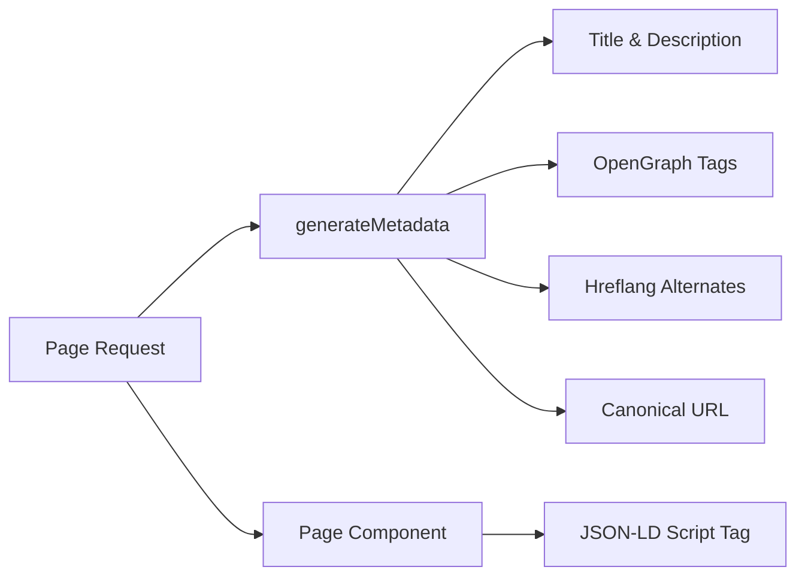

# نظام تحسين محركات البحث

يشتمل قالب Ever Works على نظام SEO شامل يقوم بإنشاء بيانات منظمة (JSON-LD)، وعلامات hreflang، وبيانات تعريف OpenGraph، وخرائط الموقع الديناميكية. جميع أدوات تحسين محركات البحث (SEO) موجودة تحت `lib/seo/` وتتكامل مع واجهة برمجة تطبيقات بيانات التعريف Next.js.

## نظرة عامة على الهندسة المعمارية



### ملفات المصدر

|ملف|الغرض|
|---|---|
|`lib/seo/schema.ts`|مولدات البيانات المنظمة JSON-LD|
|`lib/seo/hreflang.ts`|مولدات URL البديلة للغة|
|`lib/seo/listing-metadata.ts`|مصنع البيانات الوصفية لصفحة القائمة|

## البيانات المنظمة JSON-LD

تقوم الوحدة `lib/seo/schema.ts` بإنشاء بيانات Schema.org المنظمة لنتائج محرك البحث الغنية.

### مخطط المنتج

بالنسبة لصفحات تفاصيل العنصر، يتم إنشاء مخطط `Product`:

```typescript
import { generateProductSchema } from '@/lib/seo/schema';

const schema = generateProductSchema({
  name: 'My App',
  description: 'A productivity tool',
  image: 'https://example.com/icon.png',
  url: 'https://example.com/items/my-app',
  category: 'Productivity',
  sourceUrl: 'https://myapp.com',
  brandName: 'MyApp Inc.',
});
```

الناتج المتولد:

```json
{
  "@context": "https://schema.org",
  "@type": "Product",
  "name": "My App",
  "description": "A productivity tool",
  "image": "https://example.com/icon.png",
  "url": "https://example.com/items/my-app",
  "category": "Productivity",
  "brand": {
    "@type": "Brand",
    "name": "MyApp Inc."
  },
  "offers": {
    "@type": "Offer",
    "url": "https://myapp.com",
    "availability": "https://schema.org/InStock"
  }
}
```

### مخطط المنظمة

إنشاء مخطط `Organization` على مستوى الموقع لرؤية لوحة المعرفة:

```typescript
import { generateOrganizationSchema } from '@/lib/seo/schema';

const schema = generateOrganizationSchema();
```

يتضمن هذا المخطط:
- اسم العلامة التجارية وعنوان URL والشعار
- روابط الملف الشخصي الاجتماعي (مصفوفة`sameAs`) من `siteConfig.social`
- نقطة اتصال مع البريد الإلكتروني (عند تكوينها)

### مخطط موقع الويب مع SearchAction

لتمكين مربع البحث في روابط أقسام الموقع من Google:

```typescript
import { generateWebSiteSchema } from '@/lib/seo/schema';

const schema = generateWebSiteSchema('en');
// Includes potentialAction with SearchAction targeting /?q={search_term_string}
```

يحترم المخطط البادئات المحلية:
- اللغة الافتراضية: `https://example.com`
- لغات أخرى: `https://example.com/fr`

### مخطط التنقل

يُنشئ `BreadcrumbList` لنتائج البحث المتوافقة مع التنقل:

```typescript
import { generateBreadcrumbSchema } from '@/lib/seo/schema';

const schema = generateBreadcrumbSchema([
  { name: 'Home', url: 'https://example.com' },
  { name: 'Productivity', url: 'https://example.com/categories/productivity' },
  { name: 'My App', url: 'https://example.com/items/my-app' },
]);
```

### التضمين في الصفحات

تم تضمين JSON-LD باستخدام علامة `<script>` في مكون الصفحة:

```tsx
export default function ItemDetailPage({ item }) {
  const schema = generateProductSchema({ ... });

  return (
    <>
      <script
        type="application/ld+json"
        dangerouslySetInnerHTML={{ __html: JSON.stringify(schema) }}
      />
      <ItemDetail item={item} />
    </>
  );
}
```

## علامات هريفلانج

تقوم الوحدة `lib/seo/hreflang.ts` بإنشاء عناوين URL بديلة للغة لتحسين محركات البحث متعددة اللغات.

### نمط عنوان URL

يستخدم القالب نمط البادئة المحلية "حسب الحاجة":

|لغة|نمط عنوان URL|
|---|---|
|`en` (افتراضي)|`https://example.com/items/my-app`|
|`fr`|`https://example.com/fr/items/my-app`|
|`es`|`https://example.com/es/items/my-app`|
|`x-default`|نفس `en` (اللغة الافتراضية)|

### توليد البدائل

```typescript
import { generateHreflangAlternates } from '@/lib/seo/hreflang';

// For any page path
const alternates = generateHreflangAlternates('/about');
// Returns: { en: 'https://example.com/about', fr: 'https://example.com/fr/about', ... }

// Convenience functions for common page types
import { generateItemHreflangAlternates } from '@/lib/seo/hreflang';
const itemAlternates = generateItemHreflangAlternates('my-app');

import { generatePageHreflangAlternates } from '@/lib/seo/hreflang';
const pageAlternates = generatePageHreflangAlternates('about');
```

### التكامل مع البيانات الوصفية Next.js

```typescript
export async function generateMetadata({ params }) {
  const { locale, slug } = await params;
  return {
    alternates: {
      canonical: `https://example.com/${locale}/items/${slug}`,
      languages: generateItemHreflangAlternates(slug),
    },
  };
}
```

### تعيينات اللغة المدعومة

تم تعيين جميع اللغات التي يزيد عددها عن 20 لغة في `LOCALE_TO_HREFLANG`:

```
en -> en, fr -> fr, es -> es, de -> de, zh -> zh,
ar -> ar, he -> he, ru -> ru, uk -> uk, pt -> pt,
it -> it, ja -> ja, ko -> ko, nl -> nl, pl -> pl,
tr -> tr, vi -> vi, th -> th, hi -> hi, id -> id, bg -> bg
```

## البيانات الوصفية لصفحة القائمة

تقوم الوحدة `lib/seo/listing-metadata.ts` بإنشاء كائنات `Metadata` كاملة لصفحات القائمة والفئات.

### الاستخدام

```typescript
import { generateListingMetadata } from '@/lib/seo/listing-metadata';

export async function generateMetadata({ params }) {
  const { locale } = await params;
  return generateListingMetadata({
    title: 'Time Tracking Tools',
    description: 'Browse the best time tracking tools',
    path: '/categories/time-tracking',
    locale,
    itemCount: 42,
    keywords: ['time tracking', 'productivity', 'tools'],
    imageUrl: 'https://example.com/og/time-tracking.png',
  });
}
```

### بنية البيانات الوصفية التي تم إنشاؤها

تُنتج الدالة كائن Next.js `Metadata` كاملًا:

|الميدان|المصدر|
|---|---|
|`title`|`{العنوان} \|{اسم الموقع}`|
|`description`|مخصص أو تم إنشاؤه تلقائيًا من العنوان + عدد العناصر|
|`keywords`|انضم إلى مجموعة الكلمات الرئيسية|
|`openGraph.type`|`'website'`|
|`openGraph.siteName`|من `siteConfig.name`|
|`openGraph.url`|عنوان URL الأساسي مع اللغة|
|`openGraph.images`|عنوان URL للصورة الاختيارية|
|`twitter.card`|`'summary_large_image'`|
|`alternates.canonical`|عنوان URL الأساسي الكامل|
|`alternates.languages`|Hreflang بدائل لجميع اللغات|

## إنشاء صورة OpenGraph

يتم إنشاء صور OG الديناميكية باستخدام Next.js `ImageResponse` على مستويين:

|ملف|الطريق|الغرض|
|---|---|---|
|`app/opengraph-image.tsx`|`/opengraph-image`|صورة OG الافتراضية على مستوى الموقع|
|`app/[locale]/items/[slug]/opengraph-image.tsx`|`/items/{slug}/opengraph-image`|صورة OG ديناميكية لكل عنصر|

تستخدم هذه الملفات الوحدة `next/og` لعرض مكونات React كصور في وقت الطلب، مما يسمح بالنص الديناميكي والشعارات والعلامات التجارية.

## قائمة التحقق من تحسين محركات البحث

عند إضافة نوع صفحة جديد، تأكد من وجود عناصر تحسين محركات البحث التالية:

|العنصر|التنفيذ|
|---|---|
|عنوان الصفحة|`generateMetadata` بعنوان وصفي|
|الوصف التعريفي|وصف مخصص أو تم إنشاؤه تلقائيًا|
|عنوان URL الأساسي|تم التعيين في `alternates.canonical`|
|علامات Hreflang|استخدم `generateHreflangAlternates`|
|علامات OpenGraph|يتم تضمينه عبر `generateListingMetadata` أو يدويًا|
|بطاقة تويتر|اضبط `twitter.card` على `summary_large_image`|
|JSON-LD|أضف المخطط عبر `<script type="application/ld+json">`|
|فتات الخبز|استخدم `generateBreadcrumbSchema` للصفحات المتداخلة|

## أفضل الممارسات

1. **قم دائمًا بتعيين عناوين URL الأساسية** - يمنع مشكلات المحتوى المكررة عبر اللغات.
2. **تضمين hreflang لجميع اللغات** -- حتى إذا لم تتم ترجمة المحتوى بعد، فإن بنية عنوان URL تساعد محركات البحث.
3. **استخدم عناوين وصفية وفريدة** -- تجنب العناوين العامة مثل "الصفحة الرئيسية" بدون اسم الموقع.
4. **احتفظ بالأوصاف أقل من 160 حرفًا** - يتم اقتطاع الأوصاف الأطول في نتائج البحث.
5. **اختبر البيانات المنظمة** باستخدام أداة اختبار النتائج المنسّقة من Google قبل النشر.
6. **إنشاء صور OG ديناميكيًا** - الصور الاحتياطية الثابتة تفوت فرص العلامة التجارية الخاصة بالعنصر.
