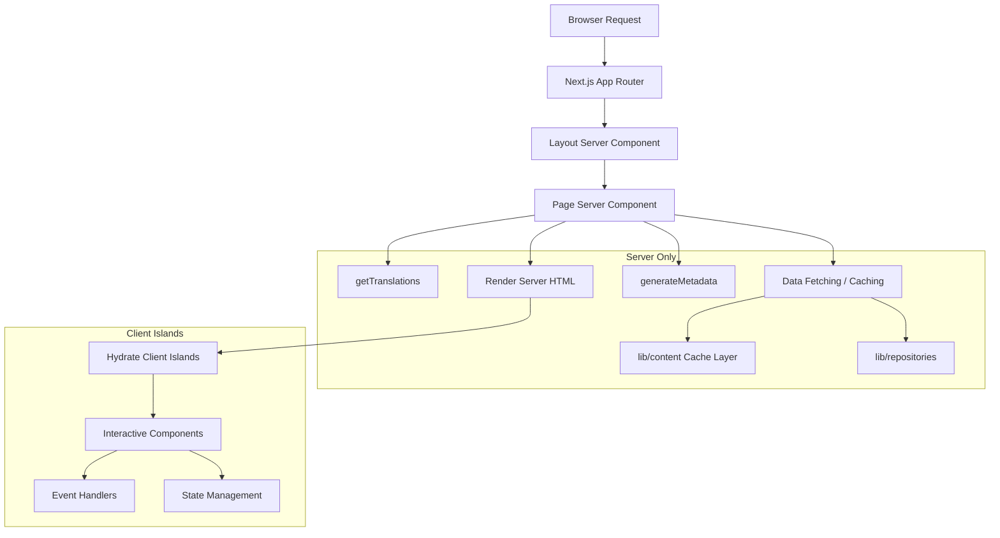

# أنماط مكونات الخادم

## نظرة عامة

يستفيد قالب Ever Works من مكونات React Server (RSC) باعتبارها إستراتيجية العرض الافتراضية عبر جهاز توجيه تطبيق Next.js. تتعامل مكونات الخادم مع جلب البيانات، وتحميل الترجمة، وإنشاء بيانات التعريف، وتكوين التخطيط على الخادم، وإرسال HTML المقدم فقط إلى العميل.

## الهندسة المعمارية



## ملفات المصدر

|ملف|أظهر النمط|
|------|---------------------|
|`template/app/[locale]/about/page.tsx`|جلب البيانات، i18n، البيانات الوصفية، عرض MDX|
|`template/app/[locale]/layout.tsx`|تخطيط الجذر مع موفر اللغة|
|`template/app/layout.tsx`|التخطيط العالمي والخطوط ومقدمي الخدمات|
|`template/app/sitemap.ts`|إنشاء مسار الخادم فقط|
|`template/app/robots.ts`|تكوين الخادم فقط|

## الأنماط الأساسية

### النمط 1: مكونات الصفحة غير المتزامنة مع i18n

تتبع كل صفحة مترجمة هذا النمط:

```typescript
// Server Component -- no "use client" directive
export const revalidate = 3600; // ISR: revalidate every hour

interface PageProps {
    params: Promise<{ locale: string }>;
}

export async function generateMetadata({ params }: PageProps): Promise<Metadata> {
    const { locale } = await params;
    const t = await getTranslations({ locale, namespace: 'footer' });
    return {
        title: t('ABOUT_US'),
        description: t('ABOUT_PAGE_META_DESCRIPTION'),
        alternates: {
            languages: generateHreflangAlternates('/about')
        }
    };
}

export default async function AboutPage({ params }: PageProps) {
    const { locale } = await params;
    const pageData = await getCachedPageContent('about', locale);
    const tCommon = await getTranslations({ locale, namespace: 'common' });

    return (
        <PageContainer>
            <MDX source={pageData?.content || DEFAULT_CONTENT} />
        </PageContainer>
    );
}
```

الخصائص الرئيسية:
- `params` هو `Promise` (اتفاقية جهاز توجيه التطبيقات Next.js 15+)
- مكالمات `getTranslations()` متعددة لمساحات أسماء مختلفة
- جلب المحتوى المخزن مؤقتًا عبر `getCachedPageContent()`
- الفاصل الزمني الثابت لإعادة التحقق مع `export const revalidate`

### النمط 2: إنشاء البيانات الوصفية

تقوم مكونات الخادم بإنشاء بيانات تعريف تحسين محركات البحث (SEO) على مستوى المسار:

```typescript
export async function generateMetadata({ params }: PageProps): Promise<Metadata> {
    const { locale } = await params;
    const t = await getTranslations({ locale, namespace: 'pages' });

    return {
        metadataBase: new URL(appUrl),
        title: t('PAGE_TITLE'),
        description: t('PAGE_DESCRIPTION'),
        alternates: {
            languages: generateHreflangAlternates('/path')
        }
    };
}
```

تقوم الأداة المساعدة `generateHreflangAlternates()` من `lib/seo/hreflang.ts` تلقائيًا بإنشاء روابط لغة بديلة لجميع اللغات المدعومة.

### النمط 3: ISR مع التخزين المؤقت للمحتوى

```typescript
export const revalidate = 3600; // Revalidate every hour

export default async function Page({ params }: PageProps) {
    const data = await getCachedPageContent('page-name', locale);
    // Render with cached data...
}
```

توفر وظيفة `getCachedPageContent()` طبقة ذاكرة تخزين مؤقت من جانب الخادم فوق محتوى CMS المستند إلى Git في `.content/`. بالدمج مع `revalidate`، يؤدي هذا إلى إنشاء نمط ISR (التجديد الثابت التزايدي) حيث يتم إنشاء الصفحات بشكل ثابت وتحديثها بشكل دوري.

### النمط 4: عمليات التحقق من المصادقة من جانب الخادم

تستخدم الصفحات المحمية أدوات حماية من جانب الخادم من `lib/auth/guards.ts`:

```typescript
import { requireAuth, requireAdmin } from '@/lib/auth/guards';

export default async function ProtectedPage() {
    const session = await requireAuth();
    // session.user is guaranteed to exist here
    return <div>Welcome {session.user.email}</div>;
}

export default async function AdminPage() {
    const session = await requireAdmin();
    // session.user.isAdmin is guaranteed true here
    return <AdminDashboard />;
}
```

يتصل هؤلاء الحراس بـ `auth()` داخليًا ويستخدمون `redirect()` من `next/navigation` لإرسال المستخدمين غير المصادقين إلى صفحة تسجيل الدخول. تتم عملية إعادة التوجيه من جانب الخادم، لذلك ليست هناك حاجة إلى JavaScript للعميل.

### النمط 5: تكوين مكونات الخادم والعميل

تقوم مكونات الخادم بتفويض التفاعل إلى "جزر" مكون العميل:

```typescript
// Server Component (page.tsx)
export default async function Page({ params }: PageProps) {
    const { locale } = await params;
    const data = await fetchData();
    const t = await getTranslations({ locale, namespace: 'page' });

    return (
        <div>
            <h1>{t('TITLE')}</h1>
            {/* Server-rendered static content */}
            <StaticContent data={data} />
            {/* Client island for interactivity */}
            <InteractiveFilter initialData={data} />
        </div>
    );
}
```

تتدفق البيانات من الخادم إلى العميل كدعائم قابلة للتسلسل. تتلقى مكونات العميل البيانات التي تم جلبها مسبقًا وتتعامل مع تفاعلات المستخدم.

## استراتيجيات جلب البيانات

### الوصول المباشر إلى المستودع

يمكن لمكونات الخادم استيراد واستدعاء وظائف المستودع مباشرة:

```typescript
import { getItemBySlug } from '@/lib/repositories/item-repository';

export default async function ItemPage({ params }) {
    const item = await getItemBySlug(params.slug);
    // ...
}
```

### طبقة المحتوى المخزنة مؤقتًا

بالنسبة لمحتوى CMS المستند إلى Git:

```typescript
import { getCachedPageContent } from '@/lib/content';

const pageData = await getCachedPageContent('about', locale);
```

### مكالمات واجهة برمجة التطبيقات الخارجية

تقوم وظائف الخدمة في `lib/services/` بتغليف تفاعلات واجهة برمجة التطبيقات الخارجية:

```typescript
import { triggerManualSync } from '@/lib/services/sync-service';
```

## الجري والتشويق

تدعم مكونات الخادم البث عبر حدود React Suspense. يمكن للصفحات الكبيرة إظهار حالات التحميل للأقسام الفردية:

```typescript
import { Suspense } from 'react';

export default async function Page() {
    return (
        <div>
            <Header /> {/* Renders immediately */}
            <Suspense fallback={<LoadingSkeleton />}>
                <SlowDataSection /> {/* Streams when ready */}
            </Suspense>
        </div>
    );
}
```

## أفضل الممارسات في القالب

1. **لا `"use client"` إلا إذا لزم الأمر** - المكونات هي مكونات الخادم بشكل افتراضي
2. **الترجمات المحملة من جانب الخادم** -- `getTranslations()` تعمل فقط على الخادم
3. ** البيانات التعريفية الموجودة في موقع مشترك مع الصفحات ** - يتم تصدير `generateMetadata` من نفس الملف
4. **إعادة التحقق على مستوى المسار** -- `export const revalidate` يتحكم في توقيت ISR
5. **وظائف الحماية للمصادقة** - عمليات إعادة التوجيه من جانب الخادم دون تكلفة حزمة العميل
6. **الدعائم لأسفل، والأحداث لأعلى** - تقوم مكونات الخادم بتمرير البيانات إلى جزر العميل كدعائم
