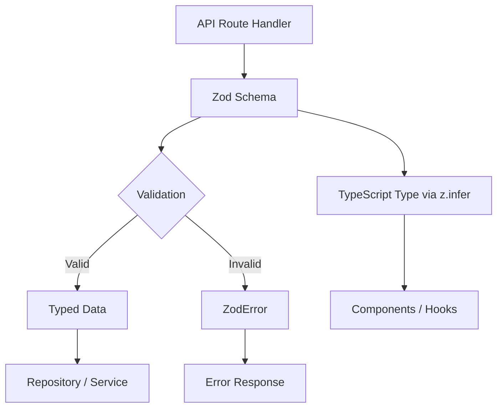

# أنماط التحقق من الصحة

يستخدم القالب Zod للتحقق من صحة المخطط عبر جميع حدود واجهة برمجة التطبيقات. تحدد مخططات التحقق من الصحة أشكال البيانات والقيود والتحويلات واستدلال النوع في مصدر واحد للحقيقة. يحتوي كل مجال على وحدة التحقق الخاصة به مع مخططات لعمليات الإنشاء والتحديث والاستعلام.

## نظرة عامة على الهندسة المعمارية



## ملفات المصدر

|ملف|الغرض|
|------|---------|
|`lib/validations/auth.ts`|مخططات كلمة المرور والمصادقة|
|`lib/validations/item.ts`|مخطط بيانات موقع العنصر|
|`lib/validations/client-item.ts`|إنشاء/تحديث/مخططات الاستعلام للعنصر الذي يواجه العميل|
|`lib/validations/company.ts`|الشركة CRUD ومخططات ارتباط شركة العنصر|
|`lib/validations/sponsor-ad.ts`|مخططات دورة حياة الإعلان الراعي|
|`lib/validations/client-dashboard.ts`|مخططات معلمات استعلام لوحة المعلومات|
|`lib/validations/user-location.ts`|موقع المستخدم وإعدادات الخصوصية|

## الأنماط الأساسية

### النمط 1: المخطط + النوع المستنتج

يقوم كل مخطط بتصدير نوع TypeScript مطابق عبر `z.infer`:

```typescript
import { z } from 'zod';

export const createCompanySchema = z.object({
  name: z.string().min(1, "Company name is required").max(255),
  website: z.string().url("Invalid URL format").optional().or(z.literal("")),
  status: z.enum(["active", "inactive"]).default("active"),
});

export type CreateCompanyInput = z.infer<typeof createCompanySchema>;
// Inferred type:
// {
//   name: string;
//   website?: string | "";
//   status: "active" | "inactive";
// }
```

### النمط 2: التحويل والتطبيع

تستخدم المخططات `.transform()` لتطبيع بيانات الإدخال:

```typescript
domain: z.string()
  .max(255)
  .optional()
  .transform((val) => val?.toLowerCase().trim() || undefined),

slug: z.string()
  .max(255)
  .optional()
  .transform((val) => val?.toLowerCase().trim() || undefined)
  .refine(
    (val) => !val || /^[a-z0-9-]+$/.test(val),
    { message: "Slug must contain only lowercase letters, numbers, and hyphens" }
  ),
```

### النمط 3: قيود التعداد

تستخدم حقول الحالة `z.enum()` مع صفائف const لسلامة النوع:

```typescript
export const companyStatus = ["active", "inactive"] as const;
export const sponsorAdStatuses = [
  "pending_payment", "pending", "rejected",
  "active", "expired", "cancelled",
] as const;
export const sponsorAdIntervals = ["weekly", "monthly"] as const;

// Usage in schemas
status: z.enum(companyStatus).default("active"),
interval: z.enum(sponsorAdIntervals),
```

### النمط 4: معلمات الاستعلام القسري

يتم فرض معلمات سلسلة الاستعلام من طلبات HTTP من السلاسل:

```typescript
export const querySponsorAdsSchema = z.object({
  page: z.coerce.number().int().positive().default(1),
  limit: z.coerce.number().int().positive().max(100).default(10),
  status: z.enum(sponsorAdStatuses).optional(),
  sortBy: z.enum(["createdAt", "updatedAt", "startDate", "endDate", "status"]).default("createdAt"),
  sortOrder: z.enum(["asc", "desc"]).default("desc"),
});
```

### النمط 5: التحويل من سلسلة إلى رقم

بالنسبة لمعلمات الاستعلام التي تصل كسلاسل ولكنها تمثل أرقامًا:

```typescript
page: z.string()
  .optional()
  .transform(val => (val ? parseInt(val, 10) : 1))
  .refine(val => !Number.isNaN(val), { message: 'Page must be a valid number' })
  .refine(val => val >= 1, { message: 'Page must be at least 1' }),

deleted: z.string()
  .optional()
  .transform(val => val === 'true'),  // String "true" -> boolean true
```

### النمط 6: التحقق من صحة الحقول المتقاطعة مع التحسين

قواعد التحقق المعقدة التي تمتد إلى حقول متعددة:

```typescript
export const updateLocationSchema = z.object({
  defaultLatitude: z.number().min(-90).max(90).nullable().optional(),
  defaultLongitude: z.number().min(-180).max(180).nullable().optional(),
  defaultCity: z.string().max(200).nullable().optional(),
  defaultCountry: z.string().max(100).nullable().optional(),
  locationPrivacy: locationPrivacySchema.optional(),
}).refine(
  (data) => {
    const hasLat = data.defaultLatitude != null;
    const hasLng = data.defaultLongitude != null;
    return hasLat === hasLng;  // Both or neither
  },
  { message: 'Both latitude and longitude must be provided together' }
);
```

### النمط 7: أنواع الاتحاد

الحقول التي تقبل تنسيقات متعددة:

```typescript
category: z.union([
  z.string().min(1, 'Category is required'),
  z.array(z.string().min(1)).min(1, 'At least one category is required'),
]).optional().nullable(),
```

## مخططات المجال

### المصادقة

التحقق من صحة كلمة المرور مع قيود regex المتعددة:

```typescript
export const passwordSchema = z.string()
  .min(8, "Password must be at least 8 characters")
  .regex(/[A-Z]/, "Must contain at least one uppercase letter")
  .regex(/[a-z]/, "Must contain at least one lowercase letter")
  .regex(/[0-9]/, "Must contain at least one number")
  .regex(/[^A-Za-z0-9]/, "Must contain at least one special character");
```

### موقع العنصر

البيانات الجغرافية ذات الإحداثيات المحدودة:

```typescript
export const locationSchema = z.object({
  address: z.string().optional(),
  city: z.string().optional(),
  state: z.string().optional(),
  country: z.string().optional(),
  postal_code: z.string().optional(),
  latitude: z.number().min(-90).max(90).optional(),
  longitude: z.number().min(-180).max(180).optional(),
  service_area: z.enum(['local', 'regional', 'national', 'global']).optional(),
  is_remote: z.boolean().optional(),
  geocoded_by: z.enum(['mapbox', 'google']).optional(),
}).optional();
```

### خصوصية موقع المستخدم

إعدادات الخصوصية المستندة إلى التعداد:

```typescript
export const locationPrivacyValues = ['private', 'city', 'exact'] as const;
export const locationPrivacySchema = z.enum(locationPrivacyValues);
export type LocationPrivacy = z.infer<typeof locationPrivacySchema>;
```

### تقديم عنصر العميل

مخطط الإنشاء الكامل مع ثوابت التحقق الخارجية:

```typescript
import { ITEM_VALIDATION } from '@/lib/types/item';

export const clientCreateItemSchema = z.object({
  name: z.string()
    .min(ITEM_VALIDATION.NAME_MIN_LENGTH)
    .max(ITEM_VALIDATION.NAME_MAX_LENGTH),
  description: z.string()
    .min(ITEM_VALIDATION.DESCRIPTION_MIN_LENGTH)
    .max(ITEM_VALIDATION.DESCRIPTION_MAX_LENGTH),
  source_url: z.string().url('Invalid URL format'),
  category: z.union([
    z.string().min(1),
    z.array(z.string().min(1)).min(1),
  ]).optional().nullable(),
  tags: z.array(z.string().min(1)).optional().default([]),
  icon_url: z.string().url().optional().or(z.literal('')),
  location: locationSchema,
});
```

### دورة حياة إعلان الراعي

مخططات متعددة تغطي سير عمل إعلان الراعي بالكامل:

|المخطط|الغرض|
|--------|---------|
|`createSponsorAdSchema`|تقديم إعلان الراعي الجديد|
|`updateSponsorAdSchema`|تحديث المسؤول (الحالة والتواريخ والاشتراك)|
|`approveSponsorAdSchema`|موافقة المشرف|
|`rejectSponsorAdSchema`|رفض المشرف مع السبب (10-500 حرف)|
|`cancelSponsorAdSchema`|الإلغاء لسبب اختياري|
|`querySponsorAdsSchema`|قائمة مرقّمة مع المرشحات|

## أنماط إعادة استخدام المخطط

### المخططات الجزئية للتحديثات

غالبًا ما تعكس مخططات التحديث مخططات الإنشاء بجميع الحقول الاختيارية:

```typescript
export const updateCompanySchema = z.object({
  id: z.string().uuid(),
  name: z.string().min(1).max(255).optional(),
  website: z.string().url().optional().or(z.literal("")),
  status: z.enum(companyStatus).optional(),
});
```

### التعرج المخطط

عندما يكون لدى عمليتين احتياجات تحقق متطابقة:

```typescript
export const assignCompanyToItemSchema = z.object({
  itemSlug: z.string().min(1).max(255).transform(val => val.toLowerCase().trim()),
  companyId: z.string().uuid("Invalid company ID format"),
});

// Reuse for updates (identical validation)
export const updateItemCompanySchema = assignCompanyToItemSchema;
```

### الانتقاء الانتقائي

استخدام `.pick()` لإنشاء مخططات مجموعة فرعية:

```typescript
const validatedData = userValidationSchema
  .pick({ email: true, password: true })
  .parse(data);
```

## الاستخدام في مسارات API

```typescript
import { clientCreateItemSchema } from '@/lib/validations/client-item';

export async function POST(request: Request) {
  const body = await request.json();

  // Validation + transformation in one step
  const result = clientCreateItemSchema.safeParse(body);

  if (!result.success) {
    return Response.json(
      { errors: result.error.flatten().fieldErrors },
      { status: 400 }
    );
  }

  // result.data is fully typed and transformed
  const item = await repository.create(result.data);
  return Response.json(item, { status: 201 });
}
```
