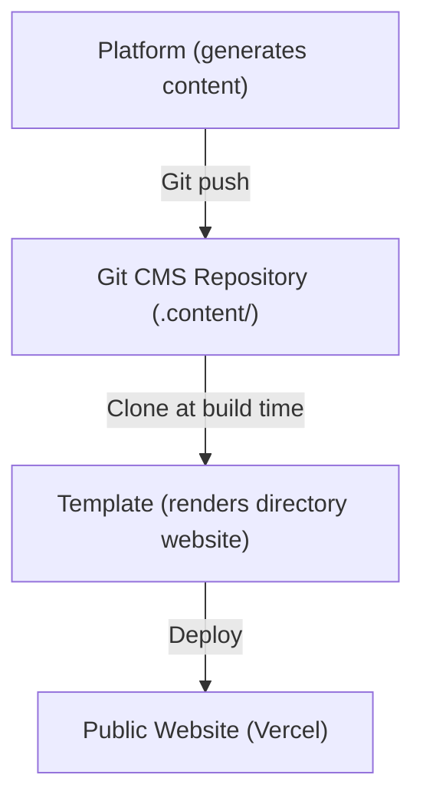
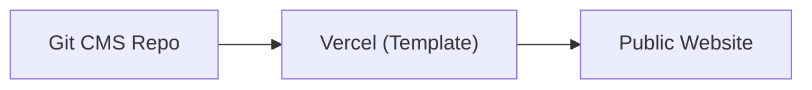
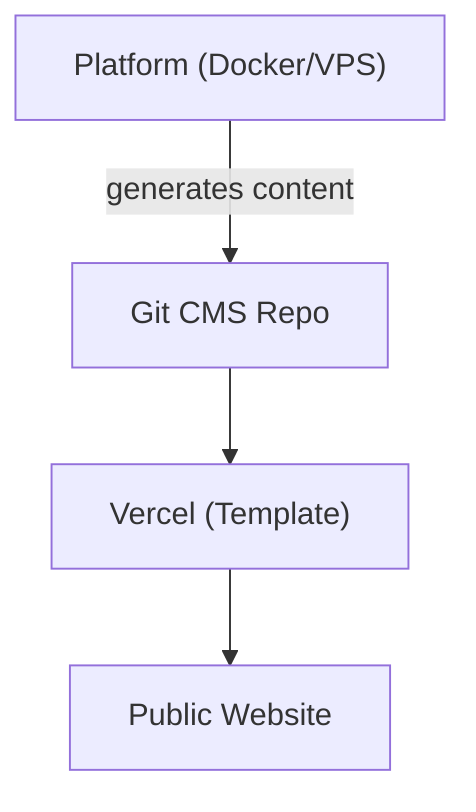
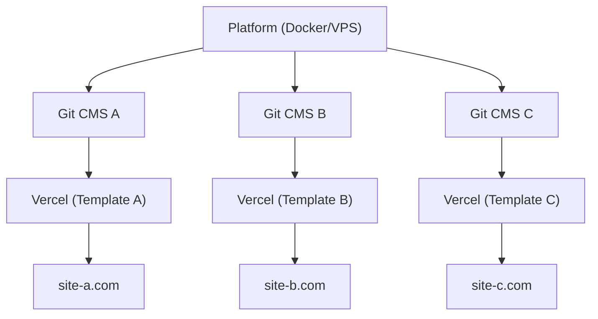

# المنصة مقابل القالب

يتكون Ever Works من منتجين رئيسيين يخدمان أغراضاً مختلفة لكنهما يعملان معاً كمنظومة موحدة. تشرح هذه الصفحة الفرق بينهما ومتى يُستخدم كل منهما.

## منصة Ever Works

**منصة Ever Works** هي البنية التحتية للواجهة الخلفية لبناء وإدارة مواقع الدليل على نطاق واسع. توفر واجهة برمجة تطبيقات REST، وخطوط أنابيب لتوليد المحتوى بالذكاء الاصطناعي، ونظام إضافات، وتنسيق النشر.

للاطلاع على التوثيق الكامل للمنصة، تفضل بزيارة [docs.ever.works](https://docs.ever.works).

## Directory Web Template

**Directory Web Template** (هذا المشروع) هو موقع دليل متكامل جاهز للإنتاج يمكنك استنساخه وتخصيصه ونشره كتطبيق مستقل.

### ما يفعله

- يوفر **موقع دليل** كاملاً مع قوائم العناصر والبحث والتصفية والفئات والوسوم والمجموعات
- يتضمن **المصادقة** عبر NextAuth.js v5 مع موفري OAuth (Google وGitHub وFacebook وTwitter وMicrosoft) وSupabase Auth
- يدعم **المدفوعات** عبر Stripe وLemonSqueezy وPolar مع إدارة الاشتراكات
- يقدم **تدويلاً** متعدد اللغات مع دعم RTL عبر next-intl
- يستخدم **نظام إدارة المحتوى المستند إلى Git** لمزامنة محتوى الدليل من مستودعات Git
- يتضمن **نظام سمات** مع سمات مدمجة وتوليد ألوان ديناميكي
- يوفر **تحليلات ومراقبة** عبر PostHog وSentry
- يأتي مع **تحسين محركات البحث (SEO)**، وتوليد خريطة الموقع، والبيانات المنظمة (JSON-LD)
- يتضمن **لوحة إدارة** لإدارة المحتوى والمستخدمين والتحليلات

### الحزمة التقنية

- **الإطار:** Next.js 15 و React 19
- **اللغة:** TypeScript 5
- **ORM:** Drizzle ORM (PostgreSQL)
- **واجهة المستخدم:** Tailwind CSS 4 و HeroUI React و Radix UI
- **المصادقة:** NextAuth.js v5 و Supabase Auth
- **المدفوعات:** Stripe و LemonSqueezy و Polar
- **الاختبار:** Playwright (E2E)
- **النشر:** Vercel (أساسي)، Docker (بديل)

## مقارنة جنباً إلى جنب

| الجانب              | المنصة                                     | القالب                                 |
| ------------------- | ------------------------------------------ | -------------------------------------- |
| **الغرض**           | بنية خلفية وخط أنابيب ذكاء اصطناعي         | موقع دليل للواجهة الأمامية            |
| **الهندسة المعمارية** | Monorepo (Turborepo + pnpm)             | تطبيق Next.js مستقل                   |
| **الواجهة الخلفية** | NestJS 11 API                              | مسارات API لـ Next.js                  |
| **ORM قاعدة البيانات** | TypeORM                                 | Drizzle ORM                            |
| **المصادقة**        | JWT + OAuth (NestJS Guards)                | NextAuth.js v5 + Supabase Auth         |
| **المدفوعات**       | غير مضمّنة                                 | Stripe و LemonSqueezy و Polar          |
| **ميزات الذكاء الاصطناعي** | وكلاء LangChain، 7 موفري LLM       | لا يوجد (يستهلك المحتوى المُولَّد بالذكاء الاصطناعي) |
| **المحتوى**         | يولّد المحتوى عبر خطوط أنابيب الذكاء الاصطناعي | يقرأ المحتوى من نظام CMS المستند إلى Git |
| **النشر**           | Docker على أي VPS                          | Vercel (أو Docker)                     |
| **الاختبار**        | Jest + Vitest                              | Playwright                             |
| **الجمهور**         | مشغّلو المنصة، مطوّرو الذكاء الاصطناعي    | بنّاؤو المواقع، منشئو الدلائل          |

## كيف يتصلان

تعمل المنصة والقالب معاً من خلال نمط **نظام إدارة المحتوى المستند إلى Git**:

### التشغيل المستقل

- **القالب بدون منصة:** حافظ على محتوى الدليل يدوياً عن طريق تعديل ملفات YAML وMarkdown في مستودع Git CMS. يعمل القالب كموقع دليل كامل الوظائف بدون توليد ذكاء اصطناعي.
- **المنصة بدون قالب:** استخدم API المنصة لتوليد بيانات الدليل وتصديرها إلى أي واجهة أمامية.

## متى تستخدم أيهما

### استخدم القالب عندما...

- تريد إطلاق موقع دليل بسرعة مع حد أدنى من إعداد الواجهة الخلفية
- يتم تنظيم محتوى دليلك يدوياً أو يأتي من مصدر بيانات ثابت
- تحتاج إلى موقع جاهز للإنتاج مع مصادقة ومدفوعات وSEO من البداية
- تفضّل النشر على Vercel بدون إدارة خوادم

### استخدم المنصة عندما...

- تحتاج إلى توليد محتوى بالذكاء الاصطناعي للدلائل الكبيرة
- تريد خطوط أنابيب آلية تكتشف عناصر الدليل وتثريها وتحدّثها
- تحتاج إلى إدارة دلائل متعددة من واجهة خلفية واحدة
- تريد استخدام نظام الإضافات لتكاملات مخصصة

### استخدمهما معاً عندما...

- تريد تدفق المحتوى المُولَّد بالذكاء الاصطناعي إلى موقع إنتاج
- تبني منتج SaaS على أساس Ever Works
- تحتاج إلى توليد المحتوى الآلي وواجهة أمامية متقنة

## هياكل النشر

### القالب فقط (الأبسط)

إدارة يدوية للمحتوى عبر Git. نشر واحد على Vercel.

### المنصة + القالب (Full Stack)

توليد آلي للمحتوى عبر المنصة. متصل من خلال Git.

### المنصة + قوالب متعددة

نسخة منصة واحدة تدير مواقع دليل متعددة.
