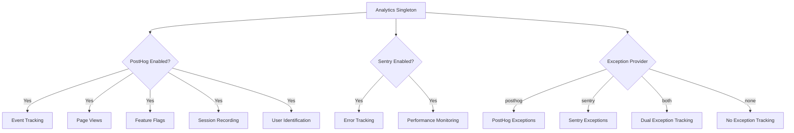
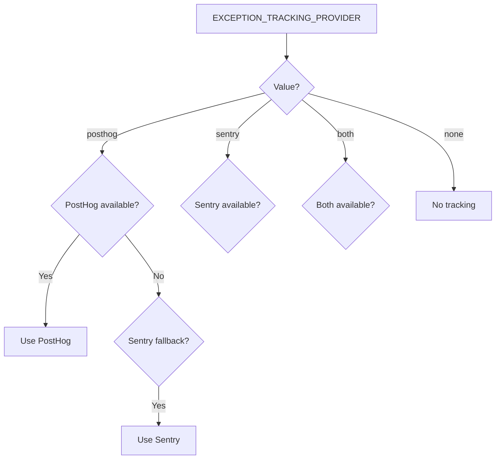

# تكوين التحليلات

يوفر القالب نظام تحليلات موحداً يدمج PostHog لتحليلات المنتج وSentry لتتبع الأخطاء. يتم إدارة كلا المزودين من خلال فئة `Analytics` المفردة مع آلية احتياطية تلقائية.

## البنية المعمارية



## متغيرات البيئة

### تكوين PostHog

| المتغير | مطلوب | الافتراضي | الوصف |
|---|---|---|---|
| `NEXT_PUBLIC_POSTHOG_KEY` | نعم (للتحليلات) | -- | مفتاح API لمشروع PostHog |
| `NEXT_PUBLIC_POSTHOG_HOST` | نعم (للتحليلات) | -- | رابط نسخة PostHog |
| `POSTHOG_DEBUG` | لا | `false` | تفعيل سجل التصحيح |
| `POSTHOG_SESSION_RECORDING_ENABLED` | لا | `true` | تفعيل تسجيل الجلسات |
| `POSTHOG_AUTO_CAPTURE` | لا | `false` | التقاط مشاهدات الصفحة تلقائياً |
| `POSTHOG_EXCEPTION_TRACKING` | لا | `true` | تفعيل تتبع الاستثناءات في PostHog |

### تكوين Sentry

| المتغير | مطلوب | الافتراضي | الوصف |
|---|---|---|---|
| `NEXT_PUBLIC_SENTRY_DSN` | نعم (للأخطاء) | -- | اسم مصدر بيانات Sentry |
| `SENTRY_ENABLE_DEV` | لا | `false` | تفعيل Sentry في بيئة التطوير |
| `SENTRY_DEBUG` | لا | `false` | تفعيل وضع التصحيح في Sentry |
| `SENTRY_EXCEPTION_TRACKING` | لا | `true` | تفعيل تتبع الاستثناءات في Sentry |

### تتبع الاستثناءات الموحد

| المتغير | مطلوب | الافتراضي | الوصف |
|---|---|---|---|
| `EXCEPTION_TRACKING_PROVIDER` | لا | `both` | المزود المستخدم: `posthog` أو `sentry` أو `both` أو `none` |

## إعداد PostHog

### الخطوة الأولى: الحصول على بيانات الاعتماد

1. سجّل في [posthog.com](https://posthog.com) أو استضف PostHog بنفسك
2. أنشئ مشروعاً
3. انسخ مفتاح API للمشروع ورابط المضيف

### الخطوة الثانية: تكوين البيئة

```env
NEXT_PUBLIC_POSTHOG_KEY=phc_your_project_key_here
NEXT_PUBLIC_POSTHOG_HOST=https://app.posthog.com
```

يتم تفعيل PostHog تلقائياً عند تعيين كل من `NEXT_PUBLIC_POSTHOG_KEY` و`NEXT_PUBLIC_POSTHOG_HOST`.

### الخطوة الثالثة: معدلات أخذ العينات

يتم ضبط معدلات أخذ العينات تلقائياً حسب البيئة:

| البيئة | معدل عينة الحدث | معدل عينة تسجيل الجلسة |
|---|---|---|
| الإنتاج | 10% (`0.1`) | 10% (`0.1`) |
| التطوير | 100% (`1.0`) | 100% (`1.0`) |

## إعداد Sentry

### الخطوة الأولى: الحصول على DSN

1. أنشئ مشروعاً في [sentry.io](https://sentry.io)
2. انسخ DSN من إعدادات المشروع

### الخطوة الثانية: تكوين البيئة

```env
NEXT_PUBLIC_SENTRY_DSN=https://examplePublicKey@o0.ingest.sentry.io/0
SENTRY_ENABLE_DEV=true  # اختياري: تفعيل في بيئة التطوير
```

يتم تفعيل Sentry تلقائياً في الإنتاج عند تعيين DSN. للتطوير، قم بتعيين `SENTRY_ENABLE_DEV=true` صراحةً.

## واجهة برمجة تطبيقات فئة Analytics

فئة `Analytics` هي نسخة مفردة يمكن الوصول إليها في جميع أنحاء التطبيق:

```typescript
import { analytics } from '@/lib/analytics';
```

### التهيئة

```typescript
// تهيئة التحليلات (استدعاء مرة واحدة في جذر التطبيق)
analytics.init();
```

طريقة `init()` مخصصة للجانب العميل فقط وآمنة للاستدعاء في سياقات الخادم (لن تنفذ شيئاً).

### تتبع الأحداث

```typescript
// تتبع حدث مخصص
analytics.track('button_clicked', {
  buttonName: 'signup',
  page: '/landing'
});

// تتبع مشاهدة صفحة
analytics.trackPageView('/dashboard', {
  referrer: document.referrer
});
```

### تحديد هوية المستخدم

```typescript
// تحديد هوية مستخدم (بعد تسجيل الدخول)
analytics.identify('user-123', {
  email: 'user@example.com',
  plan: 'premium',
  company: 'Acme Inc.'
});

// إعادة تعيين الهوية (بعد تسجيل الخروج)
analytics.reset();

// تعيين خصائص مستخدم دائمة
analytics.setUserProperties({
  subscription_tier: 'premium',
  signup_date: '2024-01-15'
});

// تعيين الخصائص الفائقة (ترسل مع كل حدث)
analytics.setSuperProperties({
  app_version: '2.0.0',
  platform: 'web'
});
```

### علامات الميزات

```typescript
// التحقق من تفعيل علامة ميزة
const isEnabled = analytics.isFeatureEnabled('new-dashboard', false);

// إعادة تحميل علامات الميزات من الخادم
await analytics.reloadFeatureFlags();
```

### تتبع الاستثناءات

```typescript
// التقاط استثناء (يتم توجيهه إلى المزود المكوَّن)
analytics.captureException(error, {
  component: 'PaymentForm',
  action: 'submit'
});

// الالتقاط برسالة نصية
analytics.captureException('Payment processing failed', {
  orderId: 'ord-123'
});
```

## اختيار مزود تتبع الاستثناءات


