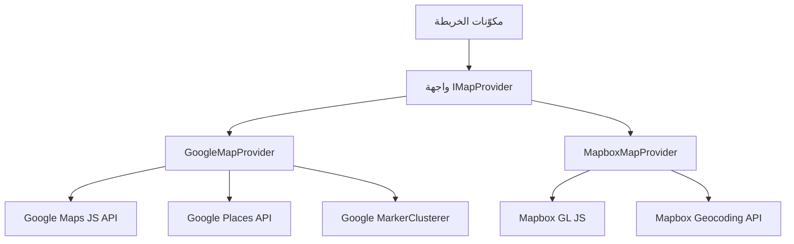

# تكوين الخريطة

يتضمن القالب نظام خريطة مستقل عن الموفر يدعم كلًا من Google Maps وMapbox GL JS. تتيح طبقة الواجهة المشتركة التبديل بين الموفرين دون تغيير كود المكوّنات.

## المعمارية



## اختيار الموفر

يُحدَّد موفر الخريطة بناءً على مفاتيح API المُهيَّأة:

| الموفر | متغير البيئة المطلوب |
|---|---|
| Google Maps | `NEXT_PUBLIC_GOOGLE_MAPS_API_KEY` |
| Mapbox | `NEXT_PUBLIC_MAPBOX_ACCESS_TOKEN` |

## إعداد Google Maps

### الخطوة 1: الحصول على مفتاح API

1. انتقل إلى [Google Cloud Console](https://console.cloud.google.com)
2. فعّل واجهات API التالية:
   - Maps JavaScript API
   - Places API
   - Geocoding API
3. أنشئ مفتاح API مع قيود على مُحيلات HTTP

### الخطوة 2: تكوين البيئة

```env
NEXT_PUBLIC_GOOGLE_MAPS_API_KEY=AIzaSy...your-api-key
NEXT_PUBLIC_GOOGLE_MAPS_MAP_ID=your-map-id
```

**قيود مفتاح API المطلوبة:**
- قيود التطبيق: مُحيلات HTTP
- أضف أنماط نطاقك (مثلًا `https://yourdomain.com/*`)

## إعداد Mapbox

### الخطوة 1: الحصول على رمز الوصول

```env
NEXT_PUBLIC_MAPBOX_ACCESS_TOKEN=pk.eyJ1Ijoi...your-token
```

**قيود الرمز المطلوبة:**
- استخدم رمزًا **عامًا** (البادئة `pk.`)
- لا تستخدم أبدًا الرموز السرية (`sk.*`) في كود العميل

## واجهة الموفر

### أساليب IMapProvider

| الأسلوب | الوصف |
|---|---|
| `isLoaded()` | التحقق من تحميل نص الموفر |
| `loadScript()` | تحميل مكتبة الموفر (idempotent) |
| `createMap(container, options)` | إنشاء نسخة خريطة في عنصر DOM |
| `createMarker(map, options)` | إضافة علامة إلى الخريطة |
| `createClusterer(map, options, onClick)` | تجميع العلامات المتقاربة في مجموعات |
| `createAutocomplete(input, onSelect)` | ربط الإتمام التلقائي للعنوان بحقل إدخال |
| `getStyleUrl(style)` | الحصول على عنوان URL للأسلوب للشوارع أو الأقمار الاصطناعية |
| `isConfigured()` | التحقق من وجود مفاتيح API |

### أساليب الخريطة

| الأسلوب | Google Maps | Mapbox |
|---|---|---|
| `streets` | `roadmap` | `mapbox://styles/mapbox/streets-v12` |
| `satellite` | `satellite` | `mapbox://styles/mapbox/satellite-streets-v12` |

## نظام الأنواع

```typescript
interface Coordinates {
  latitude: number;
  longitude: number;
}

interface MapBounds {
  north: number;
  south: number;
  east: number;
  west: number;
}

interface MapMarkerData {
  id: string;
  coordinates: Coordinates;
  title: string;
  icon?: string;
  category?: string;
  slug: string;
  description?: string;
}

interface ClusterOptions {
  radius?: number;     // نصف قطر المجموعة بالبكسل (الافتراضي: 60)
  maxZoom?: number;    // الحد الأقصى للتكبير للتجميع (الافتراضي: 16)
  minPoints?: number;  // الحد الأدنى للنقاط لتكوين مجموعة (الافتراضي: 2)
}
```

## خصائص مكوّن الخريطة

| الخاصية | النوع | الافتراضي | الوصف |
|---|---|---|---|
| `markers` | `MapMarkerData[]` | `[]` | العلامات المراد عرضها |
| `center` | `Coordinates` | -- | موضع المركز الأولي |
| `zoom` | `number` | -- | مستوى التكبير الأولي (1-20) |
| `style` | `MapStyle` | `streets` | أسلوب الخريطة |
