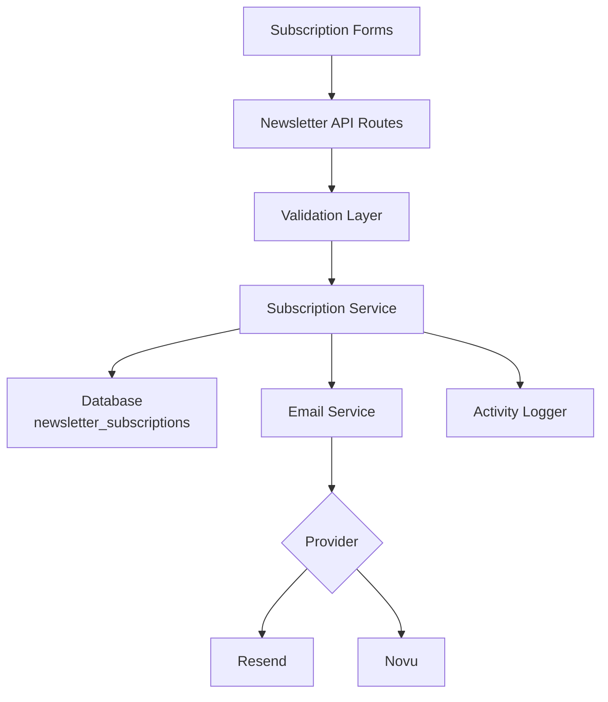
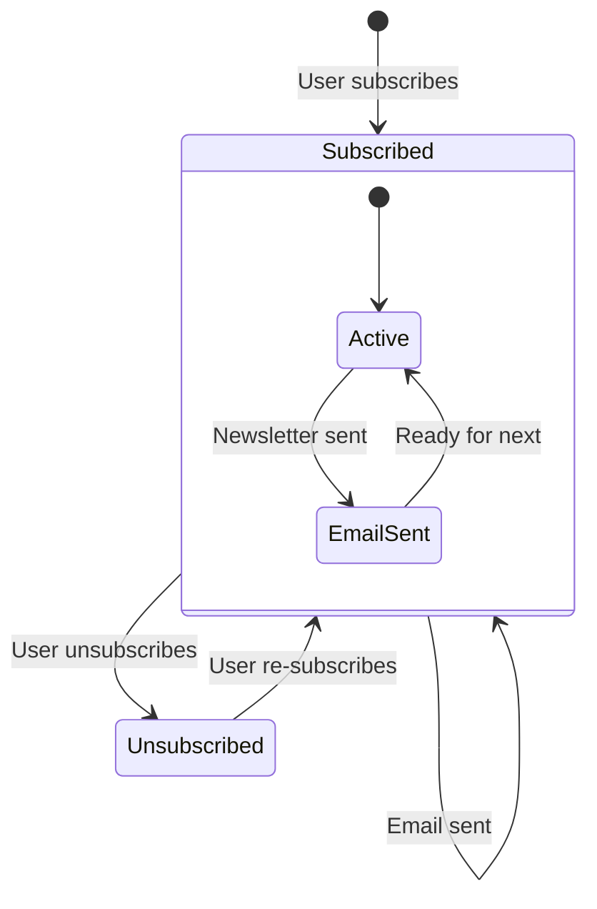

# تكوين النشرة البريدية

يتضمن القالب نظام اشتراك كامل في النشرة البريدية مع تكامل مزود البريد الإلكتروني والتحقق من الصحة وإدارة دورة حياة الاشتراك وتسجيل النشاط. يتمركز التكوين في `lib/newsletter/`.

## البنية المعمارية



## هيكل الملفات

```
lib/newsletter/
├── config.ts    # Configuration, types, validation schemas
└── utils.ts     # Email sending, subscription validation, logging
```

## ثوابت التكوين

يُعرّف الكائن `NEWSLETTER_CONFIG` في `config.ts` جميع القيم الافتراضية والرسائل:

```typescript
export const NEWSLETTER_CONFIG = {
  DEFAULT_PROVIDER: "resend",
  DEFAULT_FROM: "onboarding@resend.dev",
  DEFAULT_COMPANY_NAME: "Ever Works",

  SOURCES: {
    FOOTER: "footer",
    POPUP: "popup",
    SIGNUP: "signup",
  },

  ERRORS: {
    INVALID_EMAIL: "Please enter a valid email address",
    ALREADY_SUBSCRIBED: "Email is already subscribed to the newsletter",
    NOT_SUBSCRIBED: "Email is not subscribed to the newsletter",
    SUBSCRIPTION_FAILED: "Failed to create subscription. Please try again.",
    UNSUBSCRIPTION_FAILED: "Failed to unsubscribe. Please try again.",
    EMAIL_SEND_FAILED: "Failed to send email. Please try again.",
    STATS_FAILED: "Failed to get newsletter statistics",
  },

  SUCCESS: {
    SUBSCRIBED: "Successfully subscribed to newsletter",
    UNSUBSCRIBED: "Successfully unsubscribed from newsletter",
  },
};
```

## إعداد مزود البريد الإلكتروني

### Resend (افتراضي)

```env
RESEND_API_KEY=re_your_api_key_here
```

1. سجّل في [resend.com](https://resend.com)
2. أنشئ مفتاح API
3. تحقق من نطاق الإرسال (أو استخدم `onboarding@resend.dev` للاختبار)

### Novu

```env
NOVU_API_KEY=your_novu_api_key
```

بالنسبة إلى Novu، يتوفر تكوين إضافي في تكوين الموقع:

```yaml
mail:
  provider: "novu"
  template_id: "your-template-id"
  backend_url: "https://api.novu.co"
```

## تكوين البريد الإلكتروني

تبني الدالة `createEmailConfig()` تكوين البريد الإلكتروني من تكوين التطبيق:

```typescript
interface EmailConfig {
  provider: string;      // "resend" or "novu"
  defaultFrom: string;   // Sender email address
  domain: string;        // Application domain URL
  apiKeys: {
    resend: string;
    novu: string;
  };
  novu?: {
    templateId?: string;
    backendUrl?: string;
  };
}
```

أولوية التكوين:

| الإعداد          | المصدر                          | القيمة الاحتياطية          |
|---|---|---|
| المزود            | `config.mail.provider`          | `"resend"`                 |
| عنوان المُرسِل   | `config.mail.default_from`      | `"onboarding@resend.dev"`  |
| النطاق           | `config.app_url`                | `coreConfig.APP_URL`       |
| مفتاح Resend     | متغير بيئة `RESEND_API_KEY`    | سلسلة فارغة               |
| مفتاح Novu       | متغير بيئة `NOVU_API_KEY`     | سلسلة فارغة               |

## مخططات التحقق

يستخدم نظام النشرة البريدية مخططات Zod للتحقق من صحة المدخلات:

### مخطط البريد الإلكتروني

```typescript
const emailSchema = z.object({
  email: z
    .string()
    .email("Please enter a valid email address")
    .transform((email) => email.toLowerCase().trim()),
});
```

### مخطط الاشتراك

```typescript
const newsletterSubscriptionSchema = z.object({
  email: z
    .string()
    .email("Please enter a valid email address")
    .transform((email) => email.toLowerCase().trim()),
  source: z
    .enum(["footer", "popup", "signup"])
    .default("footer"),
});
```

## مصادر الاشتراك

تتبع مصدر الاشتراكات:

| المصدر   | الوصف                                        |
|---|---|
| `footer` | نموذج الاشتراك في ذيل الموقع                  |
| `popup`  | نافذة منبثقة/مودال النشرة البريدية            |
| `signup` | تدفق تسجيل الحساب                             |

## أدوات النشرة البريدية

### إرسال البريد الإلكتروني

```typescript
import { sendEmailSafely, createEmailService } from '@/lib/newsletter/utils';

// Create email service
const { service, config } = await createEmailService();

// Send email with error handling
const result = await sendEmailSafely(
  service,
  config,
  {
    subject: "Welcome to our newsletter!",
    html: "<h1>Welcome!</h1>",
    text: "Welcome!"
  },
  "user@example.com",
  "welcome"
);

if (!result.success) {
  console.error(result.error);
}
```

### التحقق من الاشتراك

```typescript
import { canSubscribe, canUnsubscribe } from '@/lib/newsletter/utils';

// Check if email can be subscribed
const { canSubscribe: allowed, error } = await canSubscribe("user@example.com");
if (!allowed) {
  // Email is already subscribed
}

// Check if email can be unsubscribed
const { canUnsubscribe: allowed, error } = await canUnsubscribe("user@example.com");
if (!allowed) {
  // Email is not currently subscribed
}
```

### تسجيل النشاط

```typescript
import { logNewsletterActivity, trackNewsletterMetric } from '@/lib/newsletter/utils';

// Log newsletter activity
logNewsletterActivity("subscribe", "user@example.com", "footer", {
  ip: "192.168.1.1"
});

// Track newsletter metrics
trackNewsletterMetric("subscription", "user@example.com", "popup");
```

أنواع النشاط:

| الإجراء        | متى يُسجَّل                                       |
|---|---|
| `subscribe`    | يشترك المستخدم في النشرة البريدية                 |
| `unsubscribe`  | يلغي المستخدم اشتراكه                             |
| `email_sent`   | تم إرسال بريد النشرة بنجاح                         |
| `email_failed` | فشل إرسال بريد النشرة البريدية                     |

### أدوات القوالب

```typescript
import { getTemplateWithCompany } from '@/lib/newsletter/utils';

// Generate email template with company name
const template = await getTemplateWithCompany(
  (email, companyName) => ({
    subject: `Welcome to ${companyName}`,
    html: `<p>Thanks for subscribing, ${email}!</p>`,
    text: `Thanks for subscribing, ${email}!`
  }),
  "user@example.com"
);
```

### دوال مساعدة للاستجابة

```typescript
import { createErrorResponse, createSuccessResponse } from '@/lib/newsletter/utils';

// Standardized error response
const error = createErrorResponse(
  "Subscription failed",
  "user@example.com",
  "subscribe"
);
// { error: "Subscription failed", email: "user@example.com", context: "subscribe" }

// Standardized success response
const success = createSuccessResponse("user@example.com", "subscribe");
// { success: true, email: "user@example.com", context: "subscribe" }
```

## مخطط قاعدة البيانات

تُخزَّن اشتراكات النشرة البريدية في جدول `newsletter_subscriptions`:

| العمود           | النوع     | الوصف                                             |
|---|---|---|
| `id`             | UUID      | المفتاح الأساسي                                   |
| `email`          | String    | بريد المشترك (فريد)                               |
| `isActive`       | Boolean   | حالة الاشتراك الحالية                             |
| `subscribedAt`   | Timestamp | وقت بدء الاشتراك                                  |
| `unsubscribedAt` | Timestamp | وقت إلغاء الاشتراك (قابل للقيمة الفارغة)         |
| `lastEmailSent`  | Timestamp | آخر بريد أُرسل إلى المشترك                        |
| `source`         | String    | مصدر الاشتراك (footer أو popup أو signup)         |

## دورة حياة الاشتراك



## الأنواع

```typescript
type NewsletterSource = "footer" | "popup" | "signup";

interface NewsletterActionResult {
  success?: boolean;
  error?: string;
  email?: string;
}

interface NewsletterStats {
  totalActive: number;
  recentSubscriptions: number;
}
```

## الأمان

- تُعالج عناوين البريد الإلكتروني بتحويلها إلى أحرف صغيرة وإزالة المسافات قبل التخزين
- يستخدم التحقق من البريد الإلكتروني تعبيرًا منتظمًا آمنًا يمنع هجمات ReDoS (من `lib/utils/email-validation.ts`)
- تُحيط الدالة `sendEmailSafely` جميع عمليات البريد الإلكتروني بكتل try-catch
- لا تُكشف مفاتيح API للعميل أبدًا — تجري جميع عمليات البريد على جانب الخادم

## استكشاف الأخطاء وإصلاحها

| المشكلة                           | الحل                                                                              |
|---|---|
| البريد الإلكتروني لا يُرسَل       | تحقق من تعيين `RESEND_API_KEY` أو `NOVU_API_KEY`                                  |
| خطأ "مشترك بالفعل"               | افحص جدول `newsletter_subscriptions` بحثًا عن إدخال نشط موجود                    |
| عنوان مُرسِل خاطئ                | حدّث `mail.default_from` في تكوين الموقع                                         |
| القالب لا يُحمَّل                 | تأكد من أن `getCompanyName()` يمكنها الوصول إلى تكوين الموقع                     |
| المصدر غير مُتتبَّع               | مرِّر المعامل `source` في طلبات الاشتراك                                          |
