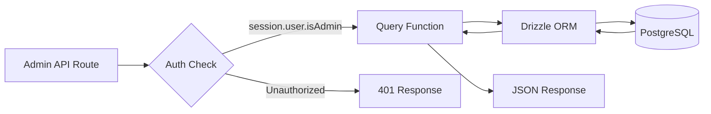
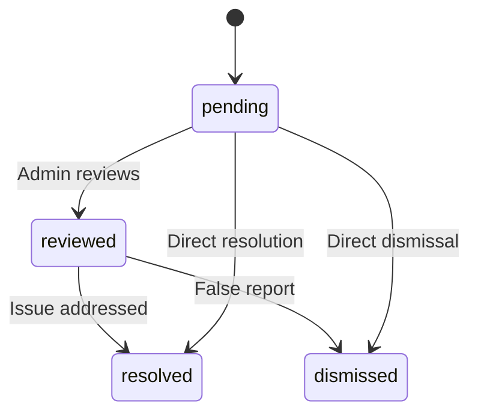

# استعلامات قاعدة بيانات المشرف

تتعامل استعلامات المسؤول مع إدارة العناصر، وإدارة المستخدم/العميل، والوصول المستند إلى الدور، وإحصائيات لوحة المعلومات، والإشراف على التقارير، والإعدادات. يتم استهلاك هذه الوظائف بشكل أساسي بواسطة مسارات API ضمن `app/api/admin/`.

## تدفق استعلام المشرف



## إدارة المستخدم (`user.queries.ts`)

### الوظائف الأساسية

|وظيفة|المعلمات|المرتجعات|الوصف|
|----------|-----------|---------|-------------|
|`getUserByEmail`|`email: string`|`المستخدم \|فارغة`|البحث عن المستخدم عن طريق عنوان البريد الإلكتروني|
|`getUserById`|`id: string`|`المستخدم \|فارغة`|البحث عن المستخدم عن طريق المفتاح الأساسي|
|`insertNewUser`|`user: NewUser`|`User[]`|إنشاء سجل مستخدم جديد|
|`updateUserPassword`|`hash, userId`|`void`|تحديث تجزئة كلمة المرور|
|`updateUserVerification`|`email, verified`|`void`|ضبط حالة التحقق من البريد الإلكتروني|
|`softDeleteUser`|`userId: string`|`void`|الحذف المبدئي (إلحاق `-deleted` بالبريد الإلكتروني)|
|`isUserAdmin`|`userId: string`|`boolean`|تحقق من دور المسؤول عبر الانضمام|

### التحقق من دور المشرف

تقوم الدالة `isUserAdmin` بإجراء ربط متعدد الجداول للتحقق من حالة المسؤول:

```typescript
export async function isUserAdmin(userId: string): Promise<boolean> {
  const result = await db
    .select({ isAdmin: roles.isAdmin })
    .from(userRoles)
    .innerJoin(roles, eq(userRoles.roleId, roles.id))
    .where(and(
      eq(userRoles.userId, userId),
      eq(roles.isAdmin, true),
      eq(roles.status, 'active')
    ))
    .limit(1);

  return result.length > 0;
}
```

### نمط الحذف الناعم

لا يتم حذف المستخدمين فعليًا أبدًا. يقوم الحذف المبدئي بربط معرف المستخدم بالبريد الإلكتروني لتحرير عنوان البريد الإلكتروني لإعادة التسجيل:

```typescript
export async function softDeleteUser(userId: string) {
  return db
    .update(users)
    .set({
      deletedAt: sql`CURRENT_TIMESTAMP`,
      email: sql`CONCAT(email, '-', id, '-deleted')`
    })
    .where(eq(users.id, userId));
}
```

## إدارة العملاء (`client.queries.ts`)

### الملف الشخصي الخام

|وظيفة|الوصف|
|----------|-------------|
|`createClientProfile(data)`|إنشاء ملف تعريف باستخدام اسم مستخدم فريد تم إنشاؤه تلقائيًا|
|`getClientProfileById(id)`|استرداد بواسطة معرف الملف الشخصي|
|`getClientProfileByUserId(userId)`|استرداد عن طريق مرجع المستخدم|
|`getClientProfileByEmail(email)`|الاسترداد عبر البحث في جدول الحسابات|
|`updateClientProfile(id, data)`|تحديث جزئي مع الطابع الزمني|
|`deleteClientProfile(id)`|من الصعب حذف سجل الملف الشخصي|

### بيانات لوحة تحكم المشرف

تم تحسين وظيفة `getAdminDashboardData` للوحة تحكم المسؤول، مما يؤدي إلى إرجاع قائمة العملاء المقسمة إلى صفحات والإحصائيات الشاملة في أقل عدد ممكن من الاستعلامات:

```typescript
export async function getAdminDashboardData(params: {
  page: number;
  limit: number;
  search?: string;
  status?: string;
  plan?: string;
  accountType?: string;
  provider?: string;
  createdAfter?: Date;
  createdBefore?: Date;
}): Promise<{
  clients: ClientProfileWithAuth[];
  stats: { overview, byProvider, byPlan, byAccountType, activity, growth };
  pagination: { page, totalPages, total, limit };
}>
```

تستبعد الوظيفة المستخدمين الإداريين من قوائم العملاء باستخدام نمط LEFT JOIN + IS NULL:

```typescript
// Exclude admin users from client listing
.leftJoin(userRoles, eq(userRoles.userId, clientProfiles.userId))
.leftJoin(roles, and(eq(userRoles.roleId, roles.id), eq(roles.isAdmin, true)))
.where(isNull(roles.id))  // Only non-admin users
```

### بحث متقدم عن العملاء

`advancedClientSearch` يدعم التصفية المعقدة متعددة المعايير:

|فئة التصفية|المعلمات|
|----------------|------------|
|** البحث عن النص **|`search` (عبر الاسم والبريد الإلكتروني واسم المستخدم والشركة والسيرة الذاتية والمسمى الوظيفي والصناعة والموقع)|
|** مرشحات التعداد **|`status`، `plan`، `accountType`، `provider`|
|** النطاقات الزمنية **|`createdAfter`، `createdBefore`، `updatedAfter`، `updatedBefore`، `dateRange`|
|**مجال محدد**|`emailDomain`، `companySearch`، `locationSearch`، `industrySearch`|
|**رقمي**|`minSubmissions`، `maxSubmissions`|
|**منطقية**|`hasAvatar`، `hasWebsite`، `hasPhone`، `emailVerified`، `twoFactorEnabled`|
|**الفرز**|`sortBy` (تم إنشاؤه، تحديثه، الاسم، البريد الإلكتروني، الشركة، إجمالي عمليات الإرسال)، `sortOrder`|

### إحصائيات العميل

`getEnhancedClientStats` يُرجع تفصيلاً شاملاً:

```typescript
{
  overview: { total, active, inactive, suspended, trial },
  byProvider: { credentials, google, github, facebook, twitter, linkedin, other },
  byPlan: { free: number, standard: number, premium: number },
  byAccountType: { individual, business, enterprise },
  activity: { newThisWeek, newThisMonth, activeThisWeek, activeThisMonth },
  growth: { weeklyGrowth, monthlyGrowth },
}
```

## إدارة التقارير (`report.queries.ts`)

### تقرير الخام

|وظيفة|الوصف|
|----------|-------------|
|`createReport(data)`|إنشاء تقرير محتوى (عنصر أو تعليق)|
|`getReportById(id)`|الحصول على تقرير مع تفاصيل المراسل والمراجع|
|`getReports(params)`|قائمة التقارير المرقّمة مع المرشحات|
|`updateReport(id, data)`|تحديث الحالة والحل وإضافة ملاحظات المراجعة|
|`getReportStats()`|الإحصائيات حسب الحالة ونوع المحتوى والسبب|
|`hasUserReportedContent(reportedBy, contentType, contentId)`|فحص التقرير المكرر|

### تدفق حالة التقرير



### تصفية التقارير

تدعم التقارير التصفية حسب الحالة ونوع المحتوى (العنصر/التعليق) والسبب (البريد العشوائي أو المضايقة أو غير المناسب أو غير ذلك):

```typescript
export async function getReports(params: {
  page?: number;
  limit?: number;
  search?: string;
  status?: ReportStatusValues;
  contentType?: ReportContentTypeValues;
  reason?: ReportReasonValues;
}): Promise<{
  reports: ReportWithReporter[];
  total: number;
  page: number;
  totalPages: number;
  limit: number;
}>
```

## إحصائيات لوحة المعلومات (`dashboard.queries.ts`)

### المقاييس المتاحة

|وظيفة|الغرض|تستخدم في|
|----------|---------|---------|
|`getVotesReceivedCount(itemSlugs)`|إجمالي الأصوات على العناصر|ملخص لوحة القيادة|
|`getCommentsReceivedCount(itemSlugs)`|إجمالي التعليقات على العناصر|ملخص لوحة القيادة|
|`getUniqueItemsInteractedCount(clientId)`|العناصر التي تفاعل معها المستخدم|لوحة النشاط|
|`getUserTotalActivityCount(clientId)`|إجمالي الأصوات + التعليقات من قبل المستخدم|لوحة النشاط|
|`getWeeklyEngagementData(itemSlugs, weeks)`|مخطط الأصوات/التعليقات الأسبوعي|مخطط المشاركة|
|`getDailyActivityData(clientId, itemSlugs, days)`|تقسيم النشاط اليومي|مخطط النشاط|
|`getTopItemsEngagement(itemSlugs, limit)`|أهم العناصر حسب المشاركة|لوحة العناصر العليا|

### بيانات المشاركة الأسبوعية

إرجاع بيانات المشاركة المجمعة حسب أسبوع ISO، بما يتوافق مع تنسيق PostgreSQL `to_char(date, 'IYYY-IW')`:

```typescript
const weeklyVotes = await db
  .select({
    week: sql<string>`to_char(${votes.createdAt}, 'IYYY-IW')`.as('week'),
    count: count(),
  })
  .from(votes)
  .where(and(inArray(votes.itemId, itemSlugs), gte(votes.createdAt, startDate)))
  .groupBy(sql`to_char(${votes.createdAt}, 'IYYY-IW')`)
  .orderBy(sql`to_char(${votes.createdAt}, 'IYYY-IW')`);
```

## إدارة رمز المصادقة (`auth.queries.ts`)

|وظيفة|الوصف|
|----------|-------------|
|`getPasswordResetTokenByEmail(email)`|ابحث عن رمز إعادة التعيين عبر البريد الإلكتروني|
|`getPasswordResetTokenByToken(token)`|ابحث عن رمز إعادة التعيين بواسطة سلسلة الرمز المميز|
|`deletePasswordResetToken(token)`|إزالة الرمز المميز المستخدم/منتهي الصلاحية|
|`getVerificationTokenByEmail(email)`|ابحث عن رمز التحقق عبر البريد الإلكتروني|
|`getVerificationTokenByToken(token)`|ابحث عن رمز التحقق بواسطة سلسلة الرمز المميز|
|`deleteVerificationToken(token)`|إزالة الرمز المميز المستخدم/منتهي الصلاحية|

تتبع جميع وظائف الرمز المميز نفس النمط البسيط للاختيار حسب الحقل مع `.limit(1)`.
