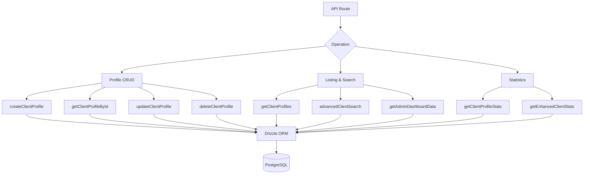

# الاستفسارات التي تواجه العميل

تتعامل استعلامات العملاء مع إدارة الملف الشخصي، والإدراج باستخدام بيانات تعريف المصادقة، والبحث المتقدم متعدد المعايير، والإحصائيات الشاملة. جميع الوظائف موجودة في `client.queries.ts` ويتم استهلاكها بواسطة كل من مسارات واجهة برمجة التطبيقات (API) التي تواجه المشرف والعميل.

## بنية استعلام العميل



## الملف الشخصي الخام

### إنشاء الملف الشخصي

تقوم الملفات الشخصية الجديدة بإنشاء أسماء مستخدمين فريدة تلقائيًا من عنوان البريد الإلكتروني عندما لا يتم توفير اسم مستخدم:

```typescript
export async function createClientProfile(data: {
  userId: string;
  email: string;
  name: string;
  displayName?: string;
  username?: string;
  bio?: string;
  jobTitle?: string;
  company?: string;
  status?: string;
  plan?: string;
  accountType?: string;
}): Promise<ClientProfile>
```

منطق إنشاء اسم المستخدم:

1. إذا تم توفير `username`، فقم بتطبيعه والتأكد من التفرد
2. بخلاف ذلك، قم باستخراج اسم المستخدم من البريد الإلكتروني عبر `extractUsernameFromEmail()`
3. الاحتياطي: قم بإنشاء بادئة `user<timestamp>`
4. تعمل جميع المسارات من خلال `ensureUniqueUsername()` والتي تُلحق اللواحق الرقمية إذا لزم الأمر

القيم الافتراضية المطبقة أثناء الإنشاء:

|الميدان|الافتراضي|
|-------|---------|
|`displayName`|نفس `name`|
|`bio`|`"Welcome! I'm a new user on this platform."`|
|`jobTitle`|`"User"`|
|`company`|`"Unknown"`|
|`status`|`"active"`|
|`plan`|`"free"`|
|`accountType`|`"individual"`|

### قراءة العمليات

|وظيفة|حقل البحث|المرتجعات|
|----------|-------------|---------|
|`getClientProfileById(id)`|`clientProfiles.id`|`ملف تعريف العميل \|فارغة`|
|`getClientProfileByUserId(userId)`|`clientProfiles.userId`|`ملف تعريف العميل \|فارغة`|
|`getClientProfileByEmail(email)`|عبر `accounts` الجدول|`ملف تعريف العميل \|فارغة`|

يتم حل البحث المستند إلى البريد الإلكتروني من خلال الجدول `accounts` للعثور على `userId` المرتبط، ثم الاستعلام عن `clientProfiles`:

```typescript
export async function getClientProfileByEmail(email: string): Promise<ClientProfile | null> {
  const account = await getClientAccountByEmail(email);
  if (!account) return null;
  const [profile] = await db
    .select()
    .from(clientProfiles)
    .where(eq(clientProfiles.userId, account.userId))
    .limit(1);
  return profile || null;
}
```

### تحديث وحذف

- **`updateClientProfile(id, data)`** - تحديث جزئي مع الطابع الزمني التلقائي `updatedAt`
- **`deleteClientProfile(id)`** -- الحذف الثابت (إرجاع النجاح المنطقي)

## قائمة مرقّمة

`getClientProfiles` يُرجع نتائج مرقّمة مع بيانات موفر المصادقة، باستثناء المستخدمين الإداريين:

```typescript
export async function getClientProfiles(params: {
  page?: number;
  limit?: number;
  search?: string;
  status?: string;
  plan?: string;
  accountType?: string;
  provider?: string;
}): Promise<{
  profiles: ClientProfileWithAuth[];
  total: number;
  page: number;
  totalPages: number;
  limit: number;
}>
```

### نمط استبعاد المسؤول

يستخدم كل من استعلام العدد واستعلام البيانات نمط LEFT JOIN + IS NULL لاستبعاد المستخدمين الإداريين:

```typescript
.leftJoin(userRoles, eq(userRoles.userId, clientProfiles.userId))
.leftJoin(roles, and(eq(userRoles.roleId, roles.id), eq(roles.isAdmin, true)))
.where(isNull(roles.id))  // Only non-admin users
```

### الاستعلام الفرعي للموفر

لتجنب الصفوف المكررة عندما يكون لدى المستخدم حسابات مصادقة متعددة، يتم حل الموفر عبر استعلام فرعي عددي:

```typescript
accountProvider: sql<string>`coalesce(
  (SELECT provider FROM ${accounts}
   WHERE ${accounts.userId} = ${clientProfiles.userId}
   LIMIT 1),
  'unknown'
)`
```

### مرشح البحث

يستخدم البحث النصي `ILIKE` عبر حقول متعددة مع منع حقن SQL:

```typescript
const escapedSearch = search
  .replace(/\\/g, '\\\\')
  .replace(/[%_]/g, '\\$&');

whereConditions.push(
  sql`(${clientProfiles.username} ILIKE ${`%${escapedSearch}%`} OR
       ${clientProfiles.displayName} ILIKE ${`%${escapedSearch}%`} OR
       ${clientProfiles.company} ILIKE ${`%${escapedSearch}%`} OR
       ${clientProfiles.name} ILIKE ${`%${escapedSearch}%`} OR
       ${clientProfiles.email} ILIKE ${`%${escapedSearch}%`})`
);
```

## بحث متقدم عن العملاء

`advancedClientSearch` يدعم أكثر من 20 معيار تصفية عبر فئات متعددة:

|فئة التصفية|المعلمات|
|----------------|------------|
|** البحث عن النص **|`search` (عبر الاسم والبريد الإلكتروني واسم المستخدم والشركة والسيرة الذاتية والمسمى الوظيفي والصناعة والموقع)|
|** مرشحات التعداد **|`status`، `plan`، `accountType`، `provider`|
|** النطاقات الزمنية **|`createdAfter`، `createdBefore`، `updatedAfter`، `updatedBefore`، `dateRange`|
|**مجال محدد**|`emailDomain`، `companySearch`، `locationSearch`، `industrySearch`|
|**رقمي**|`minSubmissions`، `maxSubmissions`|
|**منطقية**|`hasAvatar`، `hasWebsite`، `hasPhone`، `emailVerified`، `twoFactorEnabled`|
|**الفرز**|`sortBy`، `sortOrder`|

## إحصائيات العميل

### الإحصائيات الأساسية

`getClientProfileStats` يُرجع أعدادًا بسيطة:

```typescript
{
  total: number;
  active: number;
  inactive: number;
  byPlan: Record<string, number>;
  byAccountType: Record<string, number>;
}
```

### الإحصائيات المحسنة

يوفر `getEnhancedClientStats` تحليلاً شاملاً متعدد الأبعاد:

```typescript
{
  overview: { total, active, inactive, suspended, trial },
  byProvider: { credentials, google, github, facebook, twitter, linkedin, other },
  byPlan: { free: number, standard: number, premium: number },
  byAccountType: { individual, business, enterprise },
  activity: { newThisWeek, newThisMonth, activeThisWeek, activeThisMonth },
  growth: { weeklyGrowth, monthlyGrowth },
}
```

تستخدم الإحصائيات المحسنة `countDistinct` مع صلات الجداول المتعددة لإنتاج أعداد دقيقة حتى عندما يكون لدى المستخدمين موفري حسابات متعددون:

```typescript
const statsResult = await db
  .select({
    status: clientProfiles.status,
    plan: clientProfiles.plan,
    accountType: clientProfiles.accountType,
    provider: accounts.provider,
    count: countDistinct(clientProfiles.id)
  })
  .from(clientProfiles)
  .leftJoin(accounts, eq(clientProfiles.userId, accounts.userId))
  .leftJoin(userRoles, eq(userRoles.userId, clientProfiles.userId))
  .leftJoin(roles, and(eq(userRoles.roleId, roles.id), eq(roles.isAdmin, true)))
  .where(isNull(roles.id))
  .groupBy(
    clientProfiles.status,
    clientProfiles.plan,
    clientProfiles.accountType,
    accounts.provider
  );
```

### مقاييس النشاط

يتم حساب نوافذ النشاط باستخدام حساب التاريخ:

```typescript
const oneWeekAgo = new Date(now.getTime() - 7 * 24 * 60 * 60 * 1000);
const oneMonthAgo = new Date(now.getTime() - 30 * 24 * 60 * 60 * 1000);
```

معدلات النمو هي نسب مبسطة للتسجيلات الجديدة مقارنة بالمجموع:

```typescript
const weeklyGrowth = total > 0 ? Math.round((newThisWeek / total) * 100) : 0;
```

## أنواع

يتم تعريف كافة أنواع استعلام العميل في `lib/db/queries/types.ts`:

```typescript
export type ClientProfileWithAuth = ClientProfile & {
  accountProvider: string;
  isActive: boolean;
};

export type ClientStatus = "active" | "inactive" | "suspended" | "trial";
export type ClientPlan = "free" | "standard" | "premium";
export type ClientAccountType = "individual" | "business" | "enterprise";
```
