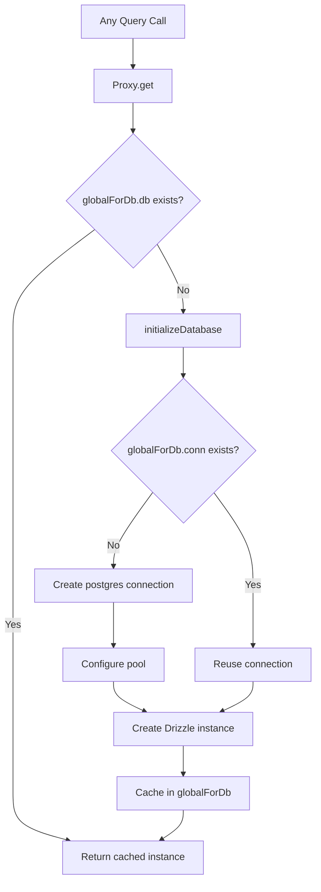

# اتصال قاعدة البيانات وتجميعها

يستخدم القالب `postgres.js` (حزمة `postgres` npm) كمحرك PostgreSQL مع Drizzle ORM. تتم إدارة الاتصال من خلال نمط تهيئة بطيء مع تخزين مؤقت فردي عالمي للبقاء على قيد الحياة لاستبدال الوحدة الساخنة (HMR) لـ Next.js قيد التطوير.

## بنية الاتصال



## إعداد قاعدة البيانات (`lib/db/drizzle.ts`)

### التهيئة البطيئة باستخدام الوكيل

يتم تصدير مثيل قاعدة البيانات كـ `Proxy` الذي يقوم بتهيئة الاتصال عند الوصول الأول:

```typescript
export const db = new Proxy({} as ReturnType<typeof drizzle>, {
  get(target, prop) {
    const database = initializeDatabase();
    return database[prop as keyof typeof database];
  },
});
```

وهذا يضمن:
- لم يتم إنشاء أي اتصال في وقت الاستيراد
- لا تتحمل البرامج النصية التي تستورد الوحدة ولكن لا تستعلم عن قاعدة البيانات أي حمل إضافي للاتصال
- أول عملية فعلية لقاعدة البيانات تؤدي إلى التهيئة

### وظيفة التهيئة

```typescript
function initializeDatabase(): ReturnType<typeof drizzle> {
  if (!getDatabaseUrl()) {
    throw new Error('DATABASE_URL environment variable is required');
  }

  if (globalForDb.db) {
    return globalForDb.db;
  }

  const poolSize = getPoolSize();
  const conn = postgres(getDatabaseUrl()!, {
    max: poolSize,
    idle_timeout: 20,
    connect_timeout: 30,
    prepare: false,
    onnotice: getNodeEnv() === 'development' ? console.log : undefined,
  });

  globalForDb.conn = conn;
  globalForDb.db = drizzle(conn, { schema });
  return globalForDb.db;
}
```

### خيارات الاتصال

|الخيار|القيمة|الغرض|
|--------|-------|---------|
|`max`|قابلة للتكوين (انظر حجم حوض السباحة)|الحد الأقصى من الاتصالات في المجمع|
|`idle_timeout`|`20` ثانية|أغلق الاتصالات الخاملة بعد هذه المدة|
|`connect_timeout`|`30` ثانية|الحد الأقصى للوقت لإنشاء اتصال|
|`prepare`|`false`|تعطيل البيانات المعدة (مطلوبة لبعض بيئات PaaS)|
|`onnotice`|`console.log` (للمطورين فقط)|تسجيل رسائل إشعار PostgreSQL قيد التطوير|

## تحجيم حمام السباحة

### التكوين

حجم التجمع قابل للتكوين عبر `DB_POOL_SIZE` متغير البيئة، مع الإعدادات الافتراضية المدركة للبيئة:

```typescript
const getPoolSize = (): number => {
  const envPoolSize = process.env.DB_POOL_SIZE;
  if (envPoolSize) {
    const parsed = parseInt(envPoolSize, 10);
    return isNaN(parsed) ? 20 : Math.max(1, Math.min(parsed, 50));
  }
  return getNodeEnv() === 'production' ? 20 : 10;
};
```

### الافتراضيات

|البيئة|حجم التجمع الافتراضي|النطاق|
|-------------|------------------|-------|
|الإنتاج| 20 | 1 - 50 |
|التنمية| 10 | 1 - 50 |

يتم تثبيت حجم المسبح بين 1 و50 بغض النظر عن القيمة التي تم تكوينها.

### إرشادات حجم حمام السباحة

- ** التطوير (10): ** يكفي لمطور واحد لديه HMR. يبقي استخدام الموارد منخفضة.
- **الإنتاج (20):** يعالج طلبات واجهة برمجة التطبيقات المتزامنة. زيادة لعمليات النشر ذات حركة المرور العالية.
- **بدون خادم (1-5):** استخدم مجموعات صغيرة عند نشرها على أنظمة أساسية بدون خادم حيث يحصل كل مثيل على مجموعته الخاصة.

## نمط سينجلتون العالمي

### سلامة HMR

يقوم وضع تطوير Next.js بإعادة تنفيذ الوحدات عند تغيير الملف. بدون الحماية، ستقوم كل دورة HMR بإنشاء تجمع اتصالات جديد، مما يؤدي إلى استنفاد اتصالات قاعدة البيانات بسرعة.

يرفق القالب الاتصال بـ `globalThis` للبقاء على قيد الحياة في HMR:

```typescript
const globalForDb = globalThis as unknown as {
  conn: postgres.Sql | undefined;
  db: ReturnType<typeof drizzle> | undefined;
};
```

عند إعادة تنفيذ الوحدة النمطية:
1. `initializeDatabase()` الشيكات `globalForDb.db`
2. إذا كان المثيل موجودًا، فسيتم إرجاعه على الفور
3. إذا كان الاتصال موجودًا ولكن مثيل Drizzle غير موجود، فسيتم إعادة استخدام الاتصال الموجود

يشير تسجيل التطوير إلى ما إذا كان قد تم إعادة استخدام الاتصال:

```
Reusing existing database connection; pool size is unchanged
```

أو تم إنشاؤها حديثًا:

```
Database connection established successfully with pool size: 10
```

### الوصول المباشر للمثيل

بالنسبة للمكتبات التي تتطلب مثيل Drizzle ملموسًا (على سبيل المثال، محول Auth.js)، يتم توفير وظيفة getter:

```typescript
export function getDrizzleInstance(): ReturnType<typeof drizzle> {
  return initializeDatabase();
}
```

## وحدة التكوين (`lib/db/config.ts`)

وحدة تكوين آمنة للبرامج النصية **لا** تستورد `server-only`، مما يسمح باستخدامها من خلال البرامج النصية للترحيل والبذور:

```typescript
export function getDatabaseUrl(): string | undefined {
  return process.env.DATABASE_URL;
}

export function getNodeEnv(): 'development' | 'production' | 'test' {
  const env = process.env.NODE_ENV;
  if (env === 'production' || env === 'test') return env;
  return 'development';
}

export function isProduction(): boolean {
  return getNodeEnv() === 'production';
}
```

## عداء الهجرة (`lib/db/migrate.ts`)

يعتبر مشغل الترحيل غير قادر وآمن للاتصال عند كل بدء تشغيل للتطبيق:

```typescript
export async function runMigrations(): Promise<boolean> {
  const { db } = await import('./drizzle');
  await migrate(db, { migrationsFolder: './lib/db/migrations' });
  return true;
}
```

السلوكيات الرئيسية:
- يتتبع Drizzle عمليات الترحيل المطبقة في `drizzle.__drizzle_migrations`
- يتم تخطي عمليات الترحيل المطبقة بالفعل تلقائيًا
- يُرجع `true` عند النجاح، `false` عند الفشل (لا يتم الرمي)
- يسجل حالة الترحيل قبل التنفيذ وبعده

## متغيرات البيئة

|متغير|مطلوب|الافتراضي|الوصف|
|----------|----------|---------|-------------|
|`DATABASE_URL`|نعم| -- |سلسلة اتصال PostgreSQL|
|`DB_POOL_SIZE`|لا|`20` (منتج) / `10` (مطور)|حجم تجمع الاتصال (1-50)|
|`NODE_ENV`|لا|`development`|البيئة (التطوير/الإنتاج/الاختبار)|

## تكوين مجموعة الرذاذ

تكوين Drizzle Kit لإنشاء المخطط وإدارة الترحيل:

```typescript
// drizzle.config.ts
export default {
  schema: "./lib/db/schema.ts",
  out: "./lib/db/migrations",
  dialect: "postgresql",
  dbCredentials: {
    url: process.env.DATABASE_URL,
  },
} satisfies Config;
```

## استكشاف الأخطاء وإصلاحها

|قضية|السبب|الحل|
|-------|-------|----------|
|`DATABASE_URL is required`|إنف فار مفقود|اضبط `DATABASE_URL` في `.env.local`|
|مهلة الاتصال|شبكة بطيئة أو قاعدة بيانات مثقلة|قم بزيادة `connect_timeout` أو تحقق من صحة قاعدة البيانات|
|استنفاد حمام السباحة في التطوير|HMR ينشئ تجمعات متعددة|تأكد من أن النمط `globalForDb` سليم|
|استنفاد حمام السباحة في همز|هناك عدد كبير جدًا من الطلبات المتزامنة|زيادة `DB_POOL_SIZE` (الحد الأقصى 50)|
|`prepare` أخطاء في PaaS|PaaS pgBouncer في وضع المعاملة|احتفظ `prepare: false`|
