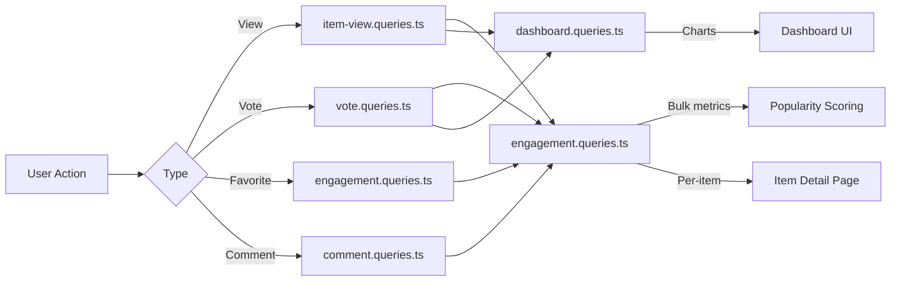

# استعلامات المشاركة والتفاعل

تعمل استعلامات المشاركة على تجميع تفاعلات المستخدم (المشاهدات والأصوات والمفضلات والتعليقات) عبر العناصر. تعمل هذه الاستعلامات على فرز الشعبية ومخططات لوحة المعلومات ولوحات المشاركة لكل عنصر. الوحدات ذات الصلة هي `engagement.queries.ts`، `vote.queries.ts`، `comment.queries.ts`، `item-view.queries.ts`، و`dashboard.queries.ts`.

## تدفق بيانات المشاركة



## مقاييس المشاركة المجمعة (`engagement.queries.ts`)

### `getEngagementMetricsPerItem`

الوظيفة الأساسية لتسجيل شعبية. إرجاع كافة أبعاد المشاركة لعناصر متعددة في دفعة استعلام متوازية واحدة:

```typescript
export async function getEngagementMetricsPerItem(
  itemSlugs: string[]
): Promise<Map<string, ItemEngagementMetrics>>
```

نوع الإرجاع:

```typescript
export interface ItemEngagementMetrics {
  views: number;
  votes: number;       // Net votes (upvotes - downvotes)
  favorites: number;
  comments: number;
  avgRating: number;   // Average rating from comments (0-5)
}
```

### استراتيجية الاستعلام الموازي

يتم تشغيل أربعة استعلامات مستقلة عبر `Promise.all` لتحقيق أقصى قدر من الإنتاجية:

```typescript
const [viewsData, votesData, favoritesData, commentsData] = await Promise.all([
  // 1. Views per item
  db.select({ itemId: itemViews.itemId, count: count() })
    .from(itemViews)
    .where(inArray(itemViews.itemId, itemSlugs))
    .groupBy(itemViews.itemId),

  // 2. Net votes per item (upvotes - downvotes)
  db.select({
      itemId: votes.itemId,
      netScore: sql<number>`SUM(CASE
        WHEN vote_type = 'upvote' THEN 1
        WHEN vote_type = 'downvote' THEN -1
        ELSE 0 END)`.as('netScore'),
    })
    .from(votes)
    .where(inArray(votes.itemId, itemSlugs))
    .groupBy(votes.itemId),

  // 3. Favorites per item
  db.select({ itemSlug: favorites.itemSlug, count: count() })
    .from(favorites)
    .where(inArray(favorites.itemSlug, itemSlugs))
    .groupBy(favorites.itemSlug),

  // 4. Comments count + average rating (excluding soft-deleted)
  db.select({
      itemId: comments.itemId,
      count: count(),
      avgRating: sql<number>`COALESCE(AVG(${comments.rating}), 0)`.as('avgRating'),
    })
    .from(comments)
    .where(and(inArray(comments.itemId, itemSlugs), isNull(comments.deletedAt)))
    .groupBy(comments.itemId),
]);
```

### تطبيع النتيجة

يتم تحويل كل نتيجة استعلام إلى `Map` للبحث عن O(1)، ثم يتم دمجها في خريطة المقاييس النهائية:

```typescript
const viewsMap = new Map<string, number>(
  viewsData.map(v => [v.itemId, Number(v.count)])
);
// ... same for votesMap, favoritesMap, commentsMap

for (const slug of itemSlugs) {
  metricsMap.set(slug, {
    views: viewsMap.get(slug) ?? 0,
    votes: votesMap.get(slug) ?? 0,
    favorites: favoritesMap.get(slug) ?? 0,
    comments: commentsMap.get(slug)?.count ?? 0,
    avgRating: commentsMap.get(slug)?.avgRating ?? 0,
  });
}
```

### وظائف مترية مستقلة

|وظيفة|المرتجعات|الوصف|
|----------|---------|-------------|
|`getFavoritesPerItem(itemSlugs)`|`Map<string, number>`|التهم المفضلة لكل عنصر|
|`getCommentsPerItem(itemSlugs)`|`Map<string, { count, avgRating }>`|عدد التعليقات ومتوسط التقييمات|

تستخدم كلتا الدالتين نفس النمط: العودة المبكرة للمصفوفات الفارغة، `groupBy` التجميع، `Map` البناء.

## استعلامات التصويت (`vote.queries.ts`)

### التصويت الخام

|وظيفة|الوصف|
|----------|-------------|
|`createVote(vote)`|إنشاء التصويت مع التطبيع سبيكة|
|`getVoteByUserIdAndItemId(userId, itemSlug)`|التحقق من التصويت الحالي|
|`deleteVote(voteId)`|من الصعب حذف التصويت|

تعمل جميع وظائف التصويت على تسوية الارتباطات الثابتة للعناصر من خلال `getItemIdFromSlug()` قبل الاستعلام.

### حساب صافي النتيجة

درجة العنصر الفردي باستخدام الشرط `SUM`:

```typescript
export async function getVoteCountForItem(itemSlug: string): Promise<number> {
  const itemId = getItemIdFromSlug(itemSlug);
  const [result] = await db
    .select({
      netScore: sql<number>`
        SUM(CASE
          WHEN vote_type = 'upvote' THEN 1
          WHEN vote_type = 'downvote' THEN -1
          ELSE 0
        END)`.as('netScore')
    })
    .from(votes)
    .where(eq(votes.itemId, itemId));
  return Number(result?.netScore ?? 0);
}
```

### عشرات التصويت بالجملة

`getVotesPerItem` تُرجع `Map<string, number>` صافي الدرجات لعناصر متعددة باستخدام `inArray` و`groupBy`.

### العناصر التي تم فرزها بالتصويت

```typescript
export async function getItemsSortedByVotes(limit = 10, offset = 0) {
  return db
    .select({
      itemId: votes.itemId,
      voteCount: sql<number>`count(${votes.id})`.as('vote_count')
    })
    .from(votes)
    .groupBy(votes.itemId)
    .orderBy(sql`vote_count DESC`)
    .limit(limit)
    .offset(offset);
}
```

## استعلامات التعليق (`comment.queries.ts`)

### التعليق الخام

|وظيفة|الوصف|
|----------|-------------|
|`createComment(data)`|إنشاء مع التطبيع سبيكة|
|`getCommentById(id)`|سجل التعليق الخام|
|`getCommentWithUserById(id)`|التعليق مع ملف تعريف المستخدم الانضمام|
|`updateComment(id, { content?, rating? })`|قم بالتحديث باستخدام `editedAt` الطابع الزمني|
|`updateCommentRating(id, rating)`|تحديث للتقييم فقط|
|`deleteComment(id)`|الحذف الناعم (`deletedAt = new Date()`)|

### التعليقات مع بيانات المستخدم

`getCommentsByItemId` يستخدم `innerJoin` مع `clientProfiles` لإثراء كل تعليق بمعلومات المؤلف:

```typescript
export async function getCommentsByItemId(itemSlug: string): Promise<CommentWithUser[]> {
  const itemId = getItemIdFromSlug(itemSlug);
  return db
    .select({
      id: comments.id,
      content: comments.content,
      rating: comments.rating,
      userId: comments.userId,
      itemId: comments.itemId,
      createdAt: comments.createdAt,
      updatedAt: comments.updatedAt,
      editedAt: comments.editedAt,
      deletedAt: comments.deletedAt,
      user: {
        id: clientProfiles.id,
        name: clientProfiles.name,
        email: clientProfiles.email,
        image: clientProfiles.avatar
      }
    })
    .from(comments)
    .innerJoin(clientProfiles, eq(comments.userId, clientProfiles.id))
    .where(and(eq(comments.itemId, itemId), isNull(comments.deletedAt)))
    .orderBy(desc(comments.createdAt));
}
```

## عرض التتبع (`item-view.queries.ts`)

### إلغاء البيانات المكررة يوميًا

يتم إلغاء تكرار المشاهدات لكل عارض لكل عنصر لكل يوم UTC باستخدام نمط `onConflictDoNothing`:

```typescript
export async function recordItemView(
  view: Pick<NewItemView, 'itemId' | 'viewerId' | 'viewedDateUtc'>
): Promise<boolean> {
  const result = await db
    .insert(itemViews)
    .values(view)
    .onConflictDoNothing()
    .returning({ id: itemViews.id });
  return result.length > 0; // true = new view, false = duplicate
}
```

### عرض وظائف التجميع

|وظيفة|المعلمات|المرتجعات|الوصف|
|----------|-----------|---------|-------------|
|`getTotalViewsCount(itemSlugs)`|`string[]`|`number`|إجمالي المشاهدات عبر العناصر|
|`getRecentViewsCount(itemSlugs, days)`|`string[], number`|`number`|المشاهدات في آخر N أيام|
|`getDailyViewsData(itemSlugs, days)`|`string[], number`|`Map<string, number>`|عدد المشاهدات اليومية|
|`getViewsPerItem(itemSlugs)`|`string[]`|`Map<string, number>`|عدد مرات المشاهدة لكل عنصر|

### مساعد تاريخ UTC

تستخدم جميع حسابات التاريخ التوقيت العالمي المنسق (UTC) لمنع الأخطاء المتعلقة بالمنطقة الزمنية:

```typescript
function getUtcDateString(daysAgo: number = 0): string {
  const date = new Date();
  date.setUTCDate(date.getUTCDate() - daysAgo);
  return date.toISOString().split('T')[0]; // "YYYY-MM-DD"
}
```

## إحصائيات لوحة المعلومات (`dashboard.queries.ts`)

### المقاييس المتاحة

|وظيفة|الغرض|
|----------|---------|
|`getVotesReceivedCount(itemSlugs)`|إجمالي الأصوات على عناصر المستخدم|
|`getCommentsReceivedCount(itemSlugs)`|إجمالي التعليقات على عناصر المستخدم|
|`getUniqueItemsInteractedCount(clientId)`|العناصر التي تفاعل معها المستخدم|
|`getUserTotalActivityCount(clientId)`|إجمالي الأصوات + التعليقات من قبل المستخدم|
|`getWeeklyEngagementData(itemSlugs, weeks)`|بيانات الرسم البياني المجمعة الأسبوعية|
|`getDailyActivityData(clientId, itemSlugs, days)`|تقسيم النشاط اليومي|
|`getTopItemsEngagement(itemSlugs, limit)`|أهم العناصر حسب درجة المشاركة|

### تجميع المشاركة الأسبوعية

يستخدم PostgreSQL's `to_char` بتنسيق أسبوع ISO لتجميع الأسبوع بشكل متسق:

```typescript
const weeklyVotes = await db
  .select({
    week: sql<string>`to_char(${votes.createdAt}, 'IYYY-IW')`.as('week'),
    count: count(),
  })
  .from(votes)
  .where(and(inArray(votes.itemId, itemSlugs), gte(votes.createdAt, startDate)))
  .groupBy(sql`to_char(${votes.createdAt}, 'IYYY-IW')`)
  .orderBy(sql`to_char(${votes.createdAt}, 'IYYY-IW')`);
```

## اعتبارات الأداء

- تقبل جميع الوظائف المجمعة المصفوفات وتستخدم `inArray` لمعالجة الدفعات
- تعود مدخلات المصفوفة الفارغة مبكرًا دون الوصول إلى قاعدة البيانات
- `Promise.all` يدير مجموعات مستقلة بشكل متزامن
- `Map` توفر هياكل البيانات بحث O(1) أثناء تجميع النتائج
- يتم استبعاد التعليقات المحذوفة بشكل أولي عبر `isNull(comments.deletedAt)` في جميع المجموعات
