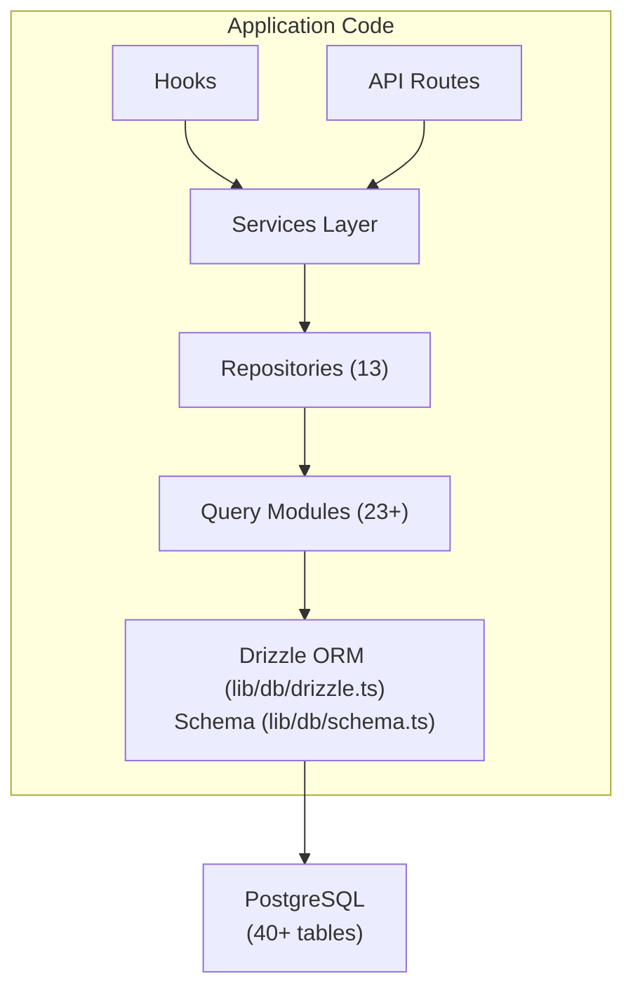

# نظرة عامة على قاعدة البيانات

يستخدم قالب Ever Works **Drizzle ORM** مع **PostgreSQL** كطبقة قاعدة البيانات الخاصة به. قاعدة البيانات اختيارية - يمكن تشغيل التطبيق بدونها لعمليات نشر المحتوى فقط - ولكنها تعمل على تشغيل جميع ميزات المستخدم والاشتراك والمشاركة والمسؤول.

## كومة التكنولوجيا

|مكون|التكنولوجيا|الغرض|
|-----------|-----------|---------|
|ORM|رذاذ ORM|منشئ الاستعلامات وإدارة المخططات آمن النوع|
|قاعدة البيانات|PostgreSQL|قاعدة البيانات العلائقية الأولية|
|سائق|`postgres` (postgres.js)|عميل PostgreSQL لـ Node.js|
|الهجرات|طقم الرذاذ|إنشاء وتنفيذ ترحيل المخطط|
|البذر|`drizzle-seed` + نصوص برمجية مخصصة|تهيئة قاعدة البيانات بالبيانات الافتراضية|

## هندسة قاعدة البيانات



## التكوين

### تكوين الرذاذ (`drizzle.config.ts`)

```typescript
export default {
  schema: "./lib/db/schema.ts",
  out: "./lib/db/migrations",
  dialect: "postgresql",
  dbCredentials: {
    url: process.env.DATABASE_URL,
  },
} satisfies Config;
```

يشير التكوين إلى:
- **ملف المخطط**: `lib/db/schema.ts` - المصدر الوحيد للحقيقة لجميع تعريفات الجدول
- **مخرجات الترحيل**: `lib/db/migrations/` - حيث يتم تخزين ملفات ترحيل SQL التي تم إنشاؤها
- ** اللهجة **: PostgreSQL
- **الاتصال**: عبر `DATABASE_URL` متغير البيئة

### إدارة الاتصال (`lib/db/drizzle.ts`)

تتم تهيئة اتصال قاعدة البيانات بتكاسل عند الاستخدام الأول وإعادة استخدام الاتصالات عبر عمليات إعادة التحميل الساخنة في التطوير عبر نمط مفرد عالمي.

الميزات الرئيسية:
- **التهيئة البطيئة**: لا يتم إنشاء اتصال قاعدة البيانات حتى يتم تنفيذ الاستعلام الأول
- ** الوصول المستند إلى الوكيل **: يستخدم الكائن `db` المصدر JavaScript `Proxy` لتهيئة الاتصال بشفافية
- **تجميع الاتصالات**: حجم التجمع القابل للتكوين عبر `DB_POOL_SIZE` متغير البيئة (الافتراضي: 20 في الإنتاج، 10 في التطوير، مثبت من 1 إلى 50)
- **مهلة الخمول**: يتم تحرير الاتصالات بعد 20 ثانية من عدم النشاط
- **مهلة الاتصال**: مهلة 30 ثانية لإنشاء اتصالات جديدة
- **نمط Singleton**: يستخدم `globalThis` لاستمرار الاتصالات عبر عمليات إعادة التحميل السريعة لـ Next.js

```typescript
// Usage - just import and use
import { db } from '@/lib/db/drizzle';

const users = await db.select().from(schema.users);
```

### متغيرات البيئة

|متغير|مطلوب|الافتراضي|الوصف|
|----------|----------|---------|-------------|
|`DATABASE_URL`|لا| - |سلسلة اتصال PostgreSQL|
|`DB_POOL_SIZE`|لا| 10/20 |حجم تجمع الاتصال (المطور/المنتج)|

عند عدم تعيين `DATABASE_URL`، يتم تعطيل ميزات قاعدة البيانات بصمت، مما يسمح بتشغيل التطبيق في وضع المحتوى فقط.

## نظرة عامة على المخطط

يتم تعريف مخطط قاعدة البيانات في ملف واحد (`lib/db/schema.ts`) يحتوي على أكثر من 40 جدولًا منظمة حسب المجال:

|المجال|الجداول|الوصف|
|--------|--------|-------------|
|المستخدمون والمصادقة| 8 |المستخدمون، الحسابات، الجلسات، الرموز المميزة، المصادقون|
|الأدوار والأذونات| 3 |RBAC مع الأدوار والأذونات وتعيينات أذونات الأدوار|
|ملفات تعريف العملاء| 1 |ملفات تعريف المستخدمين الموسعة لحسابات العملاء|
|مشاركة المحتوى| 4 |التعليقات والأصوات والمفضلة وطرق عرض العناصر|
|الاشتراكات| 4 |الخطط وتاريخ الاشتراك ومقدمي الدفع وحسابات الدفع|
|الإخطارات| 1 |نظام الإخطار داخل التطبيق|
|الإدارة والإشراف| 4 |التقارير وسجل الإشراف وسجلات تدقيق العناصر وسجلات الأنشطة|
|التكامل| 2 |تكوين CRM وتعيينات التكامل|
|الشركات| 2 |الشركات وجمعيات شركة البند|
|إعلانات الراعي| 1 |إعلانات العناصر المدعومة|
|المسوحات| 2 |المسوحات والردود على المسوحات|
|النشرة الإخبارية| 1 |اشتراكات النشرة الإخبارية|
|النظام| 1 |تتبع حالة البذور|

## تهيئة قاعدة البيانات

عند بدء تشغيل التطبيق (عبر `instrumentation.ts`)، يقوم القالب تلقائيًا بما يلي:

1. ** تشغيل عمليات الترحيل **: تطبق وظيفة Drizzle `migrate()` أي عمليات ترحيل معلقة (يتم تخطي عمليات الترحيل المطبقة بالفعل)
2. **بيانات البذور**: إذا لم يتم دمج قاعدة البيانات، فسيتم تشغيل البرنامج النصي الأولي مع حماية القفل الاستشارية لمنع حالات السباق في عمليات النشر متعددة العمليات

يتم التعامل مع هذا بواسطة `lib/db/initialize.ts`. راجع [Migrations Guide](./migrations-guide) و[Database Seeding](./seeding) للحصول على التفاصيل.

## الأوامر الرئيسية

```bash
# Generate a migration from schema changes
pnpm db:generate

# Run pending migrations
pnpm db:migrate

# Seed the database
pnpm db:seed

# Open Drizzle Studio (database GUI)
pnpm db:studio
```
