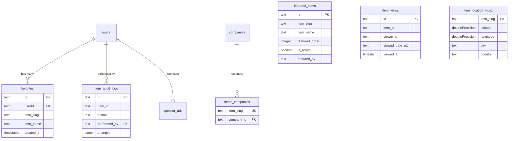

# العناصر مخطط الغوص العميق

## نظرة عامة

في قالب Ever Works، **يتم تخزين العناصر في نظام إدارة محتوى يستند إلى Git** (دليل `.content/`)، وليس في جدول قاعدة بيانات تقليدي. ومع ذلك، تدعم جداول قاعدة البيانات المتعددة العمليات المتعلقة بالعناصر مثل تعقب طرق العرض ومراجعة التغييرات وفهرسة المواقع وإدارة المفضلة وعرض العناصر وربط العناصر بالشركات.

توثق هذه الصفحة كل جدول قاعدة بيانات يشير إلى العناصر أو يدعمها.

**الملف المصدر:** `template/lib/db/schema.ts`

---

## Item-Supporting Tables

| Table | Purpose |
|---|---|
| `favorites` | User-saved favorite items |
| `featured_items` | Admin-curated featured items |
| `item_views` | Per-day unique view tracking |
| `item_audit_logs` | Complete change history for admin panel |
| `item_location_index` | Geospatial index for "Near Me" filtering |
| `items_companies` | Links items to company records |
| `location_index_meta` | Singleton metadata for location index |

---

## الجدول: `favorites`

يخزن إشارة المستخدم المرجعية/علاقاته المفضلة بالعناصر، التي تم تحديدها بواسطة سبيكة.

### أعمدة

|العمود|اسم قاعدة البيانات|اكتب|لاغية|الافتراضي|القيود|
|---|---|---|---|---|---|
|`id`|`id`|`text`|لا|`crypto.randomUUID()`|المفتاح الأساسي|
|`userId`|`userId`|`text`|لا| - |FK -> `users.id` (CASCADE)|
|`itemSlug`|`item_slug`|`text`|لا| - | - |
|`itemName`|`item_name`|`text`|لا| - | - |
|`itemIconUrl`|`item_icon_url`|`text`|نعم| - | - |
|`itemCategory`|`item_category`|`text`|نعم| - | - |
|`createdAt`|`created_at`|`timestamp`|لا|`now()`| - |
|`updatedAt`|`updated_at`|`timestamp`|لا|`now()`| - |

### الفهارس

|الاسم|أعمدة|اكتب|
|---|---|---|
|`user_item_favorite_unique_idx`|`(userId, itemSlug)`|فريدة من نوعها|
|`favorites_user_id_idx`|`userId`|شجرة ب|
|`favorites_item_slug_idx`|`itemSlug`|شجرة ب|
|`favorites_created_at_idx`|`createdAt`|شجرة ب|

### أنواع تايب سكريبت

```typescript
export type Favorite = typeof favorites.$inferSelect;
export type NewFavorite = typeof favorites.$inferInsert;
export type FavoriteWithUser = Favorite & {
    user: typeof users.$inferSelect;
};
```

---

## Table: `featured_items`

Admin-curated list of items to highlight on the site. Supports ordering and optional expiration.

### Columns

| Column | DB Name | Type | Nullable | Default | Constraints |
|---|---|---|---|---|---|
| `id` | `id` | `text` | No | `crypto.randomUUID()` | Primary Key |
| `itemSlug` | `item_slug` | `text` | No | - | - |
| `itemName` | `item_name` | `text` | No | - | - |
| `itemIconUrl` | `item_icon_url` | `text` | Yes | - | - |
| `itemCategory` | `item_category` | `text` | Yes | - | - |
| `itemDescription` | `item_description` | `text` | Yes | - | - |
| `featuredOrder` | `featured_order` | `integer` | No | `0` | Display ordering |
| `featuredUntil` | `featured_until` | `timestamp` | Yes | - | Optional expiration |
| `isActive` | `is_active` | `boolean` | No | `true` | - |
| `featuredBy` | `featured_by` | `text` | No | - | Admin user ID |
| `featuredAt` | `featured_at` | `timestamp` | No | `now()` | - |
| `createdAt` | `created_at` | `timestamp` | No | `now()` | - |
| `updatedAt` | `updated_at` | `timestamp` | No | `now()` | - |

### Indexes

| Name | Columns | Type |
|---|---|---|
| `featured_items_item_slug_idx` | `itemSlug` | B-tree |
| `featured_items_featured_order_idx` | `featuredOrder` | B-tree |
| `featured_items_is_active_idx` | `isActive` | B-tree |
| `featured_items_featured_at_idx` | `featuredAt` | B-tree |
| `featured_items_featured_until_idx` | `featuredUntil` | B-tree |

### TypeScript Types

```typescript
export type FeaturedItem = typeof featuredItems.$inferSelect;
export type NewFeaturedItem = typeof featuredItems.$inferInsert;
```

---

## الجدول: `item_views`

يتتبع المشاهدات اليومية الفريدة لكل عنصر. يستخدم تعريف العارض المجهول المستند إلى ملف تعريف الارتباط وإلغاء البيانات المكررة لتاريخ UTC. لا يخزن عناوين IP للخصوصية.

### أعمدة

|العمود|اسم قاعدة البيانات|اكتب|لاغية|الافتراضي|القيود|
|---|---|---|---|---|---|
|`id`|`id`|`text`|لا|`crypto.randomUUID()`|المفتاح الأساسي|
|`itemId`|`item_id`|`text`|لا| - |سبيكة البند|
|`viewerId`|`viewer_id`|`text`|لا| - |معرف ملف تعريف الارتباط المجهول|
|`viewedDateUtc`|`viewed_date_utc`|`text`|لا| - |تنسيق YYYY-MM-DD|
|`viewedAt`|`viewed_at`|`timestamp (tz)`|لا|`now()`|وقت المشاهدة الدقيق|

### الفهارس

|الاسم|أعمدة|اكتب|
|---|---|---|
|`item_views_unique_daily_idx`|`(itemId, viewerId, viewedDateUtc)`|فريدة من نوعها|
|`item_views_item_date_idx`|`(itemId, viewedDateUtc)`|شجرة B المركبة|

### أنواع تايب سكريبت

```typescript
export type ItemView = typeof itemViews.$inferSelect;
export type NewItemView = typeof itemViews.$inferInsert;
```

---

## Table: `item_audit_logs`

Stores the complete change history for items managed through the admin panel. Since items live in Git, `itemId` is the slug (not a foreign key).

### Columns

| Column | DB Name | Type | Nullable | Default | Constraints |
|---|---|---|---|---|---|
| `id` | `id` | `text` | No | `crypto.randomUUID()` | Primary Key |
| `itemId` | `item_id` | `text` | No | - | Item slug |
| `itemName` | `item_name` | `text` | No | - | Denormalized |
| `action` | `action` | `text (enum)` | No | - | See enum values below |
| `previousStatus` | `previous_status` | `text` | Yes | - | For status changes |
| `newStatus` | `new_status` | `text` | Yes | - | For status changes |
| `changes` | `changes` | `jsonb` | Yes | - | `{ field: { old, new } }` |
| `performedBy` | `performed_by` | `text` | Yes | - | FK -> `users.id` (SET NULL) |
| `performedByName` | `performed_by_name` | `text` | Yes | - | Denormalized |
| `notes` | `notes` | `text` | Yes | - | Review notes |
| `metadata` | `metadata` | `jsonb` | Yes | - | IP, user agent, etc. |
| `createdAt` | `created_at` | `timestamp (tz)` | No | `now()` | - |

### Action Enum Values

```typescript
export const ItemAuditAction = {
    CREATED: 'created',
    UPDATED: 'updated',
    STATUS_CHANGED: 'status_changed',
    REVIEWED: 'reviewed',
    DELETED: 'deleted',
    RESTORED: 'restored'
} as const;
```

### Indexes

| Name | Columns | Type |
|---|---|---|
| `item_audit_logs_item_id_idx` | `itemId` | B-tree |
| `item_audit_logs_action_idx` | `action` | B-tree |
| `item_audit_logs_performed_by_idx` | `performedBy` | B-tree |
| `item_audit_logs_created_at_idx` | `createdAt` | B-tree |
| `item_audit_logs_item_id_action_idx` | `(itemId, action)` | Composite B-tree |

### TypeScript Types

```typescript
export type ItemAuditLog = typeof itemAuditLogs.$inferSelect;
export type NewItemAuditLog = typeof itemAuditLogs.$inferInsert;
export type ItemAuditChanges = Record<string, { old: unknown; new: unknown }>;
```

---

## الجدول: `item_location_index`

الفهرس الجغرافي المكاني للعناصر، مما يتيح تصفية "بالقرب مني" والفرز على أساس المسافة. هذا جدول للفهرس فقط - يبقى مصدر الحقيقة في Git CMS.

### أعمدة

|العمود|اسم قاعدة البيانات|اكتب|لاغية|الافتراضي|القيود|
|---|---|---|---|---|---|
|`itemSlug`|`item_slug`|`text`|لا| - |المفتاح الأساسي|
|`latitude`|`latitude`|`doublePrecision`|لا| - | - |
|`longitude`|`longitude`|`doublePrecision`|لا| - | - |
|`address`|`address`|`text`|نعم| - | - |
|`city`|`city`|`text`|نعم| - | - |
|`state`|`state`|`text`|نعم| - | - |
|`country`|`country`|`text`|نعم| - | - |
|`cityNormalized`|`city_normalized`|`text`|نعم| - |أحرف صغيرة، مشذبة|
|`countryNormalized`|`country_normalized`|`text`|نعم| - |أحرف صغيرة، مشذبة|
|`postalCode`|`postal_code`|`text`|نعم| - | - |
|`serviceArea`|`service_area`|`text`|نعم| - | - |
|`isRemote`|`is_remote`|`boolean`|لا|`false`| - |
|`indexedAt`|`indexed_at`|`timestamp (tz)`|لا|`now()`| - |

### الفهارس

|الاسم|أعمدة|اكتب|
|---|---|---|
|`item_location_index_latitude_idx`|`latitude`|شجرة ب|
|`item_location_index_longitude_idx`|`longitude`|شجرة ب|
|`item_location_index_city_idx`|`city`|شجرة ب|
|`item_location_index_country_idx`|`country`|شجرة ب|
|`item_location_index_city_normalized_idx`|`cityNormalized`|شجرة ب|
|`item_location_index_country_normalized_idx`|`countryNormalized`|شجرة ب|
|`item_location_index_is_remote_idx`|`isRemote`|شجرة ب|
|`item_location_index_indexed_at_idx`|`indexedAt`|شجرة ب|
|`item_location_index_lat_long_idx`|`(latitude, longitude)`|شجرة B المركبة|

### أنواع تايب سكريبت

```typescript
export type ItemLocationIndex = typeof itemLocationIndex.$inferSelect;
export type NewItemLocationIndex = typeof itemLocationIndex.$inferInsert;
```

---

## Table: `items_companies`

Links item slugs to company database records.

### Columns

| Column | DB Name | Type | Nullable | Default | Constraints |
|---|---|---|---|---|---|
| `itemSlug` | `item_slug` | `text` | No | - | Unique |
| `companyId` | `company_id` | `text` | No | - | FK -> `companies.id` (CASCADE) |
| `createdAt` | `created_at` | `timestamp (tz)` | No | `now()` | - |
| `updatedAt` | `updated_at` | `timestamp (tz)` | No | `now()` | - |

### Indexes

| Name | Columns | Type |
|---|---|---|
| `items_companies_company_id_idx` | `companyId` | B-tree |

---

## الجدول: `location_index_meta`

يقوم فهرس موقع تتبع الجدول الفردي بإعادة بناء البيانات التعريفية عبر عمليات النشر.

### أعمدة

|العمود|اسم قاعدة البيانات|اكتب|لاغية|الافتراضي|القيود|
|---|---|---|---|---|---|
|`id`|`id`|`text`|لا|`'singleton'`|المفتاح الأساسي|
|`lastRebuildAt`|`last_rebuild_at`|`timestamp (tz)`|نعم| - | - |
|`lastRebuildDurationMs`|`last_rebuild_duration_ms`|`integer`|نعم| - | - |
|`lastRebuildItemCount`|`last_rebuild_item_count`|`integer`|نعم| - | - |
|`updatedAt`|`updated_at`|`timestamp (tz)`|لا|`now()`| - |

### الفهارس

|الاسم|أعمدة|اكتب|
|---|---|---|
|`location_index_meta_singleton_idx`|`id`|فريدة من نوعها|

---

## Relations Diagram



---

## أمثلة الاستعلام

### جلب المفضلة للمستخدم

```typescript
import { db } from '@/lib/db/drizzle';
import { favorites } from '@/lib/db/schema';
import { eq } from 'drizzle-orm';

const userFavorites = await db
    .select()
    .from(favorites)
    .where(eq(favorites.userId, userId));
```

### تسجيل عرض العنصر

```typescript
import { itemViews } from '@/lib/db/schema';

await db.insert(itemViews).values({
    itemId: 'my-item-slug',
    viewerId: cookieViewerId,
    viewedDateUtc: '2025-01-15',
}).onConflictDoNothing();
```

### احصل على العناصر المميزة النشطة

```typescript
import { featuredItems } from '@/lib/db/schema';
import { eq, asc, or, isNull, gte } from 'drizzle-orm';

const featured = await db
    .select()
    .from(featuredItems)
    .where(eq(featuredItems.isActive, true))
    .orderBy(asc(featuredItems.featuredOrder));
```

### البحث عن عناصر بالقرب من موقع (المربع المحيط)

```typescript
import { itemLocationIndex } from '@/lib/db/schema';
import { and, between } from 'drizzle-orm';

const nearby = await db
    .select()
    .from(itemLocationIndex)
    .where(
        and(
            between(itemLocationIndex.latitude, minLat, maxLat),
            between(itemLocationIndex.longitude, minLng, maxLng)
        )
    );
```

### الحصول على سجل التدقيق لأحد العناصر

```typescript
import { itemAuditLogs } from '@/lib/db/schema';
import { eq, desc } from 'drizzle-orm';

const history = await db
    .select()
    .from(itemAuditLogs)
    .where(eq(itemAuditLogs.itemId, 'my-item-slug'))
    .orderBy(desc(itemAuditLogs.createdAt));
```

---

## Design Notes

- **Items are NOT in the database.** They live in a Git-based CMS cloned into `.content/`. The database only stores metadata, indexes, and relationships.
- **Item identification is by slug.** All item-supporting tables reference items via `item_slug` or `item_id` (which IS the slug), not via foreign keys.
- **Denormalization is intentional.** Tables like `favorites` and `featured_items` store `item_name` and `item_icon_url` to avoid cross-system lookups at read time.
- **Privacy-first views.** The `item_views` table uses anonymous cookie IDs and does not store IP addresses.
