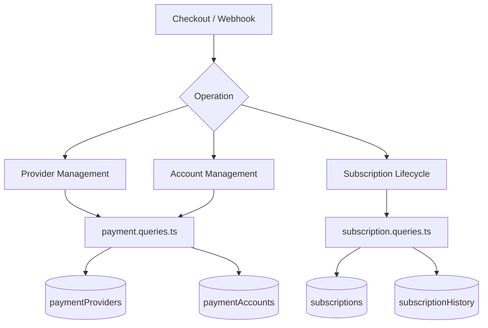
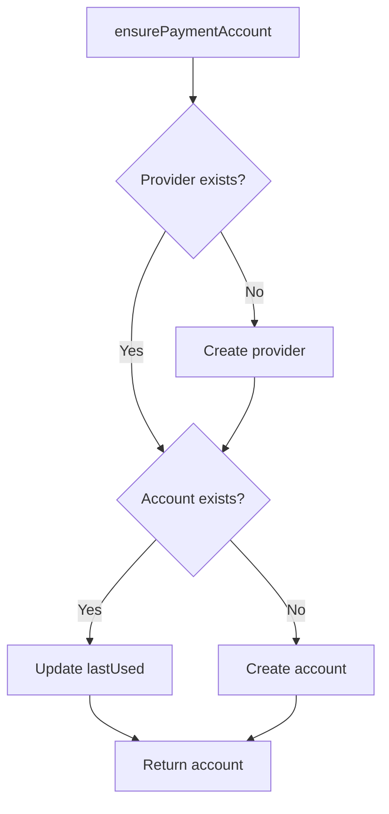
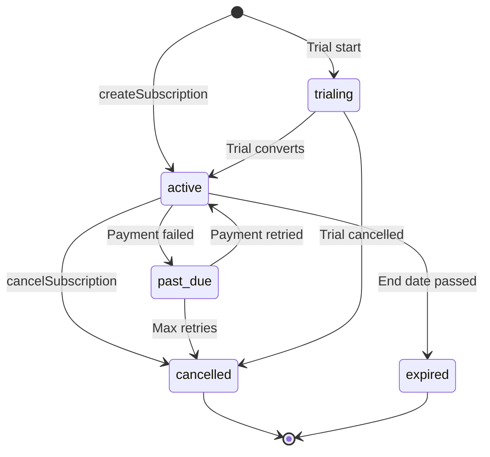

# استعلامات الدفع والاشتراك

تدير استعلامات الدفع سجل الموفر وحسابات دفع المستخدمين ودورة حياة الاشتراك الكاملة. الوحدات ذات الصلة هي `payment.queries.ts` و`subscription.queries.ts`.

## بنية نظام الدفع



## استعلامات مزود الدفع (`payment.queries.ts`)

### مزود الخام

|وظيفة|الوصف|
|----------|-------------|
|`getPaymentProvider(id)`|الحصول على المزود عن طريق الهوية|
|`getPaymentProviderByName(name)`|احصل على الموفر بالاسم (على سبيل المثال، `'stripe'`)|
|`getActivePaymentProviders()`|قم بإدراج جميع مقدمي الخدمات النشطين، مرتبة حسب الاسم|
|`createPaymentProvider(data)`|إنشاء سجل مزود جديد|
|`updatePaymentProvider(id, data)`|التحديث الجزئي لحقول الموفر|
|`deactivatePaymentProvider(id)`|تعيين `isActive = false`|

أسماء الموفرين المعتمدين: `stripe`، `lemonsqueezy`، `polar`، `solidgate`.

### استعلامات حساب الدفع

تربط حسابات الدفع المستخدم بمعرف عميل خاص بالموفر:

|وظيفة|الوصف|
|----------|-------------|
|`getPaymentAccountByUserId(userId, providerId)`|احصل على حساب مع فحص المزود النشط|
|`getPaymentAccountByCustomerId(customerId, providerId)`|البحث العكسي عن طريق معرف العميل|
|`createPaymentAccount(data)`|قم بإنشاء حساب باستخدام `lastUsed` الطابع الزمني|
|`updatePaymentAccountLastUsed(accountId)`|المس `lastUsed` الطابع الزمني|
|`getUserPaymentAccountByProvider(userId, providerName)`|البحث حسب اسم الموفر (يحل الموفر أولاً)|

### التحقق من صحة الموفر النشط

`getPaymentAccountByUserId` ينفذ صلة داخلية ثلاثية للتأكد من صلاحية كل من الموفر والمستخدم:

```typescript
export async function getPaymentAccountByUserId(
  userId: string,
  providerId: string
): Promise<PaymentAccount | null> {
  const result = await db
    .select({ /* payment account fields */ })
    .from(paymentAccounts)
    .innerJoin(paymentProviders, eq(paymentAccounts.providerId, paymentProviders.id))
    .innerJoin(users, eq(paymentAccounts.userId, users.id))
    .where(and(
      eq(paymentAccounts.userId, userId),
      eq(paymentAccounts.providerId, providerId),
      eq(paymentProviders.isActive, true)
    ))
    .limit(1);
  return result[0] || null;
}
```

### التأكد من حساب الدفع

`ensurePaymentAccount` يطبق نمط upsert غير فعال لحسابات الدفع:



```typescript
export async function ensurePaymentAccount(
  providerName: string,
  userId: string,
  customerId: string,
  accountId?: string
): Promise<PaymentAccount>
```

### إعداد حساب دفع المستخدم

`setupUserPaymentAccount` يوسع نمط الضمان من خلال اكتشاف تغيير معرف العميل:

```typescript
if (existingAccount.customerId !== customerId) {
  await db
    .update(paymentAccounts)
    .set({
      customerId,
      accountId: accountId || existingAccount.accountId,
      lastUsed: new Date(),
      updatedAt: new Date()
    })
    .where(eq(paymentAccounts.id, existingAccount.id));
}
```

### الأسماء المستعارة الراحة

- `getOrCreatePaymentAccount` - الاسم المستعار لـ `ensurePaymentAccount`
- `createOrGetPaymentAccount` - الاسم المستعار لـ `setupUserPaymentAccount`

## استعلامات الاشتراك (`subscription.queries.ts`)

### بحث الاشتراك

|وظيفة|المعلمات|المرتجعات|
|----------|-----------|---------|
|`getUserActiveSubscription(userId)`|معرف المستخدم|اشتراك نشط أو فارغ|
|`getUserSubscriptions(userId)`|معرف المستخدم|جميع الاشتراكات (مرتبة حسب التاريخ)|
|`getSubscriptionByProviderSubscriptionId(provider, subId)`|الموفر + المعرف الفرعي|الاشتراك أو فارغة|
|`getSubscriptionByUserIdAndSubscriptionId(userId, subId)`|المستخدم + المعرف الفرعي|الاشتراك أو فارغة|
|`getSubscriptionWithUser(subId)`|معرف الاشتراك|الاشتراك مع انضمام المستخدم|
|`hasActiveSubscription(userId)`|معرف المستخدم|منطقية|

### دورة حياة الاشتراك

#### إنشاء

```typescript
export async function createSubscription(data: NewSubscription): Promise<Subscription> {
  const result = await db
    .insert(subscriptions)
    .values({ ...data, createdAt: new Date(), updatedAt: new Date() })
    .returning();
  return result[0];
}
```

#### تحديث الحالة

يتم ضبط تغييرات الحالة تلقائيًا على `cancelledAt` و`cancelReason` عند الانتقال إلى `CANCELLED`:

```typescript
export async function updateSubscriptionStatus(
  subscriptionId: string,
  status: string,
  reason?: string
): Promise<Subscription | null>
```

#### إلغاء

يدعم كلا من الإلغاء الفوري وإلغاء نهاية الفترة:

```typescript
export async function cancelSubscription(
  subscriptionId: string,
  reason?: string,
  cancelAtPeriodEnd: boolean = false
): Promise<Subscription | null>
```

عند `cancelAtPeriodEnd = true`، تظل الحالة `ACTIVE` ولكن يتم تعيين `cancelledAt` و`cancelAtPeriodEnd`.

### تدفق حالة الاشتراك



### قرار الخطة

`getUserPlan` يتحقق من انتهاء صلاحية الاشتراك ويعود إلى الخطة المجانية:

```typescript
export async function getUserPlan(userId: string): Promise<string> {
  const subscription = await getUserActiveSubscription(userId);
  if (!subscription) return PaymentPlan.FREE;
  return getEffectivePlan(subscription.planId, subscription.endDate, subscription.status);
}
```

`getUserPlanWithExpiration` يُرجع تفاصيل انتهاء الصلاحية الكاملة:

```typescript
{
  planId: string;         // Stored plan
  effectivePlan: string;  // Actual plan after expiration check
  isExpired: boolean;
  expiresAt: Date | null;
  status: string | null;
  subscriptionId: string | null;
}
```

### انتهاء الصلاحية والتجديد

|وظيفة|الوصف|
|----------|-------------|
|`getSubscriptionsExpiringSoon(days)`|تنتهي الاشتراكات النشطة خلال N من الأيام|
|`getExpiredSubscriptions()`|تجاوزت الاشتراكات تاريخ انتهائها|
|`getSubscriptionsForRenewalReminder(days)`|الاشتراكات التي تحتاج إلى إشعارات التجديد|

### تاريخ الاشتراك

يتم تسجيل التغييرات في الجدول `subscriptionHistory`:

```typescript
export async function logSubscriptionHistory(data: NewSubscriptionHistory)
export async function getSubscriptionHistory(subscriptionId: string)
```

### إحصائيات الاشتراك

`getSubscriptionStats` يُرجع الأعداد الإجمالية:

```typescript
{
  total: number;
  active: number;
  cancelled: number;
  expired: number;
  pastDue: number;
  trialing: number;
}
```

## ثوابت المخطط

```typescript
// lib/db/schema.ts
export const SubscriptionStatus = {
  ACTIVE: 'active',
  CANCELLED: 'cancelled',
  EXPIRED: 'expired',
  PAST_DUE: 'past_due',
  TRIALING: 'trialing',
} as const;

// lib/constants/payment.ts
export const PaymentPlan = {
  FREE: 'free',
  STANDARD: 'standard',
  PREMIUM: 'premium',
} as const;

export const PaymentProvider = {
  STRIPE: 'stripe',
  LEMONSQUEEZY: 'lemonsqueezy',
  POLAR: 'polar',
  SOLIDGATE: 'solidgate',
} as const;
```
