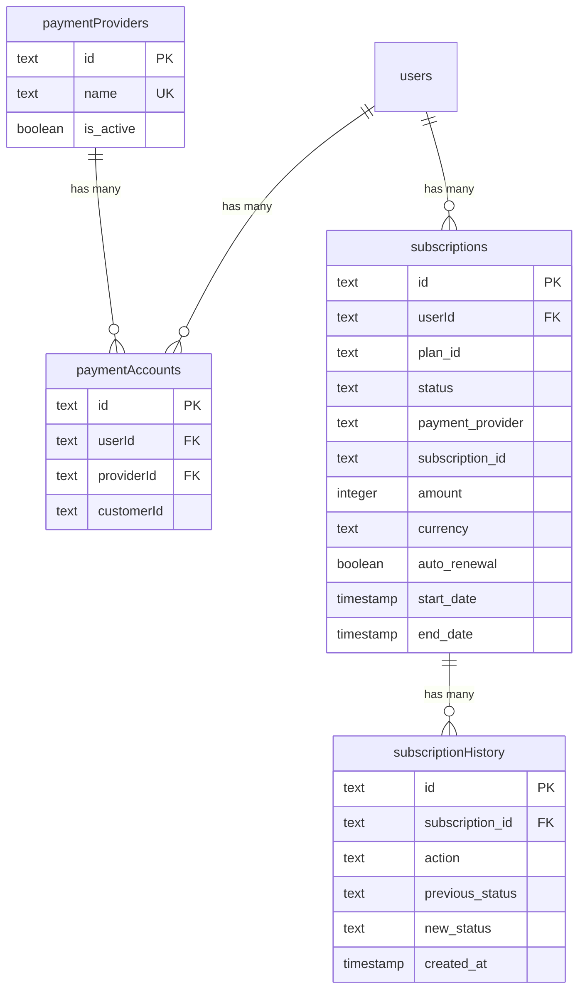
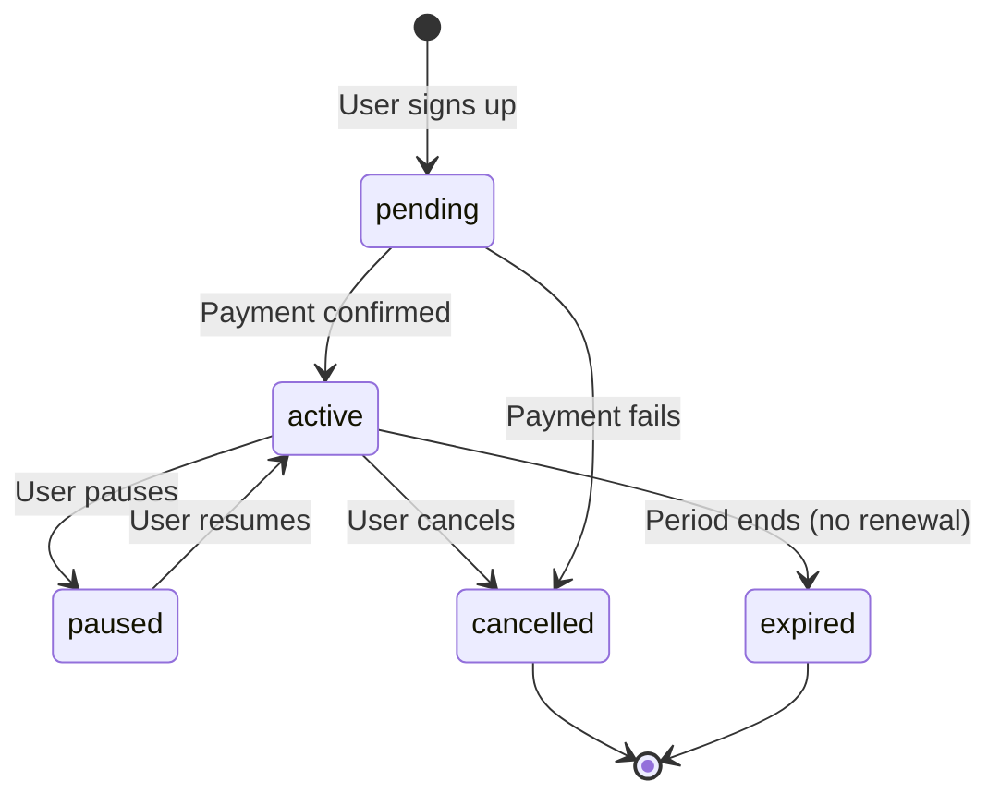

# مخطط المدفوعات والاشتراكات، نظرة عميقة

## نظرة عامة

تتعامل وحدة المدفوعات مع دورة حياة الاشتراك الكاملة: مقدمو خدمات الدفع، وحسابات العملاء، والاشتراكات مع الدعم التجريبي، وإدارة التجديد التلقائي، ومسار تدقيق كامل لسجل الاشتراك. يدعم النظام العديد من مقدمي خدمات الدفع (Stripe، Solidgate، LemonSqueezy، Polar).

**الملف المصدر:** `template/lib/db/schema.ts`
**الثوابت:** `template/lib/constants/payment.ts`
**ملف العلاقات:** `template/lib/db/migrations/relations.ts`

---

## Tables in This Module

| Table | Purpose |
|---|---|
| `paymentProviders` | Registry of available payment providers |
| `paymentAccounts` | Links users to their payment provider customer IDs |
| `subscriptions` | Active and historical subscription records |
| `subscriptionHistory` | Audit trail of subscription lifecycle events |

---

## الجدول: `paymentProviders`

سجل مقدمي خدمات الدفع المدعومة.

### أعمدة

|العمود|اسم قاعدة البيانات|اكتب|لاغية|الافتراضي|القيود|
|---|---|---|---|---|---|
|`id`|`id`|`text`|لا|`crypto.randomUUID()`|المفتاح الأساسي|
|`name`|`name`|`text`|لا|`'stripe'`|فريدة من نوعها|
|`isActive`|`is_active`|`boolean`|لا|`true`| - |
|`createdAt`|`created_at`|`timestamp`|لا|`now()`| - |
|`updatedAt`|`updated_at`|`timestamp`|لا|`now()`| - |

### الفهارس

|الاسم|أعمدة|اكتب|
|---|---|---|
|`paymentProviders_name_unique`|`name`|فريدة من نوعها|
|`payment_provider_active_idx`|`isActive`|شجرة ب|
|`payment_provider_created_at_idx`|`createdAt`|شجرة ب|

### مقدمو الخدمة المدعومين (التعداد)

```typescript
export enum PaymentProvider {
    STRIPE = 'stripe',
    SOLIDGATE = 'solidgate',
    LEMONSQUEEZY = 'lemonsqueezy',
    POLAR = 'polar'
}
```

---

## Table: `paymentAccounts`

Links users to their external payment provider customer accounts.

### Columns

| Column | DB Name | Type | Nullable | Default | Constraints |
|---|---|---|---|---|---|
| `id` | `id` | `text` | No | `crypto.randomUUID()` | Primary Key |
| `userId` | `userId` | `text` | No | - | FK -> `users.id` (CASCADE) |
| `providerId` | `providerId` | `text` | No | - | FK -> `paymentProviders.id` (CASCADE) |
| `customerId` | `customerId` | `text` | No | - | External customer ID |
| `accountId` | `accountId` | `text` | Yes | - | Optional account identifier |
| `lastUsed` | `lastUsed` | `timestamp` | Yes | - | - |
| `createdAt` | `created_at` | `timestamp` | No | `now()` | - |
| `updatedAt` | `updated_at` | `timestamp` | No | `now()` | - |

### Indexes

| Name | Columns | Type |
|---|---|---|
| `user_provider_unique_idx` | `(userId, providerId)` | Unique |
| `customer_provider_unique_idx` | `(customerId, providerId)` | Unique |
| `payment_account_customer_id_idx` | `customerId` | B-tree |
| `payment_account_provider_idx` | `providerId` | B-tree |
| `payment_account_created_at_idx` | `createdAt` | B-tree |

### Key Constraints

- **One account per provider per user:** The `user_provider_unique_idx` ensures a user can only have one customer account per payment provider.
- **Unique customer IDs per provider:** The `customer_provider_unique_idx` ensures no duplicate customer IDs within a provider.

---

## الجدول: `subscriptions`

جدول الاشتراك الأساسي مع دعم شامل للتجارب والتجديد التلقائي والإلغاء والفوترة لموفرين متعددين.

### أعمدة

|العمود|اسم قاعدة البيانات|اكتب|لاغية|الافتراضي|القيود|
|---|---|---|---|---|---|
|`id`|`id`|`text`|لا|`crypto.randomUUID()`|المفتاح الأساسي|
|`userId`|`userId`|`text`|لا| - |FK -> `users.id` (CASCADE)|
|`planId`|`plan_id`|`text`|لا|`'free'`|معرف الخطة|
|`status`|`status`|`text`|لا|`'pending'`|حالة الاشتراك|
|`startDate`|`start_date`|`timestamp`|لا|`now()`| - |
|`endDate`|`end_date`|`timestamp`|نعم| - | - |
|`paymentProvider`|`payment_provider`|`text`|لا|`'stripe'`| - |
|`subscriptionId`|`subscription_id`|`text`|نعم| - |معرف الاشتراك الخارجي|
|`invoiceId`|`invoice_id`|`text`|نعم| - |معرف الفاتورة الخارجية|
|`amountDue`|`amount_due`|`integer`|نعم| `0` |في سنتا|
|`amountPaid`|`amount_paid`|`integer`|نعم| `0` |في سنتا|
|`priceId`|`price_id`|`text`|نعم| - |معرف السعر الخارجي|
|`customerId`|`customer_id`|`text`|نعم| - |معرف العميل الخارجي|
|`currency`|`currency`|`text`|نعم|`'usd'`|رمز العملة ISO|
|`amount`|`amount`|`integer`|نعم| `0` |في سنتا|
|`interval`|`interval`|`text`|نعم|`'month'`|الفاصل الزمني للفوترة|
|`intervalCount`|`interval_count`|`integer`|نعم| `1` | - |
|`trialStart`|`trial_start`|`timestamp`|نعم| - | - |
|`trialEnd`|`trial_end`|`timestamp`|نعم| - | - |
|`autoRenewal`|`auto_renewal`|`boolean`|نعم|`true`| - |
|`renewalReminderSent`|`renewal_reminder_sent`|`boolean`|نعم|`false`| - |
|`lastRenewalAttempt`|`last_renewal_attempt`|`timestamp (tz)`|نعم| - | - |
|`failedPaymentCount`|`failed_payment_count`|`integer`|نعم| `0` | - |
|`cancelledAt`|`cancelled_at`|`timestamp`|نعم| - | - |
|`cancelAtPeriodEnd`|`cancel_at_period_end`|`boolean`|نعم|`false`| - |
|`cancelReason`|`cancel_reason`|`text`|نعم| - | - |
|`hostedInvoiceUrl`|`hosted_invoice_url`|`text`|نعم| - | - |
|`invoicePdf`|`invoice_pdf`|`text`|نعم| - | - |
|`metadata`|`metadata`|`text`|نعم| - |سلسلة JSON|
|`createdAt`|`created_at`|`timestamp`|لا|`now()`| - |
|`updatedAt`|`updated_at`|`timestamp`|لا|`now()`| - |

### الفهارس

|الاسم|أعمدة|اكتب|
|---|---|---|
|`user_subscription_idx`|`userId`|شجرة ب|
|`subscription_status_idx`|`status`|شجرة ب|
|`provider_subscription_idx`|`(paymentProvider, subscriptionId)`|فريدة من نوعها|
|`subscription_plan_idx`|`planId`|شجرة ب|
|`subscription_created_at_idx`|`createdAt`|شجرة ب|

### تحقق من القيود

```sql
-- auto_renewal and cancel_at_period_end cannot both be true
CHECK (NOT (auto_renewal AND cancel_at_period_end))
```

### تعداد الحالة

```typescript
export const SubscriptionStatus = {
    ACTIVE: 'active',
    CANCELLED: 'cancelled',
    EXPIRED: 'expired',
    PENDING: 'pending',
    PAUSED: 'paused'
} as const;
```

### تعداد الخطة

```typescript
export enum PaymentPlan {
    FREE = 'free',
    STANDARD = 'standard',
    PREMIUM = 'premium'
}
```

### أنواع تايب سكريبت

```typescript
export type Subscription = typeof subscriptions.$inferSelect;
export type NewSubscription = typeof subscriptions.$inferInsert;
export type SubscriptionWithUser = Subscription & {
    user: typeof users.$inferSelect;
};
```

---

## Table: `subscriptionHistory`

Immutable audit trail of every subscription lifecycle event.

### Columns

| Column | DB Name | Type | Nullable | Default | Constraints |
|---|---|---|---|---|---|
| `id` | `id` | `text` | No | `crypto.randomUUID()` | Primary Key |
| `subscriptionId` | `subscription_id` | `text` | No | - | FK -> `subscriptions.id` (CASCADE) |
| `action` | `action` | `text` | No | - | Event description |
| `previousStatus` | `previous_status` | `text` | Yes | - | Status before change |
| `newStatus` | `new_status` | `text` | Yes | - | Status after change |
| `previousPlan` | `previous_plan` | `text` | Yes | - | Plan before change |
| `newPlan` | `new_plan` | `text` | Yes | - | Plan after change |
| `reason` | `reason` | `text` | Yes | - | - |
| `metadata` | `metadata` | `text` | Yes | - | JSON string |
| `createdAt` | `created_at` | `timestamp` | No | `now()` | - |

### Indexes

| Name | Columns | Type |
|---|---|---|
| `subscription_history_idx` | `subscriptionId` | B-tree |
| `subscription_action_idx` | `action` | B-tree |
| `subscription_history_created_at_idx` | `createdAt` | B-tree |

### TypeScript Types

```typescript
export type SubscriptionHistory = typeof subscriptionHistory.$inferSelect;
export type NewSubscriptionHistory = typeof subscriptionHistory.$inferInsert;
```

---

## مخطط العلاقات



---

## Subscription Lifecycle



---

## أمثلة الاستعلام

### الحصول على اشتراك نشط للمستخدم

```typescript
import { db } from '@/lib/db/drizzle';
import { subscriptions } from '@/lib/db/schema';
import { eq, and } from 'drizzle-orm';

const activeSub = await db
    .select()
    .from(subscriptions)
    .where(
        and(
            eq(subscriptions.userId, userId),
            eq(subscriptions.status, 'active')
        )
    )
    .limit(1);
```

### إنشاء اشتراك جديد

```typescript
await db.insert(subscriptions).values({
    userId,
    planId: 'standard',
    status: 'active',
    paymentProvider: 'stripe',
    subscriptionId: stripeSubscription.id,
    customerId: stripeCustomer.id,
    priceId: stripePriceId,
    amount: 1999, // $19.99 in cents
    currency: 'usd',
    interval: 'month',
});
```

### تسجيل تغيير الاشتراك

```typescript
await db.insert(subscriptionHistory).values({
    subscriptionId: sub.id,
    action: 'plan_upgrade',
    previousStatus: 'active',
    newStatus: 'active',
    previousPlan: 'free',
    newPlan: 'standard',
    reason: 'User upgraded via billing page',
});
```

### ابحث عن حساب الدفع عن طريق معرف عميل Stripe

```typescript
import { paymentAccounts } from '@/lib/db/schema';

const account = await db
    .select()
    .from(paymentAccounts)
    .where(eq(paymentAccounts.customerId, stripeCustomerId))
    .limit(1);
```
