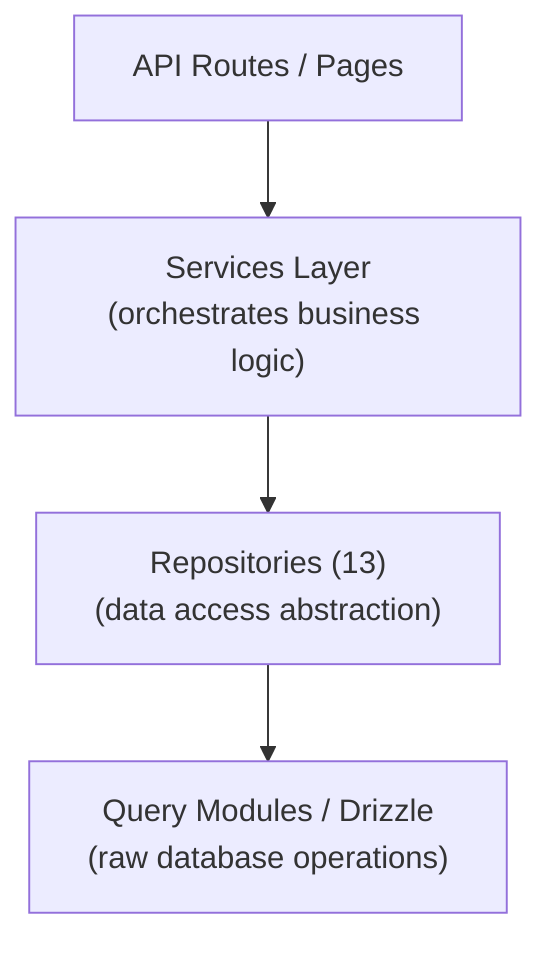

# نمط المستودع

يطبق قالب Ever Works نمط المستودع من خلال 13 فئة مستودع متخصصة في `lib/repositories/`. توفر المستودعات تجريدًا عالي المستوى لاستعلامات قاعدة البيانات الأولية، وتغليف منطق الاستعلام المعقد وقواعد العمل وتحويل البيانات.

## الهندسة المعمارية



## قائمة المستودعات

|مستودع|ملف|المجال|
|------------|------|--------|
|تحليلات المسؤول (الأمثل)|`admin-analytics-optimized.repository.ts`|تحليلات المسؤول مع تحسين الأداء|
|إحصائيات المشرف|`admin-stats.repository.ts`|إحصائيات لوحة تحكم المشرف|
|الفئة|`category.repository.ts`|إدارة الفئة|
|لوحة تحكم العميل|`client-dashboard.repository.ts`|عمليات لوحة تحكم العميل|
|عنصر العميل|`client-item.repository.ts`|عمليات تقديم عناصر العميل|
|المجموعة|`collection.repository.ts`|إدارة التحصيل|
|رسم خرائط التكامل|`integration-mapping.repository.ts`|تعيينات تكامل CRM|
|البند|`item.repository.ts`|عمليات العنصر|
|الدور|`role.repository.ts`|إدارة الدور|
|إعلان الراعي|`sponsor-ad.repository.ts`|إدارة الإعلانات الممولة|
|علامة|`tag.repository.ts`|إدارة العلامات|
|تكوين إدارة علاقات العملاء (CRM) العشرين|`twenty-crm-config.repository.ts`|تكوين إدارة علاقات العملاء|
|المستخدم|`user.repository.ts`|إدارة المستخدم|

## مستودع المحتوى المستند إلى Git (`lib/repository.ts`)

بالإضافة إلى مستودعات قاعدة البيانات، يتضمن القالب مستودع محتوى يستند إلى Git في `lib/repository.ts`. يعالج هذا عمليات Git CMS:

- مستودع المحتوى المستنسخ من `DATA_REPOSITORY` URL
- مزامنة المحتوى مع المنبع (السحب/الدفع مع اكتشاف التعارض)
- تتبع التغييرات المحلية والالتزام بها
- حماية المهلة لعمليات Git (مهلة 120 ثانية)

وهذا يختلف عن مستودعات قاعدة البيانات ويدير الدليل `.content/` الذي تستخدمه طبقة المحتوى.

## تفاصيل المستودع

### admin-analytics-optimized.repository.ts

مستودع تحليلات محسّن الأداء للوحة تحكم المشرف. يستخدم الاستعلامات المجمعة واستراتيجيات التخزين المؤقت لتقليل تحميل قاعدة البيانات عند إنشاء طرق عرض التحليلات.

القدرات الرئيسية:
- إحصائيات العرض المجمعة
- اتجاهات نمو المستخدم
- ملخصات مشاركة المحتوى
- تحليلات الإيرادات

### admin-stats.repository.ts

يوفر إحصائيات لوحة المعلومات للوحة الإدارة.

القدرات الرئيسية:
- إجمالي عدد المستخدمين
- عدد الاشتراكات النشطة
- إحصائيات المحتوى (العناصر والتعليقات والتقارير)
- ملخصات الأنشطة الأخيرة

### class.repository.ts

يدير بيانات الفئة من خلال عمليات CRUD ومعالجة العلاقات.

القدرات الرئيسية:
- قائمة الفئات مع عدد العناصر
- اجتياز شجرة الفئة (الوالد/الطفل)
- البحث عن الفئة والتصفية
- ترتيب الفئة

### Client-dashboard.repository.ts

أكبر مستودع (28 كيلو بايت)، يتعامل مع جميع بيانات لوحة التحكم من جانب العميل.

القدرات الرئيسية:
- إدارة تقديم العميل
- تحليلات التقديم (المشاهدات والتصويتات والتعليقات لكل عنصر)
- تاريخ نشاط العميل
- إحصائيات ملخص لوحة المعلومات
- قائمة العناصر المرقّمة مع المرشحات

### Client-item.repository.ts

يدير العناصر من منظور العميل (المرسل).

القدرات الرئيسية:
- إنشاء وتحديث تقديم العنصر
- تتبع حالة العنصر
- تاريخ التقديم
- تصفية العناصر الخاصة بالعميل

### Collection.repository.ts

إدارة المجموعة لمجموعات العناصر المنسقة.

القدرات الرئيسية:
- عمليات جمع CRUD
- جمعيات جمع العناصر
- ترتيب المجموعة وحالتها
- قائمة المجموعة المرقّمة

### التكامل-mapping.repository.ts

استمرارية رسم خرائط تكامل CRM.

القدرات الرئيسية:
- إنشاء وتحديث التعيينات بين المعرفات الداخلية ومعرفات CRM
- عمليات upsert بالجملة
- البحث عن طريق معرف داخلي أو معرف CRM
- مزامنة تتبع الطابع الزمني
- إدارة تجزئة الإصدار لاكتشاف التغيير

### item.repository.ts

عمليات بيانات العنصر الأساسية (بالنسبة للبيانات التعريفية المخزنة في قاعدة البيانات، وليس محتوى Git).

القدرات الرئيسية:
- إدارة البيانات التعريفية للعنصر
- البحث عن العناصر باستخدام مرشحات متعددة
- تجميع بيانات مشاركة العنصر
- إدارة العناصر المميزة

### role.repository.ts

إدارة الأدوار لنظام RBAC.

القدرات الرئيسية:
- عمليات الدور CRUD
- جمعيات إذن الدور
- تعيينات دور المستخدم
- التحقق من صحة الدور

### الراعي-ad.repository.ts

إدارة دورة حياة الإعلانات المدعومة.

القدرات الرئيسية:
- رعاية إنشاء الإعلانات وإدارتها
- انتقالات الحالة (معلقة، نشطة، منتهية الصلاحية)
- تصفية الإعلانات حسب الحالة أو المستخدم أو العنصر
- بيانات تكامل الدفع
- معالجة انتهاء الصلاحية

### tag.repository.ts

إدارة العلامات مع اقترانات العنصر.

القدرات الرئيسية:
- عمليات العلامة CRUD
- البحث عن العلامات والإكمال التلقائي
- إحصائيات استخدام العلامة
- اقترانات علامة العنصر

### عشرين crm-config.repository.ts

عشرين إدارة تكوين فردي لـ CRM.

القدرات الرئيسية:
- الحصول على/تحديث تكوين CRM
- تمكين/تعطيل تكامل CRM
- إدارة وضع المزامنة
- إدارة مفاتيح API

### user.repository.ts

إدارة حساب المستخدم.

القدرات الرئيسية:
- عمليات ملف تعريف المستخدم
- بحث المستخدم والتصفية
- إدارة حالة الحساب
- حذف المستخدم (الحذف الناعم)

## نمط الاستخدام

يتم استيراد المستودعات واستخدامها مباشرة في مسارات API والخدمات ومكونات الخادم:

```typescript
import { clientDashboardRepository } from '@/lib/repositories/client-dashboard.repository';

// In an API route
export async function GET(request: NextRequest) {
  const session = await auth();
  const dashboard = await clientDashboardRepository.getDashboardStats(session.user.id);
  return NextResponse.json({ success: true, data: dashboard });
}
```

```typescript
import { itemRepository } from '@/lib/repositories/item.repository';

// In a server component
export default async function ItemPage({ params }) {
  const item = await itemRepository.findBySlug(params.slug);
  return <ItemDetail item={item} />;
}
```

## المستودع مقابل وحدات الاستعلام

|الجانب|وحدات الاستعلام (`lib/db/queries/`)|المستودعات (`lib/repositories/`)|
|--------|-----------------------------------|-------------------------------------|
|التعقيد|استفسارات بسيطة ومركزة|عمليات معقدة متعددة الجداول|
|منطق الأعمال|لا شيء (الوصول الكامل إلى البيانات)|يتضمن التحقق من الصحة وقواعد العمل|
|تحويل البيانات|نتائج قاعدة البيانات الخام|البيانات المحولة/المثرية|
|حالة الاستخدام|عمليات قاعدة البيانات المباشرة|الوصول إلى البيانات على مستوى الميزة|
|المستهلك النموذجي|وحدات الاستعلام الأخرى، وطرق بسيطة|الخدمات ومسارات API ومكونات الخادم|

تستخدم كلتا الطبقتين Drizzle ORM وتستوردان اتصال قاعدة البيانات من `lib/db/drizzle.ts`. يعتمد الاختيار بينهما على مدى تعقيد العملية: تستخدم القراءات البسيطة وحدات الاستعلام مباشرة، بينما تمر الميزات المعقدة عبر المستودعات.
