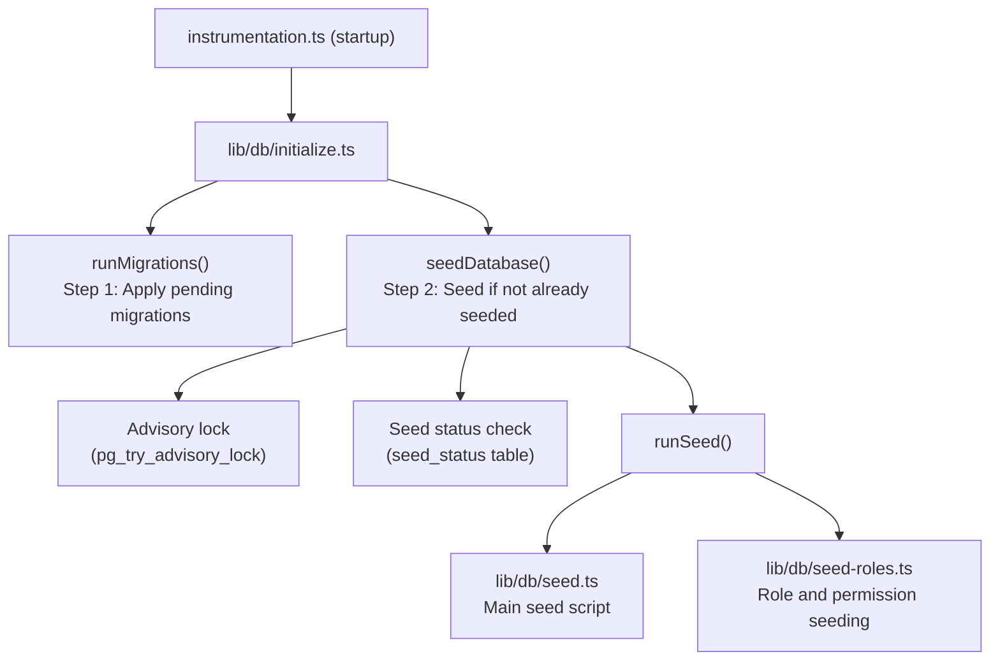

# زرع قاعدة البيانات

يشتمل قالب Ever Works على نظام زرع قاعدة بيانات شامل يقوم بتهيئة البيانات الأساسية (الأدوار والأذونات وموفري الدفع) ويقوم بشكل اختياري بإنشاء بيانات تجريبية للتطوير والاختبار.

## هندسة البذور



## مخطوطات البذور

### البرنامج النصي الرئيسي (`lib/db/seed.ts`)

يعالج البرنامج النصي الأولي جميع عمليات تهيئة قاعدة البيانات. يعمل في وضعين:

**وضع الإنتاج**: البذور فقط البيانات الأساسية المطلوبة لكي يعمل التطبيق:
- أدوار المشرف والعميل
- أذونات النظام
- مزودي الدفع الافتراضيين
- سجلات النظام المطلوبة

**الوضع التجريبي**: بالإضافة إلى ذلك، يتم الحصول على بيانات اختبار شاملة للتطوير:
- عينة من المستخدمين بأدوار مختلفة
- عينة من ملفات تعريف العملاء
- الاشتراكات سبيل المثال
- التعليقات التجريبية، والأصوات، والمفضلة
- إشعارات الاختبار
- إدخالات سجل النشاط

يتم تنشيط الوضع التجريبي عند تعيين متغير البيئة `DEMO_MODE`.

الخصائص الرئيسية:
- **التوازن لكل طاولة**: يتم فحص كل طاولة قبل البذر؛ يتم ملء الجداول الفارغة فقط
- **التحقق من وجود الجدول**: التحقق من وجود الجداول قبل محاولة الإدراج
- ** يستخدم `drizzle-seed`**: يستفيد من مكتبة Drizzle الرسمية لتوليد البيانات المنظمة
- **آمن لإعادة التشغيل**: يمكن استدعاؤه عدة مرات دون تكرار البيانات

```typescript
// Simplified seed flow
export async function runSeed(): Promise<void> {
  await ensureDb();
  const isDemo = isDemoMode();

  if (isDemo) {
    // Seed comprehensive test data
  } else {
    // Seed minimal essential data only
  }

  // Seed roles (always)
  if (await isTableEmpty('roles', roles)) {
    await seedRoles();
  }

  // Seed permissions (always)
  if (await isTableEmpty('permissions', permissions)) {
    await seedPermissions();
  }

  // Seed payment providers (always)
  if (await isTableEmpty('paymentProviders', paymentProviders)) {
    await seedPaymentProviders();
  }

  // Demo-only: seed users, profiles, subscriptions, etc.
  if (isDemo) {
    await seedDemoData();
  }
}
```

### بذر الأدوار (`lib/db/seed-roles.ts`)

برنامج نصي مخصص لبذر نظام RBAC، والذي يمكن أيضًا تشغيله بشكل مستقل.

**`seedPermissions()`** ينشئ مجموعة الأذونات الأولية:

|مفتاح الإذن|الوصف|
|---------------|-------------|
|`read:own`|يمكن قراءة البيانات الخاصة|
|`write:own`|يمكن كتابة البيانات الخاصة|
|`admin:all`|الوصول الإداري الكامل|
|`client:manage`|يمكن إدارة العمليات الخاصة بالعميل|
|`user:read`|يمكن قراءة بيانات المستخدم|
|`user:write`|يمكن كتابة بيانات المستخدم|

يستخدم `onConflictDoUpdate` لتحديث الأذونات الموجودة بأمان دون الفشل في عمليات إعادة التشغيل.

**`linkRolesToPermissions()`** ينشئ ارتباطات إذن الدور:

- **دور المسؤول**: يحصل على كافة الأذونات
- **دور العميل**: يحصل على `read:own` و`write:own` و`client:manage`

تتحقق الوظيفة من وجود الأدوار المطلوبة (المسؤول والعميل) ونشطة قبل إنشاء الارتباطات.

**`seedRolesAndPermissions()`** ينسق كلتا العمليتين ضمن معاملة قاعدة البيانات:

```typescript
export async function seedRolesAndPermissions() {
  await db.transaction(async () => {
    await seedPermissions();
    await linkRolesToPermissions();
  });
}
```

يمكن تشغيله بشكل مستقل:
```bash
# Run directly (if configured as a script)
npx tsx lib/db/seed-roles.ts
```

## نظام التهيئة (`lib/db/initialize.ts`)

يقوم نظام التهيئة بإدارة تسلسل بدء التشغيل الكامل مع حماية التزامن.

### تتبع حالة البذور

يتتبع الجدول `seed_status` حالة البذر:

|الحالة|معنى|
|--------|---------|
|`seeding`|عملية البذور جارية|
|`completed`|اكتملت البذرة بنجاح|
|`failed`|فشل البذرة (خطأ مخزن)|

### حماية التزامن

في عمليات النشر متعددة العمليات (على سبيل المثال، وظائف Vercel المتعددة بدون خادم التي تبدأ في وقت واحد)، يمنع النظام البذر المكرر باستخدام:

1. **الأقفال الاستشارية لـ PostgreSQL**: `pg_try_advisory_lock(12345)` توفر قفلًا غير محظور. يمكن لعملية واحدة فقط الحصول عليها.
2. **جدول حالة البذرة**: تحقق العمليات الأخرى من جدول `seed_status` وانتظر حتى الاكتمال.
3. **اكتشاف الأشياء القديمة**: إذا كانت حالة `seeding` أقدم من 5 دقائق، فسيتم التعامل معها على أنها قديمة ويتم تنظيفها.
4. **مهلة الانتظار**: ستنتهي مهلة العمليات التي تنتظر اكتمال مثيل آخر بعد 60 ثانية.

### تدفق التهيئة

```
initializeDatabase()
│
├── DATABASE_URL not set? → Silent skip (DB is optional)
│
├── Step 1: Run migrations (always, idempotent)
│   └── Failure? → Error in production, warning in dev/preview
│
├── Step 2: Check if already seeded
│   └── seed_status = 'completed'? → Done
│
├── Step 3: Handle edge cases
│   ├── Previous seed failed? → Delete failed status, retry
│   ├── Stale seeding (>5min)? → Clean up, retry
│   └── Another instance seeding? → Wait for completion
│
├── Step 4: Acquire advisory lock
│   └── Lock not available? → Wait for other instance
│
├── Step 5: Double-check (another instance may have finished)
│
├── Step 6: Run seed
│   ├── Create seed_status record ('seeding')
│   ├── Execute runSeed()
│   └── Update seed_status ('completed' or 'failed')
│
└── Step 7: Release advisory lock (always, in finally block)
```

## تشغيل البذور يدويا

### البذور القياسية

```bash
pnpm db:seed
```

### مخطوطات البذور الفردية

```bash
# Seed roles and permissions only
npx tsx lib/db/seed-roles.ts
```

### الوضع التجريبي

لزراعة البيانات التجريبية، قم بتعيين `DEMO_MODE` متغير البيئة:

```bash
DEMO_MODE=true pnpm db:seed
```

## متغيرات البيئة

|متغير|الافتراضي|الوصف|
|----------|---------|-------------|
|`DATABASE_URL`| - |سلسلة اتصال PostgreSQL (مطلوبة للبذر)|
|`DEMO_MODE`|`false`|تمكين زرع البيانات التجريبية|

## ملخص بيانات البذور

### المصنف دائمًا (وضع الإنتاج)

|الجدول|البيانات|
|-------|------|
|`roles`|أدوار المشرف والعميل|
|`permissions`|تعريفات أذونات النظام|
|`rolePermissions`|جمعيات إذن الدور|
|`paymentProviders`|شريط، ليمون سكويزي، بولار، سوليدجيت|

### الوضع التجريبي فقط

|الجدول|البيانات|
|-------|------|
|`users`|عينة من المستخدمين الإداريين والعملاء|
|`accounts`|حسابات المصادقة لعينة المستخدمين|
|`clientProfiles`|ملفات تعريف العملاء بحالات متنوعة|
|`subscriptions`|عينة من الاشتراكات عبر الخطط|
|`comments`|تعليقات البند سبيل المثال|
|`votes`|عينة من الأصوات|
|`favorites`|عينة المفضلة|
|`notifications`|عينة من إشعارات المشرف|
|`activityLogs`|نموذج لتاريخ النشاط|

## أفضل الممارسات

1. **لا تقم مطلقًا بتشغيل البذور في الإنتاج باستخدام DEMO_MODE**: يجب استخدام البيانات التجريبية فقط في التطوير والتشغيل المرحلي
2. **التحقق من حالة البذرة قبل إعادة البذر يدويًا**: استعلم عن جدول `seed_status` لفهم الحالة الحالية
3. **استخدام المعاملات**: يستخدم تحديد الأدوار المعاملات لضمان الاتساق
4. **تصميم غير فعال**: تحقق دائمًا من وجود البيانات قبل إدراجها لدعم عمليات إعادة التشغيل الآمنة
5. **الأقفال الاستشارية**: يمنع نظام القفل الاستشاري المشكلات في البيئات التي لا تحتوي على خادم حيث قد تبدأ مثيلات متعددة في وقت واحد
