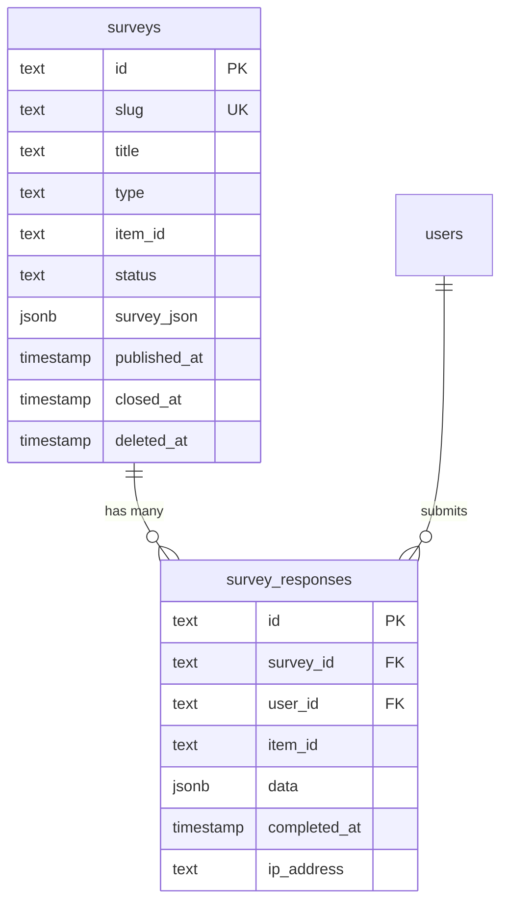
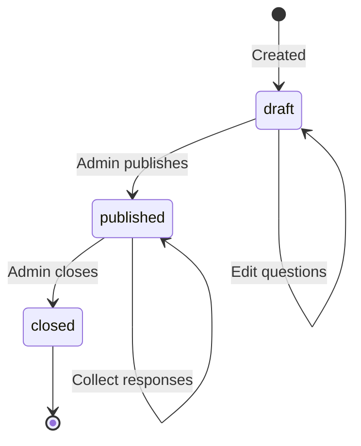

# مخطط المسوحات الغوص العميق

## نظرة عامة

توفر وحدة الاستطلاعات نظام استطلاع مرن مع نوعين من الجداول: `surveys` لتعريفات الاستطلاع و`survey_responses` للإجابات المجمعة. يمكن أن تكون الاستطلاعات إما عالمية (على مستوى الموقع) أو خاصة بعنصر معين. يتم تخزين بنية الاستطلاع على هيئة كائن ثنائي كبير الحجم JSON (`surveyJson`) باستخدام نوع العمود JSONB، مما يسمح بمخططات الأسئلة الديناميكية دون نمذجة قاعدة بيانات جامدة.

**الملف المصدر:** `template/lib/db/schema.ts`

---

## Table: `surveys`

Stores survey definitions with their question structure in a JSON column.

### Columns

| Column | DB Name | Type | Nullable | Default | Constraints |
|---|---|---|---|---|---|
| `id` | `id` | `text` | No | `crypto.randomUUID()` | Primary Key |
| `slug` | `slug` | `text` | No | - | Unique |
| `title` | `title` | `text` | No | - | - |
| `description` | `description` | `text` | Yes | - | - |
| `type` | `type` | `text (enum)` | No | - | `global`, `item` |
| `itemId` | `item_id` | `text` | Yes | - | Item slug (for item surveys) |
| `status` | `status` | `text (enum)` | No | `'draft'` | `draft`, `published`, `closed` |
| `surveyJson` | `survey_json` | `jsonb` | No | - | Full survey structure |
| `createdAt` | `created_at` | `timestamp (tz)` | No | `now()` | - |
| `updatedAt` | `updated_at` | `timestamp (tz)` | No | `now()` | - |
| `publishedAt` | `published_at` | `timestamp (tz)` | Yes | - | - |
| `closedAt` | `closed_at` | `timestamp (tz)` | Yes | - | - |
| `deletedAt` | `deleted_at` | `timestamp (tz)` | Yes | - | Soft delete |

### Indexes

| Name | Columns | Type |
|---|---|---|
| `surveys_slug_idx` | `slug` | B-tree |
| `surveys_type_idx` | `type` | B-tree |
| `surveys_item_id_idx` | `itemId` | B-tree |
| `surveys_status_idx` | `status` | B-tree |
| `surveys_created_at_idx` | `createdAt` | B-tree |

### Survey Type Enum

| Value | Description |
|---|---|
| `global` | Site-wide survey visible to all users |
| `item` | Survey attached to a specific item (referenced by `itemId`) |

### Survey Status Enum

| Value | Description |
|---|---|
| `draft` | Not yet published, only visible to admins |
| `published` | Live and accepting responses |
| `closed` | No longer accepting responses |

---

## الجدول: `survey_responses`

يخزن استجابات المستخدم الفردية للاستطلاعات. يتم تخزين بيانات الاستجابة على هيئة JSONB blob.

### أعمدة

|العمود|اسم قاعدة البيانات|اكتب|لاغية|الافتراضي|القيود|
|---|---|---|---|---|---|
|`id`|`id`|`text`|لا|`crypto.randomUUID()`|المفتاح الأساسي|
|`surveyId`|`survey_id`|`text`|لا| - |FK -> `surveys.id` (تقييد)|
|`userId`|`user_id`|`text`|نعم| - |FK -> `users.id` (الضبط فارغ)|
|`itemId`|`item_id`|`text`|نعم| - |سبيكة سياق العنصر|
|`data`|`data`|`jsonb`|لا| - |إجابات الرد|
|`completedAt`|`completed_at`|`timestamp (tz)`|لا| - |عندما انتهى المستخدم|
|`ipAddress`|`ip_address`|`text`|نعم| - |IP المرسل|
|`userAgent`|`user_agent`|`text`|نعم| - |وكيل مستخدم المتصفح|
|`createdAt`|`created_at`|`timestamp (tz)`|لا|`now()`| - |
|`updatedAt`|`updated_at`|`timestamp (tz)`|لا|`now()`| - |

### المفاتيح الخارجية

|العمود|المراجع|على الحذف|
|---|---|---|
|`surveyId`|`surveys.id`|تقييد|
|`userId`|`users.id`|تعيين فارغ|

:::معلومات حذف السلوك
يستخدم المفتاح الخارجي `surveyId` `RESTRICT` (وليس `CASCADE`)، مما يعني أنه لا يمكن حذف الاستطلاع بينما يحتوي على ردود. وهذا يحمي بيانات الاستجابة من الفقد العرضي. استخدم الحذف المبدئي (`deletedAt`) في الاستطلاع بدلاً من ذلك.

يستخدم المفتاح الخارجي `userId` `SET NULL`، مع الاحتفاظ ببيانات الاستجابة المجهولة حتى عند حذف حساب مستخدم.
:::

### الفهارس

|الاسم|أعمدة|اكتب|
|---|---|---|
|`survey_responses_survey_id_idx`|`surveyId`|شجرة ب|
|`survey_responses_user_id_idx`|`userId`|شجرة ب|
|`survey_responses_item_id_idx`|`itemId`|شجرة ب|
|`survey_responses_completed_at_idx`|`completedAt`|شجرة ب|

---

## TypeScript Types

```typescript
export type Survey = typeof surveys.$inferSelect;

export type SurveyItem = Survey & {
    responseCount?: number;
    isCompletedByUser?: boolean;
};

export type NewSurvey = typeof surveys.$inferInsert;
export type SurveyResponse = typeof surveyResponses.$inferSelect;
export type NewSurveyResponse = typeof surveyResponses.$inferInsert;
```

---

## مخطط العلاقات



---

## Survey Lifecycle



---

## العمود `surveyJson`

يخزن عمود `surveyJson` JSONB تعريف الاستطلاع الكامل. هذا مخطط مرن يمكنه تمثيل أنواع مختلفة من الأسئلة:

```typescript
// Example surveyJson structure
{
  "pages": [
    {
      "name": "page1",
      "elements": [
        {
          "type": "rating",
          "name": "satisfaction",
          "title": "How satisfied are you?",
          "rateMin": 1,
          "rateMax": 5
        },
        {
          "type": "text",
          "name": "feedback",
          "title": "Any additional feedback?"
        },
        {
          "type": "radiogroup",
          "name": "recommend",
          "title": "Would you recommend this?",
          "choices": ["Yes", "No", "Maybe"]
        }
      ]
    }
  ]
}
```

---

## Query Examples

### Create a survey

```typescript
import { db } from '@/lib/db/drizzle';
import { surveys } from '@/lib/db/schema';

await db.insert(surveys).values({
    slug: 'user-satisfaction-2025',
    title: "استطلاع رضا المستخدم 2025"،
    description: 'Help us improve our platform',
    type: 'global',
    status: 'draft',
    surveyJson: {
        pages: [{
            name: 'page1',
            elements: [
                { type: 'rating', name: 'overall', title: 'Overall satisfaction' }
            ]
        }]
    },
});
```

### Publish a survey

```typescript
await db
    .update(surveys)
    .set({
        status: 'published',
        publishedAt: new Date(),
        updatedAt: new Date(),
    })
    .where(eq(surveys.id, surveyId));
```

### Submit a response

```typescript
import { surveyResponses } from '@/lib/db/schema';

await db.insert(surveyResponses).values({
    surveyId,
    userId,
    itemId: 'specific-item-slug', // Optional, for item-type surveys
    data: {
        overall: 4,
        feedback: 'Great platform, minor UI issues',
        recommend: 'Yes',
    },
    completedAt: new Date(),
    ipAddress: request.headers.get('x-forwarded-for'),
    userAgent: request.headers.get('user-agent'),
});
```

### Get surveys with response counts

```typescript
import { sql } from 'drizzle-orm';

const surveysWithCounts = await db
    .select({
        id: surveys.id,
        title: عنوان الاستطلاعات،
        status: surveys.status,
        responseCount: sql<number>`(
            SELECT count(*) FROM survey_responses
            WHERE survey_responses.survey_id = surveys.id
        )`,
    })
    .from(surveys)
    .where(isNull(surveys.deletedAt))
    .orderBy(desc(surveys.createdAt));
```

### Check if user completed a survey

```typescript
const completed = await db
    .select({ id: surveyResponses.id })
    .from(surveyResponses)
    .where(
        and(
            eq(surveyResponses.surveyId, surveyId),
            eq(surveyResponses.userId, userId)
        )
    )
    .limit(1);

const hasCompleted = completed.length > 0;
```

### Get published surveys for an item

```typescript
const itemSurveys = await db
    .select()
    .from(surveys)
    .where(
        and(
            eq(surveys.type, 'item'),
            eq(surveys.itemId, 'my-item-slug'),
            eq(surveys.status, 'published'),
            isNull(surveys.deletedAt)
        )
    );
```

---

## ملاحظات التصميم

- **JSONB للمرونة.** استخدام `surveyJson` و`data` كأعمدة JSONB يسمح لنظام الاستطلاع بدعم أي نوع سؤال دون ترحيل المخطط. المقايضة هي سلامة نوع أقل صرامة على مستوى قاعدة البيانات.
- **تقييد الحذف.** لا يمكن حذف الاستطلاعات التي تحتوي على إجابات. استخدم عمود الحذف الناعم `deletedAt` بدلاً من ذلك.
- **دعم الاستجابات المجهولة.** `userId` على `survey_responses` لاغية ويستخدم `SET NULL` عند الحذف، مما يسمح بتقديم الاستبيانات المصادق عليها والمجهولة.
- **سياق العنصر.** يتيح الحقل `itemId` في كلا الجدولين إجراء استطلاعات خاصة بالعنصر (على سبيل المثال، "تقييم هذه الأداة") مع الحفاظ على المخطط عام بما يكفي للاستطلاعات العامة.
