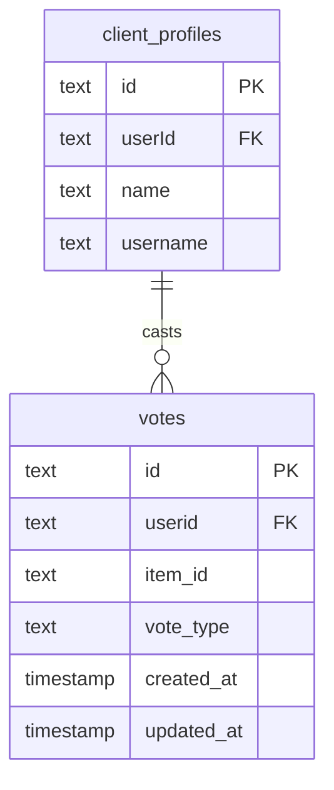
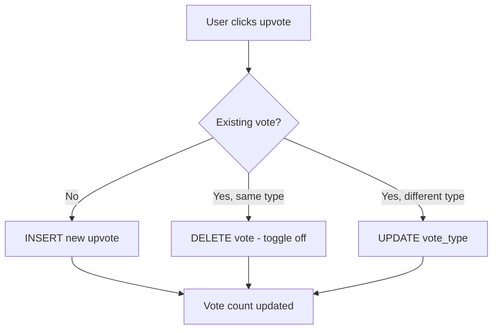

# مخطط الأصوات، الغوص العميق

## نظرة عامة

يطبق نظام الأصوات آلية التصويت لصالح/التصويت السلبي للعناصر. يمكن لكل مستخدم (يتم تحديده بواسطة سجل `client_profiles`) الإدلاء بصوت واحد بالضبط لكل عنصر، ويتم فرضه بواسطة فهرس مركب فريد. يمكن تبديل الأصوات بين التصويت الإيجابي والتصويت السلبي.

**الملف المصدر:** `template/lib/db/schema.ts`
**ملف العلاقات:** `template/lib/db/migrations/relations.ts`

---

## Table: `votes`

### Columns

| Column | DB Name | Type | Nullable | Default | Constraints |
|---|---|---|---|---|---|
| `id` | `id` | `text` | No | `crypto.randomUUID()` | Primary Key |
| `userId` | `userid` | `text` | No | - | FK -> `client_profiles.id` (CASCADE) |
| `itemId` | `item_id` | `text` | No | - | Item slug |
| `voteType` | `vote_type` | `text (enum)` | No | `'upvote'` | `upvote`, `downvote` |
| `createdAt` | `created_at` | `timestamp` | No | `now()` | - |
| `updatedAt` | `updated_at` | `timestamp` | No | `now()` | - |

:::caution Column Name Note
The `userId` property maps to the database column `userid` (lowercase, no underscore). This is intentional -- it matches the migration schema. Do not confuse this with other tables where the column is `userId` or `user_id`.
:::

### Foreign Keys

| Column | References | On Delete |
|---|---|---|
| `userid` | `client_profiles.id` | CASCADE |

### Indexes

| Name | Columns | Type |
|---|---|---|
| `unique_user_item_vote_idx` | `(userid, item_id)` | Unique |
| `item_votes_idx` | `item_id` | B-tree |
| `votes_created_at_idx` | `created_at` | B-tree |

### Key Constraints

- **One vote per user per item:** The `unique_user_item_vote_idx` unique index on `(userid, item_id)` ensures each client profile can only have one vote record per item.
- **Vote type is exclusive:** A user either has an upvote or a downvote, never both.

---

## نوع التصويت التعداد

```typescript
export const VoteType = {
    UPVOTE: 'upvote',
    DOWNVOTE: 'downvote'
} as const;

export type VoteTypeValues = (typeof VoteType)[keyof typeof VoteType];
```

---

## TypeScript Types

```typescript
export type Vote = typeof votes.$inferSelect;
export type InsertVote = typeof votes.$inferInsert;
```

---

## العلاقات

```typescript
// From relations.ts
export const votesRelations = relations(votes, ({ one }) => ({
    clientProfile: one(clientProfiles, {
        fields: [votes.userid],
        references: [clientProfiles.id]
    }),
}));
```

---

## Relations Diagram



---

## تدفق التصويت



---

## Query Examples

### Cast a vote (upsert pattern)

```typescript
import { db } from '@/lib/db/drizzle';
import { votes, VoteType } from '@/lib/db/schema';
import { eq, and } from 'drizzle-orm';

// Insert or update vote using onConflict
await db
    .insert(votes)
    .values({
        userId: clientProfileId,
        itemId: 'my-item-slug',
        voteType: VoteType.UPVOTE,
    })
    .onConflictDoUpdate({
        target: [votes.userId, votes.itemId],
        set: {
            voteType: VoteType.UPVOTE,
            updatedAt: new Date(),
        },
    });
```

### Remove a vote

```typescript
await db
    .delete(votes)
    .where(
        and(
            eq(votes.userId, clientProfileId),
            eq(votes.itemId, 'my-item-slug')
        )
    );
```

### Count votes for an item

```typescript
import { sql } from 'drizzle-orm';

const voteCounts = await db
    .select({
        upvotes: sql<number>`count(*) filter (where ${votes.voteType} = 'upvote')`,
        downvotes: sql<number>`count(*) filter (where ${votes.voteType} = 'downvote')`,
    })
    .from(votes)
    .where(eq(votes.itemId, 'my-item-slug'));
```

### Get user's vote on an item

```typescript
const userVote = await db
    .select()
    .from(votes)
    .where(
        and(
            eq(votes.userId, clientProfileId),
            eq(votes.itemId, 'my-item-slug')
        )
    )
    .limit(1);
```

### Get all votes by a user

```typescript
const userVotes = await db
    .select()
    .from(votes)
    .where(eq(votes.userId, clientProfileId))
    .orderBy(desc(votes.createdAt));
```

### Get most upvoted items

```typescript
const topItems = await db
    .select({
        itemId: votes.itemId,
        upvotes: sql<number>`count(*)`,
    })
    .from(votes)
    .where(eq(votes.voteType, 'upvote'))
    .groupBy(votes.itemId)
    .orderBy(sql`count(*) desc`)
    .limit(10);
```

---

## ملاحظات التصميم

- ** تشير الأصوات إلى ملفات تعريف العملاء، وليس المستخدمين. ** ويتوافق هذا مع جدول التعليقات. يجب أن يكون لدى المستخدمين سجل `client_profiles` للتصويت.
- **يتم تعريف العناصر بواسطة الارتباط الثابت.** يقوم العمود `item_id` بتخزين العنصر الثابت من Git CMS، وليس مفتاحًا خارجيًا لقاعدة البيانات.
- **لا يوجد جدول منفصل لعدد الأصوات.** يتم تجميع أعداد الأصوات في وقت الاستعلام باستخدام `count()`. تكلفة استعلام الصفقات هذه من أجل الاتساق (لا توجد عدادات قديمة).
- **يتتبع الحقل `updatedAt` تغييرات التصويت.** عندما يقوم المستخدم بالتبديل من التصويت الإيجابي إلى التصويت السلبي، يتم تحديث `updatedAt` بينما يحافظ `createdAt` على وقت التصويت الأصلي.
