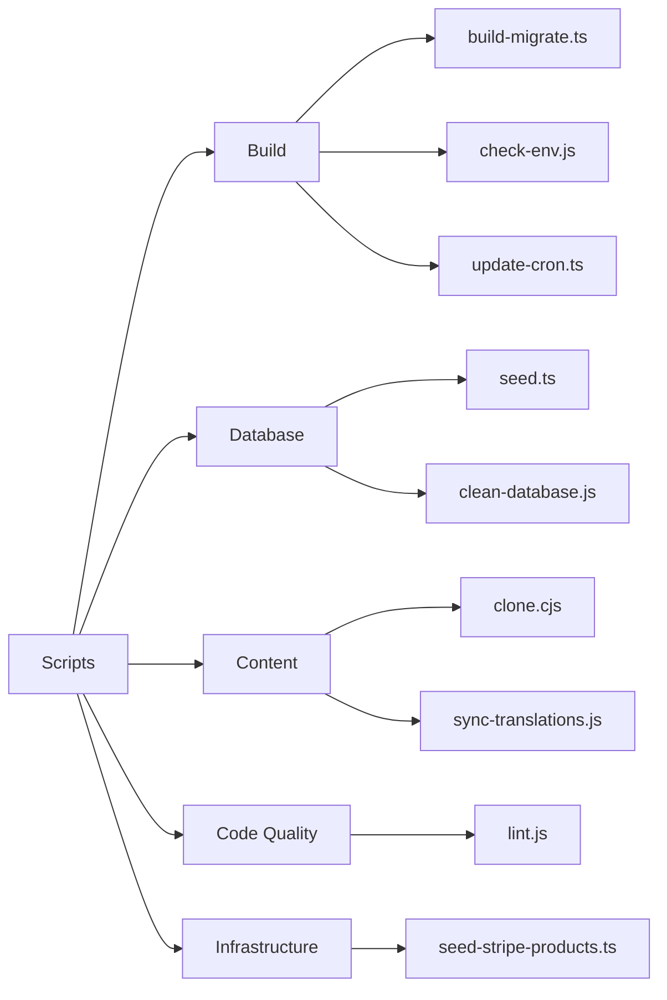
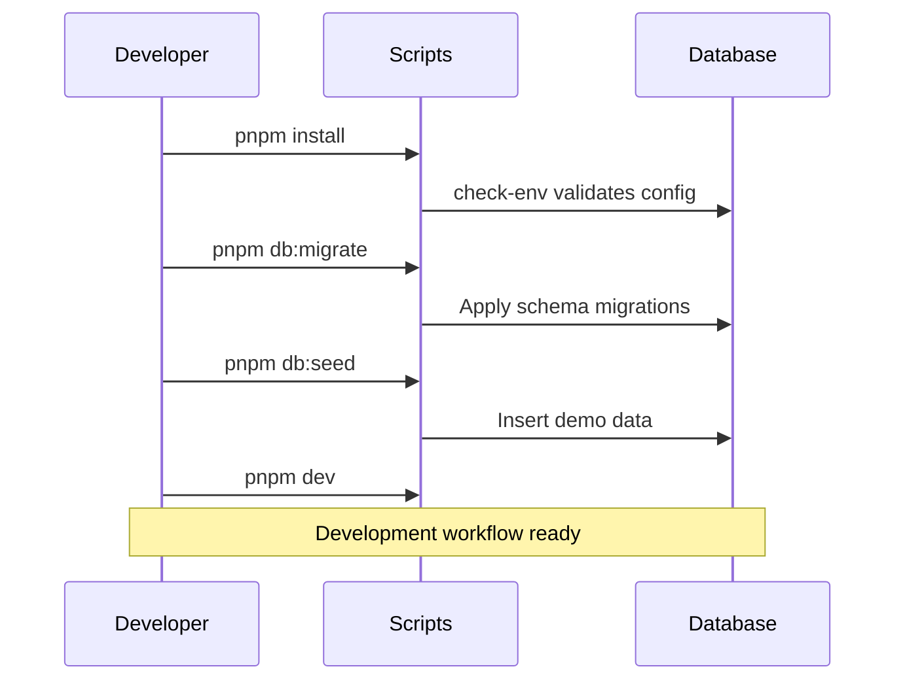

# نظرة عامة على السكريبتات

يحتوي مجلد `apps/web/scripts/` على سكريبتات مساعدة للبناء وإدارة قواعد البيانات وإدارة المحتوى وصيانة جودة الكود.

## تصنيفات السكريبتات



## سكريبتات البناء

### `build-migrate.ts`

يُشغِّل ترحيلات قاعدة البيانات أثناء البناء.

```bash
pnpm run build:migrate
```

يعمل تلقائيًا قبل بناء الإنتاج للتأكد من أن مخطط قاعدة البيانات محدَّث.

### `check-env.js`

يتحقق من تعيين جميع متغيرات البيئة المطلوبة.

```bash
node scripts/check-env.js
```

يُوقف البناء في حالة غياب متغيرات بيئة حيوية. تستدعيه كثير من السكريبتات الأخرى تلقائيًا في بداية تشغيلها.

### `update-cron.ts`

يُحدِّث إعداد مهام Cron في Vercel أو Trigger.dev.

```bash
pnpm run update:cron
```

## سكريبتات قاعدة البيانات

### `seed.ts`

يملأ قاعدة البيانات ببيانات تجريبية للتطوير والاختبار.

```bash
cd apps/web
pnpm run db:seed
```

#### البيانات التي ينشئها Seed

| النوع         | الكمية | الوصف                                    |
|---------------|--------|------------------------------------------|
| المستخدمون    | 50     | مزيج من حسابات العملاء والمشرفين         |
| الشركات       | 20     | شركات نموذجية مع ملفات تعريفية كاملة     |
| الفئات        | 10     | تصنيفات الدليل                           |
| العناصر       | 100    | قوائم دليل نموذجية                      |
| التعليقات     | 200    | مراجعات وتغذية راجعة نموذجية             |

#### بيانات Seed لمنتجات Stripe

| المنتج       | السعر      | الدورة |
|--------------|------------|--------|
| Basic Plan   | 9$/شهر     | شهري   |
| Pro Plan     | 29$/شهر    | شهري   |
| Business     | 99$/شهر    | شهري   |

### `clean-database.js`

**⚠️ عملية تدميرية** — يحذف جميع البيانات من قاعدة البيانات. للتطوير فقط.

```bash
node scripts/clean-database.js
```

## سكريبتات المحتوى

### `clone.cjs`

يستنسخ مستودع CMS المعتمد على Git إلى `.content/`.

```bash
node scripts/clone.cjs
```

يستخدم `DATA_REPOSITORY` من البيئة لتحديد المستودع الواجب استنساخه.

### `sync-translations.js`

يزامن جميع ملفات الترجمة مع المرجع الإنجليزي.

```bash
node scripts/sync-translations.js
```

راجع [سير عمل الترجمة](./translation-workflow.md) للاطلاع على التفاصيل الكاملة.

## سكريبتات جودة الكود

### `lint.js`

يُشغِّل ESLint بإعداد المشروع.

```bash
node scripts/lint.js
# أو من جذر المونوريبو:
pnpm lint
```

## التطابق مع `package.json`

| سكريبت npm         | الملف                           | الوصف                          |
|--------------------|---------------------------------|-------------------------------|
| `db:seed`          | `scripts/seed.ts`               | ملء البيانات التجريبية         |
| `db:migrate`       | `drizzle-kit migrate`           | تشغيل الترحيلات                |
| `generate:openapi` | `scripts/generate-openapi.ts`   | توليد وثائق OpenAPI            |
| `sync:translations`| `scripts/sync-translations.js`  | مزامنة الترجمات                |

## سير عمل التطوير النموذجي



## إضافة سكريبتات جديدة

عند إضافة سكريبت جديد:

1. أنشئ الملف في `apps/web/scripts/`
2. استخدم `.ts` لـ TypeScript أو `.js`/`.cjs` لـ CommonJS
3. أضف إدخالًا مقابلًا في قسم `scripts` من `apps/web/package.json`
4. وثِّق الغرض منه وطريقة استخدامه داخل السكريبت
5. أضف فحوصات `check-env` إذا كان السكريبت يعتمد على متغيرات البيئة
