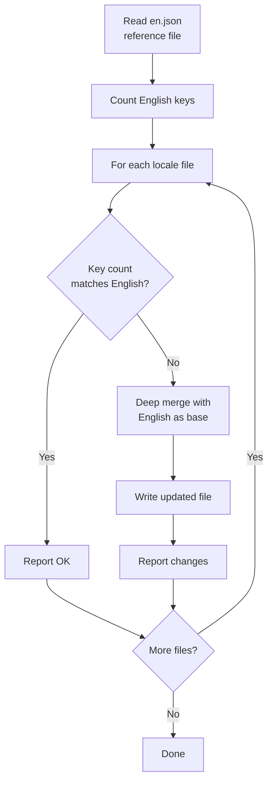
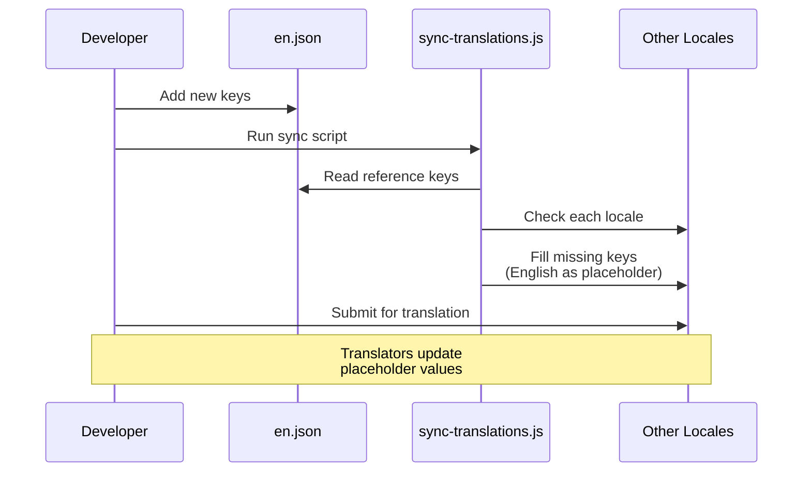

# سير عمل الترجمة

يستخدم القالب `next-intl` للتدويل (i18n) مع ملفات رسائل مبنية على JSON. يضمن سير عمل الترجمة مزامنة جميع اللغات المدعومة مع ملف المرجع الإنجليزي عبر سكريبت مزامنة آلي.

## اللغات المدعومة

يأتي القالب مع 20 لغة مدعومة:

| الكود | اللغة            | الكود | اللغة    |
|-------|------------------|-------|----------|
| `en`  | الإنجليزية (مرجع)| `ko`  | الكورية  |
| `ar`  | العربية          | `nl`  | الهولندية|
| `bg`  | البلغارية        | `pl`  | البولندية|
| `de`  | الألمانية        | `pt`  | البرتغالية|
| `es`  | الإسبانية        | `ru`  | الروسية  |
| `fr`  | الفرنسية         | `th`  | التايلاندية|
| `he`  | العبرية          | `tr`  | التركية  |
| `hi`  | الهندية          | `uk`  | الأوكرانية|
| `id`  | الإندونيسية      | `vi`  | الفيتنامية|
| `it`  | الإيطالية        | `ja`  | اليابانية|

## هيكل الملفات

```
messages/
├── en.json          # الإنجليزية (المرجع - المصدر الوحيد للحقيقة)
├── ar.json          # العربية
├── bg.json          # البلغارية
├── de.json          # الألمانية
├── es.json          # الإسبانية
├── fr.json          # الفرنسية
├── he.json          # العبرية
├── hi.json          # الهندية
├── id.json          # الإندونيسية
├── it.json          # الإيطالية
├── ja.json          # اليابانية
├── ko.json          # الكورية
├── nl.json          # الهولندية
├── pl.json          # البولندية
├── pt.json          # البرتغالية
├── ru.json          # الروسية
├── th.json          # التايلاندية
├── tr.json          # التركية
├── uk.json          # الأوكرانية
└── vi.json          # الفيتنامية
```

## سكريبت مزامنة الترجمات

يضمن سكريبت `scripts/sync-translations.js` احتواء كل ملف لغة على جميع المفاتيح المعرَّفة في `en.json`.

### تشغيل المزامنة

```bash
node scripts/sync-translations.js
```

### آلية العمل



### استراتيجية الدمج

تستخدم المزامنة الدمج العميق مع إعطاء الأولوية للترجمات الموجودة:

```javascript
function deepMerge(target, source) {
  const result = { ...source };  // Start with English (source)
  for (const key in target) {
    if (typeof target[key] === 'object' && !Array.isArray(target[key])) {
      result[key] = deepMerge(target[key], source[key] || {});
    } else {
      result[key] = target[key]; // Existing translation wins
    }
  }
  return result;
}
```

**السلوك الرئيسي:**

- تُملأ المفاتيح الغائبة بقيم إنجليزية كعناصر نائبة
- لا تُستبدل الترجمات الموجودة أبدًا
- تُعالَج الهياكل المتداخلة بشكل تكراري
- تُعامَل المصفوفات كقيم ورقية (لا تُدمج)

### مثال على المخرجات

```
English file has 342 translation keys

ar.json: 340/342 keys (missing 2)
  -> Updated ar.json with missing keys from English

bg.json: 342/342 keys - OK
de.json: 342/342 keys - OK
es.json: 338/342 keys (missing 4)
  -> Updated es.json with missing keys from English

Done!
```

## تنسيق ملف الرسائل

تستخدم ملفات الترجمة JSON متداخلًا مع الوصول إلى المفاتيح بالنقطة:

```json
{
  "common": {
    "loading": "Loading...",
    "error": "An error occurred",
    "save": "Save",
    "cancel": "Cancel"
  },
  "auth": {
    "signIn": "Sign In",
    "signOut": "Sign Out",
    "email": "Email Address",
    "password": "Password"
  },
  "navigation": {
    "home": "Home",
    "about": "About",
    "contact": "Contact"
  }
}
```

## استخدام الترجمات في الكود

### مكوِّنات جانب العميل

```tsx
'use client';
import { useTranslations } from 'next-intl';

export function LoginButton() {
  const t = useTranslations('auth');
  return <button>{t('signIn')}</button>;
}
```

### مكوِّنات جانب الخادم

```tsx
import { getTranslations } from 'next-intl/server';

export default async function Page() {
  const t = await getTranslations('common');
  return <h1>{t('loading')}</h1>;
}
```

### مع المتغيرات

```json
{
  "greeting": "Hello, {name}!",
  "itemCount": "You have {count, plural, =0 {no items} one {1 item} other {# items}}"
}
```

```tsx
const t = useTranslations('dashboard');
t('greeting', { name: 'John' });     // "Hello, John!"
t('itemCount', { count: 5 });         // "You have 5 items"
```

## إضافة لغة جديدة

اتبع هذه الخطوات لإضافة لغة جديدة:

### الخطوة 1: إنشاء ملف الرسائل

```bash
# انسخ الملف الإنجليزي كنقطة بداية
cp messages/en.json messages/NEW_LOCALE.json
```

### الخطوة 2: تسجيل اللغة

أضف اللغة إلى إعداد i18n:

```typescript
// i18n/config.ts (أو ما يعادله)
export const locales = ['en', 'ar', 'de', ..., 'NEW_LOCALE'];
```

### الخطوة 3: ترجمة المحتوى

عدِّل `messages/NEW_LOCALE.json` واستبدل النصوص الإنجليزية بالقيم المترجمة.

### الخطوة 4: تشغيل المزامنة للتحقق

```bash
node scripts/sync-translations.js
```

إذا احتوى الملف على جميع المفاتيح ستظهر "OK"، وستُملأ المفاتيح الغائبة بعناصر نائبة إنجليزية.

## إضافة مفاتيح ترجمة جديدة

عند إضافة ميزات جديدة تتطلب نصًا للمستخدم:

### الخطوة 1: الإضافة إلى المرجع الإنجليزي

```json
// messages/en.json
{
  "newFeature": {
    "title": "New Feature",
    "description": "This is a new feature"
  }
}
```

### الخطوة 2: تشغيل المزامنة

```bash
node scripts/sync-translations.js
```

سيضيف هذا المفاتيح الجديدة تلقائيًا إلى جميع ملفات اللغات مع النص الإنجليزي كعناصر نائبة.

### الخطوة 3: طلب الترجمات

شارك المفاتيح المُضافة حديثًا مع المترجمين لكل لغة، ويحتاجون فقط إلى تحديث قيم العناصر النائبة الإنجليزية.

## عدّ المفاتيح

يعدّ سكريبت المزامنة المفاتيح بشكل تكراري في الكائنات المتداخلة:

```javascript
function countKeys(obj) {
  let count = 0;
  for (const key in obj) {
    if (typeof obj[key] === 'object' && !Array.isArray(obj[key])) {
      count += countKeys(obj[key]); // Recurse into nested objects
    } else {
      count++;                      // Count leaf values
    }
  }
  return count;
}
```

تُعدُّ فقط نصوص الترجمة على مستوى الأوراق، لا مفاتيح التجميع الوسيطة.

## دعم لغات RTL

يدعم القالب لغات القراءة من اليمين إلى اليسار (RTL) بما فيها العربية (`ar`) والعبرية (`he`). يُعالَج تخطيط RTL تلقائيًا عبر إعداد اللغة وخاصية CSS `dir`.

## مخطط سير العمل



## أفضل الممارسات

1. **عدِّل `en.json` دائمًا أولًا** — هو المصدر الوحيد للحقيقة
2. **شغِّل المزامنة بعد كل تغيير إنجليزي** — يُبقي جميع اللغات محدَّثة
3. **لا تضف مفاتيح يدويًا إلى الملفات غير الإنجليزية** — استخدم سكريبت المزامنة
4. **استخدم التجميعات المتداخلة** — جمِّع المفاتيح حسب الميزة أو الصفحة لسهولة الإدارة
5. **تجنب النصوص المكتوبة مباشرة في الكود** — استخدم دائمًا `useTranslations` أو `getTranslations`
6. **اختبر تخطيطات RTL** — تحقق بانتظام من مظهر العربية والعبرية
7. **استخدم مفاتيح وصفية** — `auth.signInButton` بدلًا من `auth.btn1`
